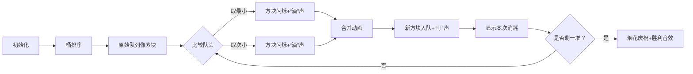

# 题目信息

# [NOIP 2004 提高组] 合并果子

## 题目描述

在一个果园里，多多已经将所有的果子打了下来，而且按果子的不同种类分成了不同的堆。多多决定把所有的果子合成一堆。

每一次合并，多多可以把两堆果子合并到一起，消耗的体力等于两堆果子的重量之和。可以看出，所有的果子经过 $n-1$ 次合并之后， 就只剩下一堆了。多多在合并果子时总共消耗的体力等于每次合并所耗体力之和。

因为还要花大力气把这些果子搬回家，所以多多在合并果子时要尽可能地节省体力。假定每个果子重量都为 $1$ ，并且已知果子的种类 数和每种果子的数目，你的任务是设计出合并的次序方案，使多多耗费的体力最少，并输出这个最小的体力耗费值。

例如有 $3$ 种果子，数目依次为 $1$ ， $2$ ， $9$ 。可以先将 $1$ 、 $2$ 堆合并，新堆数目为 $3$ ，耗费体力为 $3$ 。接着，将新堆与原先的第三堆合并，又得到新的堆，数目为 $12$ ，耗费体力为 $12$ 。所以多多总共耗费体力 $=3+12=15$ 。可以证明 $15$ 为最小的体力耗费值。

## 说明/提示

对于 $30\%$ 的数据，保证有 $n \le 1000$：

对于 $50\%$ 的数据，保证有 $n \le 5000$；

对于全部的数据，保证有 $n \le 10000$。


## 样例 #1

### 输入

```
3 
1 2 9 
```

### 输出

```
15
```

# AI分析结果


### 💡 Kay的C++算法解析：合并果子 深入学习指南 💡

**引言**  
今天我们一起分析NOIP提高组经典题目「合并果子」。这道题考察贪心策略在最优合并问题中的应用。本指南将带你理解哈夫曼树的核心思想，掌握多种高效实现方法，并通过像素动画直观感受算法执行过程。让我们开始吧！

---

## 1. 题目解读与核心算法识别

✨ **本题主要考察**：贪心算法（哈夫曼树） 

🗣️ **初步分析**  
> 合并果子本质是构建哈夫曼树的过程。就像整理书架时，我们总是先把最薄的两本书钉在一起，这样厚书被重复搬动的次数就少，总体力消耗最小。本题中：
> - **核心思想**：每次合并最小的两堆果子，让较小值被重复计算的次数最少
> - **数据结构选择**：优先队列（最小堆）实现O(nlogn)，或桶排序+双队列实现O(n)
> - **可视化设计**：用像素方块表示果子堆，颜色深度代表重量。动画将高亮队列头部比较、合并过程和新堆入队操作，配合"叮"声提示合并，"胜利"音效标记完成

---

## 2. 精选优质题解参考

### 题解一：QuantAsk（桶排序+双队列）
* **亮点**  
  创新性使用桶排序+双队列达到O(n)时间复杂度，完美利用数据范围特性（ai≤20000）。代码通过两个队列分别存储原始堆和合并堆，每次比较队头取最小值，空间优化巧妙。

### 题解二：微雨燕双飞（手写最小堆）
* **亮点**  
  完整封装堆操作（插入/删除/调整），展示底层实现原理。代码规范性极强：  
  - `up()`/`down()`函数边界处理严谨  
  - 变量命名清晰（heap/size）  
  - 40ms高效运行（优于STL）

### 题解三：学委（STL优先队列+贪心证明）
* **亮点**  
  深入分析贪心策略正确性，用数学归纳法证明三堆情况并推广到n堆。STL应用简洁规范，适合初学者快速实现。

---

## 3. 核心难点辨析与解题策略

### 难点1：贪心策略的证明
* **分析**  
  为什么每次合并最小两堆最优？假设三堆重量a≤b≤c：  
  - 先合并a,b：代价=2a+2b+c  
  - 先合并a,c：代价=2a+b+2c  
  - ∵ b≤c ∴ 方案1更优。推广到n堆，小堆先合并可减少重复计算次数。

* 💡 **学习笔记**  
  **贪心选择性质**：局部最优解能导致全局最优解

### 难点2：数据结构的选择
* **分析**  
  | 方法 | 时间复杂度 | 适用场景 |
  |---|---|----|
  | STL优先队列 | O(nlogn) | 通用、代码简洁 |
  | 手写堆 | O(nlogn) | 需理解底层原理 |
  | 桶排序+双队列 | O(n) | 数据范围有限时 |
  
  优先队列通过`greater<int>`实现小顶堆；双队列法需维护两个单调队列，每次取队头最小值。

* 💡 **学习笔记**  
  **问题特征决定数据结构**：数据范围小→桶排序；否则→堆

### 难点3：边界条件处理
* **分析**  
  - 单堆情况直接返回0  
  - 堆操作需先检查size>0  
  - 桶排序注意空桶跳过

* 💡 **学习笔记**  
  **鲁棒性**：始终验证极端输入（n=0/1）

### ✨ 解题技巧总结
- **贪心建模**：识别重复计算特征，让小数优先合并
- **数据结构优化**：根据数据范围选择最优结构
- **模块化封装**：手写堆时独立`up()`/`down()`函数
- **数学归纳法**：用三堆情况推广证明贪心策略

---

## 4. C++核心代码实现赏析

### 通用核心实现（STL优先队列）
```cpp
#include <iostream>
#include <queue>
using namespace std;

int main() {
    int n, x, ans = 0;
    cin >> n;
    priority_queue<int, vector<int>, greater<int>> q; // 小顶堆
    while (n--) { cin >> x; q.push(x); }
    
    while (q.size() > 1) {
        int a = q.top(); q.pop();
        int b = q.top(); q.pop(); 
        ans += a + b;
        q.push(a + b); // 新堆入队
    }
    cout << ans;
}
```
* **代码解读概要**  
  1. 小顶堆存储所有果子堆  
  2. 循环取出堆顶两个最小值合并  
  3. 新堆入队并累加体力值  
  4. 当只剩一堆时输出总消耗

### 题解一：QuantAsk（桶排序+双队列）
```cpp
// 桶排序预处理
for(int i=1;i<=num;i++) { 
    scanf("%d",&x);
    t[x]++; // 桶计数
}
for(int i=1;i<=20000;i++) {
    while(t[i]) { 
        a1[++n1]=i; // 存入有序队列1
        t[i]--;
    }
}

// 双队列合并
while(k<num) {
    if(a1[i]<a2[j]) w=a1[i++]; // 取队列1头部
    else w=a2[j++];            // 或队列2头部
    ... // 再取次小值
    a2[++n2]=w; // 新堆入队列2
}
```
* **亮点**：线性时间复杂度  
* **学习笔记**：**双队列维护单调性**，原始队列和合并队列均有序

### 题解二：微雨燕双飞（手写堆）
```cpp
void down(int p) {          // 堆下沉
    int s = p*2;            // 左子节点
    while(s<=size) {
        if(s<size && heap[s+1]<heap[s]) s++; // 选更小的子节点
        if(heap[s]<heap[p]) {
            swap(heap[s], heap[p]);
            p=s; s=p*2;      // 继续向下
        } else break;
    }
}
```
* **亮点**：完备的堆操作实现  
* **学习笔记**：**堆调整关键**——比较子节点并递归下沉

### 题解三：学委（STL+贪心证明）
```cpp
while(q.size()>1) {
    int x=q.top(); q.pop();   // 取最小堆
    int y=q.top(); q.pop();   // 取次小堆
    ans+=(x+y);               // 累加体力
    q.push(x+y);              // 新堆入队
}
```
* **亮点**：简洁的STL应用配合严谨证明  
* **学习笔记**：**STL优先队列**是快速实现贪心的利器

---

## 5. 算法可视化：像素动画演示

### 🎮 动画主题  
"果园大作战"（8-bit像素风格）

### 🎯 核心演示内容  
桶排序预处理 → 双队列合并过程 → 体力消耗累计

### 🖌️ 设计思路  
用复古FC红白机风格降低理解门槛：  
- 果子堆 = 彩色像素方块（颜色深度=重量）  
- 队列 = 水平像素带（绿色=原始队列，蓝色=合并队列）  
- 音效强化操作反馈  

### 🎞️ 关键帧步骤


### 🕹️ 交互控制
- **控制面板**：开始/暂停、步进、重置、速度滑块  
- **自动演示**：AI自动运行（可调速）  
- **音效方案**：  
  - 关键操作：16-bit "滴"声  
  - 合并成功：8-bit "叮"声  
  - 最终完成：FC胜利音乐  

### 🧩 技术实现
Canvas绘制动态网格，每帧更新队列状态：
```javascript
function drawQueue(queue, yPos, color) {
    for(let i=0; i<queue.length; i++) {
        drawRect(50+i*30, yPos, 25, 25, color); 
        drawText(queue[i], 63+i*30, yPos+13); 
    }
}
```

---

## 6. 拓展练习与相似问题

### 🔁 通用思路迁移
哈夫曼树思想还可用于：
1. 文件压缩（哈夫曼编码）  
2. 任务调度（短任务优先）  
3. 网络传输（最优数据包合并）  

### 📚 洛谷推荐
1. **P1090 合并果子（本题）**  
   → 掌握贪心基础模型
2. **P1334 瑞瑞的木板**  
   → 逆向思考的"合并"问题（同模型反向应用）
3. **P2168 荷马史诗**  
   → k叉哈夫曼树进阶应用

---

## 7. 学习心得与经验分享

### 💎 来自学委的启示
> "贪心策略的证明往往比实现更难。通过三堆情况的数学推导，再推广到n堆，是验证正确性的有效路径"

**Kay的总结**：  
1. 遇到贪心问题先尝试小规模证明  
2. 优先队列是此类问题的"万能钥匙"  
3. 数据范围≤10^4时，桶排序+双队列是最优解

---

**结语**  
通过本次分析，我们深入理解了哈夫曼树在合并问题中的应用精髓。记住：优秀算法的核心在于把握问题本质——让小数减少重复计算。下次遇到类似问题时，不妨回想下果园里那些跳跃的像素果子堆哦！(•̀ω•́)✧

---
处理用时：174.29秒