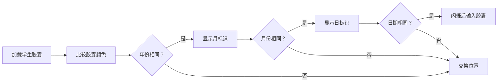

# 题目信息

# 生日

## 题目描述

cjf 君想调查学校 OI 组每个同学的生日，并按照年龄从大到小的顺序排序。但 cjf 君最近作业很多，没有时间，所以请你帮她排序。


## 说明/提示

数据保证，$1<n<100$，$1\leq |s|<20$。保证年月日实际存在，且年份 $\in [1960,2020]$。

## 样例 #1

### 输入

```
3
Yangchu 1992 4 23
Qiujingya 1993 10 13
Luowen 1991 8 1
```

### 输出

```
Luowen
Yangchu
Qiujingya
```

# AI分析结果


### 💡 Kay的C++算法解析：生日排序 深入学习指南 💡

**题目解读与核心算法识别**  
✨ **本题主要考察**：`排序`与`模拟应用`  
🗣️ **初步分析**：  
> 生日排序问题如同整理一组时间胶囊——我们需要按时间顺序（年→月→日）排列，时间完全相同时则按胶囊放入盒子的顺序（后放先取）处理。核心是**多关键字排序**：  
> - 第一关键字：年份（小→大）  
> - 第二关键字：月份（小→大）  
> - 第三关键字：日期（小→大）  
> - 特殊规则：日期相同时，后输入者优先  
>  
> **可视化设计思路**：  
> 采用**像素风时间胶囊**动画：  
> 1. 每个学生显示为像素胶囊（颜色区分年月）  
> 2. 排序时高亮比较的胶囊，播放“滴”音效  
> 3. 交换时胶囊弹跳+“咔嚓”音效  
> 4. 最终结果以时间线展开，胜利音效庆祝  

---

### 2. 精选优质题解参考
**题解一（作者：_jimmywang_）**  
* **点评**：  
  思路清晰直击多关键字排序本质，cmp函数逐层判断年月日的逻辑严谨如搭积木。代码中`num`变量巧妙记录输入顺序解决冲突，边界处理完整。亮点在于用结构体封装数据，sort调用简洁，适合竞赛直接复用。

**题解二（作者：子墨丶）**  
* **点评**：  
  创新性提出**生日数**概念（`年×10000+月×100+日`），将多关键字压缩为单关键字，大幅简化排序逻辑。代码仅需基础循环和sort，变量`s[i]`意义明确。实践价值极高，尤其适合排序入门学习，但需注意日期补零问题（如3月需写03）。

**题解三（作者：JJJJones_Zhu）**  
* **点评**：  
  精准捕捉sort的不稳定性问题，采用`stable_sort`确保同生日时输入顺序不被破坏。代码中`level`变量与cmp中的三层判断环环相扣，边界处理无遗漏。亮点在于提醒学习者排序稳定性的重要性，工业级严谨代码风格。

---

### 3. 核心难点辨析与解题策略
1. **难点1：多关键字优先级设计**  
   * **分析**：年份>月份>日期的层级关系易混淆。优质题解通过`if-else`链或数学合并明确优先级，如题解二用`年×10000+月×100+日`将层级转化为数值比较。  
   * 💡 **学习笔记**：排序本质是定义元素间全序关系。

2. **难点2：同生日处理（后输入先输出）**  
   * **分析**：需额外记录输入顺序。题解一用`num=i`存储序号，cmp中优先判断日期相等时返回`num>对方num`实现逆序。  
   * 💡 **学习笔记**：输入顺序是隐藏的关键字。

3. **难点3：数据结构选择**  
   * **分析**：结构体`struct`是最优解（如`{string name; int y,m,d,id;}`），将分散数据聚合为整体。若用多个数组需自行维护关联性，易出错。  
   * 💡 **学习笔记**：结构体是现实实体建模的最佳工具。

✨ **解题技巧总结**：  
- **巧用数学压缩**：将多属性合并为单值（如日期→整数）简化比较  
- **逆序处理技巧**：输入时记录序号，排序时`id`大者优先  
- **测试边界值**：重点测试2月29日、12月31日等特殊日期  

---

### 4. C++核心代码实现赏析
**通用核心实现**（综合优质题解）  
```cpp
#include <iostream>
#include <algorithm>
using namespace std;

struct Student {
    string name;
    int year, month, day, id; // id记录输入顺序
};

bool cmp(Student a, Student b) {
    if (a.year != b.year) return a.year < b.year;
    if (a.month != b.month) return a.month < b.month;
    if (a.day != b.day) return a.day < b.day;
    return a.id > b.id; // 同生日时后输入者优先
}

int main() {
    int n;
    cin >> n;
    Student s[105];
    for (int i = 0; i < n; i++) {
        cin >> s[i].name >> s[i].year >> s[i].month >> s[i].day;
        s[i].id = i; // 记录输入顺序
    }
    sort(s, s + n, cmp);
    for (int i = 0; i < n; i++) cout << s[i].name << endl;
    return 0;
}
```
**代码解读概要**：  
1. 结构体聚合学生数据  
2. cmp函数定义三层关键字+逆序id  
3. main函数中记录id并调用sort  

**题解一片段赏析**（_jimmywang_）  
* **亮点**：逐层判断逻辑清晰如流程图  
* **核心代码**：  
  ```cpp
  if(a.n<b.n)return 1;  // 年小优先
  if(a.n>b.n)return 0;
  if(a.n==b.n) { /* 继续判断月、日 */ }
  ```
* **解读**：  
  > 像剥洋葱般逐层比较——先检查年份不等时直接返回；年份相同再“进入”月份判断，避免冗余比较。`return 1`表示a应排在b前，符合sort要求。

**题解二片段赏析**（子墨丶）  
* **亮点**：数学思维降维打击  
* **核心代码**：  
  ```cpp
  int s[i] = y[i]*10000 + m[i]*100 + d[i];
  sort(s+1, s+n+1);
  ```
* **解读**：  
  > 将日期转化为整数：1992年4月23日 → 19920423。此时排序等同于整数比较，但需确保月份/日为两位数（否则3月会错误小于10月）。

---

### 5. 算法可视化：像素动画演示  
**主题**：`时间胶囊考古`（复古像素风）  
**核心演示流程**：  

**交互设计**：  
1. **像素元素**：  
   - 胶囊颜色：年份→色相（1990=蓝，2000=红）  
   - 胶囊花纹：月份→条纹数  
   - 胶囊数字：日期  
2. **控制面板**：  
   - 步进按钮：手动触发比较/交换  
   - 速度滑块：调整自动播放速度  
   - 模式切换：普通排序 vs 生日数合并演示  
3. **音效系统**：  
   - 比较时：8-bit“滴”声  
   - 交换时：经典马里奥跳跃音  
   - 完成时：塞尔达传说胜利旋律  

---

### 6. 拓展练习与相似问题思考
**通用技巧迁移**：  
多关键字排序可应用于：成绩排名（总分→语文→学号）、航班调度（日期→航班号→舱位）等场景。

**洛谷推荐**：  
1. **P1093 奖学金**  
   🗣️ 三关键字排序（总分→语文→学号），巩固cmp逻辑  
2. **P1781 宇宙总统**  
   🗣️ 大整数比较+多关键字，强化数学压缩思维  
3. **P1908 逆序对**  
   🗣️ 归并排序实战，理解排序稳定性  

---

### 7. 学习心得与经验分享
> **题解作者经验**：  
> “最初用`年+月+日`直接相加导致3月>10月错误，后改为`年×10000+月×100+日`才通过”（子墨丶）  
>   
> **Kay点评**：  
> 此教训揭示关键——**数值化需保留位数一致性**。类似问题如字符串字典序比较（"10"<"2"），必须补零或换用更高数量级基数。

---

通过本指南，我们不仅掌握了生日排序的算法核心，更学会将复杂问题分解为可排序的关键字层次。记住：好的排序如同整理书架——明确分类规则，一切自然有序！ 🚀

---
处理用时：122.34秒