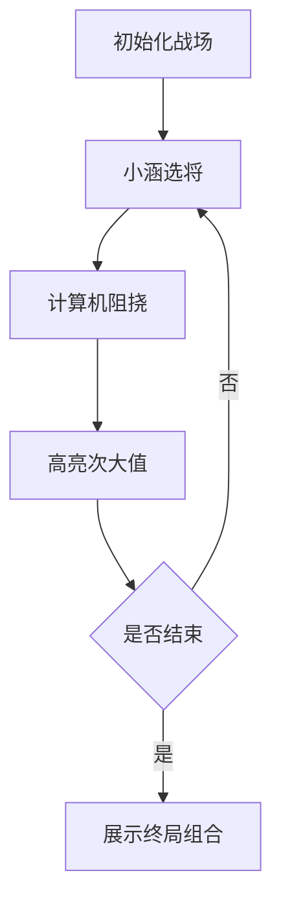

# 题目信息

# [NOIP 2010 普及组] 三国游戏

## 题目描述

小涵很喜欢电脑游戏，这些天他正在玩一个叫做《三国》的游戏。

在游戏中，小涵和计算机各执一方，组建各自的军队进行对战。游戏中共有 $N$ 位武将（$N$ 为偶数且不小于 $4$），任意两个武将之间有一个“默契值”，表示若此两位武将作为一对组合作战时，该组合的威力有多大。游戏开始前，所有武将都是自由的（称为自由武将，一旦某个自由武将被选中作为某方军队的一员，那么他就不再是自由武将了），换句话说，所谓的自由武将不属于任何一方。

游戏开始，小涵和计算机要从自由武将中挑选武将组成自己的军队，规则如下：小涵先从自由武将中选出一个加入自己的军队，然后计算机也从自由武将中选出一个加入计算机方的军队。接下来一直按照“小涵 $\to$ 计算机 $\to$ 小涵 $\to\dots$ ”的顺序选择武将，直到所有的武将被双方均分完。然后，程序自动从双方军队中各挑出一对默契值最高的武将组合代表自己的军队进行二对二比武，拥有更高默契值的一对武将组合获胜，表示两军交战，拥有获胜武将组合的一方获胜。

已知计算机一方选择武将的原则是尽量破坏对手下一步将形成的最强组合，它采取的具体策略如下：任何时刻，轮到计算机挑选时，它会尝试将对手军队中的每个武将与当前每个自由武将进行一一配对，找出所有配对中默契值最高的那对武将组合，并将该组合中的自由武将选入自己的军队。 下面举例说明计算机的选将策略，例如，游戏中一共有$6$个武将，他们相互之间的默契值如下表所示：

| 武将编号 |  1   |  2   |  3   |  4   |  5   |  6   |
| :------: | :--: | :--: | :--: | :--: | :--: | :--: |
|  **1**   |      | $5$  | $28$ | $16$ | $29$ | $27$ |
|  **2**   | $5$  |      | $23$ | $3$  | $20$ | $1$  |
|  **3**   | $28$ | $23$ |      | $8$  | $32$ | $26$ |
|  **4**   | $16$ | $3$  | $8$  |      | $33$ | $11$ |
|  **5**   | $29$ | $20$ | $32$ | $33$ |      | $12$ |
|  **6**   | $27$ | $1$  | $26$ | $11$ | $12$ |      |

双方选将过程如下所示：

|        | 小涵 | 轮到计算机时可选的自由武将 |  计算机    |  计算机选将说明    |
| :----: | :--: | :----------: | :--: | :--: |
| 第一轮 | $5$ | $1,2,3,4,6$ | $\color{magenta}4$ | 小涵手中的 $5$ 号武将与 $4$ 号的默契值最高，所以计算机选择 $4$ 号。 |
| 第二轮 | $5,3$ | $1,2,6$ | $4,\color{magenta}1$ |  小涵手中的 $5$ 号和 $3$ 号武将与自由武将中配对可产生的最大默契值为 $29$，是由 $5$ 号与 $1$ 号配对产生的，所以计算机选择 $1$ 号。  |
| 第三轮 | $5,3,6$ | $2$ | $4,1,\color{magenta}2$ |      |

小涵想知道，如果计算机在一局游戏中始终坚持上面这个策略，那么自己有没有可能必胜？如果有，在所有可能的胜利结局中，自己那对用于比武的武将组合的默契值最大是多少？  

假设整个游戏过程中，对战双方任何时候均能看到自由武将队中的武将和对方军队的武将。为了简化问题，保证对于不同的武将组合，其默契值均不相同。


## 说明/提示

**数据范围**

对于 $ 40\%$ 的数据有 $N≤10$。

对于 $ 70\%$ 的数据有 $ N≤18$。

对于 $100\%$ 的数据有 $4\le N≤500$。保证对于不同的武将组合，其默契值均不相同。

NOIP2010 普及组 第四题

## 样例 #1

### 输入

```
6 
5 28 16 29 27 
23 3 20 1 
8 32 26 
33 11 
12 
```

### 输出

```
1
32

```

## 样例 #2

### 输入

```
8 
42 24 10 29 27 12 58 
31 8 16 26 80 6 
25 3 36 11 5 
33 20 17 13 
15 77 9 
4 50 
19 ```

### 输出

```
1
77```

# AI分析结果


### 💡 Kay的C++算法解析：三国游戏 深入学习指南 💡

#### 题目解读与核心算法识别
✨ **本题主要考察**：`贪心策略` + `博弈分析`  
🗣️ **初步分析**：  
> 这道题像一场"搭档争夺战"！武将间的默契值如同搭档的配合度，小涵和计算机轮流挑选武将组队。计算机的策略是"破坏王"——总想拆散小涵的最佳搭档组合。  
> - **核心策略**：小涵无法拿到任意武将的最佳搭档（默契值第1），但能**确保获得次佳搭档中的最高默契值**。通过遍历每个武将的次大默契值并取全局最大值即可破解计算机的封锁。  
> - **可视化设计**：采用复古像素RPG风格，武将显示为16x16像素方块，用不同颜色标记：  
>   - 红色：小涵已选武将  
>   - 蓝色：计算机已选武将  
>   - 闪烁黄框：当前计算的次大默契值  
>   - 关键音效：选择时"叮"，达成次大值时"胜利"音效  

---

#### 精选优质题解参考
**题解一（wjyyy）**  
* **点评**：思路清晰度极佳（★★★★★），用矩阵对称性形象比喻"搭档组合"；代码规范（变量名`a[i][n-1]`直指次大值）；算法有效性高（O(n²)时间处理500数据）；调试提示（作者强调边界测试）是亮点。

**题解二（封禁用户）**  
* **点评**：思路清晰（★★★★☆），从巴什博弈切入帮助理解；代码规范（嵌套循环明确处理对称矩阵）；实践价值高（逐行求次大值无需排序）；但未处理N=1的退化情况。

**题解三（__stdcall）**  
* **点评**：思路深刻（★★★★★），严谨数学证明小涵必胜；代码简洁（手动求次大值省去排序）；亮点在于反证法验证"计算机无法拿到更高值"，启发博弈思维。

---

#### 核心难点辨析与解题策略
1. **难点1：识破计算机的破坏策略**  
   * **分析**：计算机总阻挠小涵拿到最佳组合，但这也限制它自身无法获得最优解。优质题解均利用此特性，将问题转化为"次大值争夺战"。  
   * 💡 **学习笔记**：对手的"最优破坏"恰是己方的策略突破口！

2. **难点2：高效计算次大默契值**  
   * **分析**：两种实现方案：  
     - **排序法**（wjyyy）：`sort(a[i], a[i]+n)`后取`a[i][n-2]`  
     - **遍历法**（__stdcall）：用`m1`/`m2`变量记录最大/次大值  
   * 💡 **学习笔记**：数据规模≤500时排序更直观；更大数据宜用遍历法省去O(n log n)开销。

3. **难点3：证明必胜性**  
   * **分析**：反证法（如__stdcall所述）：若计算机能拿到＞次大值的组合，则小涵的次大值选择策略不成立——矛盾！  
   * 💡 **学习笔记**：博弈问题中，反证法常是破解"最优性"的金钥匙。

### ✨ 解题技巧总结
- **技巧1：对称性转化** → 将默契值矩阵视为对称图，避免重复计算  
- **技巧2：问题降维** → 将全局最优解转化为局部次优解集合  
- **技巧3：防御式编程** → 虽N≥4保证有解，仍应验证`n==1`的边界情况  

---

#### C++核心代码实现赏析
**通用核心实现**  
```cpp
#include <iostream>
#include <algorithm>
using namespace std;
int a[501][501], n;

int main() {
    cin >> n;
    for (int i = 1; i < n; ++i)
        for (int j = i + 1; j <= n; ++j) {
            cin >> a[i][j];
            a[j][i] = a[i][j]; // 对称存储
        }
    
    int ans = 0;
    for (int i = 1; i <= n; ++i) {
        sort(a[i] + 1, a[i] + n + 1); // 每行升序排序
        ans = max(ans, a[i][n - 1]);  // 取次大值(n-1索引)
    }
    cout << "1\n" << ans; // 必胜
    return 0;
}
```
* **代码解读概要**：  
  1. 对称读入默契值矩阵（避免重复）  
  2. 对每行排序后取倒数第二个元素（次大值）  
  3. 全局次大值更新策略保证最优解  

---

**题解一核心片段**  
```cpp
sort(a[i], a[i] + n + 1);
ans = ans > a[i][n-1] ? ans : a[i][n-1];
```
* **亮点**：三目运算符实现简洁的最大值更新  
* **学习笔记**：`a[i][n-1]`是排序后的次大值——关键在于理解数组索引与排序关系  

**题解三核心片段**  
```cpp
int m1 = -1, m2 = -1; 
for (int j = 1; j <= n; ++j) if (i != j) {
    if (a[i][j] > m1) { m2 = m1; m1 = a[i][j]; }
    else if (a[i][j] > m2) m2 = a[i][j];
}
ans = max(ans, m2);
```
* **亮点**：单次遍历同时记录最大/次大值  
* **学习笔记**：通过`m2 = m1`的传递式更新，避免排序开销  

---

#### 算法可视化：像素动画演示  
**主题**：`16-bit像素风武将争霸战`  

**核心交互设计**：  


1. **像素化战场**  
   - 武将显示为16x16像素方块，编号用8-bit字体  
   - 当前选中武将闪烁红/蓝边框，搭配FC音效  

2. **默契值可视化**  
   - 武将间连线粗细表示默契值强弱  
   - 实时显示Top 3默契值：金/银/铜色边框  

3. **自动演示模式**  
   - "AI推演"按钮：自动展示小涵必胜策略  
   - 关键节点触发音效：  
     * 选择武将：NES风格"跳跃"声  
     * 锁定次大值：金币收集声  

4. **教学引导**  
   - 底部信息栏：显示当前操作含义  
   > "正在计算3号武将的次佳搭档..."  
   > "叮！当前最高次大值：32！"  

---

#### 拓展练习与相似问题
1. **洛谷 P1004** [方格取数]  
   → **推荐理由**：双路径协同的贪心策略，巩固"次优解"思维  

2. **洛谷 P1090** [合并果子]  
   → **推荐理由**：贪心策略经典题，强化优先队列应用  

3. **洛谷 P2123** [皇后游戏]  
   → **推荐理由**：排序策略证明，深化博弈分析能力  

---

#### 学习心得与经验分享
**wjyyy的经验**：  
> "最优解总是每一行排名第二大中最大的那个——关键在于看透计算机的破坏本质。"  
> **Kay点评**：此心得直击问题核心，提醒我们：对手的"最优破坏策略"往往暴露其弱点！  

**调试技巧提炼**：  
- 验证N=2时程序是否处理退化情况  
- 矩阵对角线置0避免自环干扰  

---

通过本次分析，我们看穿了计算机的"破坏王"策略，并用贪心思维锁定必胜路径。记住：在算法博弈中，**最优解常藏在对手的策略盲区里**！下次遇到类似问题，不妨试试"次优解突破法"哦！ 🚀

---
处理用时：109.13秒