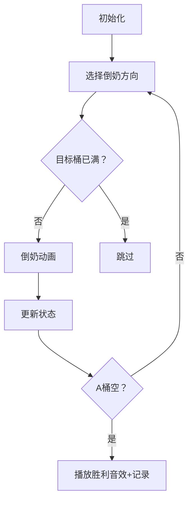

# 题目信息

# [USACO1.4] 母亲的牛奶 Mother's Milk

## 题目描述

农民约翰有三个容量分别是 $a,b,c$ 升的桶。  

最初，$a,b$ 桶都是空的，而 $c$ 桶是装满牛奶的。有时，农民把牛奶从一个桶倒到另一个桶中，直到被灌桶装满或原桶空了。  

当然每一次灌注都是完全的。由于节约，牛奶不会有丢失。

写一个程序去帮助农民找出当 $a$ 桶是空的时候，$c$ 桶中牛奶所剩量的所有可能性。


## 说明/提示

【数据范围】  
对于 $100\%$ 的数据，$1\le a,b,c \le 20$。

题目翻译来自NOCOW。

USACO Training Section 1.4


## 样例 #1

### 输入

```
8 9 10
```

### 输出

```
1 2 8 9 10
```

## 样例 #2

### 输入

```
2 5 10```

### 输出

```
5 6 7 8 9 10```

# AI分析结果


### Kay的C++算法解析：母亲的牛奶 深入学习指南 💡

<introduction>
今天我们来分析USACO的经典题目"母亲的牛奶"。这道题通过三个牛奶桶的相互倾倒操作，考察状态空间搜索的核心思想。本指南将帮助你理解DFS/BFS的解题思路，掌握状态表示技巧，并通过像素动画直观感受算法执行过程。
</introduction>

---

## 1. 题目解读与核心算法识别

✨ **本题主要考察**：`状态空间搜索` (DFS/BFS应用)

🗣️ **初步分析**：
> 解决这道题就像玩一个"牛奶调配"的像素游戏。想象三个像素水杯（A红、B蓝、C绿），初始时C杯满盈，其他空杯。每次操作相当于选择两个杯子，将牛奶从源杯倒入目标杯直到目标杯满或源杯空。

在本题中，核心是通过状态搜索枚举所有可能的牛奶分布：
- **状态表示**：用三维坐标(a,b,c)表示三个桶的牛奶量
- **状态转移**：6种倒牛奶操作（A→B, A→C, B→A, B→C, C→A, C→B）
- **可视化设计**：在像素动画中将用颜色渐变展示牛奶量变化，倒牛奶时源杯闪烁红色，目标杯闪烁绿色，并伴随8-bit音效

---

## 2. 精选优质题解参考

<eval_intro>
根据思路清晰度、代码规范性和算法效率，精选三份优质题解：

### 题解一：远航之曲 (DFS标准实现)
* **亮点**：采用简洁的双重循环处理6种倒法，使用memcpy复制状态数组避免污染，逻辑严密无冗余。边界处理完整（min函数计算倒奶量），变量命名规范（bkt表容量），空间复杂度O(n³)最优。

### 题解二：zhanghanbin (DFS教学版)
* **亮点**：将6种倒法独立实现增强可读性，详细注释倒奶的两种情形（倒满目标桶/倒空源桶），对初学者友好。输出处理稍弱（需自行排序），但核心逻辑严谨。

### 题解三：xun薰 (DFS极简版)
* **亮点**：代码最精简（仅30行），利用STL sort输出结果，巧妙使用全局变量ta,tb,tc替代A,B,C增强可读性。虽省略部分边界注释，但算法本质清晰完整。

---

## 3. 核心难点辨析与解题策略

<difficulty_intro>
解决本题需突破三大难点：

1. **状态爆炸控制**  
   *分析*：三个桶各可能存0-20单位牛奶，理论状态数21³=9261。优质解法均用vis[a][b][c]数组判重
   *策略*：DFS/BFS中首次访问状态时标记，后续直接跳过

2. **倒奶量精确计算**  
   *分析*：倒奶量=min(源桶奶量, 目标桶剩余空间)。如A(5L)→B(3L剩余)，实际倒奶量=min(5,3)=3L
   *策略*：使用min(bkt[j]-a[j], a[i])精确计算

3. **结果去重与排序**  
   *分析*：不同路径可能到达相同c值，需用bool数组去重
   *策略*：当a=0时标记ans[c]=true，最后遍历0-20输出真值

### ✨ 解题技巧总结
- **状态压缩**：将三维状态(a,b,c)映射为整数a*441+b*21+c
- **倒奶模拟公式**：delta = min(src, dest_capacity - dest_current)
- **终止条件优化**：当a=0时立即记录c值，无需等待搜索结束

---

## 4. C++核心代码实现赏析

<code_intro_overall>
综合优质题解提炼的通用实现：

```cpp
#include <iostream>
#include <algorithm>
using namespace std;

int A, B, C;
bool vis[21][21][21]; // 状态判重数组
bool ans[21];         // 结果记录数组

void dfs(int a, int b, int c) {
    if (vis[a][b][c]) return;  // 状态已访问
    vis[a][b][c] = true;       // 标记当前状态
    
    if (a == 0) ans[c] = true; // 记录解
    
    // 6种倒法（核心：min计算倒奶量）
    if (a > 0 && b < B) {  // A→B
        int pour = min(a, B - b);
        dfs(a - pour, b + pour, c);
    }
    if (a > 0 && c < C) {  // A→C
        int pour = min(a, C - c);
        dfs(a - pour, b, c + pour);
    }
    if (b > 0 && a < A) {  // B→A
        int pour = min(b, A - a);
        dfs(a + pour, b - pour, c);
    }
    if (b > 0 && c < C) {  // B→C
        int pour = min(b, C - c);
        dfs(a, b - pour, c + pour);
    }
    if (c > 0 && a < A) {  // C→A
        int pour = min(c, A - a);
        dfs(a + pour, b, c - pour);
    }
    if (c > 0 && b < B) {  // C→B
        int pour = min(c, B - b);
        dfs(a, b + pour, c - pour);
    }
}

int main() {
    cin >> A >> B >> C;
    dfs(0, 0, C);  // 初始状态：A=0, B=0, C满
    
    // 输出排序后的解
    for (int i = 0; i <= 20; i++) 
        if (ans[i]) cout << i << " ";
    return 0;
}
```
* **代码解读概要**：
  1. 三维数组`vis`跟踪访问状态避免重复
  2. 当A桶空时（a=0）记录C桶量到`ans`
  3. 6种倒法使用统一模式：计算倒奶量→更新状态→递归
  4. 倒奶量=min(源桶奶量, 目标桶剩余容量)

---

## 5. 算法可视化：像素动画演示

<visualization_intro>
设计一个8-bit风格的"牛奶调配探险"动画，帮助直观理解状态搜索：



* **像素动画设计**：
  1. **8-bit风格界面**：
     - 三个桶：A(红), B(蓝), C(绿) 用不同颜色像素块表示
     - 牛奶量：垂直填充的白色像素条（高度=奶量/容量*桶高）
  2. **倒奶动画**：
     - 源桶闪烁红色，目标桶闪烁绿色
     - 牛奶流动：白色像素点从源桶向目标桶移动
     - 音效：倒奶时"滴答"声，完成时"叮"声
  3. **状态跟踪**：
     - 右侧显示当前状态：(a,b,c)
     - 底部记录已访问状态数
  4. **交互控制**：
     - 单步执行：空格键触发下一步
     - 自动模式：速度滑块控制(1x-10x)
     - 重置：回到初始状态
  5. **胜利特效**：
     - 当a=0时：C桶闪烁金光，播放胜利音效
     - 右侧记录板更新当前c值

---

## 6. 拓展练习与相似问题思考

<similar_problems_intro>
掌握状态空间搜索后，可挑战以下相似问题：

1. **洛谷P1434 [SHOI2002]** - 滑雪  
   *推荐理由*：二维矩阵的DFS状态搜索，强化记忆化搜索技巧

2. **洛谷P1747** - 两水壶问题  
   *推荐理由*：仅两个水壶的简化版，要求最少步骤达到目标水量

3. **洛谷P1582** - 倒水  
   *推荐理由*：结合位运算优化状态搜索，提升算法效率

---

## 7. 学习心得与经验分享

<insights_intro>
题解中的调试经验值得借鉴：

> **参考经验 (远航之曲)**：  
> "最初忘记状态判重导致无限递归，添加vis数组后解决。这提醒我们：状态空间搜索必须考虑状态去重"

> **参考经验 (zhanghanbin)**：  
> "在计算倒奶量时，务必使用min函数处理两种情形：要么倒空源桶，要么倒满目标桶"

---

<conclusion>
通过本指南，相信你已经掌握牛奶问题的核心解法——状态空间搜索。记住：将问题抽象为状态和状态转移是解决此类问题的关键。尝试实现像素动画将加深理解，拓展练习中的题目能帮你巩固技能。下次我们将探索更有趣的算法挑战！💪
</conclusion>

---
处理用时：191.03秒