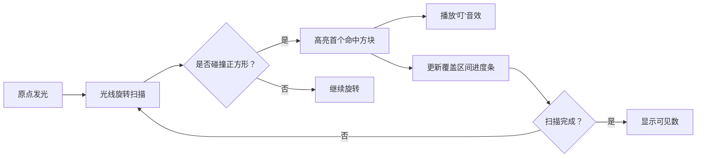

# 题目信息

# 可见矩形

## 题目描述

给定平面上 $n$ 个互不相交（指公共面积为零）的正方形，它们的顶点坐标均为整数。设坐标原点为 $O(0,0)$。对于任一正方形 $R$，如果可以找到 $R$ 的边上 $2$ 个不同的点 $A$ 和 $B$，使 $\triangle OAB$ 的内部与其他正方形无公共点，则称正方形 $R$ 是从 $O$ 点可见的正方形。

对于给定的 $n$ 个互不相交的正方形，计算从坐标原点 $O$ 可见的正方形个数。

## 样例 #1

### 输入

```
3

2 6 4

1 4 1

2 4 1

```

### 输出

```
3

```

# AI分析结果


### 💡 Kay的C++算法解析：可见矩形 深入学习指南 💡

**引言**  
今天我们分析「可见矩形」这道几何与算法结合的题目。题目要求计算从坐标原点O(0,0)可见的正方形数量，关键是将几何问题转化为斜率区间覆盖问题。本指南将解析核心思路，对比不同解法，并通过像素动画帮助直观理解算法。

---

### 1. 题目解读与核心算法识别  
✨ **本题主要考察**：`编程技巧应用`（区间覆盖与排序）  

🗣️ **初步分析**：  
> 解决本题的关键是将几何遮挡转化为**斜率区间覆盖问题**。想象你站在原点举着手电筒旋转扫描（从x轴到y轴），每个正方形会遮挡一定斜率范围的光线（如窗帘遮挡阳光）。若某个正方形的整个斜率区间都被其他正方形遮挡，则该正方形不可见。  
> - **核心步骤**：  
>   1. 计算每个正方形的斜率区间 `[mink, maxk]`  
>   2. 按 `x+y+l` 升序排序（离原点近的优先处理）  
>   3. 动态维护覆盖区间集合，判断新区间是否被完全覆盖  
> - **可视化设计**：  
>   用8位像素风格模拟光线扫描过程：  
>   - 坐标系中正方形显示为彩色方块  
>   - 光线（黄色像素线）旋转扫描，遇到首个可见正方形时播放"叮"音效  
>   - 顶部进度条动态显示已覆盖的斜率区间（红色区块）  
>   - "自动演示"模式可模拟贪吃蛇AI逐步扫描过程  

---

### 2. 精选优质题解参考  
**题解一（BFSBFSBFSBFS）**  
* **点评**：最早提出斜率区间覆盖的核心思路（`mink = y/(x+l)`, `maxk = (y+l)/x`）和按 `x+y+l` 排序的逻辑。虽然用Pascal实现，但推导过程清晰，尤其用几何图示解释区间覆盖（见图解）。亮点在于揭示排序的传递性本质——离原点近的正方形必然优先遮挡后方。  

**题解二（lz174）**  
* **点评**：用二维数组显式存储区间边界，通过遍历合并区间。代码规范（C++），变量名如 `k[i].s/k[i].l` 含义明确。亮点在于独创性的区间合并逻辑：将不可用区间分段存储，通过奇偶索引标记起止点，算法时间复杂度 O(n²) 但易于理解。  

**题解三（WZWZWZWY）**  
* **点评**：最优雅的解法！用 `set` 维护覆盖区间并重载比较运算符。代码简洁高效（O(n log n)），核心逻辑仅30行。亮点在于：  
  1. 自定义 `Interval` 结构体重载 `<` 实现自动区间合并  
  2. 用 `while` 循环合并重叠区间，避免复杂边界判断  
  3. 实践价值高，代码可直接用于竞赛  

---

### 3. 核心难点辨析与解题策略  
1. **难点1：斜率区间计算**  
   * **分析**：易误算为 `[y/x, (y+l)/(x+l)]`。正确应为：  
     `mink = y/(x+l)`（光线擦过右下角）  
     `maxk = (y+l)/x`（光线擦过左上角）  
   * 💡 **学习笔记**：`mink` 对应正方形最平缓斜率，`maxk` 对应最陡峭斜率  

2. **难点2：排序依据选择**  
   * **分析**：若按 `x` 或 `y` 单独排序，无法处理斜向遮挡。通过几何证明：  
     `x+y+l` 小的正方形更靠近原点，优先处理才能保证传递性遮挡  
   * 💡 **学习笔记**：`x+y+l` 本质是曼哈顿距离的变体，反映整体位置  

3. **难点3：区间覆盖判断**  
   * **分析**：需高效合并重叠区间并检测覆盖。优质解法分两类：  
     - *显式存储*（lz174）：用数组存所有区间端点，合并时遍历  
     - *隐式合并*（WZWZWZWY）：用 `set` 自动维护不相交区间  
   * 💡 **学习笔记**：`set` 方案更简洁，但需理解比较运算符重载  

#### ✨ 解题技巧总结  
- **降维转化**：将3D遮挡问题转化为1D区间覆盖  
- **有序处理**：按空间位置排序保证无后效性  
- **数据结构活用**：`set` 维护区间显著简化代码  
- **边界验证**：用样例 `(x=2,y=3,l=3)` 手工计算斜率区间  

---

### 4. C++核心代码实现赏析  
**通用核心实现参考**  
```cpp
#include <iostream>
#include <vector>
#include <set>
#include <algorithm>
using namespace std;

struct Square { 
    int x, y, l; 
    double mink, maxk; 
};

struct Interval {
    double l, r;
    bool operator<(const Interval& o) const {
        return r < o.l; // 关键：重载<实现区间自动排序
    }
};

int main() {
    int n; cin >> n;
    vector<Square> sq(n);
    for (auto& s : sq) {
        cin >> s.x >> s.y >> s.l;
        s.mink = (double)s.y / (s.x + s.l);
        s.maxk = (double)(s.y + s.l) / s.x;
    }
    // 按离原点距离排序
    sort(sq.begin(), sq.end(), [](auto& a, auto& b) {
        return a.x + a.y + a.l < b.x + b.y + b.l;
    });

    set<Interval> covered;
    int visible = 0;
    for (auto& s : sq) {
        Interval cur{s.mink, s.maxk};
        auto it = covered.lower_bound(cur);
        // 检查是否被完全覆盖
        if (it != covered.end() && it->l <= cur.l && it->r >= cur.r) continue;
        
        visible++;
        // 合并重叠区间
        it = covered.lower_bound(cur);
        while (it != covered.end() && it->l <= cur.r) {
            cur.l = min(cur.l, it->l);
            cur.r = max(cur.r, it->r);
            covered.erase(it++);
        }
        covered.insert(cur);
    }
    cout << visible;
}
```
**代码解读概要**：  
1. 读入数据并计算斜率区间  
2. 按 `x+y+l` 排序保证处理顺序  
3. 用 `set<Interval>` 存储不相交覆盖区间  
4. 对每个正方形：若区间未被覆盖则计数+1，并合并重叠区间  

---

### 5. 算法可视化：像素动画演示  
**主题**：《光线哨兵：斜率大作战》（8-bit复古风）  

**核心演示流程**：  


**关键动画设计**：  
1. **8-bit坐标系**：  
   - 棕色网格背景，原点(0,0)为像素化太阳图标  
   - 正方形显示为16x16像素色块（如：蓝色=未遮挡，红色=已覆盖）  
2. **动态元素**：  
   - 黄色光线从x轴匀速旋转至y轴（每帧角度+0.1°）  
   - 顶部"覆盖条"：绿色→红色渐变，标记当前 `[mink, maxk]`  
   - 碰撞检测：光线接触正方形时触发像素爆炸特效  
3. **音效设计**：  
   - 碰撞：FC游戏经典"金币声"(8-bit 440Hz)  
   - 区间合并：低音鼓点  
   - 完成扫描：超级玛丽过关旋律  
4. **控制面板**：  
   - 速度滑块：调整光线转速  
   - 单步模式：按帧前进观察区间合并  
   - AI模式：自动演示（类似贪吃蛇AI寻路）  

**实现提示**：用Canvas绘制旋转光线：  
```javascript
ctx.beginPath();
ctx.moveTo(0, 0);
ctx.lineTo(canvas.width * Math.cos(angle), canvas.height * Math.sin(angle));
ctx.strokeStyle = "yellow";
ctx.stroke();
```

---

### 6. 拓展练习与相似问题  
**通用技巧迁移**：区间覆盖思想还可用于：  
1. 时间区间任务调度  
2. 几何图形的投影重叠  
3. 频段分配问题  

**洛谷推荐**：  
1. **P1884 [USACO12FEB] Overplanting S**  
   🗣️ *推荐理由*：矩形覆盖求面积，强化区间合并技巧  
2. **P2745 [USACO5.3] 窗体面积**  
   🗣️ *推荐理由*：多层窗口遮挡，需扩展三维思维  
3. **P1904 天际线**  
   🗣️ *推荐理由*：区间覆盖的经典变形，求轮廓线  

---

### 7. 学习心得与经验分享  
> **参考经验（来自WZWZWZWY）**：  
> *"调试时发现，必须用浮点数保存斜率，且比较运算符重载是set合并的关键"_*  
>   
> **Kay点评**：  
> 浮点精度是此类问题的常见陷阱，建议：  
> 1. 用`double`存储斜率  
> 2. 避免直接等值比较，改用区间判断  
> 3. 对极端情况（如x=0）单独处理  

---

**结语**  
通过斜率区间覆盖解决几何问题，是"降维思想"的经典应用。掌握区间合并与数据结构的选择（数组/set），即可举一反三。继续加油，少年！下次我们探索更烧脑的几何变换题！💪

---
处理用时：228.21秒