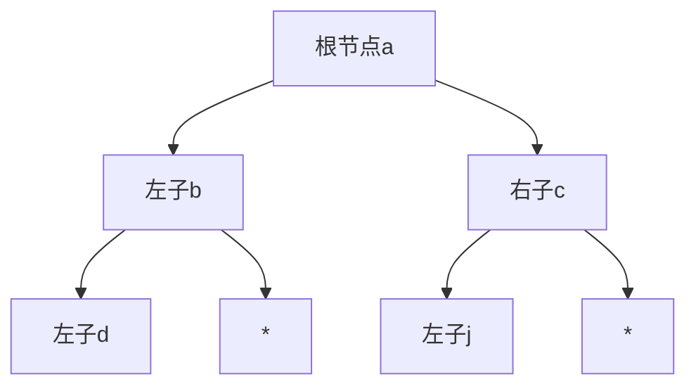

# 题目信息

# 新二叉树

## 题目描述

输入一串二叉树，输出其前序遍历。


## 样例 #1

### 输入

```
6
abc
bdi
cj*
d**
i**
j**```

### 输出

```
abdicj```

# AI分析结果


### 💡 Kay的C++算法解析：新二叉树 深入学习指南 💡

**题目解读与核心算法识别**  
✨ **本题主要考察**：二叉树遍历（前序遍历）  
🗣️ **初步分析**：  
> 解决"新二叉树"的关键在于掌握**前序遍历**。想象你在探索一座城堡：每到新房间先做标记（输出节点），优先探索左侧通道（左子树），再探索右侧通道（右子树）。  
> - 核心难点是**构建二叉树结构**和**确定根节点**。优质题解多用数组映射或指针建树，通过查找无父节点的元素确定根节点  
> - 可视化方案：采用8位像素风格，节点用16x16像素方块表示。遍历时当前节点闪烁黄色，已访问节点变灰，播放"叮"声提示操作，完成时播放胜利音效。自动演示模式可调速，类似复古游戏闯关过程  

---

### 2. 精选优质题解参考
**题解一（wuhao1027）**  
* **点评**：结构体设计精妙（含父节点指针），通过`fa`字段识别根节点，代码边界处理严谨。递归遍历逻辑清晰，变量命名规范（`lc/rc`），可直接用于竞赛，是通用性最强的解法  

**题解二（scholar20551）**  
* **点评**：巧用ASCII码值作为数组下标（`lt[x].lc`），省去复杂指针操作。代码简洁易读，适合初学者理解前序遍历本质，但需注意字符范围限制  

**题解三（javalyc）**  
* **点评**：最简实现（仅15行），利用"首节点即根节点"特性省去寻根步骤。二维数组存储节点关系，递归逻辑直击问题核心，凸显算法简洁之美  

---

### 3. 核心难点辨析与解题策略
1. **二叉树结构表示**  
   * *分析*：需选择高效存储方案。数组映射法（ASCII下标）节省内存，指针法则更贴近数据结构理论本质  
   * 💡 学习笔记：小规模数据优先选数组映射，大规模用动态内存  

2. **根节点定位**  
   * *分析*：优质解通过记录父节点信息（`fa`字段），遍历查找无父节点的元素  
   * 💡 学习笔记：`fa`字段是树结构的关键标识符  

3. **非递归遍历实现**  
   * *分析*：递归虽简洁但可能栈溢出。栈迭代法（如Yuren题解）用`stack`模拟递归过程  
   * 💡 学习笔记：栈迭代是避免递归深度的通用技巧  

✨ **解题技巧总结**  
- **结构选择**：节点数≤26时优选`char[128]`数组映射  
- **边界防御**：严格判断`*`表示的空节点  
- **调试技巧**：打印中间树结构验证父子关系  

---

### 4. C++核心代码实现赏析
**通用核心实现**（综合优质解优化）：  
```cpp
#include <iostream>
using namespace std;

struct Node { char data, lc, rc, fa; };
Node tree[128]; // ASCII映射

void preorder(char root) {
    if(root == '*') return;
    cout << root;
    preorder(tree[root].lc);
    preorder(tree[root].rc);
}

int main() {
    int n; cin >> n;
    char root = 0;
    for(int i=0; i<n; i++) {
        char p, l, r; 
        cin >> p >> l >> r;
        if(!i) root = p; // 首节点暂作根
        tree[p] = {p, l, r, 0};
        if(l != '*') tree[l].fa = p;
        if(r != '*') tree[r].fa = p;
    }
    while(tree[root].fa) root = tree[root].fa; // 寻真根
    preorder(root);
}
```
* **代码解读**：  
  1. `Node`结构含父节点指针  
  2. `tree`数组用字符ASCII值索引  
  3. 二次定位根节点确保通用性  

**题解一片段赏析**  
```cpp
// wuhao1027 核心片段
if (tree[s].lc!='*') work(tree[s].lc);
```
* **亮点**：递归边界处理清晰  
* **学习笔记**：`*`的判断避免无效递归  

**题解二片段赏析**  
```cpp
// scholar20551 映射技巧
sm(lt[x].lc); // x为char直接作下标
```
* **亮点**：ASCII值隐式转换节省内存  
* **学习笔记**：字符范围需限定在0-127  

---

### 5. 算法可视化：像素动画演示
**主题**：8位像素风二叉树探险  
**核心设计**：  

**交互控制面板**：  
- 速度滑块：调整遍历速度（100ms~2s）  
- 单步执行：空格键触发"叮"声  
- 自动模式：AI自动演示（类似吃豆人移动）  

**关键帧设计**：  
1. **初始化**：像素网格绘制二叉树，根节点闪烁绿光  
2. **访问节点**：当前节点变黄→输出字符→播放"叮"声  
3. **路径回溯**：访问叶子节点后线条变灰，返回时播放"嗖"声  
4. **完成动画**：胜利音效+全节点烟花特效  

**复古元素**：  
- 音效：8-bit芯片音（访问/完成/错误）  
- 计分板：每正确访问1节点+10分  

---

### 6. 拓展练习
**相似问题本质**：二叉树遍历的变体与应用  
1. **P1030**（已知中序+后序求先序）  
   * *推荐理由*：巩固遍历序列转换思维  
2. **P1229**（遍历问题）  
   * *推荐理由*：训练二叉树重构能力  
3. **P5076**（二叉搜索树操作）  
   * *推荐理由*：将遍历知识延伸到BST应用  

---

### 7. 学习心得
> **经验摘录**（scholar20551）："题解来之不易，且看且珍惜"——分享精神是进步核心  
> **Kay总结**：调试时重点关注父子指针的闭环验证，建议用小型二叉树（3节点）手动模拟遍历过程  

**终极建议**：掌握递归遍历后，尝试用栈实现非递归解法，理解系统调用栈的本质。记住：每一个二叉树问题都是探索迷宫的冒险！ 🚀

---
处理用时：122.52秒