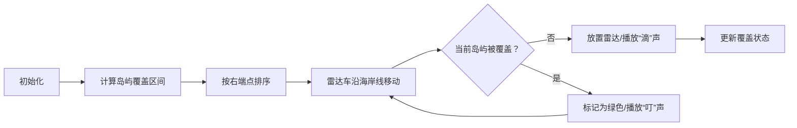

# 题目信息

# 雷达安装

## 题目描述

假设海岸线是一条无限延伸的直线。它的一侧是陆地，另一侧是海洋。每一座小岛是在海面上的一个点。雷达必须安装在陆地上（包括海岸线），并且每个雷达都有相同的扫描范围 $d$。你的任务是建立尽量少的雷达站，使所有小岛都在扫描范围之内。

数据使用笛卡尔坐标系，定义海岸线为 $x$ 轴。在 $x$ 轴上方为海洋，下方为陆地。


## 说明/提示

### 样例 1 解释


### 数据范围

对于全部数据，$n\le1000$，$ d \le 2\times 10^4$，$ | x_i | \le 2 \times 10^6 $，$ 0 \le y_i \le 2\times 10^4$。

## 样例 #1

### 输入

```
3 2
1 2
-3 1
2 1
```

### 输出

```
2```

# AI分析结果


### 💡 Kay的C++算法解析：雷达安装 深入学习指南 💡

#### 1. 题目解读与核心算法识别
✨ **本题主要考察**：贪心算法（区间选点问题）

🗣️ **初步分析**：
> 雷达安装本质是经典的**区间选点问题**。想象你有一串珍珠（岛屿），每颗珍珠需要被一根线（雷达覆盖范围）穿过。贪心策略的核心是：**每次选择当前最优位置放置雷达，使其能覆盖最多未覆盖的珍珠**。  
> - 解题思路：计算每个岛屿在海岸线上的可覆盖区间，按右端点排序后，在第一个区间的右端点放置雷达，然后跳过所有被覆盖的区间，重复此过程
> - 核心难点：区间计算（勾股定理）、贪心策略证明（为何右端点最优）、边界处理（y>d无解）
> - 可视化设计：用像素风格展示岛屿位置和覆盖区间，雷达放置时播放"滴"声，被覆盖区间变绿色。设计"雷达车"沿x轴移动，自动停在最优位置放置雷达

---

#### 2. 精选优质题解参考
**题解一（弹星者）**  
* **点评**：思路清晰度满分！直击贪心核心，用单变量`temp`跟踪雷达位置，逻辑简洁（O(n)复杂度）。代码规范：变量名`a[i].l/r`明确，边界处理严谨（先检查y>d）。亮点：用数学证明解释为何选择右端点，实践价值极高，可直接用于竞赛。

**题解二（OItby）**  
* **点评**：算法有效性突出！标准贪心实现配合快速读入优化，结构工整。亮点：POJ原题对比拓展视野，区间处理用`Res`变量精妙记录位置，避免冗余计算。代码中`cmp`函数按右端点排序是关键学习点。

**题解三（wzm2007）**  
* **点评**：教学价值突出！双重循环标记覆盖的写法更易理解，`vis`数组直观展示覆盖状态。虽然效率O(n²)但数据范围允许。亮点：详细注释帮助初学者，边界检查`if(q>d)`位置合理。

---

#### 3. 核心难点辨析与解题策略
1. **难点：问题转化与区间计算**  
   * **分析**：岛屿(x,y)到雷达距离需≤d，通过勾股定理推导覆盖区间`[x-√(d²-y²), x+√(d²-y²)]`。优质题解统一先处理y>d的无解情况
   * 💡 **学习笔记**：几何问题代数化是解题关键，sqrt计算需double精度

2. **难点：贪心策略的正确性证明**  
   * **分析**：为什么按右端点排序？因为当前区间的右端点能覆盖后续更多左端点较小的区间。弹星者题解用`temp`变量生动展示该思想
   * 💡 **学习笔记**：贪心选择需具备无后效性——当前选择不影响后续子问题

3. **难点：高效实现与边界处理**  
   * **分析**：O(n)解法需单次遍历，维护最后雷达位置。OItby用`Res`变量，当新区间左端点>Res时新增雷达。注意：区间可能包含负数坐标
   * 💡 **学习笔记**：排序后只需比较相邻区间，避免嵌套循环

✨ **解题技巧总结**  
- **技巧1：问题转化**：将几何覆盖问题抽象为区间选点模型  
- **技巧2：贪心排序**：按右端点升序排序是通用套路  
- **技巧3：边界防御**：先检查y>d直接返回-1，避免无效计算  

---

#### 4. C++核心代码实现赏析
**通用核心实现（综合弹星者与OItby思路）**  
```cpp
#include <iostream>
#include <algorithm>
#include <cmath>
using namespace std;

const int MAXN = 1005;
struct Segment {
    double l, r;
} seg[MAXN];

bool cmp(Segment a, Segment b) {
    return a.r < b.r; // 按右端点升序排序
}

int main() {
    int n; double d;
    cin >> n >> d;
    bool invalid = false;
    for (int i = 0; i < n; ++i) {
        double x, y;
        cin >> x >> y;
        if (y > d) invalid = true;
        double len = sqrt(d*d - y*y);
        seg[i].l = x - len;
        seg[i].r = x + len;
    }
    if (invalid) {
        cout << -1;
        return 0;
    }
    sort(seg, seg + n, cmp);
    double last_radar = seg[0].r;
    int ans = 1;
    for (int i = 1; i < n; ++i) {
        if (seg[i].l > last_radar) { // 当前区间未被覆盖
            ans++;
            last_radar = seg[i].r;
        }
    }
    cout << ans;
    return 0;
}
```
**代码解读概要**：  
1. 读入时计算每个岛屿的覆盖区间（注意y>d直接判无解）  
2. 按区间右端点排序使贪心策略生效  
3. 维护`last_radar`变量，仅当新区间左端点超过它时才新增雷达  

---

**分题解核心代码赏析**  
**题解一（弹星者）**  
```cpp
sort(a+1,a+n+1,cmp);
for(int i=1;i<=n;i++){
    if(i==1) temp=a[i].r,ans++;
    else if(temp>a[i].l) continue;
    else temp=a[i].r,ans++;
}
```
**亮点**：简洁高效的O(n)遍历  
**解读**：  
> `temp`记录最后雷达位置，初始化为首个区间右端点。当新区间左端点`a[i].l ≤ temp`时跳过（已被覆盖），否则在新区间右端点放置新雷达。**精妙之处**：用单变量避免复杂数据结构  

**题解二（OItby）**  
```cpp
sort(ld+1,ld+n+1,Cmp);
Res=ld[1].e;
for (i=2;i<=n;++i)
    if (Res<ld[i].b) ++Ans,Res=ld[i].e;
```
**亮点**：工业级代码风格，快速读入优化  
**解读**：  
> `Res`等效于`last_radar`，`ld[i].b`即左端点。当`Res < ld[i].b`时说明当前雷达无法覆盖该区间，需新增。**学习点**：排序后只需比较右端点与新区间左端点  

**题解三（wzm2007）**  
```cpp
sort(a,a+n,cmp);
for(int i=0;i<n;i++){
    if(a[i].vis) continue;
    ans++;
    a[i].vis=1;
    for(int j=0;j<n;j++)
        if(!a[j].vis && a[i].y>=a[j].x) 
            a[j].vis=1;
}
```
**亮点**：直观的覆盖标记教学  
**解读**：  
> 未覆盖时(`!vis`)放置雷达，内层循环标记所有左端点`≤当前雷达位置`的区间。**注意**：`a[i].y`是当前雷达位置（右端点），`a[j].x`是新区间左端点  

---

#### 5. 算法可视化：像素动画演示  
**主题**：雷达保卫战（8位像素风格）  

**核心演示流程**：  


**交互设计细节**：  
1. **像素场景**：  
   - 海岸线：绿色像素带（x轴）  
   - 岛屿：彩色像素点（y>0）  
   - 覆盖区间：半透明蓝色线段  
   - 雷达：红色闪烁像素点  

2. **动态效果**：  
   - 雷达车（像素卡车）沿x轴移动，到达区间右端点时播放"滴"声并升起雷达  
   - 被覆盖区间变绿，岛屿闪烁庆祝  
   - 无解时屏幕闪烁红光，播放低沉警报  

3. **控制面板**：  
   - 单步执行：空格键逐步观察贪心选择  
   - 速度滑块：调整雷达车移动速度  
   - AI演示：自动完成全程，结束后显示雷达数  

4. **教学提示**：  
   - 排序阶段：岛屿按右端点排队，显示比较过程  
   - 贪心选择：高亮当前区间右端点，显示`last_radar`位置  

---

#### 6. 拓展练习与相似问题  
**通用技巧迁移**：  
1. **活动安排问题**：选择最多互不重叠区间（按右端点排序）  
2. **最小覆盖点**：区间完全覆盖问题（按左端点排序）  
3. **合并重叠区间**：变形应用（如P2082）  

**洛谷推荐**：  
1. **P1230 智力大冲浪**  
   → 巩固贪心选择与区间排序  
2. **P1250 种树**  
   → 区间覆盖的变形（固定点数求最小覆盖）  
3. **P2082 区间覆盖（加强版）**  
   → 挑战更大数据规模的区间处理  

---

#### 7. 学习心得与经验分享  
> **经验摘录（弹星者）**：  
> *“为了让雷达数尽可能少，在覆盖新区间时尽量选择右端点”*  
>   
> **Kay点评**：  
> 此心得点明贪心本质——**当前最优导致全局最优**。调试时可画图验证：选择右端点总能覆盖更多后续区间，这是贪心策略可行的核心证明  

> **经验摘录（Social_Zhao）**：  
> *“本题实际是区间选点问题”*  
>   
> **Kay点评**：  
> 精准的问题归类能力至关重要！识别出经典模型能快速调用标准解法，避免重新发明轮子  

---

### 结语  
通过雷达安装问题，我们掌握了贪心算法的精髓：**排序创造贪心条件，局部最优推导全局最优**。后续遇到区间覆盖、活动安排等问题时，不妨回想海岸线上飞驰的雷达车和闪烁的像素岛屿。编程如探险，愿各位在算法世界中持续披荆斩棘！🚀

---
处理用时：186.65秒