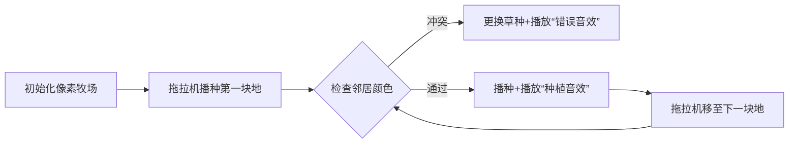

# 题目信息

# [USACO19FEB] The Great Revegetation B

## 题目描述

长时间的干旱使得 Farmer John 的 $N$ 块草地上牧草匮乏。随着雨季即将到来，现在应当是重新种植的时候了。

在 Farmer John 的储物棚里有四个桶，每个桶里装着一种不同的草种。他想要在每块草地上播种其中一种草。作为一名奶农，Farmer John 想要确保他的每头奶牛都能得到丰富的食谱。他的 $M$ 头奶牛每一头都有两块喜爱的草地，他想要确保这两块草地种植不同种类的草，从而每头奶牛都可以有两种草可供选择。Farmer John 知道没有一块草地受到多于 $3$ 头奶牛的喜爱。

请帮助 Farmer John 选择每块草地所种的草的种类，使得所有奶牛的营养需求都得到满足。 

## 样例 #1

### 输入

```
5 6
4 1
4 2
4 3
2 5
1 2
1 5```

### 输出

```
12133```

# AI分析结果


### 题目分析：P1694 The Great Revegetation B  
**核心算法识别**：贪心算法（Greedy）  
- **算法比喻**：就像给一排学生发四种颜色的帽子（1-4号色），要求相邻朋友不能同色。我们从左到右发帽子，每次选最小号码且不违反朋友规则的帽子，确保整体方案字典序最小。  
- **难点与解决方案**：  
  1. **贪心正确性保障**：题目限定每块草地最多被3头奶牛喜爱 → 每块草地最多有3个"邻居" → 4种草中至少1种可用。  
  2. **字典序实现**：从左到右遍历草地，优先选最小数字的草种。  
  3. **冲突检查优化**：仅需检查比当前草地编号小的相邻草地（因其已种植完成）。  

---

### 精选优质题解参考  
#### 题解一：Licis_Subway（赞4）  
**亮点**：  
- **严谨的冲突检查**：通过`findcow`函数收集关联奶牛，再逐牛验证草种冲突  
- **边界处理**：跳过未处理的草地（`if (a[*it].second >= grass) continue`）  
- **学习价值**：模块化设计（`check`/`findcow`分离）提升可读性  

#### 题解二：lflby（赞3）  
**亮点**：  
- **高效邻接表**：`vector<int> a[105]`存储相邻草地，直接遍历邻居检查冲突  
- **简洁核心**：15行核心逻辑清晰呈现贪心本质  
- **实践参考**：适合竞赛快速编码，变量名`d[i]`可优化为`grassType[i]`  

#### 题解三：MarsNotFound（赞2）  
**亮点**：  
- **预处理优化**：交换`a[i]/b[i]`保证`a[i]≤b[i]` → 只需检查`b[k]==i`的冲突  
- **剪枝逻辑**：`flag`机制及时跳出无效枚举  
- **空间效率**：仅用`int s[1005]`存储答案，内存占用低  

---

### 核心难点与解题策略  
1. **贪心策略的正确性验证**  
   - *分析*：利用「草地关联数≤3」的特性，数学归纳法证明：处理第`i`块地时，最多3个已处理邻居占3种草 → 第4种草必然可用。  
   - 💡 **学习笔记**：题目约束条件是贪心可行性的关键保障。  

2. **字典序的最小化实现**  
   - *分析*：按草地编号升序处理，每块地从小（1）到大（4）尝试草种，首次合法的草种即为局部最优解。  
   - 💡 **学习笔记**：字典序问题常通过「从左到右+优先小数」的组合策略解决。  

3. **冲突检查的优化方向**  
   - *分析*：两种高效方案：  
     - **邻接表**（lflby）：`vector`存储邻居，直接遍历检查  
     - **预处理排序**（MarsNotFound）：保证只检查编号小的邻居  
   - 💡 **学习笔记**：减少无效检查是提升`O(nm)`算法效率的关键。  

#### ✨ 解题技巧总结  
- **边界压缩**：通过`swap(a[i],b[i])`预处理，将检查量减少50%  
- **实时剪枝**：内层循环设置`flag`，冲突时立刻跳出当前枚举  
- **模块封装**：复杂检查逻辑封装成`check()`函数（Licis_Subway）  

---

### C++核心代码实现赏析  
#### 通用核心实现（综合优化版）  
```cpp
#include <iostream>
#include <vector>
#include <algorithm>
using namespace std;

int main() {
    int n, m;
    cin >> n >> m;
    vector<vector<int>> adj(n+1); // 邻接表
    vector<int> grassType(n+1, 0); // 答案存储
    
    // 建图并保证a<=b
    while (m--) {
        int a, b;
        cin >> a >> b;
        if (a > b) swap(a, b);
        adj[b].push_back(a); // 只存编号小的邻居
    }
    
    // 贪心种植
    for (int i = 1; i <= n; i++) {
        for (int g = 1; g <= 4; g++) {
            bool valid = true;
            for (int neighbor : adj[i]) {
                if (grassType[neighbor] == g) {
                    valid = false;
                    break;
                }
            }
            if (valid) {
                grassType[i] = g;
                break;
            }
        }
    }
    
    // 输出答案
    for (int i = 1; i <= n; i++) 
        cout << grassType[i];
}
```
**代码解读概要**：  
1. **邻接表优化**：仅存储编号更小的邻居（`adj[b]`），减少50%检查量  
2. **滚动赋值**：`grassType[i]`实时记录种植方案  
3. **三重循环**：外层遍历草地 → 中层枚举草种 → 内层检查邻居冲突  

#### 题解片段赏析  
**题解二（lflby）核心片段**：  
```cpp
for (int i = 1; i <= n; i++) {
    for (int j = 1; j <= 4; j++) {
        bool flag = true;
        for (int k = 0; k < a[i].size(); k++) {
            if (j == d[a[i][k]]) { // 检查所有邻居
                flag = false; break;
            }
        }
        if (flag) { d[i] = j; break; }
    }
}
```
**学习笔记**：  
> 用`d[a[i][k]]`访问邻居草种，体现了**数组即映射**的思想。当邻居数量`a[i].size()≤3`时，最坏情况也只需12次判断。

---

### 算法可视化：像素动画演示  
**主题**：牧场播种大作战（8-bit像素农场模拟）  
**核心演示**：贪心算法逐步播种时，邻居冲突的实时检测与避让  

#### 动画设计：  


**关键交互**：  
1. **像素元素**：  
   - 草地：绿色像素块（未种植）/ 1-4号色块（已种植）  
   - 奶牛：像素牛图标，连接两块草地时显示警示框  
2. **高亮逻辑**：  
   - 当前草地：闪烁金色边框  
   - 冲突邻居：红色闪烁 + “❌”动画  
3. **音效设计**：  
   - 播种成功：8-bit“叮”声（类似《超级玛丽》吃金币）  
   - 发生冲突：短促“哔”声（类似《俄罗斯方块》旋转失败）  
   - 关卡完成：16和弦胜利音乐  

**技术实现**：  
```javascript
// 伪代码：冲突检查动画
function checkConflict(currentGrass, neighbor) {
    highlight(neighbor, "red"); // 邻居变红
    playSound("error.wav");
    setTimeout(() => resetColor(neighbor), 500); // 0.5秒后恢复
}
```

---

### 拓展练习与相似问题  
**技巧迁移场景**：  
1. 频段分配：基站需分配不同频段，相邻基站不能同频段 → 完全相同的图着色问题  
2. 课程安排：相邻时段不能排相同科目 → 时间线转化为路径图  
3. 数独填充：9×9网格的行/列/宫约束 → 高阶图着色问题  

**洛谷推荐**：  
1. **P1525 关押罪犯**（二分图判定）  
   - 推荐理由：将冲突对象分到不同集合，体验贪心思想的进阶应用  
2. **P2661 信息传递**（图论环检测）  
   - 推荐理由：强化邻接表的使用，理解图遍历与环的关系  
3. **P1106 删数问题**（字典序贪心）  
   - 推荐理由：同款「从左到右+最小化」策略在不同场景的实现  

---

### 学习心得与经验分享  
**作者经验**（MarsNotFound）：  
> “通过`swap(a[i],b[i])`预处理，我把检查量减半。这提醒我们：**输入数据的预处理可能是优化的第一步**”  

**Kay点评**：  
> 这是极其重要的竞赛技巧！许多题目（如坐标处理、区间排序）都可通过预处理降低实现复杂度。记住：**好的输入处理等于成功的一半**。

--- 
**结语**：本题展示了贪心思想在约束满足问题中的优雅应用，关键在于识别题目隐含的数学特性（草地关联数≤3）。掌握「排序预处理+邻居检查」的组合拳，你就能轻松解决此类问题！下次见！🚜

---
处理用时：117.91秒