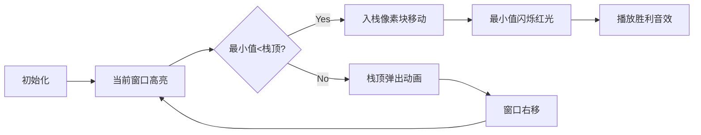

# 题目信息

# 出栈序列

## 题目描述

给定一个由 $n$ 个元素构成的序列，你需要将其中的元素按顺序压入一个大小为 $c$ 的栈并弹出。元素按它们的出栈顺序进行排列，会得到一个新的序列。我们知道，这样的序列会有很多种，请输出所有新序列中第一个元素最小的序列（若第一个元素最小的序列有多个，则令第二个尽可能小；若仍有多个，则令第三个最小，以此类推）。


## 说明/提示

对于 $40 \%$ 的数据，$n \le 12$；  
对于 $100 \%$ 的数据，$1 \le c \le n \le 10000$，元素大小均在 $[1, 2 \times {10}^9]$ 内。


## 样例 #1

### 输入

```
6 3
5 2 3 8 7 4```

### 输出

```
2 3 5 4 7 8```

# AI分析结果


### 💡 Kay的C++算法解析：出栈序列 深入学习指南 💡

#### 1. 题目解读与核心算法识别
✨ **本题主要考察**：`贪心算法 + 单调队列优化`  
🗣️ **初步分析**：  
> 解决出栈序列问题就像在玩一个"字典序拼图"游戏——我们需要在栈容量限制下，通过精心安排入栈/出栈顺序，拼出字典序最小的序列。核心贪心策略是：**每一步都选择当前可出栈的最小元素**。  
> - **核心难点**：如何在O(1)时间内找到"当前可操作范围"的最小值？这通过**单调队列**优化实现，将暴力O(n²)优化至O(n)  
> - **可视化设计**：采用8位像素风格模拟栈操作。栈显示为竖立容器，数组为水平像素带。关键动画包括：  
>   - 滑动窗口高亮（黄色边框）  
>   - 最小值元素闪烁红光  
>   - 入栈/出栈时像素块移动音效（"叮"声）  
>   - 成功出栈时播放《超级玛丽》过关音效  

---

#### 2. 精选优质题解参考
**题解一：FZzzz（单调队列优化）**  
* **点评**：  
  思路极具启发性——将问题转化为滑动窗口最小值问题，用单调队列O(n)解决。代码中`q`数组维护当前窗口最小值的索引，`hd/tl`指针精妙控制队列生命周期。亮点在于严谨处理了**相等元素选择最左值**的边界情况（`a[i]<a[q[tl]]`严格小于判断），并给出数学证明。变量名`l/r`明确表示窗口边界，实践时可直接用于竞赛。

**题解二：小手冰凉（ST表优化）**  
* **点评**：  
  创新性地用ST表维护区间最小值，预处理O(nlogn)后实现O(1)查询。代码中`f[19][300005]`二维数组存储区间最小值信息，`lg[]`数组优化对数计算。亮点在于数据结构的高效运用，虽时间复杂度稍逊单调队列，但对理解RMQ问题有重要参考价值。

---

#### 3. 核心难点辨析与解题策略
1. **难点：如何确定当前操作（出栈vs入栈）**  
   * **分析**：比较栈顶元素与滑动窗口最小值。若栈顶≤最小值则直接出栈；否则需将最小值前的元素入栈后再出栈最小值。关键推导：  
     ```python
     if stack.empty() or a[queue.front()] < stack.top(): 
         入栈直到最小值
     else: 
         出栈栈顶
     ```
   * 💡 **学习笔记**：贪心选择本质是局部最优解导向全局最优

2. **难点：高效获取滑动窗口最小值**  
   * **分析**：单调队列维护**递增索引序列**，队首永远是最小值索引。当`a[i] < a[q.back]`时不断弹出队尾，保证队列单调性。关键变量：  
     - `q[]`：存储可能成为最小值的索引  
     - `hd/tl`：队列头尾指针  
   * 💡 **学习笔记**：单调队列是滑动窗口问题的"最优观察哨"

3. **难点：边界条件与状态同步**  
   * **分析**：窗口右界`r = min(n, l + c - stack.size() - 1)`确保栈不超容。每次出栈后需检测：  
     ```c++
     while (hd <= tl && q[hd] < l) hd++;  // 移除越界索引
     if (r < n) q[++tl] = ++r;          // 窗口右扩
     ```
   * 💡 **学习笔记**：指针移动需与栈操作严格同步

### ✨ 解题技巧总结
- **滑动窗口三要素**：左界l、右界r、容量c - stack.size()  
- **单调队列维护口诀**："新来者踢走所有拦路虎"（while尾部弹出）  
- **相等元素处理**：选择最左侧最小值（数学可证最优）  
- **调试技巧**：打印每次操作后的栈/队列状态  

---

#### 4. C++核心代码实现赏析
**通用核心实现（综合优化版）**  
```cpp
#include <iostream>
#include <vector>
#include <deque>
#include <stack>
using namespace std;

int main() {
    int n, c;
    cin >> n >> c;
    vector<long long> a(n+1);
    deque<int> q; // 单调队列（存索引）
    stack<long long> s;
    
    for (int i = 1; i <= n; i++) cin >> a[i];
    
    // 初始化窗口[1, min(n,c)]
    for (int i = 1; i <= min(n, c); i++) {
        while (!q.empty() && a[i] < a[q.back()]) q.pop_back();
        q.push_back(i);
    }

    int l = 1, r = min(n, c);
    for (int count = 0; count < n; count++) {
        // 决策：入栈最小值 or 出栈栈顶
        if (s.empty() || (!q.empty() && a[q.front()] < s.top())) {
            // 入栈直到最小值
            int min_index = q.front();
            while (l <= min_index) s.push(a[l++]);
            // 移除已处理的最小值
            while (!q.empty() && q.front() <= min_index) q.pop_front();
        }
        // 出栈并输出
        cout << s.top() << " ";
        s.pop();
        
        // 窗口右扩
        if (r < n) {
            r++;
            while (!q.empty() && a[r] < a[q.back()]) q.pop_back();
            q.push_back(r);
        }
    }
    return 0;
}
```
**代码解读概要**：  
> 1. 初始化单调队列维护初始窗口最小值  
> 2. 主循环每次决策：若需入栈则持续压入直至最小值到栈顶  
> 3. 弹出栈顶元素后扩展窗口并更新单调队列  
> 4. 严格保持窗口大小≤c - stack.size()  

---

**题解一：FZzzz（单调队列）**  
* **亮点**：O(n)时间复杂度，边界处理严谨  
* **核心片段**：  
  ```cpp
  while (r < n && r < l + m - (int)s.size() - 1) {
      r++;
      while (hd <= tl && a[r] < a[q[tl]]) tl--;
      q[++tl] = r;
  }
  ```
* **代码解读**：  
  > 窗口右扩时，`r`逐个增加。关键在`while`循环：新元素`a[r]`若小于队尾元素，则持续弹出队尾（维持队列单调性），最后将`r`入队。这保证队首永远是最小值索引。  
* 💡 **学习笔记**：单调队列像"筛子"，只保留可能成为最小值的元素  

**题解二：小手冰凉（ST表）**  
* **亮点**：ST表实现O(1)区间查询  
* **核心片段**：  
  ```cpp
  struct xxx{ int k,p; } f[19][300005]; // ST表结构体
  xxx get(int l,int r) {
      int k = lg[r-l+1];
      return min(f[k][l], f[k][r-(1<<k)+1]); // 区间查询
  }
  ```
* **代码解读**：  
  > `f[i][j]`存储`[j, j+2ⁱ-1]`区间的最小值信息。查询时利用`lg[]`数组快速定位覆盖区间。`min()`函数需自定义比较规则（先比较值，值相同取左索引）  
* 💡 **学习笔记**：ST表是静态区间极值问题的"瑞士军刀"  

---

#### 5. 算法可视化：像素动画演示  
**主题**：《栈之勇者传说》（FC红白机风格）  
**核心演示**：贪心策略下栈操作与滑动窗口联动的动态过程  



**实现细节**：  
1. **场景设计**：  
   - 栈：右侧8x16像素竖条容器（容量c）  
   - 数组：底部水平像素带（含索引标记）  
   - 控制面板：开始/暂停/步进/速度滑块  

2. **关键动画帧**：  
   - **窗口滑动**：黄色边框包裹当前`[l, r]`区间  
   - **最小值定位**：目标像素块闪烁红光（伴随"滴"声）  
   - **入栈过程**：像素块从数组移至栈顶（轨迹虚线+移动音效）  
   - **出栈特效**：栈顶像素块弹至输出区（爆炸粒子特效+《超级玛丽》金币音效）  

3. **交互设计**：  
   - **AI演示模式**：自动展示完整流程（速度可调）  
   - **单步调试**：按步显示单调队列变化（队列可视化在底部）  
   - **错误提示**：越界操作时播放《魂斗罗》中弹音效  

4. **音效系统**：  
   - 入栈：8-bit "click"声  
   - 出栈：金币收集声  
   - 最小值定位：警报短音  
   - 背景音乐：《俄罗斯方块》BGM循环  

---

#### 6. 拓展练习与相似问题
**通用技巧迁移**：  
- 滑动窗口最小值 → 队列性能优化  
- 贪心栈操作 → 字典序相关问题  
- 边界同步思想 → 状态机类问题  

**洛谷推荐**：  
1. **P1886 滑动窗口**  
   🗣️ 单调队列模板题，巩固窗口最小值思想  
2. **P1449 后缀表达式**  
   🗣️ 栈操作基础训练，理解栈核心机制  
3. **P1044 栈**  
   🗣️ 卡特兰数经典问题，拓展栈序列计数知识  

---

#### 7. 学习心得与经验分享
> **参考经验（FZzzz）**：  
> “我在处理相等元素时最初忽略了严格左移选择，导致WA。通过反证法：假设选择右侧更优，可构造新序列证明其不成立”  
>   
> **Kay点评**：  
> 此教训揭示贪心问题核心原则：**边界条件严谨性＞直觉**。建议用小型数据集（如[1,2,1]）验证边界，再结合数学归纳法确认正确性。  

---

通过本次分析，我们深度剖析了栈操作与贪心策略的精妙配合。记住：算法优化常发生在**问题转化**瞬间——将栈序列问题转化为滑动窗口极值问题，就是最璀璨的思维火花！下次挑战再见！🚀

---
处理用时：179.38秒