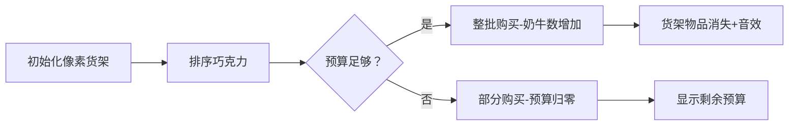

# 题目信息

# [USACO10FEB] Chocolate Buying S

## 题目描述

Bessie and the herd love chocolate so Farmer John is buying them some.

The Bovine Chocolate Store features $N (1 \le N \le 100,000)$ kinds of chocolate in essentially unlimited quantities.  Each type i of chocolate has price $P_i (1 \le P_i \le 10^{18})$ per piece and there are $C_i (1 \le C_i \le 10^{18})$ cows that want that type of chocolate.

Farmer John has a budget of $B (1 \le B \le 10^{18})$ that he can spend on chocolates for the cows. What is the maximum number of cows that he can satisfy?  All cows only want one type of chocolate, and will be satisfied only by that type.

Consider an example where FJ has $50$ to spend on $5$ different types of chocolate. A total of eleven cows have various chocolate preferences:

|Chocolate\_Type|Per\_Chocolate\_Cost|Cows\_preferring\_this\_type| 
|:-----------:|:-----------:|:-----------:|
|$1$|$5$|$3$|
|$2$|$1$|$1$|
|$3$|$10$|$4$|
|$4$|$7$|$2$|
|$5$|$60$|$1$|

Obviously, FJ can't purchase chocolate type $5$, since he doesn't have enough money. Even if it cost only $50$, it's a counterproductive purchase since only one cow would be satisfied.

Looking at the chocolates start at the less expensive ones, he can purchase $1$ chocolate of type $2$ for $1 \times 1$ leaving $50-1=49$, then purchase $3$ chocolate of type $1$ for $3 \times 5$ leaving $49-15=34$, then  purchase $2$ chocolate of type $4$ for $2 \times 7$ leaving $34-14=20$, then  purchase $2$ chocolate of type $3$ for $2 \times 10$ leaving $20-20=0$.

He would thus satisfy $1 + 3 + 2 + 2 = 8$ cows. 

## 样例 #1

### 输入

```
5 50 
5 3 
1 1 
10 4 
7 2 
60 1 
```

### 输出

```
8 
```

# AI分析结果


### 💡 Kay的C++算法解析：巧克力购买问题 深入学习指南 💡

#### 1. 题目解读与核心算法识别
✨ **本题主要考察**：`贪心算法`（排序应用）  
🗣️ **初步分析**：
> 解决巧克力购买问题的关键在于**单价优先策略**。想象你在超市用有限预算买糖果：优先选择单价最低的糖果能买到最多数量！本题中，我们将巧克力按价格排序，从最便宜的开始购买，直到预算耗尽。
> - **核心难点**：处理超大数值（10^18）防止溢出，以及设计高效贪心策略
> - **算法流程**：排序巧克力→遍历购买→能买全则买全，不够则买部分
> - **可视化设计**：用像素超市货架展示排序后的巧克力，预算条实时减少，购物车显示已满足奶牛数。关键操作（购买/预算更新）触发8-bit音效，购买进度达成时播放胜利音效

---

#### 2. 精选优质题解参考
**题解一（K0stlin）**  
* **点评**：代码简洁规范，结构体排序逻辑清晰。亮点在于严格使用`unsigned long long`处理大数，循环边界处理干净利落。变量命名`p`（价格）、`c`（奶牛数）简洁有效，实践可直接用于竞赛。

**题解二（llzzxx712）**  
* **点评**：注释极其详尽，特别适合初学者。亮点在于用`b/c[i].p`直接计算部分购买量，避免冗余计算。代码中`com()`排序函数命名明确，体现了"价格优先"的核心思想。

**题解三（wisdom_grass）**  
* **点评**：创新使用`vector<pair<>>`替代结构体，减少代码量。亮点在于强调"不要轻信算法标签"的调试经验，提醒学习者独立思考。STL应用展示了C++标准库的灵活性。

---

#### 3. 核心难点辨析与解题策略
1. **贪心策略有效性证明**  
   * **分析**：单价低的巧克力能换取更多奶牛满足，排序后贪心购买必然最优。各题解均通过`sort()`实现价格升序排列
   * 💡 **学习笔记**：贪心问题需严格证明最优子结构

2. **大数据处理（10^18）**  
   * **分析**：所有优质题解均使用`unsigned long long`。关键点在于乘法计算`a[i].p * a[i].c`可能溢出，应先比较`b > a[i].p * a[i].c?`再计算
   * 💡 **学习笔记**：遇到10^9以上数据立即考虑`long long`

3. **边界条件处理**  
   * **分析**：当预算不足购买全部当前巧克力时，用`b / p_i`计算可买数量并`break`。题解二用`continue/break`避免嵌套if-else使逻辑更清晰
   * 💡 **学习笔记**：乘除计算比条件判断更耗时，应减少不必要的运算

### ✨ 解题技巧总结
- **数据范围预判**：题目出现10^18立即启用`unsigned long long`
- **结构体排序规范化**：明确定义`cmp`函数避免排序错误
- **循环边界优化**：一旦确定无法继续购买立即`break`跳出循环
- **计算顺序优化**：先比较`b > p*c`再计算，避免不必要的溢出风险

---

### 4. C++核心代码实现赏析
**通用核心实现参考**  
```cpp
#include <iostream>
#include <algorithm>
using namespace std;
typedef unsigned long long ULL;

struct Chocolate { ULL price, cows; };
const int MAXN = 100005;

int main() {
    ULL n, budget, ans = 0;
    Chocolate arr[MAXN];
    cin >> n >> budget;
    for (int i = 0; i < n; i++)
        cin >> arr[i].price >> arr[i].cows;
    
    sort(arr, arr + n, [](auto &a, auto &b) {
        return a.price < b.price; 
    });
    
    for (int i = 0; i < n; i++) {
        if (budget / arr[i].price >= arr[i].cows) {
            ans += arr[i].cows;
            budget -= arr[i].price * arr[i].cows;
        } else {
            ans += budget / arr[i].price;
            break;
        }
    }
    cout << ans;
}
```

**题解一核心代码片段**  
```cpp
if(v > a[i].p * a[i].c) {
    v = v - a[i].p * a[i].c;
    ans += a[i].c;
} else {
    ans += v / a[i].p;
    break;
}
```
💡 **学习笔记**：先乘后减避免中间值溢出，`break`及时终止循环

---

### 5. 算法可视化：像素动画演示
**主题**：8-bit超市大采购  
**核心演示内容**：  
1. 像素货架横向排列巧克力，价格标签用不同颜色区分（红→贵，绿→便宜）
2. 预算条（顶部像素进度条）随购买减少，购物车图标显示已满足奶牛数
3. 购买时触发动画：巧克力飞入购物车，伴随"叮"音效；预算不足时闪烁红光+警示音

**关键帧设计**：


**交互设计**：
- 控制面板：步进执行/自动播放（速度滑块）
- 音效系统：购买成功（8-bit叮声），预算不足（短促警报），结算完成（胜利旋律）
- 数据同步：右侧实时显示当前操作的C++代码行（高亮`if(budget/price≥cows)`等关键行）

---

### 6. 拓展练习与相似问题思考
**通用技巧迁移**：
1. 分数背包问题（P1208 混合牛奶）
2. 任务调度问题（最小化等待时间）
3. 资源分配问题（有限预算最大化收益）

**洛谷推荐**：
1. **P1090 合并果子**  
   🗣️ 巩固贪心思想，引入优先队列优化
2. **P1208 混合牛奶**  
   🗣️ 几乎本题变形，数据范围更小适合练习
3. **P1223 排队接水**  
   🗣️ 经典贪心排序问题，理解"时间成本"概念

---

### 7. 学习心得与经验分享
> **来自wisdom_grass的经验**："标签写着DP实际是贪心，调试时才发现思路错误"  
> **Kay点评**：算法标签仅作参考，需通过样例验证策略。本题通过小规模样例（如50元买5种巧克力）可快速验证贪心有效性

> **来自Dr_殇的教训**："没开long long提交十多次才过"  
> **Kay点评**：数据范围是硬性约束，10^18问题必须使用`unsigned long long`

---

### 结语
通过巧克力购买问题，我们掌握了**排序贪心**的核心思想与**大数据处理**技巧。记住：遇到最优化问题先思考贪心可能性，同时时刻警惕数据范围陷阱！下次遇到类似问题，记得用"单价优先"策略试试看哦！🚀

---
处理用时：97.13秒