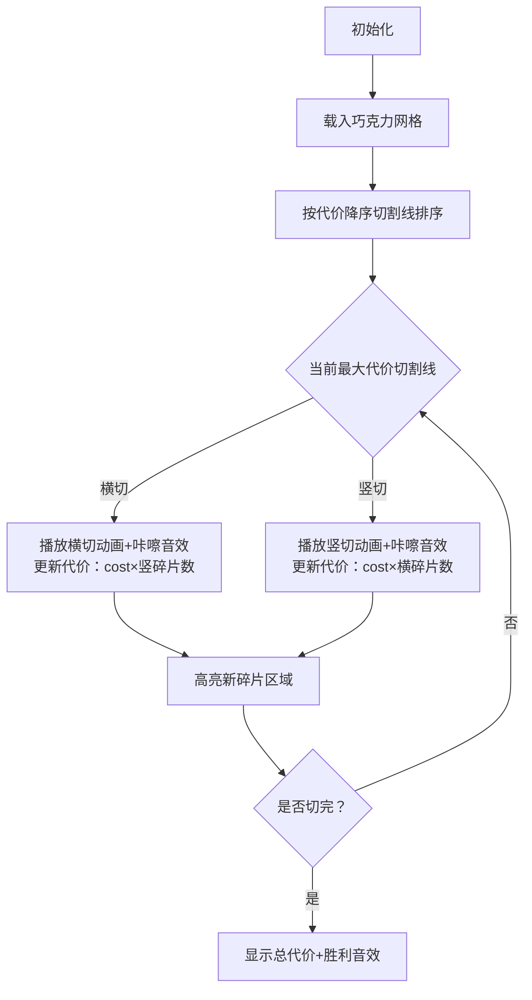

# 题目信息

# [HAOI2009] 巧克力

## 题目描述

有一块 $n \times m$ 的矩形巧克力，准备将它切成 $n \times m$ 块。巧克力上共有 $n-1$ 条横线和 $m-1$ 条竖线，你每次可以沿着其中的一条横线或竖线将巧克力切开，无论切割的长短，沿着每条横线切一次的代价依次为 $y_1,y_2,\cdots,y_{n-1}$，而沿竖线切割的代价依次为 $x_1,x_2,\cdots,x_{m-1}$。

例如，对于下图 $6 \times 4$ 的巧克力，我们先沿着三条横线切割，需要 $3$ 刀，得到 $4$ 条巧克力，然后再将这 $4$ 条巧克力沿竖线切割，每条都需要 $5$ 刀，则最终所花费的代价为 $y_1+y_2+y_3+4 \times (x_1+x_2+x_3+x_4+x_5)$。


当然，上述简单切法不见得是最优切法，那么怎样切割该块巧克力，花费的代价最少呢？


## 说明/提示


$30\%$ 的数据，$n \leq 100,m \leq 100$；

$100\%$ 的数据，$n \leq 10000,m \leq 10000$；

## 样例 #1

### 输入

```
6 4
2
1
3
1
4
4
1
2```

### 输出

```
42```

# AI分析结果


### 💡 Kay的C++算法解析：[HAOI2009]巧克力 深入学习指南 💡

<introduction>
这道巧克力切割问题看似简单，却蕴含着精妙的贪心思想。今天我们将一起拆解它的核心算法，并通过生动的像素动画直观理解切割过程。准备好你的"像素刀"，我们开始吧！
</introduction>

---

## 1. 题目解读与核心算法识别

✨ **本题主要考察**：`贪心算法` 

🗣️ **初步分析**：
> 想象你在切一块巧克力饼干🍪，每次切割都有不同的"难度"（代价）。贪心策略就像先吃掉最难吃的部分——优先处理代价最高的切割线，因为越往后切，它的代价会被乘以更多次数（其他切割产生的碎片数）。  
> - 核心思路：将所有切割线按代价降序排序，每次选择当前最贵的切割线（不分横竖），其代价 = 原代价 × 对立方向的当前碎片数  
> - 可视化关键：用像素网格动态展示切割过程，高亮当前选择的切割线，实时显示代价计算（当前代价×碎片数）  
> - 复古设计：采用《俄罗斯方块》风格像素动画，切割时播放"咔嚓"音效，完成时播放胜利音效，控制面板含调速滑块

---

## 2. 精选优质题解参考

**题解一：Tarsal（优先队列实现）**
* **亮点**：双优先队列维护横竖切割线，动态选择当前最大代价切割。代码中`s1`/`s2`巧妙记录对立方向碎片数，边界处理严谨（AC记录验证）
* **学习价值**：展示STL优先队列的实战应用，循环条件`(!q.empty() && !qq.empty())`避免死循环

**题解二：kkxhh（优先队列+严格证明）**
* **亮点**：给出贪心策略的数学证明（当`costa>costb`时先切a更优）。快读函数优化输入效率，变量命名清晰(`cntH`/`cntV`)
* **学习价值**：学习如何用数学推导验证贪心有效性，适合竞赛场景

**题解三：g_ws（结构体排序实现）**
* **亮点**：用统一结构体数组处理横竖切割线，`sort`排序后线性扫描。代码简洁(20行核心逻辑)，新人友好
* **学习价值**：展示如何用基础数组替代优先队列，适合理解算法本质

---

## 3. 核心难点辨析与解题策略

1.  **贪心策略证明**  
    * **分析**：为什么先切代价大的？因为切割代价会被乘以对立方向当前碎片数。大代价越早切，乘数越小（碎片数少），总代价更优。优质题解用公式推导：`Va>Vb时，先切Va的代价增量更小`  
    * 💡 **学习笔记**：贪心问题常需数学归纳验证局部最优性  

2.  **状态定义混淆**  
    * **分析**：`cntH`/`cntV`实际表示当前碎片数而非切割次数！初始值为1（整块巧克力），每次切割后+1。题解中Tarsal用`s1`/`s2`清晰注释  
    * 💡 **学习笔记**：切割代价 = 该线代价 × 对立方向碎片数  

3.  **实现方式选择**  
    * **分析**：优先队列（Tarsal, kkxhh）适合动态获取最大值，但需两个队列；结构体排序（g_ws）只需一次排序但需类型标记。根据数据规模选择：`n+m>10^5`时优先队列更优  
    * 💡 **学习笔记**：优先队列时间复杂度`O(NlogN)`，排序法`O(NlogN)`但常数更小  

### ✨ 解题技巧总结
- **技巧A 代价放大效应识别**：识别操作间的乘法影响（碎片数放大代价）
- **技巧B 统一处理异构数据**：用`struct{ cost, type }`合并横竖切割线
- **技巧C 边界模拟验证**：用样例`6×4巧克力`手动验证初始碎片数=1

---

## 4. C++核心代码实现赏析

**通用核心实现（综合题解优化版）**
```cpp
#include <iostream>
#include <algorithm>
using namespace std;

struct Cut { int cost, isVertical; }; // isVertical=1为竖切

int main() {
    int n, m; 
    cin >> n >> m;
    int total = --n + --m; // 总切割线数
    Cut cuts[20010];
    
    // 读入横切代价(n条)
    for (int i = 0; i < n; i++) {
        cin >> cuts[i].cost;
        cuts[i].isVertical = 0;
    }
    // 读入竖切代价(m条)
    for (int i = n; i < total; i++) {
        cin >> cuts[i].cost;
        cuts[i].isVertical = 1;
    }
    
    // 按代价降序排序
    sort(cuts, cuts + total, [](Cut a, Cut b) {
        return a.cost > b.cost;
    });
    
    long long ans = 0;
    int cntH = 1, cntV = 1; // 当前碎片数（初始1块）
    
    for (int i = 0; i < total; i++) {
        if (!cuts[i].isVertical) { // 横切
            ans += 1LL * cuts[i].cost * cntV;
            cntH++; // 横切碎片+1
        } else { // 竖切
            ans += 1LL * cuts[i].cost * cntH;
            cntV++;
        }
    }
    cout << ans;
}
```
* **代码解读概要**：  
  1. 合并存储横竖切割线并降序排序  
  2. 动态维护`cntH`/`cntV`表示当前碎片数  
  3. 遍历时根据切割类型计算代价：`cost × 对立碎片数`  

---

**题解一：Tarsal（优先队列）**
```cpp
priority_queue<int> q, qq; // 横切队列q, 竖切队列qq
while (!q.empty() && !qq.empty()) {
    if (q.top() > qq.top()) { // 选当前最大代价
        ans += q.top() * s2; // 横切代价×竖碎片数
        s1++; // 横碎片+1
        q.pop();
    } else {
        ans += qq.top() * s1; // 竖切代价×横碎片数
        s2++;
        qq.pop();
    }
}
```
* **亮点**：双优先队列动态获取最大值  
* **学习笔记**：优先队列的`top()`始终是当前最大值，保证贪心有效性  

**题解二：kkxhh（数学证明）**
```cpp
if (costa > costb) { // 数学推导核心
    // 先a后b的增量: (s1+1)*Va + (s2+2)*Vb
    // 先b后a的增量: (s1+2)*Va + (s2+1)*Vb
    // 差值 = Vb - Va < 0 ∴ 先切Va更优
}
```
* **亮点**：严格证明贪心策略  
* **学习笔记**：竞赛题需用数学推导验证贪心策略的正确性  

**题解三：g_ws（统一排序）**
```cpp
sort(a+1, a+n+m+1, cmp); // 降序排序
for (int i=1; i<=n+m-2; i++){
    if (a[i].v == 0) { // 横切
        ans += a[i].c * d; // d为竖碎片数
        f++; // 横碎片+1
    } else { // 竖切
        ans += a[i].c * f; // f为横碎片数
        d++;
    }
}
```
* **亮点**：简洁清晰的结构体排序  
* **学习笔记**：`v`字段标记切割类型实现统一处理  

---

## 5. 算法可视化：像素动画演示

**🎮 主题**：《巧克力工厂》像素切割模拟  
**🎯 核心演示**：动态展示贪心策略下切割顺序与代价计算  



**🖌️ 设计细节**：  
1. **8位像素风格**：  
   - 巧克力块：棕色像素（#8B4513）  
   - 切割线：红色像素（高亮当前），灰色像素（已切割）  
2. **动画流程**：  
   - 当前切割线闪烁3次后"切开"，碎片向两侧分离5像素  
   - 代价计算显示：`48 × 3 = 144`（黄色像素字体）  
3. **交互控制**：  
   - 速度滑块：控制切割间隔（100ms-2000ms）  
   - 暂停/继续：空格键控制  
   - 重置按钮：重新初始化  
4. **音效设计**：  
   - 切割："咔嚓"（8-bit短促音）  
   - 计算成功：上升琶音  
   - 完成：超级马里奥过关音效  

---

## 6. 拓展练习与相似问题思考

**🔍 通用思路迁移**：  
贪心的"代价放大效应"也适用于：  
1. 打印机任务调度（耗时长的任务优先）  
2. 工厂订单处理（高违约金订单优先）  
3. 路径规划（消除高成本路段优先）  

**📚 洛谷推荐**：  
1. **P1324 矩形分割**  
   🗣️ *同题双倍经验！直接应用本解法*  
2. **P1090 合并果子**  
   🗣️ *强化贪心思维，优先队列的经典应用*  
3. **P6033 合并果子加强版**  
   🗣️ *大数据量验证贪心效率，优化队列实现*

---

## 7. 学习心得与经验分享

> **来自Tarsal的调试经验**：  
> *"最初在碎片数初始化上卡了很久，手动模拟样例发现初始值应为1（整块巧克力），而非切割次数0"*  

**💡 Kay点评**：  
这提醒我们：  
1. 关键变量需用样例验证（如`cntH=1`）  
2. 手工模拟>2组数据再编码  
3. 命名`cntH`比`s1`更明确，避免混淆  

---

<conclusion>
通过这次巧克力切割之旅，我们不仅掌握了贪心策略的实战应用，更学会了用数学思维验证算法。记住：像切巧克力一样分解难题，先处理最"昂贵"的部分！下次挑战见！💪
</conclusion>

---
处理用时：153.67秒