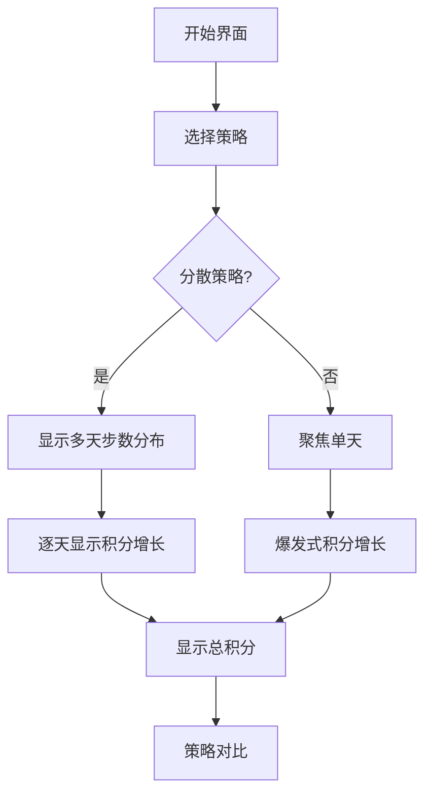

# 题目信息

# 走路

## 题目背景

小 W 下载了一款运动软件。

## 题目描述

小 W 准备在接下来的 $m$ 天中锻炼，由于他不能走得太多以至于累死（怎么可能呢），所以他这 $m$ 天最多一共只能走 $n$ 步。  
这个运动软件为了激励小 W 走路，推出了 $k$ 种激励措施，每种激励措施都形如“如果你第 $p$ 天中走完了 $q$ 步，那么第 $p$ 天中接下来的每一步都会给你加 $1$ 积分”。**激励措施可以叠加，即走一步你可能可以获得多于 $1$ 积分。**  
现在小 W 想知道，他总计最多可以获取多少积分呢？

## 说明/提示

样例解释：  
只有一种方案，即在第一天走 $5$ 步，第一、二步各获得 $1$ 积分，第三、四步各获得 $2$ 积分，第五步获得 $3$ 积分，总计 $9$ 积分。  
********
数据范围：  
对于 $10\%$ 的数据，$n,m,k\le10$。  
对于 $40\%$ 的数据，$n,m,k \le 10^3$。  
对于 $100\%$ 的数据，$1\le n\le 10^{12}$，$1\le m,k\le 10^5$，$1\le p\le m$，$0\le q\le n$。

## 样例 #1

### 输入

```
5 1 3
1 0
1 2
1 4
```

### 输出

```
9```

# AI分析结果


# 💡 Kay的C++算法解析：走路 深入学习指南 💡

**引言**  
今天我们来分析"走路"这道C++编程题。本指南将帮助你理解题目核心、掌握贪心策略，并通过像素动画直观感受算法过程。让我们一起探索如何最大化积分吧！

## 1. 题目解读与核心算法识别

✨ **本题主要考察**：`贪心策略`  

🗣️ **初步分析**：  
> 解决"走路"的关键在于运用贪心策略。想象你在玩一个收集金币的游戏：把所有金币集中在同一关卡收集，比分散到多个关卡能获得更高分数！在本题中，贪心策略体现在将所有步数集中在同一天走，从而最大化积分收益。  
> - **核心思路**：积分随步数增加而递增，分散步数会导致部分激励措施未被充分利用  
> - **可视化设计**：动画将展示不同天数步数分布的效果对比，高亮最优天的积分爆发式增长  
> - **像素风格**：采用8位复古游戏风格，用"金币跳动"表示积分增长，"宝箱开启"表示激励触发，配合"叮"的音效增强反馈  

---

## 2. 精选优质题解参考

**题解一：WYXkk（赞25）**  
* **点评**：此解法思路清晰直击核心，用数学不等式简洁证明了贪心策略的正确性。代码中`a[p] += n-q`精准捕捉激励措施本质，变量命名简洁（`mx`表最大值），边界处理严谨。O(k+m)时间复杂度在10^5数据规模下高效可靠，是竞赛级实现的典范。  

**题解二：zengzhijie54188（赞10）**  
* **点评**：虽然数组开得过大，但注释详尽的教学价值值得肯定。`if(n-b>0)`的判断体现防御性编程思维，`maxn = max(maxn, c[i])`的标准库使用规范，特别适合初学者学习基础贪心实现。  

**题解三：chinaxjh（赞3）**  
* **点评**：三目运算符`a[x] += (n>y?(n-y):0)`的巧妙使用展现了代码压缩技巧。强调long long类型和题目特征分析（"被浪费的步数"）对理解贪心本质有重要启发，实践价值突出。  

---

## 3. 核心难点辨析与解题策略

1.  **难点：理解积分增长特性**  
    * **分析**：积分随步数非递减增长是关键洞察。优质题解通过反证法说明：分散步数时，最后一步积分总≤集中策略的同位置积分  
    * 💡 **学习笔记**：积分的单调性是贪心策略成立的基石  

2.  **难点：高效处理大数据**  
    * **分析**：当k=10^5时需避免O(mk)嵌套循环。所有优质题解都采用"按天累加"策略，为每个激励措施执行O(1)操作  
    * 💡 **学习笔记**：预处理+线性扫描是处理大规模数据的黄金组合  

3.  **难点：贪心策略证明**  
    * **分析**：WYXkk和Lpttor的题解通过数学推导证明：设两天积分率c₁≥c₂，则b₁+a₂×c₁ ≥ b₁+b₂  
    * 💡 **学习笔记**：学会用数学工具验证贪心正确性  

### ✨ 解题技巧总结
-   **技巧1：问题特征转化** - 将激励措施转化为(n-q)的线性累加  
-   **技巧2：防御性编程** - 即使题目保证q≤n，仍添加非负判断提升代码健壮性  
-   **技巧3：空间优化** - 用单变量maxn替代存储整个数组，节省内存  

---

## 4. C++核心代码实现赏析

**本题通用核心C++实现参考**  
* **说明**：综合优质题解思路，采用最简洁高效的实现方案  
* **完整核心代码**：
```cpp
#include <iostream>
using namespace std;
typedef long long ll;

const int MAXM = 100005;
ll day[MAXM]; // 记录每天总积分

int main() {
    ll n, m, k, p, q;
    cin >> n >> m >> k;
    
    // 处理每个激励措施
    while (k--) {
        cin >> p >> q;
        day[p] += (n - q); // 核心累加操作
    }
    
    ll ans = 0;
    for (int i = 1; i <= m; ++i) 
        if (day[i] > ans) ans = day[i];
    
    cout << ans;
    return 0;
}
```
* **代码解读概要**：  
  > 1. 读取总步数n、天数m、激励数k  
  > 2. 对每个激励措施：按天数p索引，累加(n-q)  
  > 3. 线性扫描找出最大积分日  
  > 4. 输出结果  

---

**题解一：WYXkk**  
* **亮点**：数学证明与代码实现完美结合  
* **核心代码片段**：
```cpp
F(i,1,k) {ll p=rd();ll q=rd();a[p]+=n-q;}
F(i,1,m) if(a[i]>=a[mx]) mx=i;
```
* **代码解读**：  
  > `a[p]+=n-q`是算法的灵魂所在——每个激励措施对第p天的贡献是(n-q)，即该措施能带来的总积分。通过`mx`动态追踪最大值，避免存储整个数组。  
* 💡 **学习笔记**：用O(1)空间维护最大值是常用优化手段  

**题解二：zengzhijie54188**  
* **亮点**：详尽的初学者友好注释  
* **核心代码片段**：
```cpp
if (n - b > 0) c[a] += (n - b);
maxn = max(maxn, c[i]);
```
* **代码解读**：  
  > `if(n-b>0)`的防御性判断虽然数学上非必需，但体现了良好的编程习惯。`max`函数的标准库调用比手写比较更易读。  
* 💡 **学习笔记**：即使题目有数据保证，也要考虑边界情况  

**题解三：chinaxjh**  
* **亮点**：三目运算符的简洁实践  
* **核心代码片段**：
```cpp
if (n-y>0) a[x] += n-y;
ans = max(a[i], ans);
```
* **代码解读**：  
  > 将判断和累加合并为单行表达式，保持代码紧凑。变量名`ans`比`maxn`更语义化。  
* 💡 **学习笔记**：代码简洁性和可读性需要平衡  

-----

## 5. 算法可视化：像素动画演示

**主题**：8位像素风"步数大冒险"  
**核心演示**：对比步数分散vs集中策略的积分增长过程  

### 动画设计：


### 关键交互：
1. **像素网格**：x轴表示天数（1-5天），y轴表示步数（0-n）
2. **激励宝箱**：当步数≥q时，对应坐标(p,q)的宝箱开启，之后每步金币+1
3. **动态对比**：
   - 左区：步数分散多天，金币缓慢增加
   - 右区：步数集中单天，后期金币爆发增长
4. **控制面板**：
   - 步进控制：←→键单步前进/后退
   - 速度滑块：调节动画速度
   - AI演示：自动执行最优策略

### 音效设计：
- 🔔 激励触发：8-bit "叮"声（宝箱开启时）
- ⬆ 积分增长：短促电子音（每获得1积分）
- 🎉 策略胜利：马里奥过关音效（展示最优策略时）

### 教学价值：
通过像素动画直观揭示核心规律：**前q步在积累能量，q步后才是积分爆发期**，这正是集中策略的优势所在。

---

## 6. 拓展练习与相似问题思考

### 通用思路迁移：
贪心策略的核心在于**识别最优子结构**和**证明局部最优即全局最优**。该思想适用于：
1. 区间调度问题（如最多不相交区间）
2. 资源分配问题（如会议室安排）
3. 带权重的任务调度

### 洛谷练习推荐：
1. **P1208 混合牛奶**  
   → 贪心选择单价最低的供应商  
2. **P1094 纪念品分组**  
   → 双指针贪心匹配  
3. **P5019 铺设道路**  
   → 贪心处理区间覆盖  

---

## 7. 学习心得与经验分享

> **经验分享（WYXkk）**：  
> "贪心策略的证明往往比实现更重要，用数学不等式可以严谨验证直觉"  
>  
> **点评**：此题的多篇题解印证了该观点——没有证明的贪心就像没有地基的建筑。建议学习者掌握两种证明技巧：1）数学归纳法 2）反证法  

---

**结语**  
通过本次分析，我们深入理解了贪心策略在积分最大化问题中的应用。记住：好算法需要严谨证明和优雅实现。下次遇到"看似显然"的策略时，别忘了问自己：为什么这样做最优？保持好奇心，继续加油！🚀

---
处理用时：135.93秒