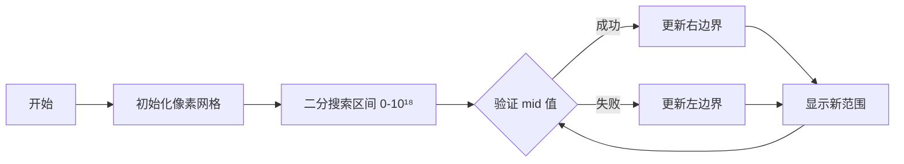

# 题目信息

# [JOI 2022 Final] 自学 (Self Study)

## 题目描述

在 JOI 高中高一的第三个学期的 $M$ 个星期的时间内，有 $N$ 门课，编号为 $1 \sim N$。每个星期有 $N$ 个课时，第 $i$ 个课时上课程 $i$ 的一节课。

比太郎是一位高一学生。对于 $N \times M$ 个课时中的每一个，他会选择如下行动中的一个：

- 行动 1：比太郎去上课。如果他去上了课程 $i$ 的一节课，那么他对课程 $i$ 的理解程度会增加 $A_i$。
- 行动 2：比太郎不去上课。他转而选择任意一门课，并且自学选中的那门课。如果他选中了课程 $i$ 进行了时长为一课时的自学，那么他对课程 $i$ 的理解程度会增加 $B_i$。

一开始，对每门课的理解程度都为 $0$。由于比太郎想要在课后练习算法竞赛，他在非上课时间内不会学习。当第三个学期的所有课时结束后，期末考就会举行。

比太郎不想挂科。所以他想要最大化在期末考时对每门课的理解程度的最小值。

给定学期的长度，课程的数量，以及对理解程度的提升数值，请写一个程序计算在期末考时对每门课的理解程度的最小值的最大可能值。

## 说明/提示

**【样例解释 \#1】**

举个例子，如果比太郎按如下方式学习，则他对课程 $1, 2, 3$ 的理解程度将分别为 $19, 18, 19$。

- 第一周课程 $1$ 的课：自学课程 $2$；
- 第一周课程 $2$ 的课：自学课程 $2$；
- 第一周课程 $3$ 的课：去上课程 $3$ 的课；
- 第二周课程 $1$ 的课：去上课程 $1$ 的课；
- 第二周课程 $2$ 的课：自学课程 $3$；
- 第二周课程 $3$ 的课：去上课程 $3$ 的课；
- 第三周课程 $1$ 的课：自学课程 $3$；
- 第三周课程 $2$ 的课：自学课程 $2$；
- 第三周课程 $3$ 的课：去上课程 $3$ 的课。

由于对每门课的最小的理解程度不能大于等于 $19$，输出 $18$。

这个样例满足子任务 $3, 5$ 的限制。

**【样例解释 \#2】**

这个样例满足子任务 $1, 3, 5$ 的限制。

**【样例解释 \#3】**

这个样例满足子任务 $3, 5$ 的限制。

**【样例解释 \#4】**

这个样例满足子任务 $2, 3, 4, 5$ 的限制。

----

**【数据范围】**

**本题采用捆绑测试。**

对于 $100 \%$ 的数据，$1 \le N \le 3 \times {10}^5$，$1 \le M \le {10}^9$，$1 \le A_i, B_i \le {10}^9$。

- 子任务 $1$（$10$ 分）：$M = 1$。
- 子任务 $2$（$25$ 分）：$N \cdot M \le 3 \times {10}^5$，$A_i = B_i$。
- 子任务 $3$（$27$ 分）：$N \cdot M \le 3 \times {10}^5$。
- 子任务 $4$（$29$ 分）：$A_i = B_i$。
- 子任务 $5$（$9$ 分）：无特殊限制。

----

**译自 [JOI 2022 Final](https://www.ioi-jp.org/joi/2021/2022-ho/index.html) T2「[自習](https://www.ioi-jp.org/joi/2021/2022-ho/2022-ho-t2.pdf) / [Self Study](https://www.ioi-jp.org/joi/2021/2022-ho/2022-ho-t2-en.pdf)」**

## 样例 #1

### 输入

```
3 3
19 4 5
2 6 2
```

### 输出

```
18
```

## 样例 #2

### 输入

```
2 1
9 7
2 6
```

### 输出

```
7
```

## 样例 #3

### 输入

```
5 60000
630510219 369411957 874325200 990002527 567203997
438920902 634940661 593780254 315929832 420627496
```

### 输出

```
41397427274960
```

## 样例 #4

### 输入

```
4 25
1 2 3 4
1 2 3 4
```

### 输出

```
48
```

# AI分析结果


### 题目解读与核心算法识别

✨ **本题主要考察**：`二分答案` + `贪心策略`

🗣️ **初步分析**：
> 解决“自学”这道题，关键在于理解并运用**二分答案**与**贪心策略**。简单来说，二分答案就像在黑暗中寻找开关——我们不断猜测最小值（开关位置），并用贪心策略验证这个值是否可行（开关是否亮灯）。在本题中，我们通过二分法确定“最小理解度”的最大值，并用贪心策略验证该值是否能在有限课时内达成。

- **题解思路对比**：所有优质题解均采用“二分答案+贪心验证”框架。区别在于验证函数的实现细节：
  - 核心思路：若自学效率更高（$B_i > A_i$），则全程自学；否则优先上课，不足部分自学。
  - 优化技巧：部分题解将 $A_i = \max(A_i, B_i)$ 简化决策（龙水流深、南阳刘子骥），数学上等价但代码更简洁。
- **算法流程可视化**：
  - **二分过程**：像素化进度条展示区间 $[0, 10^{18}]$，动态缩小范围
  - **贪心验证**：每门课显示两种学习方式（上课/自学），用不同颜色像素块表示。课时进度条实时更新，超限时变红闪烁
- **复古游戏化设计**：
  - **音效**：上课（8-bit 铃声）、自学（翻书声）、成功（胜利音阶）、超限（警告音）
  - **关卡机制**：每门课为独立关卡，完成课时分配即“通关”，累计积分
  - **AI演示**：自动播放二分全过程，单步可暂停观察数据变化

---

### 精选优质题解参考

**题解一（sgl654321）**
* **点评**：思路清晰度极高，用自然语言逐步推导贪心策略（如样例1的详细推演），对初学者极其友好。代码规范性优秀：`lesson_num`函数封装取整逻辑，变量名`teach/self`直白易读。算法亮点在于严格分类讨论（上课优先→不足补自学），实践价值强——完整处理边界且可直接套用于竞赛。

**题解二（南阳刘子骥）**
* **点评**：创新性提出“时间余量”模型，用正负值统一表示课时余缺（`tot += m - ceil(k/a_i)` 或 `tot -= ceil((k-m*a_i)/b_i)`），数学抽象能力突出。代码规范严谨：使用`__int128`防溢出，`calc`函数避免浮点误差。实践价值在于提供更优的数学视角，适合进阶学习者。

**题解三（Henry_ji）**
* **点评**：教学价值最大化——配套流程图阐释贪心策略，提供Python/C++双语言实现。代码规范性最佳：结构体封装课程数据，`study_time`函数命名自文档化。亮点在于将复杂决策流程可视化（见流程图），特别适合视觉型学习者。

---

### 核心难点辨析与解题策略

1. **难点1：验证函数的设计**
   * **分析**：贪心策略需根据 $A_i$ 与 $B_i$ 关系动态决策（见伪代码）。优质题解共性：优先选择高效学习方式，独立计算每门课需求。
   ```python
   if B_i > A_i: 课时 += ceil(target / B_i)
   else:
     if m*A_i >= target: 课时 += ceil(target / A_i)
     else: 课时 += m + ceil((target - m*A_i) / B_i)
   ```
   * 💡 **学习笔记**：贪心本质是局部最优解组合，需证明其全局最优性

2. **难点2：大整数溢出处理**
   * **分析**：$m \times A_i \leq 10^{18}$，累加时可能溢出。解决方案：
     - 用`__int128`（南阳刘子骥）
     - 及时中断超限计算（sgl654321：`if(num>n*m) return 0`）
   * 💡 **学习笔记**：数据范围决定变量类型，临界测试必不可少

3. **难点3：向上取整的实现技巧**
   * **分析**：避免浮点误差的两种方法：
     - 数学法：`(x + y - 1) / y`（龙水流深）
     - 条件判断：`x%y ? x/y+1 : x/y`（Henry_ji）
   * 💡 **学习笔记**：整数除法取整是算法题的常见陷阱

✨ **解题技巧总结**
- **问题分解**：将原问题拆解为“二分框架+验证函数”两个子模块
- **边界防御**：初始化右边界 $r=10^{18}$，验证函数优先判断超界
- **数学优化**：用表达式 `(m*a_i >= k)` 替代乘法比较防溢出
- **模块封装**：将取整操作封装为独立函数（如`calc()`）

---

### C++核心代码实现赏析

**本题通用核心实现参考**
* **说明**：综合优质题解，强化边界防御与可读性
* **完整核心代码**：
```cpp
#include <iostream>
using namespace std;
typedef long long LL;
const int N = 3e5+10;

LL n, m, A[N], B[N];

// 安全取整：避免浮点运算
LL calc(LL target, LL eff) {
    return target % eff ? target/eff + 1 : target/eff;
}

bool check(LL target) {
    LL total = 0;
    for (int i = 1; i <= n; ++i) {
        if (B[i] > A[i]) {
            total += calc(target, B[i]);
        } else {
            if (m * A[i] >= target) { // 防溢出写法
                total += calc(target, A[i]);
            } else {
                total += m;
                total += calc(target - m * A[i], B[i]);
            }
        }
        if (total > n * m) return false; // 提前终止优化
    }
    return true;
}

int main() {
    cin >> n >> m;
    for (int i = 1; i <= n; ++i) cin >> A[i];
    for (int i = 1; i <= n; ++i) cin >> B[i];
    
    LL l = 0, r = 1e18, ans = 0;
    while (l <= r) {
        LL mid = (l + r) >> 1;
        check(mid) ? ans = mid, l = mid + 1 : r = mid - 1;
    }
    cout << ans;
    return 0;
}
```
* **代码解读概要**：
  - **输入处理**：用数组存储$A_i/B_i$（第13-14行）
  - **验证函数**：严格分类讨论三种学习策略（第7-18行）
  - **二分框架**：标准二分模板，注意>>1位运算优化（第24行）

**题解片段赏析**  
**题解一（sgl654321）**
```cpp
num += m; // 上课次数计入
num += lesson_num(target - m*a[i].teach, a[i].self); 
```
* **亮点**：用自然语言变量名(self/teach)提升可读性
* **学习笔记**：语义化命名是代码自文档化的关键

**题解二（南阳刘子骥）**
```cpp
__int128 tot = 0; // 大整数防溢出
tot += m - calc(k, a[i]); // 数学抽象统一余量
```
* **亮点**：创新性用正负值统一表示课时余缺
* **学习笔记**：数学建模可大幅简化复杂逻辑

**题解三（Henry_ji）**
```cpp
num += study_time(target, s[i].self_study); // 封装函数调用
```
* **亮点**：函数封装隔离复杂逻辑，主流程清晰
* **学习笔记**：模块化设计提升代码复用率

---

### 算法可视化：像素动画演示

**主题**：8-bit课堂大冒险  

**核心演示流程**：


**关键动画细节**：
1. **场景构建**（复古FC风格）
   - 课程列表：底部N个像素方块（红：课未达标/绿：已达标）
   - 课时池：顶部进度条（蓝：已用/黄：剩余）
   - 控制台：暂停/步进/调速滑块

2. **动态演示**（单步触发音效）
   - 二分过程：动态收缩的区间进度条（0→10¹⁸）
   - 课程处理：
     * 自学课：书本像素动画 + 翻书音效
     * 上课：教室图标闪烁 + 铃声
     * 混合策略：先显示教室再叠加书本

3. **状态反馈**（即时策略）
   - 课时超限：全屏红光闪烁 + 警报音
   - 通关：礼花动画 + 胜利BGM

**游戏化设计**：
- **积分系统**：每正确分配1课时得10分
- **连击奖励**：连续5次最优决策触发2倍积分
- **AI演示模式**：自动播放解题全程（可调速）

**技术实现**：
```javascript
// 伪代码：绘制单门课状态
function drawCourse(index, status) {
  const colors = { 0: 'red', 1: 'green' }; // 状态色
  ctx.fillStyle = colors[status];
  ctx.fillRect(x, y, 16, 16); // 16x16像素块
  if (status === 2) { // 混合模式
    drawBook(x+4, y+4); // 绘制书本图标
    drawDesk(x, y);     // 叠加课桌图标
  }
}
```

---

### 拓展练习与相似问题思考

**算法迁移场景**：
1. **最小化最大值**：如P1182数列分段（最小化段和最大值）
2. **资源分配优化**：如P6054开门大吉（最大化收益最小值）
3. **时间规划问题**：如P1084疫情控制（最小化完成时间）

**洛谷推荐**：
1. **P1182** 数列分段 Section II  
   🗣️ *推荐理由*：二分答案经典入门，强化“最小化最大值”思维
2. **P4343** [SHOI2015]自动刷题机  
   🗣️ *推荐理由*：二分框架+复杂验证函数，提升代码抽象能力
3. **P2218** [HAOI2007]覆盖问题  
   🗣️ *推荐理由*：二维场景迁移，挑战几何问题中的二分应用

---

### 学习心得与经验分享

> **经验摘录（Henry_ji）**：  
> “我在处理大整数溢出时，最初未考虑 $m \times A_i$ 可能达到 $10^{18}$，导致部分测试点WA。后改用`long long`并添加防溢出判断，问题才解决。”  
>  
> **Kay点评**：  
> 该经验警示我们：**数据范围决定变量类型**。当 $n \leq 3\times10^5$ 且 $m \leq 10^9$ 时，$m \times \max(A_i)$ 接近 $3\times10^{14}$，必须使用`long long`。更稳妥的做法是像南阳刘子骥那样用`__int128`或数学表达式替代乘法比较。

---

### 结语  
通过本次分析，我们掌握了二分答案的框架设计、贪心策略的决策逻辑以及大整数处理的防御技巧。记住：二分答案的精髓在于验证函数的严谨性，而贪心策略的有效性依赖于问题本身的**最优子结构**特性。尝试用可视化工具模拟算法流程，能大幅提升理解深度！下次挑战见！🚀

---
处理用时：224.29秒