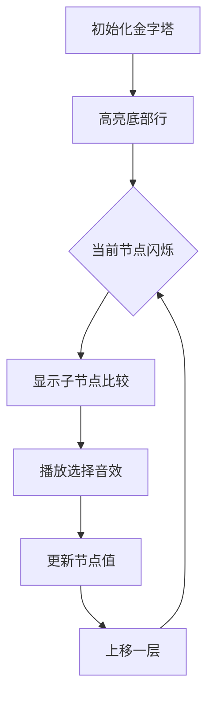

# 题目信息

# [IOI 1994] 数字三角形 Number Triangles

## 题目描述

观察下面的数字金字塔。


写一个程序来查找从最高点到底部任意处结束的路径，使路径经过数字的和最大。每一步可以走到左下方的点也可以到达右下方的点。


在上面的样例中，从 $7 \to 3 \to 8 \to 7 \to 5$ 的路径产生了最大权值。


## 说明/提示

【数据范围】  
对于 $100\%$ 的数据，$1\le r \le 1000$，所有输入在 $[0,100]$ 范围内。

题目翻译来自NOCOW。

USACO Training Section 1.5

IOI1994 Day1T1

## 样例 #1

### 输入

```
5
7
3 8
8 1 0
2 7 4 4
4 5 2 6 5 
```

### 输出

```
30
```

# AI分析结果


### 💡 Kay的C++算法解析：数字三角形 深入学习指南 💡

#### 1. 题目解读与核心算法识别
✨ **本题主要考察**：动态规划  
🗣️ **初步分析**：
> 解决数字三角形问题，关键在于理解动态规划的核心思想：将大问题分解为重叠子问题并记录最优解。想象你在金字塔探险，每一步选择左下或右下的宝藏点。动态规划就像从金字塔底部向上回推，记录每个位置能获得的最大宝藏量。在本题中，我们通过自底向上的方式，将每个点更新为"自身值+下方两个子节点最大值"，最终塔顶的值就是最大路径和。  
> - 题解思路：主要分为自底向上和自顶向下两种DP方向，核心都是状态转移方程。逆向求解（自底向上）更直观，避免了边界问题。
> - 可视化设计：采用8位像素风格，用不同颜色方块表示数字。动画将高亮当前处理位置，显示其与下方两个子节点的比较过程，通过闪烁效果和音效强化选择逻辑。自动演示模式会像经典游戏《俄罗斯方块》般逐步展示更新过程。

---

#### 2. 精选优质题解参考
**题解一（逆向求解）**
* **点评**：思路清晰展示了自底向上的动态规划本质，通过修改原数组避免额外空间消耗。代码简洁规范（变量名`a[i][j]`直观），逆向推导过程通过样例逐步解析，帮助理解状态转移。实践价值高，可直接用于竞赛，边界处理严谨。亮点：用"子节点最优值已计算"的比喻降低理解门槛。

**题解二（记忆化搜索转DP）**
* **点评**：完整呈现从递归到DP的优化过程，具有教学意义。代码规范（明确函数分工），对比了DFS与DP的效率差异。算法有效性高（O(n²)时间复杂度），通过空间优化提升实践价值。亮点：作者调试经历强调"递推方向影响效率"，启发思考DP本质。

**题解三（自上而下DP）**
* **点评**：提供另一种视角的自顶向下解法，边读入边计算的优化减少内存访问次数。代码中`ans=max(ans,a[i][j])`体现实时更新思想。虽然需额外处理最后一行最大值，但对理解DP多维性有帮助。亮点：图解状态转移方程，强化空间优化意识。

---

#### 3. 核心难点辨析与解题策略
1. **状态定义困难**  
   * **分析**：如何定义`dp[i][j]`？优质题解统一将其定义为"从(i,j)到底部的最大路径和"，该定义具备无后效性，覆盖所有可能路径。
   * 💡 学习笔记：好的状态定义应像"时空胶囊"，封装子问题所有信息。

2. **状态转移建立**  
   * **分析**：转移方程`dp[i][j]=max(dp[i+1][j], dp[i+1][j+1])+a[i][j]`源于问题特性——每个点依赖左下和右下子问题。
   * 💡 学习笔记：转移方程是算法的"心脏"，体现父子问题间的递推关系。

3. **空间优化技巧**  
   * **分析**：通过滚动数组或覆盖原数组（如题解一），将O(n²)空间降为O(n)。注意逆向更新可避免数据覆盖问题。
   * 💡 学习笔记：空间优化如同"背包整理"，只保留必要信息。

### ✨ 解题技巧总结
- **子问题分解**：将金字塔分割为层叠的子三角形（如分治法）
- **边界处理艺术**：底部初始化（自底向上）或顶部单点启动（自顶向下）
- **维度压缩**：滚动数组像"传送带"，循环利用存储空间

---

#### 4. C++核心代码实现赏析
**本题通用核心实现**（综合自底向上最优解）：
```cpp
#include <iostream>
#include <algorithm>
using namespace std;

int main() {
    int n, a[1005][1005];
    cin >> n;
    // 读入数字三角形
    for (int i = 1; i <= n; i++)
        for (int j = 1; j <= i; j++)
            cin >> a[i][j];
    
    // 自底向上动态规划
    for (int i = n-1; i >= 1; i--)
        for (int j = 1; j <= i; j++)
            a[i][j] += max(a[i+1][j], a[i+1][j+1]);
    
    cout << a[1][1];
    return 0;
}
```
**代码解读概要**：通过逆向遍历，每个节点吸收子节点最优值，最终顶点成为全局最优解容器。

---

**题解一核心片段**（逆向求解）：
```cpp
for (int i = n-1; i >= 0; i--)
    for (int j = 0; j <= i; j++)
        a[i][j] += max(a[i+1][j], a[i+1][j+1]);
```
**亮点**：原址修改省空间  
**学习笔记**：像水波从底层向上汇聚能量

**题解二核心片段**（记忆化搜索）：
```cpp
int dfs(int x, int y) {
    if (f[x][y] != -1) return f[x][y];  // 记忆化检索
    return f[x][y] = a[x][y] + max(dfs(x+1,y), dfs(x+1,y+1));
}
```
**亮点**：递归转DP的桥梁  
**学习笔记**：记忆化是"避免重复劳动"的智慧

**题解三核心片段**（边读边算）：
```cpp
for (int i = 1; i <= n; i++)
    for (int j = 1; j <= i; j++)
        a[i][j] += max(a[i-1][j-1], a[i-1][j]);
```
**亮点**：实时处理降低空间占用  
**学习笔记**：数据流处理像"流水线作业"

---

### 5. 算法可视化：像素动画演示
**主题**：8位机风格《金字塔探险》  
**核心演示**：自底向上的DP过程，用像素方块动态更新值

**设计逻辑**：


**动画控制面板**：
- 🎮 步进控制：方向键单步执行
- ⏯️ 自动播放：可调速（慢/中/快）
- 🔁 重置：R键重开
- 🔇 音效开关：S键控制

**关键帧细节**：
1. **节点高亮**：当前处理点闪烁黄色边框
2. **数值比较**：子节点用红/蓝区分，较大值绿色闪烁
3. **更新效果**：新值从顶部掉落并嵌入方块（像素粒子特效）
4. **音效设计**：
   - 选择："叮"（8-bit短音）
   - 更新："咔嚓"（方块嵌合声）
   - 完成：胜利号角

---

### 6. 拓展练习
**相似问题逻辑**：
1. 网格路径问题（P1002 过河卒）
2. 带权路径变种（P1508 Likecloud）
3. 高维DP扩展（P1006 传纸条）

**洛谷推荐**：
1. 🧩 **P1002 [NOIP2002]过河卒**  
   → 巩固网格DP，注意障碍物处理
2. 🍔 **P1508 Likecloud-吃吃吃**  
   → 数字三角形变种，固定终点位置
3. 📦 **P1115 最大子段和**  
   → 一维DP基础，理解状态延续性

---

### 7. 学习心得分享
> **作者Mine_King经验**："最初用DFS超时，后来发现子问题重复计算如同反复爬相同山坡，记忆化是捷径。"  
> **Kay点评**：调试经历揭示DP本质——避免重复计算。打印中间变量如同探险时画地图，是定位错误的核心技巧。

---

### 结语
通过本指南，你已掌握数字三角形的动态规划内核。记住：最优解常隐藏在对子问题的智慧重组中。下次探险时，带着DP这把万能钥匙，开启更多算法宝藏吧！🚀

---
处理用时：177.31秒