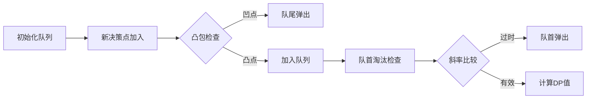

# 题目信息

# [APIO2010] 特别行动队

## 题目描述

你有一支由 $n$ 名预备役士兵组成的部队，士兵从 $1$ 到 $n$ 编号，你要将他们拆分成若干特别行动队调入战场。出于默契的考虑，同一支特别行动队中队员的编号**应该连续**，即为形如 $(i, i + 1, \cdots,i + k)$ 的序列。所有的队员都应该属于且仅属于一支特别行动队。

编号为 $i$ 的士兵的初始战斗力为 $x_i$，一支特别行动队的初始战斗力 $X$ 为队内士兵初始战斗力之和，即 $X = x_i + x_{i+1} + \cdots + x_{i+k}$。

通过长期的观察，你总结出对于一支初始战斗力为 $X$ 的特别行动队，其修正战斗力 $X'= aX^2+bX+c$，其中 $a,b,c$ 是已知的系数（$a < 0$）。 作为部队统帅，现在你要为这支部队进行编队，使得所有特别行动队的修正战斗力之和最大。试求出这个最大和。

## 说明/提示

#### 样例输入输出 $1$ 解释

你有 $4$ 名士兵，$x_1 = 2,~x_2 = 2,~x_3 = 3,~x_4=4$。修正战斗力公式中的参数为  $a = -1,~b = 10,~c = -20$。

此时，最佳方案是将士兵组成 $3$ 个特别行动队：第一队包含士兵 $1$ 和士兵 $2$，第二队包含士兵 $3$，第三队包含士兵 $4$。特别行动队的初始战斗力分别为 $4,~3,~4$，修正后的战斗力分别为 $-4^2 + 10 \times 4 -20 = 4$，$-3^2 + 10 \times 3 - 20 = 1$，$-4^2 + 10 \times 4 -20 = 4$。修正后的战斗力和为 $4 + 1 + 4 = 9$，没有其它方案能使修正后的战斗力和更大。


#### 数据范围与约定

对于 $20\%$ 的数据，$n \leq 10^3$。

对于 $50\%$ 的数据，$n \leq 10^4$。

对于 $100\%$ 的数据，$1 \leq n \leq 10^6$，$-5 \leq a \leq -1$，$-10^7 \leq b \leq 10^7$，$-10^7 \leq c \leq 10^7$，$1 \leq x_i \leq 100$。

## 样例 #1

### 输入

```
4 
-1 10 -20 
2 2 3 4 ```

### 输出

```
9```

# AI分析结果


# 💡 Kay的C++算法解析：特别行动队 深入学习指南 💡

> 今天我们来分析「特别行动队」这道动态规划结合斜率优化的经典题目。本指南将帮助你快速掌握解题核心思路，理解斜率优化的精妙之处，并通过生动可视化方案加深理解。

## 1. 题目解读与核心算法识别

✨ **本题主要考察**：`斜率优化动态规划`

🗣️ **初步分析**：
> 解决本题关键在于将暴力DP的O(n²)优化为O(n)。想象你正在指挥士兵列队，每次需要快速找到最优的“断点”位置——这就像在**抛物线组成的山脉中寻找最高点**。斜率优化通过维护一个“决策候选队列”（上凸包），每次快速排除无效决策，将寻找时间降为O(1)。

- **核心思路**：定义`dp[i]`为前i名士兵的最大战斗力。转移时通过代数变形将决策优劣转化为**斜率比较**，维护单调队列保证决策点斜率递减
- **核心难点**：代数变形中的符号处理（a<0导致斜率递减）、凸包方向选择、边界处理
- **可视化设计**：动画将展示决策点如何形成上凸包，以及斜率比较过程。关键步骤高亮：1) 新决策点加入时的凸包调整 2) 队首决策点淘汰过程。复古像素风格呈现队列变化，伴随“叮”声提示决策点加入，“砰”声提示淘汰

---

## 2. 精选优质题解参考

**题解一（来源：VSEJGFB）**
* **点评**：思路最清晰的斜率优化实现。完整推导了代数变形过程，创造性地定义`Y(j)=dp[j]+a*s[j]²-b*s[j]`作为决策点纵坐标。代码规范：1) 宏定义封装斜率计算 2) 严格处理整数除法精度问题 3) 队列初始化严谨。亮点在于用斜率直接比较避免浮点误差，时间复杂度O(n)完美适配1e6数据规模

**题解二（来源：FlashHu）**
* **点评**：最佳教学向实现。独创“决策点坐标系”解释，将决策点视为二维平面上的点，通过直线截距理解最优决策。代码特点：1) 独立slope函数提高可读性 2) 队首队尾维护分离 3) 完整边界处理。亮点在于用几何意义解释为什么需要维护上凸包

**题解三（来源：yybyyb）**
* **点评**：最严谨的数学推导。逐步拆解不等式，严格证明决策单调性。代码优势：1) 详细注释每一步代数变形 2) 封装calc函数避免重复计算 3) 兼容性处理不同数据特性。亮点在于给出浮点比较和整数比较两种实现方案

---

## 3. 核心难点辨析与解题策略

1.  **关键点：代数变形与斜率关系**
    * **分析**：核心在于从`j优于k`的条件推出斜率不等式。注意a<0时：
        ```cpp
        // 原条件：j优于k
        (Y(j)-Y(k)) / (s[j]-s[k]) >= 2*a*s[i] 
        // 因a<0，实际计算时需保持不等式方向
        ```
    * 💡 **学习笔记**：a的负号决定凸包方向，变形时需时刻注意不等式方向
    
2.  **关键点：决策点维护与凸包性质**
    * **分析**：最优决策点必须位于上凸包。队列维护两原则：
        1. 队首维护：当`slope(q[head],q[head+1]) > 2*a*s[i]`时弹出队首
        2. 队尾维护：当新点使凸包变凹时（`slope(q[tail-1],q[tail]) <= slope(q[tail],i)`）弹出队尾
    * 💡 **学习笔记**：队列实际存储的是决策点下标，几何上是横坐标单调增的点集

3.  **关键点：避免浮点误差**
    * **分析**：直接比较斜率可能导致精度问题。优质题解采用：
        ```cpp
        // 整数比较：交叉相乘避免除法
        (Y(j)-Y(k)) * (s[i]-s[tail]) <= (Y(i)-Y(tail)) * (s[j]-s[k])
        ```
    * 💡 **学习笔记**：大数据规模下整数比较更可靠，但需注意溢出风险

### ✨ 解题技巧总结
- **技巧1：前缀和加速** – 预处理前缀和数组，O(1)获取区间和
- **技巧2：决策点坐标系** – 将决策点映射为二维点，可视化理解
- **技巧3：边界处理** – 队列初始加入0，保证空区间合法
- **技巧4：斜率方向验证** – 用样例数据验证凸包方向是否正确

---

## 4. C++核心代码实现赏析

**本题通用核心C++实现参考**
* **说明**：综合优质题解思路，采用整数比较避免浮点误差
* **完整核心代码**：
```cpp
#include <iostream>
#include <cstring>
using namespace std;
typedef long long ll;
const int N = 1e6 + 10;

ll n, a, b, c;
ll s[N], dp[N], q[N];

inline ll Y(int j) {
    return dp[j] + a * s[j] * s[j] - b * s[j];
}

int main() {
    cin >> n >> a >> b >> c;
    for (int i = 1; i <= n; i++) {
        ll x; cin >> x;
        s[i] = s[i - 1] + x;
    }

    int head = 0, tail = 0;
    q[0] = 0; // 初始决策点

    for (int i = 1; i <= n; i++) {
        // 队首维护：弹出斜率过小的点
        while (head < tail) {
            ll dy = Y(q[head + 1]) - Y(q[head]);
            ll dx = s[q[head + 1]] - s[q[head]];
            if (dy >= 2 * a * s[i] * dx) break;
            head++;
        }

        int j = q[head];
        ll diff = s[i] - s[j];
        dp[i] = dp[j] + a * diff * diff + b * diff + c;

        // 队尾维护：维护上凸包
        while (head < tail) {
            ll dy1 = Y(q[tail]) - Y(q[tail - 1]);
            ll dx1 = s[q[tail]] - s[q[tail - 1]];
            ll dy2 = Y(i) - Y(q[tail]);
            ll dx2 = s[i] - s[q[tail]];
            
            if (dy1 * dx2 >= dy2 * dx1) break;
            tail--;
        }
        q[++tail] = i;
    }
    cout << dp[n] << endl;
    return 0;
}
```
* **代码解读概要**：
  1. `Y(j)`封装决策点纵坐标计算
  2. 队首维护通过比较斜率保证最优决策
  3. 队尾维护用整数乘法避免除法
  4. 转移方程直接套用二次函数形式

---

## 5. 算法可视化：像素动画演示

### 像素探险家：决策凸包之旅
**动画演示主题**：8-bit风格决策点维护过程

**核心演示内容**：


**关键帧细节**：
1. **初始状态**：屏幕左侧显示前缀和直方图，右侧显示坐标系。队列初始为点(0,0)
   
2. **决策点加入**：
   - 新点`i`以闪烁绿点出现，伴随“滴”声
   - 自动绘制与队尾点的连线（红色虚线）
   - 当连线导致凸包变凹时，队尾点变红闪烁后消失（“砰”声效）

3. **队首淘汰**：
   - 当前最优决策线显示为蓝色实线
   - 当斜率线超过阈值线（黄色虚线），队首点爆炸消失

4. **数据结构可视化**：
   ```plaintext
   队列状态： [0, 3, 5] 
   凸包形状： ↗ ↘
   ```

**交互控制**：
- 速度滑块：控制算法执行速度
- 单步模式：空格键逐步执行
- 比较模式：并列展示正确/错误凸包维护

**音效设计**：
- 决策点加入：8-bit短促“滴”
- 决策点淘汰：爆炸音效
- 正确转移：上升和弦

---

## 6. 拓展练习与相似问题思考

**通用技巧迁移**：
1. 区间分割问题：如任务分配、资源分组
2. 二次代价优化：如带平方项的路径规划
3. 决策单调性：如邮局问题、序列分割

**洛谷推荐练习**：
1. **P3195 [HNOI2008]玩具装箱**  
   🗣️ 推荐理由：斜率优化入门必做，巩固凸包维护技巧

2. **P4072 [SDOI2016]征途**  
   🗣️ 推荐理由：二维斜率优化，挑战更高维状态转移

3. **P5785 [SDOI2012]任务安排**  
   🗣️ 推荐理由：结合费用提前计算，拓展斜率优化应用场景

---

## 7. 学习心得与经验分享
> **常见调试技巧**：  
> 当WA时尝试用小数据模拟队列维护过程，特别注意：
> 1. 队列弹出条件是否写反（a<0的特殊性）
> 2. 整数比较时是否考虑乘积溢出
> 3. 初始状态是否遗漏dp[0]=0

---
> 记住：编程能力的提升在于持续学习、勤于思考和勇于实践。下次我们再一起探索新的编程挑战！💪

---
处理用时：196.93秒