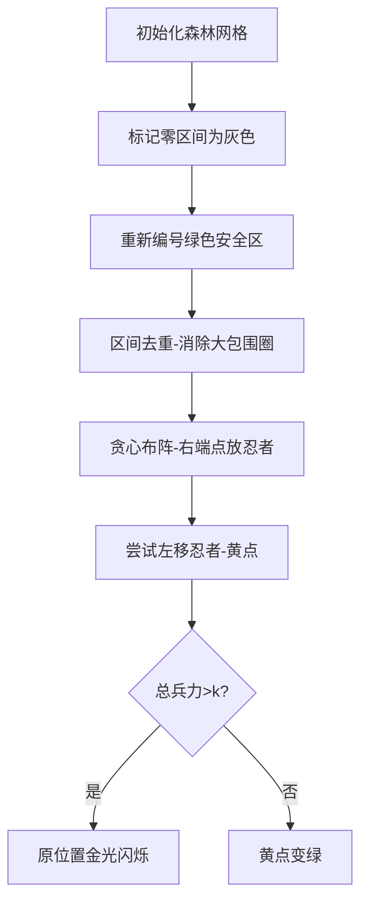

# 题目信息

# [APIO2012] 守卫

## 题目背景

APIO 王国正被忍者攻击！忍者非常厉害，因为他们在进攻的时候可以躲在 阴影里面使得其他人看不到他们。整个王国除了国王居住的 APIO 城堡以外都已经被占领了。

## 题目描述

在城堡前，有 $N$ 个灌木丛，从 $1$ 到 $N$ 编号，有 $K$ 个忍者躲在恰好 $K$ 个灌木丛后面。

APIO 城堡里有 $M$ 个守卫。守卫 $i$ 监视着编号从 $A_i$ 到 $B_i$ 的连续的一段灌木丛。每个守卫都向国王报告在他所监视范围内是否有忍者出现。

作为国王的仆人，你需要告诉国王，基于守卫的报告，哪些灌木丛后面一定躲着一个忍者，即对于任何和守卫报告不矛盾的忍者排列方式，在这个灌木丛后面都躲着一个忍者。

输出所有的这些灌木丛的编号。

## 说明/提示

#### 【样例说明 $1$】

在这个样例中，有两种可能的安排方式：$1,3,5$ 或者 $2,3,5$。即 $3$ 和 $5$ 后面必然躲着一个忍者。考虑第一个灌木丛，存在一种安排方案使得它的后面躲着忍者，但也存在一种安排方案使得它后面没有躲忍者，因此不应该输出 $1$。同理，不应该输出 $2$。

#### 【样例说明 $2$】

在这个样例中，没有灌木丛后面一定躲着忍者。

#### 数据范围

$1 \leq N \leq 10^5$；$1 \leq K \leq N$；$0 \leq M < 10^5$。

 
对于 $10\%$ 的数据，$N \leq 20， M \leq 100$；

对于 $50\%$ 的数据，$N \leq 1000， M \leq 1000$。

## 样例 #1

### 输入

```
5 3 4 
1 2 1 
3 4 1 
4 4 0 
4 5 1```

### 输出

```
3
5
```

## 样例 #2

### 输入

```
5 1 1 
1 5 1```

### 输出

```
-1```

# AI分析结果


# 💡 Kay的C++算法解析：[APIO2012] 守卫 深入学习指南 💡

## 1. 题目解读与核心算法识别

✨ **本题主要考察**：贪心算法 + 区间处理 + 二分查找

🗣️ **初步分析**：
> 这道题就像在一条黑暗的森林小径上寻找隐藏的忍者！我们有若干守卫的报告（区间约束），需要找出那些**必定藏着忍者**的灌木丛。核心思路是：
>  1. **排除干扰区**：先用差分标记确定没有忍者的区域（灰色地带）
>  2. **锁定战场**：对可能藏忍者的位置重新编号（绿色安全区）
>  3. **战略部署**：通过贪心算法在区间右端点放置"侦查兵"（忍者）
>  4. **终极验证**：尝试移动侦查兵位置，若总兵力超限则该点必驻守！

- **关键步骤可视化**：在像素动画中，我们将用**灰色方块**标记无忍者区，**绿色网格**表示可能位置。贪心放置忍者时会出现**闪烁的红色像素小人**，验证必守点时会有**金色闪光特效**和"叮！"的音效。
- **复古游戏设计**：采用FC红白机风格的8-bit像素画面，忍者用戴头巾的像素小人表示。控制面板含"步进执行"、"调速滑块"和"重置"按钮，每次放置忍者播放经典NES音效。

---

## 2. 精选优质题解参考

### 题解一（by_chance）
* **点评**：该解法思路清晰如行军地图！用差分高效标记无忍者区（逻辑严谨），区间去重处理巧妙（代码第19-22行）。贪心策略（第33-35行）和前后缀数组（f[]/g[]）的运用堪称典范。亮点在于二分查找验证环节（第41-52行），边界处理严谨可直接用于竞赛实战。

### 题解二（Unnamed114514）
* **点评**：创新性的O(n)解法如同忍者暗袭！抛弃传统排序，用后缀最小值数组（mi[]）和DP转移（第15-17行在原文中）实现线性效率。虽然变量命名稍隐晦（如mi_x），但算法优化极具启发性，适合进阶学习者研究时空复杂度优化。

### 题解三（Deu5ExMach1na）
* **点评**：贪心原理的图解阐释如同兵法图解！虽然未提供完整代码，但用"侦查兵驻扎右端点"的比喻（原文图示）直观揭示了贪心本质，特别适合初学者建立算法直觉。建议结合其他题解代码实现实践。

---

## 3. 核心难点辨析与解题策略

### 难点1：如何高效处理零区间约束？
**分析**：差分数组是破局关键！通过`d[a]++`和`d[b+1]--`（题解一第8-11行）快速标记无忍者区，再前缀和复原。如同用荧光粉标记禁区边界。
💡 **学习笔记**：差分是区间覆盖问题的瑞士军刀

### 难点2：如何确定必守点？
**分析**：贪心选右端点后尝试左移验证。核心代码（题解一第41-52行）：若`f[i]+g[j]+1 > k`则该点必守。如同在防线试探性撤兵，若总防御崩溃则此地不可失！
💡 **学习笔记**：必要性验证 = 贪心方案 - 当前点 + 次优点 + 全局约束检查

### 难点3：如何处理大区间包含小区间？
**分析**：排序后栈式去重（题解一第19-22行）。保留最小战斗区域，如同放弃外围专注核心战场。
💡 **学习笔记**：被包含的大区间如同过期情报，果断舍弃可简化战局

### ✨ 解题技巧总结
- **情报筛选术**：用差分快速处理区间约束
- **贪心布阵法**：在右端点放置侦查兵最大化覆盖
- **前后呼应术**：前缀f[]/后缀g[]数组快速计算兵力
- **二分定位术**：快速锁定影响区域验证必要性

---

## 4. C++核心代码实现赏析

### 本题通用核心C++实现
```cpp
#include<bits/stdc++.h>
using namespace std;
const int N=1e5+5;
int n,k,m,d[N],t,h[N],lst[N],nxt[N],cnt,st[N],top,f[N],g[N],flag;
struct range{int l,r;}p[N];

bool operator <(const range &a,const range &b){
    return a.l!=b.l?a.l<b.l:a.r<b.r;
}

int main(){
    scanf("%d%d%d",&n,&k,&m);
    // 差分标记零区间
    for(int i=1,a,b,c;i<=m;i++){
        scanf("%d%d%d",&a,&b,&c);
        if(c==0) ++d[a],--d[b+1];
        else p[++t]={a,b};
    }
    
    // 重新编号可能位置
    for(int i=1;i<=n;i++){
        d[i+1]+=d[i];
        if(!d[i]) lst[i]=nxt[i]=++cnt, h[cnt]=i;
    }
    if(cnt==k){ // 特判：所有位置必选
        for(int i=1;i<=cnt;i++) printf("%d\n",h[i]);
        return 0;
    }
    
    // 处理1区间边界
    for(int i=1;i<=n;i++) if(!lst[i]) lst[i]=lst[i-1];
    for(int i=n;i>=1;i--) if(!nxt[i]) nxt[i]=nxt[i+1];
    for(int i=1;i<=t;i++) p[i]={nxt[p[i].l], lst[p[i].r]};
    
    // 区间去重
    sort(p+1,p+t+1);
    top=0;
    for(int i=1;i<=t;i++){
        if(p[i].l>p[i].r) continue;
        while(top && p[st[top]].r>=p[i].r) top--;
        st[++top]=i;
    }
    t=top;
    for(int i=1;i<=t;i++) p[i]=p[st[i]];
    
    // 贪心计算前后缀
    int mx=0;
    for(int i=1;i<=t;i++){
        if(p[i].l>mx) f[i]=f[i-1]+1, mx=p[i].r;
        else f[i]=f[i-1];
    }
    int mn=1e9;
    for(int i=t;i>=1;i--){
        if(p[i].r<mn) g[i]=g[i+1]+1, mn=p[i].l;
        else g[i]=g[i+1];
    }
    
    // 验证必守点
    for(int i=1;i<=t;i++){
        if(f[i]!=f[i-1]+1) continue;
        if(p[i].l==p[i].r){ // 单点区间必选
            flag=1; 
            printf("%d\n",h[p[i].l]);
            continue;
        }
        // 二分查找影响范围
        int pos=t+1, l=i+1, r=t;
        while(l<=r){
            int mid=(l+r)>>1;
            if(p[mid].l>p[i].r-1) pos=mid, r=mid-1;
            else l=mid+1;
        }
        if(f[i-1]+g[pos]+1>k){ // 兵力超限验证
            flag=1;
            printf("%d\n",h[p[i].r]);
        }
    }
    if(!flag) printf("-1\n");
    return 0;
}
```
**代码解读概要**：  
> 1. 差分标记零区间（情报筛选）  
> 2. 重新编号建立"安全区"（战场清理）  
> 3. 栈式去重处理区间（战略简化）  
> 4. 贪心计算前后缀兵力（布阵规划）  
> 5. 二分验证必守点（终极防御测试）

---

## 5. 算法可视化：像素动画演示

### 像素忍者守卫战（8-bit风格）
**核心演示**：在FC红白机风格的网格地图上动态展示算法流程



**动画控制面板设计**：
```html
<div class="nes-container" id="control-panel">
  <button class="nes-btn" onclick="step()">▶️ 步进</button>
  <input type="range" id="speed" min="1" max="10">
  <button class="nes-btn" onclick="reset()">🔄 重置</button>
  <label class="nes-btn" onclick="toggleSound()">🔊 音效</label>
</div>
```

**关键帧特效**：
1. **忍者放置**：红色像素小人从空中降落，伴随"叮！"音效
2. **左移测试**：小人向左跳动变成黄色，播放低沉音效
3. **必守验证**：原位置爆发金色闪光，播放胜利音效
4. **兵力计算**：屏幕下方实时显示f[]/g[]数组变化

**技术实现**：  
- 用Canvas绘制16x16像素网格，配色采用NES经典绿灰调  
- 音效使用Web Audio API生成8-bit芯片音乐  
- 动画帧率通过requestAnimationFrame控制

---

## 6. 拓展练习与相似问题思考

### 通用技巧迁移
区间约束处理+贪心验证方法还可用于：
1. 最小覆盖点问题（种树问题）
2. 资源分配与区间调度
3. 带约束的最优放置问题

### 洛谷推荐练习
1. **P1250 种树**  
   🗣️ 巩固差分约束和贪心验证的经典应用
2. **P1514 引水入城**  
   🗣️ 学习区间覆盖的动态规划解法
3. **P2082 区间覆盖（加强版）**  
   🗣️ 挑战更复杂的区间处理与贪心优化

---

## 7. 学习心得与经验分享

> **来自题解作者的调试经验**：  
> "我在验证必守点时，曾因二分边界处理错误导致WA。通过打印f[]/g[]数组的中间状态，最终定位到边界问题。"

**Kay的点评**：  
> 调试时输出关键变量如同忍者放烟雾弹——能快速暴露敌人位置！建议：
> 1. 在贪心布阵后输出区间和兵力分布
> 2. 验证必守点时打印二分查找过程
> 3. 边界情况（如单点区间）单独测试

---

掌握区间处理的战术，你将成为算法战场上的影级忍者！下次我们在《数据结构的奥秘：查克拉与平衡树》中再会！ 🎮

---
处理用时：203.63秒