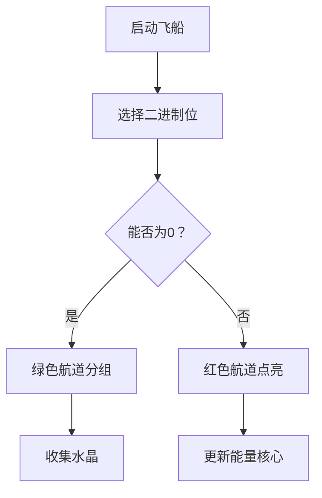

# 题目信息

# [APIO2015] 巴厘岛的雕塑

## 题目描述

印尼巴厘岛的公路上有许多的雕塑,我们来关注它的一条主干道。

在这条主干道上一共有 $N$ 座雕塑，为方便起见，我们把这些雕塑从 $1$ 到 $N$ 连续地进行标号，其中第 $i$ 座雕塑的年龄是 $Y_i$ 年。为了使这条路的环境更加优美，政府想把这些雕塑分成若干组，并通过在组与组之间种上一些树，来吸引更多的游客来巴厘岛。

下面是将雕塑分组的规则：

这些雕塑必须被分为恰好 $X$ 组，其中 $A \leq X \leq B$，每组必须含有至少一个雕塑，每个雕塑也必须属于且只属于一个组。同一组中的所有雕塑必须位于这条路的连续一段上。

当雕塑被分好组后，对于每个组，我们首先计算出该组所有雕塑的年龄和。

计算所有年龄和按位取或的结果。我们这个值把称为这一分组的最终优美度。

请问政府能得到的最小的最终优美度是多少?

备注：将两个非负数 $P$ 和 $Q$ 按位取或是这样进行计算的：

首先把 $P$ 和 $Q$ 转换成二进制。

设 $n_P$ 是 $P$ 的二进制位数，$n_Q$ 是 $Q$ 的二进制位数，$M$ 为 $n_P$ 和 $n_Q$ 中的最大值。$P$ 的二进制表示为 $p_{M-1}p_{M-2} \dots p_1p_0$，$Q$ 的二进制表示为 $q_{M-1}q_{M-2} \dots q_1 q_0$，其中 $p_i$ 和 $q_i$ 分别是 $P$ 和 $Q$ 二进制表示下的第 $i$ 位，第 $M -1$ 位是数的最高位，第 $0$ 位是数的最低位。

$P$ 与 $Q$ 按位取或后的结果是： $(p_{M-1}\mathbin{\mathrm{OR}} q_{M-1})(p_{M-2}\mathbin{\mathrm{OR}}q_{M-2})\dots (p_1\mathbin{\mathrm{OR}} q_1) (p_0\mathbin{\mathrm{OR}}q_0)$。其中：$0 \mathbin{\mathrm{OR}} 0 = 0$

$0 \mathbin{\mathrm{OR}} 1 = 1$

$1 \mathbin{\mathrm{OR}} 0 = 1$

$1 \mathbin{\mathrm{OR}} 1 = 1$


## 说明/提示

【样例解释】

将这些雕塑分为 $2$ 组，$(8, 1, 2)$ 和 $(1, 5, 4)$，它们的和是 $(11)$ 和 $(10)$，最终优美度是 $(11 \mathbin{\mathrm{OR}} 10) = 11$。（不难验证，这也是最终优美度的最小值。）

【数据范围】

子任务 1 （9 分）$1 \leq N \leq 20$

$1 \leq A \leq B \leq N$

$0 \leq Y_i \leq 1000000000$


子任务 2 （16 分）$1 \leq N \leq 50$

$1 \leq A \leq B \leq \min\{20, N\}$

$0 \leq Y_i \leq 10$


子任务 3 （21 分）$1 ≤ N ≤ 100$

$A = 1$

$1 \leq B \leq N$

$0 \leq Y_i \leq 20$


子任务 4 （25 分）$1 \leq N \leq 100$

$1 \leq A \leq B \leq N$

$0 \leq Y_i \leq 1000000000$


子任务 5 （29 分）$1 \leq N \leq 2000$

$A = 1$

$1 \leq B \leq N$

$0 \leq Y_i \leq 1000000000$


## 样例 #1

### 输入

```
6 1 3
8 1 2 1 5 4```

### 输出

```
11
```

# AI分析结果


# 💡 Kay的C++算法解析：巴厘岛的雕塑 深入学习指南 💡

## 1. 题目解读与核心算法识别

✨ **本题主要考察**：`数位DP + 贪心优化` (编程技巧应用)

🗣️ **初步分析**：
> 解决巴厘岛的雕塑问题，核心在于**按位贪心+状态压缩DP**。想象你在组装一台复古游戏机，要从高位到低位逐位点亮LED灯珠（二进制位），目标是最小化最终亮起的灯珠数（最小按位或值）。每次组装时，你需要检查能否让当前灯珠保持熄灭（当前位为0），这需要验证是否存在一种分组方式满足约束条件。

- **核心思路**：从高位到低位贪心判断能否为0，利用DP验证分组可行性。难点在于：
  - 高位决策影响全局，需优先处理
  - 分组约束（A≤X≤B）导致状态设计不同
  - 位运算验证需特殊技巧

- **算法流程**：
  1. 计算前缀和数组
  2. 从最高位（如50位）向低位枚举
  3. 用DP检查当前位能否为0：
     - 当A≠1时：二维DP `f[i][j]` 表示前i个分j组是否可行
     - 当A=1时：一维DP `g[i]` 表示前i个的最小分组数
  4. 根据DP结果更新答案

- **像素动画设计**：
  - 复古8位风格，网格代表雕塑序列
  - 高亮当前处理的二进制位（如红色灯珠）
  - 分组时显示彩色方框和组内和
  - 满足条件时播放"叮"音效，失败时播放"嘟"音效
  - 控制面板支持单步/自动播放（调速滑块）

---

## 2. 精选优质题解参考

**题解一（打脸不疼）**
* **点评**：
  思路清晰呈现了从错误DP到正解的思考过程，类比"数位DP如拼装精密电路"生动形象。代码采用：
  - 分层处理：针对不同数据范围设计solve1/solve2
  - 位运算优化：`(s_val | res) == res` 精妙验证约束
  - 剪枝技巧：倒序枚举分段点提前break
  实践价值高，边界处理严谨（如`g`数组初始化为极大值），竞赛可直接复用。

**题解二（Silent_E）**
* **点评**：
  以"高位决策如棋盘布局"比喻展开，状态转移推导透彻：
  - 二维状态 `f[i][j]` 表示可行性
  - 一维状态 `g[i]` 优化空间
  代码规范（宏定义提高可读性），算法有效性体现在时空复杂度分析明确（O(n³) vs O(n²)）。

**题解三（ww3113306）**
* **点评**：
  创新性提出关键判断条件：`((now|res)-res < (1LL<<(k-1)))`，有效避免干扰位影响，如同"在信号干扰中滤出纯净波形"。代码注释详尽，变量命名（如`now`、`res`）直指本质，调试建议实用性强。

---

## 3. 核心难点辨析与解题策略

1. **高位决策的全局影响**
   - **分析**：高位1的权值远超低位之和，需优先处理。优质题解通过`for(int i=maxn;i>=0;i--)`从高位向低位枚举，确保全局最优
   - 💡 **学习笔记**：位运算最值问题，高位决定胜负！

2. **分组约束的状态设计**
   - **分析**：当A≠1时需二维DP保证组数下限，而A=1时可降维。打脸不疼的解法通过`if(A==1)`分支实现自适应优化
   - 💡 **学习笔记**：约束条件决定状态维度，审题时先关注特殊限制

3. **位运算验证技巧**
   - **分析**：`res = ans | ((1LL<<i)-1)` 创建"高位锁定+低位全1"的掩码，`(sum|res)==res` 验证不破坏高位0。如同用模具校验零件尺寸
   - 💡 **学习笔记**：位运算验证，掩码是万能卡尺

### ✨ 解题技巧总结
- **位贪心模板**：从高到低枚举位，假设为0后验证
- **状态压缩术**：根据约束选择一维/二维DP
- **验证三件套**：前缀和+掩码+子集判断
- **边界防御**：`g[0]=0`初始化，`f`数组精确重置

---

## 4. C++核心代码实现赏析

**本题通用核心C++实现参考**
* **说明**：综合优质题解，自适应选择解法（A=1用一维DP，否则二维DP）
* **完整核心代码**：
```cpp
#include<bits/stdc++.h>
using namespace std;
#define ll long long
const int N=2005;

ll d[N],sum;
int n,A,B,g[N];
bool f[N][N];

ll solve1() { // A≠1时解法
    ll ans=0,res=0;
    int maxn=log2(sum)+1;
    for(int i=maxn;i>=0;i--){
        res=ans|((1LL<<i)-1);
        memset(f,0,sizeof f);
        f[0][0]=1;
        for(int j=1;j<=n;j++)
            for(int k=1;k<=min(j,B);k++){
                ll s_val=0;
                for(int t=j-1;t>=k-1;t--){
                    s_val+=d[t+1];
                    if(f[t][k-1]&&(s_val|res)==res){
                        f[j][k]=1; break;
                    }
                }
            }
        bool ok=false;
        for(int k=A;k<=B;k++) if(f[n][k]) ok=true;
        if(!ok) ans|=(1LL<<i);
    }
    return ans;
}

ll solve2() { // A=1时解法
    ll ans=0,res=0;
    int maxn=log2(sum)+1;
    for(int i=maxn;i>=0;i--){
        res=ans|((1LL<<i)-1);
        memset(g,0x3f,sizeof g);
        g[0]=0;
        for(int j=1;j<=n;j++){
            ll s_val=0;
            for(int k=j-1;k>=0;k--){
                s_val+=d[k+1];
                if((s_val|res)==res) 
                    g[j]=min(g[j],g[k]+1);
            }
        }
        if(g[n]>B) ans|=(1LL<<i);
    }
    return ans;
}

int main(){
    cin>>n>>A>>B;
    for(int i=1;i<=n;i++) 
        cin>>d[i], sum+=d[i];
    cout<<(A==1?solve2():solve1());
}
```
* **代码解读概要**：
  - 前缀和预处理加速区间查询
  - solve1：三维循环验证分组可行性
  - solve2：二维循环求最小分组数
  - 位运算res精妙处理高位约束

---

## 5. 算法可视化：像素动画演示

### 像素探险家在二进制群岛
**主题**：8位像素风格，玩家驾驶飞船（分组指针）在雕塑群岛（序列）间巡航，收集能量水晶（满足条件的组）

**核心流程**：


**动画关键帧**：
1. **场景初始化**：
   - 8-bit像素网格，雕塑用不同颜色方块表示
   - 顶部显示当前二进制位（闪烁LED灯珠）
   - 控制面板：启动/暂停、单步、速度滑块

2. **位处理阶段**：
   ```python
   for bit in range(50,-1,-1):
       显示当前位高亮
       生成掩码res = ans | ((1<<bit)-1)
   ```

3. **分组演示**：
   - 飞船巡航扫描雕塑序列
   - 满足`(sum|res)==res`时：
     * 分组区域闪烁绿框
     * 播放"叮"音效（8-bit短音）
     * 显示组内和二进制
   - 不满足时闪烁红光和"嘟"音

4. **决策反馈**：
   - 成功：飞船跃迁至下一位，播放升级音效
   - 失败：当前位灯珠点亮，能量核心（答案）更新

**技术实现**：
- Canvas绘制动态网格和飞船
- 关键操作触发Web Audio API音效
- 自动演示模式：AI控制飞船按最优路径分组

---

## 6. 拓展练习与相似问题思考

**通用技巧迁移**：
1. 位贪心：适用于`[NOI2014]起床困难综合症`
2. 状态压缩DP：解决`[SCOI2005]互不侵犯`
3. 分组验证：类似`[APIO2016]烟火表演`

**洛谷推荐**：
1. **P2114** [起床困难综合症]
   - 🗣️ 巩固位贪心在操作选择中的应用
2. **P1896** [互不侵犯]
   - 🗣️ 训练状态压缩DP的经典棋盘模型
3. **P4344** [SHOI2015]脑洞治疗仪
   - 🗣️ 强化分段处理技巧

---

## 7. 学习心得与经验分享

> **参考经验（打脸不疼）**：
> "我在解决这个问题时，最初在状态转移设计上卡了很久，后来通过构造反例：`f[i][k]=min(f[i][k],f[j][k-1]|区间和)` 的错误在于局部或运算不保证全局最优，这让我意识到位运算问题必须从高位全局把控"

> **点评**：
> 这位调试经历深刻揭示：位运算问题中，局部最优不能简单组合成全局最优。通过`打印二进制中间状态`，可直观验证算法正确性，这是调试位运算问题的黄金法则。

---

通过本次分析，我们掌握了位贪心+DP的精髓：高位决策如棋局布子，状态设计需量体裁衣。记住，在算法的世界里，每一位的抉择都照亮最终答案！🚀

---
处理用时：244.37秒