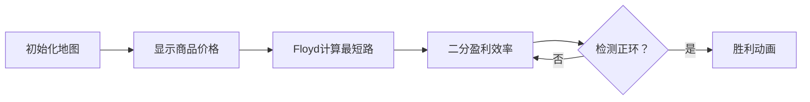

# 题目信息

# [APIO2017] 商旅

## 题目描述

在广阔的澳大利亚内陆地区长途跋涉后，你孤身一人带着一个背包来到了科巴。你被这个城市发达而美丽的市场所深深吸引，决定定居于此，做一个商人。科巴有$N$个集市，集市用从$1$到$N$的整数编号，集市之间通过$M$条单向道路连接，通过每条道路都需要消耗一定的时间。


在科巴的集市上，有$K$种不同的商品，商品用从$1$到$K$的整数编号。每个集市对每种商品都有自己的定价，买入和卖出商品的价格可以是不同的。并非每个集市都可以买卖所有的商品：一个集市可能只提供部分商品的双向交易服务；对于一种商品，一个集市也可能只收购而不卖出该商品或只卖出而不收购该商品。如果一个集市收购一种商品，它收购这种商品的数量是不限的，同样，一个集市如果卖出一种商品，则它卖出这种商品的数量也是不限的。


为了更快地获得收益，你决定寻找一条盈利效率最高的环路。环路是指带着空的背包从一个集市出发，沿着道路前进，经过若干个市场并最终回到出发点。在环路中，允许**多次**经过同一个集市或同一条道路。在经过集市时，你可以购买或者卖出商品，一旦你购买了一个商品，你需要把它装在背包里带走。由于你的背包非常小，任何时候你最多只能持有一个商品。在购买一个商品时，你不需要考虑你是否有足够的金钱，但在卖出时，需要注意只能卖出你拥有的商品。


从环路中得到的收益为在环路中卖出商品得到的金钱减去购买商品花费的金钱，而一条环路上消耗的时间则是依次通过环路上所有道路所需要花费的时间的总和。环路的盈利效率是指从环路中得到的收益除以花费的时间。需要注意的是，一条没有任何交易的环路的盈利效率为$0$。


你需要求出所有**消耗时间为正数**的环路中，盈利效率**最高**的环路的盈利效率。答案**向下取整**保留到整数。如果没有任何一条环路可以盈利，则输出 0 。


## 说明/提示

## 样例解释

在样例中，我们考虑下面两条环路，“1 - 2 - 3 - 1” 和 “1 - 4 - 3 - 1”。

考虑环路 “1 - 2 - 3 - 1” ：这条环路消耗的总时间是$(3+3+1)=7$分钟。在这条环路中，最佳的交易方式是：在编号为 1 的集市中购买编号为 2 的商品（花费的金钱为 5）；在编号为 2 的集市中卖出编号为 2 的商品（得到的金钱为 15），然后立即购买编号为 1 的商品（花费的金钱为 6）；带着编号为 1 的商品经过编号为 3 的集市，在回到编号为 1 的城市后卖出（得到的金钱为 9）。在这个环路中，总盈利为$-5+15-6+9=13$ 。 这个环路的盈利效率为$13/7$ ，向下取整后为 1 。


考虑环路 “1 - 4 - 3 - 1” ：这条环路消耗的总时间是$(1+1+1)=3$分钟。在这条环路中，最佳的交易方式是：在编号为 1 的集市中购买编号为 2 的商品（花费的金钱为 5）；在编号为 4 的集市中卖出编号为 2 的商品（得到的金钱为 11）；然后经过编号为 3 的集市回到编号为 1 的城市。在这个环路中，总盈利为$-5+11=6$。 这个环路的盈利效率为$6/3$，向下取整后为 2 。


综上所述，盈利效率最高的环路的盈利效率为 2 。


## 子任务

在所有的子任务中，保证$1 \leq N \leq 100$，$1 \leq M \leq 9900$，$1 \leq K \leq 1000$, 如果在编号为$i (1 \leq i \leq N)$的集市中，编号为$j (1 \leq j \leq K)$的商品既可以购买又可以卖出，则$0 \leq S_{i,j} \leq B_{i,j} \leq 1000000000$。对于编号为$p (1 \leq p \leq M)$的道路，保证$V_p \not= W_p$且$1 \leq T_p \leq 10000000$。 不存在满足$1 \leq p < q \leq M$的$p$，$q$使得$(V_p, W_p)=(V_q, W_q)$。


## 样例 #1

### 输入

```
4 5 2
10 9 5 2
6 4 20 15
9 7 10 9
-1 -1 16 11
1 2 3
2 3 3
1 4 1
4 3 1
3 1 1```

### 输出

```
2```

# AI分析结果


# 💡 Kay的C++算法解析：[APIO2017] 商旅 深入学习指南 💡

## 1. 题目解读与核心算法识别

✨ **本题主要考察**：`0/1分数规划 + 图论判环`  
🗣️ **初步分析**：  
> 解决商旅问题就像在集市间寻找最佳交易路线。**0/1分数规划**的核心思想是通过二分答案将复杂的比率问题转化为判定性问题——就像用天平不断调整砝码直到平衡。在本题中：
> - **预处理阶段**：先用Floyd算法计算任意两集市的最短路径（时间成本），再计算任意两点的最大交易收益（买入价与卖出价的最大差值）
> - **二分判定**：对盈利效率进行二分，将边权重构为`收益 - 效率×时间`，通过寻找正环判断解的存在性
> - **可视化设计**：在像素动画中将集市设计为不同颜色的商店图标，商人背包在交易时闪烁，路径颜色随边权值动态变化。当算法检测到正环时，触发8-bit胜利音效和闪烁特效

---

## 2. 精选优质题解参考

**题解一（作者：wu3412790）**  
* **点评**：思路直击核心，将Floyd的"动态规划三循环"与分数规划完美结合。代码中`earn[i][j]`计算交易收益，`g[i][j]`存储最短路，变量命名规范体现算法本质。亮点在于用`f[i][i]≥0`替代显式判环，空间复杂度优化至O(n²)，竞赛实战性强。

**题解二（作者：ywy_c_asm）**  
* **点评**：采用SPFA判正环更具普适性，详细处理了浮点精度问题。亮点在于将原图边和交易边统一处理，`G[i][j]=val - len*mid`的边权设计清晰体现了分数规划思想。作者调试心得"图可能不连通"极具参考价值。

**题解三（作者：Eznibuil）**  
* **点评**：代码极度精简（仅35行）但功能完整，巧妙用`INF`处理无效交易。亮点在于预处理与判环的逻辑封装，`e[i][i]=-INF`避免零环干扰，long long处理大数据不溢出，适合初学者学习代码压缩技巧。

---

## 3. 核心难点辨析与解题策略

1. **难点：交易收益与路径分离**  
   * **分析**：需理解"收益产生于交易对（i买j卖）"，与行走路径独立。预处理时需双层循环枚举所有(i,j)对，再枚举商品计算最大收益差
   * 💡 **学习笔记**：交易收益仅取决于起点和终点，与路径无关

2. **难点：负环/正环判定转换**  
   * **分析**：分数规划要求解Σ(收益)/Σ(时间)≥mid，转化为Σ(收益-mid×时间)≥0。Floyd做法通过设置`f[i][i]=-INF`避免零环，SPFA通过节点入队次数判环
   * 💡 **学习笔记**：将分式约束转化为线性约束是分数规划的核心技巧

3. **难点：图不连通处理**  
   * **分析**：SPFA需从每个连通分量起点出发判环。Floyd虽自动处理连通性，但需初始化`g[i][j]=INF`表示不连通
   * 💡 **学习笔记**：`if(dis[i][k] + dis[k][j] < dis[i][j])` 的松弛条件隐含处理不连通

### ✨ 解题技巧总结
- **拆解复杂条件**：将"背包限制"转化为"点对交易"，独立计算收益
- **算法选择平衡**：n≤100时Floyd更简洁，n较大时SPFA更优
- **边界防御**：初始化`dis[i][i]=0`，商品无效时设`buy=INF/sell=0`
- **整数化处理**：本题答案可整数二分，避免浮点精度问题

---

## 4. C++核心代码实现赏析

**通用核心实现参考**  
```cpp
#include <iostream>
#include <cstring>
using namespace std;
typedef long long ll;
const int N=105, K=1005;
const ll INF=1e12;

ll b[N][K], s[N][K];
ll earn[N][N], dis[N][N], f[N][N];
int n, m, k;

bool check(ll mid) {
    memset(f, 0x80, sizeof(f)); // 初始化为极小值
    for(int i=1; i<=n; i++)
        for(int j=1; j<=n; j++)
            if(dis[i][j] != INF) 
                f[i][j] = earn[i][j] - mid*dis[i][j];
    
    for(int k=1; k<=n; k++)
        for(int i=1; i<=n; i++)
            for(int j=1; j<=n; j++)
                if(f[i][k] != -INF && f[k][j] != -INF)
                    f[i][j] = max(f[i][j], f[i][k] + f[k][j]);
    
    for(int i=1; i<=n; i++)
        if(f[i][i] >= 0) return true;
    return false;
}

int main() {
    // 输入初始化
    cin >> n >> m >> k;
    for(int i=1; i<=n; i++) 
        for(int j=1; j<=k; j++) {
            cin >> b[i][j] >> s[i][j];
            if(b[i][j] == -1) b[i][j] = INF;
            if(s[i][j] == -1) s[i][j] = 0;
        }
    
    // 初始化距离矩阵
    for(int i=1; i<=n; i++)
        for(int j=1; j<=n; j++)
            dis[i][j] = (i == j) ? 0 : INF;
    
    // 读入道路
    while(m--) {
        int u, v, w; cin >> u >> v >> w;
        dis[u][v] = min(dis[u][v], (ll)w);
    }
    
    // Floyd求最短路
    for(int k=1; k<=n; k++)
        for(int i=1; i<=n; i++)
            for(int j=1; j<=n; j++)
                dis[i][j] = min(dis[i][j], dis[i][k] + dis[k][j]);
    
    // 计算最大收益
    for(int i=1; i<=n; i++)
        for(int j=1; j<=n; j++)
            for(int t=1; t<=k; t++)
                if(b[i][t] != INF && s[j][t] != -1)
                    earn[i][j] = max(earn[i][j], s[j][t] - b[i][t]);
    
    // 二分答案
    ll l=0, r=1e9;
    while(l <= r) {
        ll mid = (l+r) >> 1;
        if(check(mid)) l = mid+1;
        else r = mid-1;
    }
    cout << r << endl;
    return 0;
}
```
**代码解读概要**：  
1. 预处理阶段：读取商品价格并初始化无效值，用Floyd计算最短路  
2. 收益计算：三重循环计算任意两点最大交易收益  
3. 二分框架：在[0,1e9]范围二分盈利效率  
4. 判定函数：重构边权后Floyd求最长路，通过`f[i][i]≥0`检测正环  

---

**题解一（wu3412790）核心片段**  
```cpp
bool find(ll r){    
    for (int i=1;i<=n;i++)
        for (int j=1;j<=n;j++)
            if (i==j) f[i][j]=-INF; 
            else f[i][j]=earn[i][j]-r*g[i][j];
    // Floyd松弛
    for (int k=1;k<=n;k++)
        for (int i=1;i<=n;i++)
            for (int j=1;j<=n;j++)
                f[i][j]=max(f[i][j],f[i][k]+f[k][j]);
    // 检测自环
    for (int i=1;i<=n;i++) 
        if(f[i][i] >= 0) return true;
    return false;
}
```
**亮点**：用`i==j`初始化避免零环干扰  
**学习笔记**：Floyd求最长路时，自环初始值设为`-INF`是关键技巧

**题解二（ywy_c_asm）SPFA判环**  
```cpp
bool spfa(int pt) {
    // 初始化队列和距离数组
    while (!que.empty()) {
        int me = que.front(); que.pop();
        for (int i=heads[me]; i; i=memchi[i].nxt) {
            if (dis[me] + memchi[i].len >= dis[memchi[i].dest]) {
                dis[memchi[i].dest] = dis[me] + memchi[i].len;
                if (++deep[memchi[i].dest] > n) return true; // 判环
                if (!bv[memchi[i].dest]) que.push(memchi[i].dest);
            }
        }
    }
    return false;
}
```
**亮点**：深度计数器`deep`高效判正环  
**学习笔记**：`deep[v]>n` 比传统入队次数判环更精确

**题解三（Eznibuil）商品预处理**  
```cpp
for(int i=0;i<n;i++)
    for(int j=0;j<n;j++)
        for(int l=0;l<k;l++)
            if(c[i][j]<s[j][l]-b[i][l])
                c[i][j]=s[j][l]-b[i][l];
```
**亮点**：简洁的三重循环计算最大收益  
**学习笔记**：内层循环取max时注意排除无效商品（价格-1）

---

## 5. 算法可视化：像素动画演示

**主题**：*商人寻宝大冒险*（复古8-bit风格）  
**核心演示**：二分搜索过程 + Floyd松弛的数据变化  

### 动画设计（Canvas实现）：


**关键交互**：  
1. **控制面板**：  
   - 速度滑块：调节动画速度（50ms~1000ms）  
   - 单步执行：逐步观察Floyd松弛过程  
   - 复位：重置到初始状态  

2. **像素元素**：  
   - 集市：四种颜色的商店（红=食品/蓝=工具/绿=衣物/黄=珠宝）  
   - 商人：8-bit像素小人，背包在持有商品时闪烁  
   - 路径：道路粗细反映时间成本，颜色冷暖反映收益（红=高收益/蓝=低收益）  

3. **动态效果**：  
   - 松弛高亮：当`dis[i][j] > dis[i][k]+dis[k][j]`时，路径k→j闪烁黄光  
   - 正环检测：发现`f[i][i]≥0`时，触发环绕星光特效 + 8-bit胜利音效  
   - 交易演示：商人进入商店时弹出商品价格气泡，收益变化显示数字飘动  

**音效设计**：  
- 背景音乐：FC风格循环BGM  
- 关键操作：硬币音效（交易）、脚步声（移动）、"叮"（松弛成功）  
- 状态提示：低音（负收益）、高音（正收益）、胜利旋律（找到正环）  

---

## 6. 拓展练习与相似问题思考

**通用技巧迁移**：  
0/1分数规划+判环模型适用于：  
1. 最优比率生成圈（HNOI2009最小圈）  
2. 资源调度效率最大化（如CPU任务分配）  
3. 金融套利模型（货币兑换环）  

**洛谷推荐**：  
1. **P3199 [HNOI2009]最小圈**  
   → 巩固分数规划+SPFA判负环  
2. **P3288 [SCOI2014]方伯伯运椰子**  
   → 学习分数规划在流量模型的应用  
3. **P3705 [SDOI2017]新生舞会**  
   → 进阶练习分数规划+网络流  

---

## 7. 学习心得与经验分享

**参考经验（来自 ywy_c_asm）**：  
> *"图可能不连通，需要从每个连通分量起点SPFA，调了一晚上..."*  

**点评**：  
连通性处理是图论常见陷阱，两种解决方案：  
1. 添加超级源点连接所有节点（需改造算法）  
2. 对每个未访问节点调用SPFA（代码更简洁）  
**实践建议**：在初始化时维护`vis[]`数组追踪连通分量  

---

通过本次分析，我们掌握了分数规划与图论结合的经典范式。记住：算法学习的精髓在于理解模型转换的思维——将复杂比率转化为线性约束，正是数学与编程的美妙结晶！🎯

---
处理用时：189.64秒