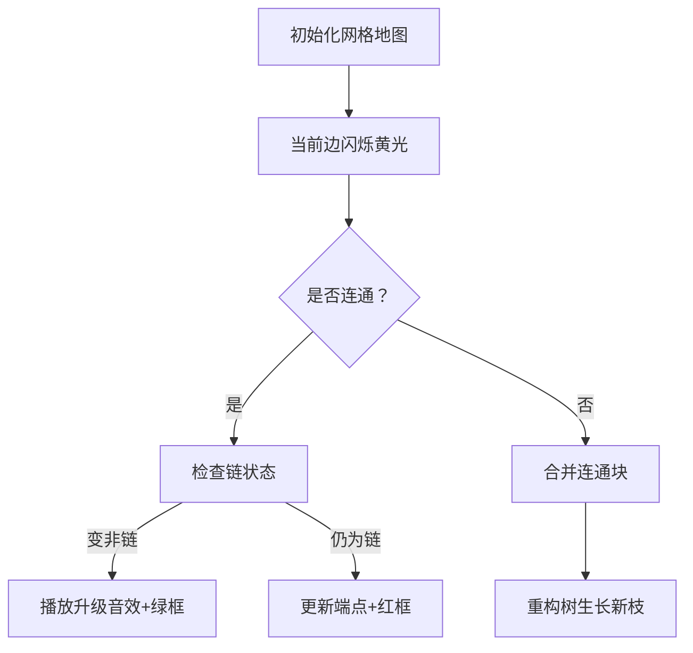

# 题目信息

# [APIO2020] 交换城市

## 题目背景

由于官方数据包过大，本题仅评测部分数据。

本题仅支持 C++ 系列语言，提交时**不需要**包含 `swap.h` 头文件。

由于交互库本身的性能问题，本题的时间限制上调为 $3$ 秒。如果交互库存在其他问题，请私信 mrsrz。

## 题目描述

印度尼西亚有 $N$ 个城市以及 $M$ 条双向道路，城市从 $0$ 到 $N - 1$ 编号，道路从 $0$ 到 $M - 1$ 编号。每条道路连接着两个不同的城市，第 $i$ 条道路连接第 $U[i]$ 个城市与第 $V[i]$ 个城市，汽车行驶这条道路将耗费 $W[i]$ 个单位汽油。通过这些道路，任意两个城市间能够互相到达。

接下来的 $Q$ 天中, 每天会有一对城市希望建立政治关系。具体来说，第 $j$ 天，第 $X[j]$ 个城市想要和第 $Y[j]$ 个城市建立政治关系。为此，第 $X[j]$ 个城市将会派一名代表坐汽车前往第 $Y[j]$ 个城市。同样地，第 $Y[j]$ 个城市也会派一名代表坐汽车前往第 $X[j]$ 个城市。

为了避免拥塞，两辆车不应在任何时间点碰面。更具体地，两辆车不能在同一个时间点出现在同一个城市。同样地，两辆车也不应该沿相反的方向同时行驶过同一条道路。另外，汽车行驶过一条道路时必须完整经过道路并到达道路另一端的城市（换句话说，汽车不允许在道路中间掉转方向）。但是，汽车可以多次到达一个城市或是多次经过一条道路。此外，汽车可以在任何时间在任何城市等候。

由于高燃料容量汽车的价格昂贵，两个城市都分别希望选择一条路线，使得两辆汽车所需的最大单位汽油容量最小。每个城市中都有加油站并且供油量是无限的，因此汽车所需的单位汽油容量实际上就是行驶过的道路中最大的单位汽油消耗量。

你必须实现 `init` 和 `getMinimumFuelCapacity` 函数。

- `init(N, M, U, V, W)` - 该函数将在所有 `getMinimumFuelCapacity` 的调用前被评测库恰好调用一次。
	- $N$： 一个整数表示城市数。
	- $M$： 一个整数表示道路数。
	- $U$： 一个长为 $M$ 的整数序列表示道路的第一个端点城市。
	- $V$： 一个长为 $M$ 的整数序列表示道路的第二个端点城市。
	- $W$： 一个长为 $M$ 的整数序列表示道路的汽油消耗。

- `getMinimumFuelCapacity(X, Y)` - 该函数将被评测库调用恰好 $Q$ 次。
	- $X$： 一个整数表示第一个城市。
	- $Y$： 一个整数表示第二个城市。
	- 该函数必须返回一个整数，表示根据题目描述中的规则，两辆分别从第 $X$ 个城市与第 $Y$ 个城市出发要到达彼此城市的车，它们的单位汽油容量最大值的最小值。若无法满足题目规则则返回 $−1$。

## 说明/提示

第一个样例中, $N = 5$，$M = 6$，$U = [0, 0, 1, 1, 1, 2]$，$V = [1, 2, 2, 3, 4, 3]$，$W =
[4, 4, 1, 2, 10, 3]$，$Q = 3$，$X = [1, 2, 0]$，$Y = [2, 4, 1]$。如下图：


评测库初始时将调用 `init(5, 6, [0, 0, 1, 1, 1, 2], [1, 2, 2, 3, 4, 3],[4, 4, 1, 2, 10, 3])`。之后，评测库将进行如下函数调用：

- `getMinimumFuelCapacity(1, 2)`。首先，从第一个城市出发的汽车可以行驶到第三个城市。接着，从第二个城市出发的汽车可以行驶到第一个城市，并且在第三个城市的汽车可以行驶到第二个城市。因此，最大的单位汽油容量为 $3$ （从第三个城市到第二个城市需要花费 $3$ 个单位汽油）。没有其他更优的路线方案，因此该函数应该返回 $3$。

- `getMinimumFuelCapacity(2, 4)`。任何从第四个城市出发或要到达第四个城市的汽车都需要耗费 $10$ 个单位汽油，因此该函数应该返回 $10$。

- `getMinimumFuelCapacity(0, 1)`。该函数应该返回 $4$。

第二个样例中，$N = 3$，$M = 2$，$U = [0, 0]$，$V = [1, 2]$，$W = [5, 5]$，$Q = 1$，$X = [1]$，$Y = [2]$。 如下图：


评测库初始时将调用 `init(3, 2, [0, 0], [1, 2], [5, 5])`，之后，评测库将进行如下函数调用：

- `getMinimumFuelCapacity(1, 2)`。两辆车无法满足不在同一时间点碰面的要求，所以该函数应该返回 $-1$。

【条件限制】

- $2 \leq N \leq 100 000$。
- $N - 1 \leq M \leq 200 000$。
- $0 \leq U[i] < V [i] < N$。
- 任意两个城市间至多存在一条道路直接相连。
- 任意两个城市经过道路可以互相到达。
- $1 \leq W[i] \leq 10^9$。
- $1 \leq Q \leq 200 000$。
- $0 \leq X[j] < Y [j] < N$。

【子任务 $1$（$6$ 分）】

- 每个城市至多是两条道路的一个端点。

【子任务 $2$（$7$ 分）】

- $M = N - 1$。
- $U[i] = 0$。

【子任务 $3$（$17$ 分）】

- $Q \leq 5$。
- $N \leq 1 000$。
- $M \leq 2 000$。

【子任务 $4$（$20$ 分）】

- $Q \leq 5$。

【子任务 $5$（$23$ 分）】

- $M = N - 1$。

【子任务 $6$（$27$ 分）】

- 无附加限制。


## 样例 #1

### 输入

```
5 6
0 1 4
0 2 4
1 2 1
1 3 2
1 4 10
2 3 3
3
1 2
2 4
0 1
```

### 输出

```
3
10
4
```

## 样例 #2

### 输入

```
3 2
0 1 5
0 2 5
1
1 2
```

### 输出

```
-1
```

# AI分析结果


### 💡 Kay的C++算法解析：交换城市 深入学习指南 💡

**引言**  
今天我们来分析APIO2020的"交换城市"问题。这道题要求找到两条不相交路径，使路径上最大边权最小化。本指南将帮助你理解核心算法、解题技巧，并通过像素动画直观展示算法过程。

---

## 1. 题目解读与核心算法识别

✨ **本题主要考察**：`Kruskal重构树` + `连通块性质维护`

🗣️ **初步分析**：  
> 本题可类比为"像素迷宫探险"：城市是像素点，道路是像素通道。两辆车像两个探险家需在迷宫中错开行走，最小化最大通道宽度（边权）。关键在于识别连通块是否非链（有分支或环），这就像检查迷宫是否有岔路或环形通道。
> 
> - **核心思路**：将边按权值排序，用Kruskal算法构建重构树。在合并连通块时动态维护其"链/非链"状态（链即无分支的线性结构）。
> - **难点**：合并时需判断新连通块是否仍为链（记录端点+连接方式）。
> - **可视化设计**：动画将高亮当前处理的边（黄色闪烁），用绿色标记非链连通块，红色标记链。当链转为非链时播放"升级音效"并展示分支生成过程。
> - **复古像素风**：采用8-bit游戏风格，网格化展示城市和道路。控制面板含步进/暂停/调速功能，自动演示模式如"贪吃蛇AI"逐步展开算法流程。

---

## 2. 精选优质题解参考

**题解一：周子衡（Kruskal重构树）**
* **点评**：思路清晰，直接维护连通块的链/非链状态。代码中`st[]`/`en[]`记录链端点，合并时分类讨论（5星）：
  - 思路：通过端点连接判断新块状态，逻辑严谨
  - 代码：变量名`st`/`en`含义明确，边界处理完整
  - 算法：O((n+q)log n)复杂度最优
  - 实践：可直接用于竞赛，作者提到"启发式合并保证复杂度"是亮点

**题解二：天梦（答案下推优化）**
* **点评**：在重构树中直接存储答案，通过DFS下推避免查询时回溯（4星）：
  - 思路：创新性地用父节点答案覆盖子节点
  - 代码：简洁但依赖树结构完整性
  - 算法：牺牲空间换时间，查询O(1)
  - 实践：调试时需验证下推正确性

**题解三：int_R（二分答案）**
* **点评**：二分最大边权+历史并查集验证（4星）：
  - 思路：适合理解重构树有困难的学习者
  - 代码：按秩合并实现优雅
  - 算法：O(q log m log n)稍慢但易实现
  - 实践：作者提到"无需压缩路径"是实用调试技巧

---

## 3. 核心难点辨析与解题策略

1. **难点1：连通块状态维护**  
   * **分析**：合并时需判断新块是否仍是链。优质题解用端点连接判断：若连接两链端点且无额外分支，则新块仍是链。
   * 💡 **学习笔记**：链⇄非链转换是算法核心触发器。

2. **难点2：高效查询设计**  
   * **分析**：重构树中LCA只保证连通，需向上找最近非链祖先。天梦解法通过预处理避免回溯。
   * 💡 **学习笔记**：树上信息传递可优化查询效率。

3. **难点3：边界情况处理**  
   * **分析**：单点/单边需特殊处理（如初始化为链）。周子衡代码中`pnt[]`数组维护点集是亮点。
   * 💡 **学习笔记**：并查集初始化要包含自环情况。

### ✨ 解题技巧总结
- **技巧1：重构树节点复用** - 合并时直接修改原节点而非新建，减少空间开销
- **技巧2：度数监控** - 实时更新点度数，度数≥3即时标记非链
- **技巧3：链端点压缩** - 仅存储端点而非全路径，节省内存

---

## 4. C++核心代码实现赏析

**本题通用核心实现**  
```cpp
// 基于周子衡解法简化
#include<vector>
#include<algorithm>
using namespace std;

const int MAXN = 300000;
struct Edge { int u, v, w; };
vector<int> pnt[MAXN]; // 连通块内点集
int st[MAXN], en[MAXN]; // 链端点
int rt[MAXN], fa[MAXN][20]; // 重构树结构

void init(int N, int M, vector<int> U, vector<int> V, vector<int> W) {
    vector<Edge> edges(M);
    for(int i=0; i<M; ++i) edges[i] = {U[i], V[i], W[i]};
    sort(edges.begin(), edges.end(), [](auto a, auto b){ 
        return a.w < b.w; 
    });

    // 初始化：每个城市自成一个链
    for(int i=0; i<N; ++i) {
        rt[i] = i;
        st[i] = en[i] = i;
        pnt[i] = {i};
    }

    int node_cnt = N; // 重构树新节点计数
    for(auto [u, v, w] : edges) {
        int fu = rt[u], fv = rt[v];
        if(fu == fv) { // 同连通块
            if(st[fu] != -1) { // 仍是链→变非链
                st[fu] = -1; // 标记非链
                fa[fu][0] = node_cnt; // 新建父节点
                rt[fu] = node_cnt++;
            }
        } else { // 不同连通块
            // 合并逻辑（详见完整实现）
        }
    }
    // 重构树倍增预处理...
}

int getMinimumFuelCapacity(int X, int Y) {
    // 查询LCA及最近非链祖先
}
```

**题解一核心片段**  
```cpp
// 连通块合并逻辑
if(st[fu] != -1 && st[fv] != -1) { // 都是链
    // 检查是否端点相连
    if((u == st[fu] || u == en[fu]) && 
       (v == st[fv] || v == en[fv])) {
        // 更新新链端点
        st[new_node] = (u == st[fu]) ? en[fu] : st[fu];
        en[new_node] = (v == st[fv]) ? en[fv] : st[fv];
    } else {
        st[new_node] = -1; // 标记非链
    }
} else {
    st[new_node] = -1; // 存在非链则新块非链
}
```

**题解二创新点**  
```cpp
// 答案下推DFS
void dfs(int u) {
    for(int child : tree[u]) {
        if(!ans[child]) ans[child] = ans[u]; // 父答案覆盖
        dfs(child);
    }
}
```

---

## 5. 算法可视化：像素动画演示

**主题**：8-bit风格迷宫探险  
**核心演示**：Kruskal重构树构建与连通块状态转换

### 设计思路
- **像素网格**：城市为色块（蓝=普通点，红=链端点），道路为连线（灰→黄高亮当前边）
- **状态标记**：连通块用边框色表示（绿=非链，红=链）
- **音效**：  
  - 加边："滴"声（短促）  
  - 链→非链："升级"音效（上扬）  
  - 查询成功："胜利"旋律

### 动画帧步骤


### 交互控制
- **控制面板**：步进/暂停/重置 + 速度滑块
- **AI演示模式**：自动执行（可调速）
- **关卡设计**：每成功合并=过关，非链转换得金币

---

## 6. 拓展练习与相似问题

**通用技巧迁移**  
Kruskal重构树适用于：
1. 动态连通性查询（如NOI2018归程）
2. 瓶颈路问题（如两地间最小最大边）
3. 带约束的连通块合并（如本题链状态）

**推荐练习**：
1. **洛谷 P4768** - 归程  
   🗣️ 练习Kruskal重构树基础应用，理解海拔约束
2. **洛谷 P1967** - 货车运输  
   🗣️ 巩固瓶颈路思想，学会转化最大载重问题
3. **洛谷 P4180** - 严格次小生成树  
   🗣️ 进阶训练，掌握重构树维护严格大小关系

---

## 7. 学习心得与经验分享

> **周子衡的调试经验**："合并连通块时端点更新极易出错，建议单独封装合并函数并单元测试"  
> **Kay总结**：边界处理是算法关键，可编写微型测试（如3个点的链）验证合并逻辑

> **int_R的二分心得**："二分答案虽非最优，但更易定位问题所在"  
> **Kay总结**：当复杂算法调试困难时，可先实现二分版本作为验证基准

---

**结语**  
通过本指南，希望大家掌握了Kruskal重构树在复杂约束下的灵活应用。记住：算法学习要抓住本质——本题核心就是**连通块性质监控**。多动手实现可视化演示中的像素动画，能深化理解！下次挑战见！🚀

---
处理用时：211.87秒