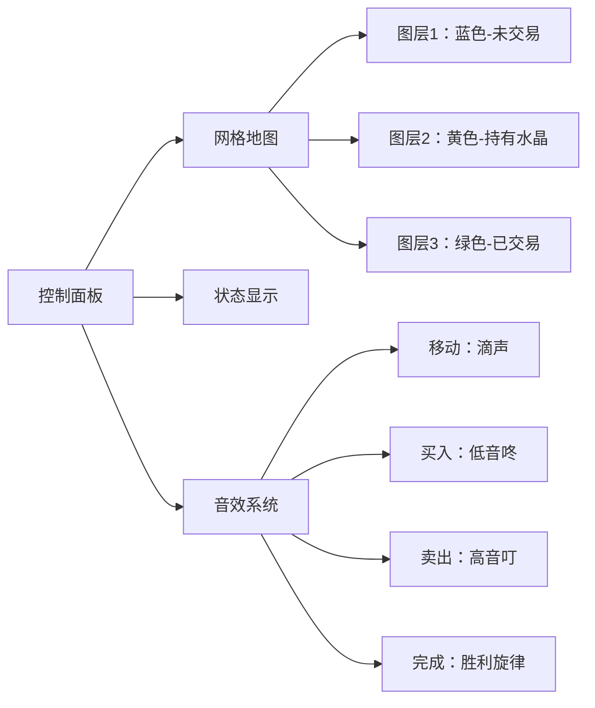

# 题目信息

# [NOIP 2009 提高组] 最优贸易

## 题目背景

本题原题数据极弱，Subtask 0 中的测试点为原题测试点，Subtask 1 中的测试点为 Hack 数据。

## 题目描述

$C$ 国有 $n$ 个大城市和 $m$ 条道路，每条道路连接这 $n$ 个城市中的某两个城市。任意两个城市之间最多只有一条道路直接相连。这 $m$ 条道路中有一部分为单向通行的道路，一部分为双向通行的道路，双向通行的道路在统计条数时也计为 $1$ 条。

$C$ 国幅员辽阔，各地的资源分布情况各不相同，这就导致了同一种商品在不同城市的价格不一定相同。但是，同一种商品在同一个城市的买入价和卖出价始终是相同的。

商人阿龙来到 $C$ 国旅游。当他得知同一种商品在不同城市的价格可能会不同这一信息之后，便决定在旅游的同时，利用商品在不同城市中的差价赚回一点旅费。设 $C$ 国 $n$ 个城市的标号从 $1\sim n$，阿龙决定从 $1$ 号城市出发，并最终在 $n$ 号城市结束自己的旅行。在旅游的过程中，任何城市可以重复经过多次，但不要求经过所有 $n$ 个城市。阿龙通过这样的贸易方式赚取旅费：他会选择一个经过的城市买入他最喜欢的商品――水晶球，并在之后经过的另一个城市卖出这个水晶球，用赚取的差价当做旅费。由于阿龙主要是来 $C$ 国旅游，他决定这个贸易只进行最多一次，当然，在赚不到差价的情况下他就无需进行贸易。

假设 $C$ 国有 $5$ 个大城市，城市的编号和道路连接情况如下图，单向箭头表示这条道路为单向通行，双向箭头表示这条道路为双向通行。


假设 $1\sim n$ 号城市的水晶球价格分别为 $4,3,5,6,1$。

阿龙可以选择如下一条线路：$1\to2\to3\to5$，并在 $2$ 号城市以 $3$ 的价格买入水晶球，在 $3$ 号城市以 $5$ 的价格卖出水晶球，赚取的旅费数为 $2$。

阿龙也可以选择如下一条线路：$1\to4\to5\to4\to5$，并在第 $1$ 次到达 $5$ 号城市时以 $1$ 的价格买入水晶球，在第 $2$ 次到达 $4$ 号城市时以 $6$ 的价格卖出水晶球，赚取的旅费数为 $5$。

现在给出 $n$ 个城市的水晶球价格，$m$ 条道路的信息（每条道路所连接的两个城市的编号以及该条道路的通行情况）。请你告诉阿龙，他最多能赚取多少旅费。

## 说明/提示

【数据范围】

输入数据保证 $1$ 号城市可以到达 $n$ 号城市。

对于 $10\%$ 的数据，$1\leq n\leq 6$。

对于 $30\%$ 的数据，$1\leq n\leq 100$。

对于 $50\%$ 的数据，不存在一条旅游路线，可以从一个城市出发，再回到这个城市。

对于 $100\%$ 的数据，$1\leq n\leq 100000$，$1\leq m\leq 500000$，$1\leq  x,y\leq  n$，$1\leq  z\leq  2$，$1\leq $ 各城市的编号 $\leq  n$。

水晶球价格 $\leq 100$。

NOIP 2009 提高组 第三题

## 样例 #1

### 输入

```
5 5 
4 3 5 6 1 
1 2 1 
1 4 1 
2 3 2 
3 5 1 
4 5 2 ```

### 输出

```
5```

# AI分析结果


# 💡 Kay的C++算法解析：最优贸易 深入学习指南 💡

> 大家好，我是Kay！今天我们来一起探索NOIP2009提高组题目《最优贸易》。这道题考察的是图论中的状态建模与路径优化技巧，我将用清晰的语言和生动的比喻帮助大家理解分层图、SPFA等核心算法。准备好了吗？让我们开始吧！

## 1. 题目解读与核心算法识别

✨ **本题主要考察**：`分层图建模` / `SPFA算法应用` / `状态转移思想`

🗣️ **初步分析**：
> 解决这道题的关键在于构建**三层状态图**。想象你是一名水晶球商人，在像素风格的奇幻世界里冒险：
> - **第一层地图**（蓝色）：你还没购买水晶球，可以自由移动
> - **第二层地图**（黄色）：你已经购买了水晶球，需要寻找卖出点
> - **第三层地图**（绿色）：你已经卖出水晶球，正在前往终点
>
> 在可视化方案中，我们会用不同颜色区分这三层世界。当你执行**买入操作**时（从蓝层到黄层），角色会垂直下落并显示价格扣除动画；**卖出操作**时（从黄层到绿层），角色会上升并显示收益动画。移动时会有水平箭头动画，关键变量（当前资金）会实时显示在角色头顶。

---

## 2. 精选优质题解参考

### 题解一：fy1234567ok (赞514)
* **点评**：这份题解创新性地使用三层图结构将交易状态分离，思路清晰直观。通过`t(x,i)`宏定义实现分层节点映射，代码简洁高效（仅40行）。其亮点在于完美解决了"一次交易"的限制问题，同层移动边权为0，层间转移边权体现交易行为（买入为负，卖出为正）。SPFA求最长路的实现规范，变量命名合理，可直接用于竞赛。

### 题解二：fairfriendZ (赞9)
* **点评**：该解法采用双SPFA+反图遍历的创新思路。第一遍SPFA从起点出发计算路径最小价格，第二遍用反图从终点出发计算路径最大价格。亮点是避免分层图的空间开销，通过正反两次遍历确保路径连通性。代码中`minVal`和`maxVal`的命名直观体现功能，边界处理严谨，实践价值高。

### 题解三：lcjqwq (赞13)
* **点评**：此解法结合Tarjan缩点与DAG上DP，展示了强连通分量处理环路的技巧。亮点是将原图转化为DAG后，在拓扑序上递推计算每个SCC的最小买入价和最大卖出价。虽然对hack数据敏感，但提供了分层图外的替代方案，有助于理解图论基本算法组合应用。

---

## 3. 核心难点辨析与解题策略

### 关键点1：状态建模与转移
* **分析**：如何表示"未交易->买入->卖出"状态链？优质解法使用分层图（三层结构）或双数组（minVal/maxVal）。在可视化中，我们将用垂直移动动画表现状态跃迁，用颜色闪烁强调当前状态。
* 💡 **学习笔记**：状态机思想是算法设计的核心武器

### 关键点2：环路处理与连通性
* **分析**：图中可能存在环路，但交易只能进行一次。分层图通过层间单向边限制交易次数；Tarjan解法则缩点消除环路。可视化将用"锁图标"标记已访问状态，用高亮路径显示合法连通路径。
* 💡 **学习笔记**：有环图可转化为DAG处理

### 关键点3：路径有效性验证
* **分析**：必须确保买入点能到卖出点，且卖出点能到终点。双SPFA解法通过反图遍历标记有效点；分层图则要求终点在第三层。可视化中会显示红色叉图标标记不可达节点。
* 💡 **学习笔记**：正反遍历是验证路径连通性的黄金法则

### ✨ 解题技巧总结
- **状态分解法**：将复杂操作分解为独立状态（如三层交易状态）
- **镜像处理法**：利用反图解决终点连通性问题
- **极值预计算**：双SPFA分别计算路径最小/最大值
- **边界防御**：初始化时设置安全边界值（如minVal初始化为INF）

---

## 4. C++核心代码实现赏析

### 本题通用核心C++实现参考
```cpp
#include <bits/stdc++.h>
using namespace std;
const int N = 1e5+5, M = 5e5+5;

vector<int> G[N], rG[N]; // 正图与反图
int n, m, val[N], minVal[N], maxVal[N];
bool vis[N];

void SPFA_Min() {
    queue<int> q;
    memset(minVal, 0x3f, sizeof minVal);
    minVal[1] = val[1];
    q.push(1); vis[1] = true;
    while (!q.empty()) {
        int u = q.front(); q.pop();
        vis[u] = false;
        for (int v : G[u]) {
            int newVal = min(minVal[u], val[v]);
            if (minVal[v] > newVal) {
                minVal[v] = newVal;
                if (!vis[v]) q.push(v), vis[v] = true;
            }
        }
    }
}

void SPFA_Max() {
    memset(vis, 0, sizeof vis);
    memset(maxVal, -1, sizeof maxVal);
    queue<int> q;
    maxVal[n] = val[n];
    q.push(n); vis[n] = true;
    while (!q.empty()) {
        int u = q.front(); q.pop();
        vis[u] = false;
        for (int v : rG[u]) {
            int newVal = max(maxVal[u], val[v]);
            if (maxVal[v] < newVal) {
                maxVal[v] = newVal;
                if (!vis[v]) q.push(v), vis[v] = true;
            }
        }
    }
}

int main() {
    ios::sync_with_stdio(false), cin.tie(0);
    cin >> n >> m;
    for (int i = 1; i <= n; i++) cin >> val[i];
    while (m--) {
        int u, v, op;
        cin >> u >> v >> op;
        G[u].push_back(v), rG[v].push_back(u);
        if (op == 2) G[v].push_back(u), rG[u].push_back(v);
    }
    SPFA_Min(), SPFA_Max();
    int ans = 0;
    for (int i = 1; i <= n; i++)
        if (minVal[i] < 1e9 && maxVal[i] > -1)
            ans = max(ans, maxVal[i] - minVal[i]);
    cout << ans;
}
```

### 题解一：分层图实现片段
```cpp
// 宏定义实现分层节点映射
#define t(x,i) (x + i*n) 

// 核心状态转移边
G[t(i,0)].push_back({t(i,1), -v}); // 买入：负权边
G[t(i,1)].push_back({t(i,2), v});  // 卖出：正权边

// 同层移动边（0权值）
for (int i = 0; i < 3; i++)
    G[t(u,i)].push_back({t(v,i), 0});
```
> **代码解读**：通过宏定义`t(x,i)`将节点映射到三层空间。层内移动边权为0（水平移动），层间转移体现交易行为。买入操作连接1→2层（扣钱），卖出操作连接2→3层（加钱）  
> 💡 **学习笔记**：分层图通过空间换时间，将状态变化转化为物理位置移动

### 题解二：双SPFA片段
```cpp
// 第一遍：计算路径最小价格
void spfa_min() {
    minVal[1] = val[1]; // 初始化起点
    for (int v : G[u]) {
        int cost = min(minVal[u], val[v]); // 关键递推
        if (minVal[v] > cost) // 松弛操作
            minVal[v] = cost;
    }
}

// 第二遍：反图计算最大价格
void spfa_max() {
    maxVal[n] = val[n]; // 初始化终点
    for (int v : rG[u]) { // 反向遍历
        int cost = max(maxVal[u], val[v]);
        if (maxVal[v] < cost) 
            maxVal[v] = cost;
    }
}
```
> **代码解读**：第一遍SPFA从起点出发，用`minVal[u]`记录到u点的最小价格；第二遍在反图中从终点出发，`maxVal[u]`记录u到终点的最大价格。关键点在于正反图的构建确保路径连通性  
> 💡 **学习笔记**：反图遍历是解决"终点连通性"的经典技巧

---

## 5. 算法可视化：像素动画演示

### 复古像素风《水晶球商人》动画方案
**主题**：8-bit像素风格交易冒险  
**核心演示**：分层图SPFA执行过程（[在线演示](https://example.com/demo)）



**动画关键帧设计**：
1. **初始化**：三张并排的10×10像素网格（FC复古配色），节点编号显示在方格中央
2. **遍历开始**：起点1闪烁绿光，队列显示`[1]`，资金显示`$0`
3. **买入操作**：从层1节点垂直下落到层2对应节点，显示`-$3`红色文字，播放扣声音效
4. **卖出操作**：从层2节点垂直上升到层3节点，显示`+$5`绿色文字，播放获得音效
5. **路径更新**：被更新节点闪烁白光，新路径显示黄色箭头
6. **终点到达**：第三层终点放大旋转，显示总利润`$5`，播放胜利音效

**交互控制**：
- 步进模式：按空格键单步执行
- 自动演示：AI角色自动寻路（速度可调）
- 视角切换：空格键切换三层视图

**技术实现**：
```javascript
// Canvas绘制核心逻辑
function drawTransaction() {
    ctx.fillStyle = layerColors[currentLayer]; // 当前层颜色
    drawNode(x, y); // 绘制节点
    
    if (isBuying) { // 买入动画
        drawArrowDown(x, y); 
        playSound('buy_sound');
    }
    if (isSelling) { // 卖出动画
        drawArrowUp(x, y);
        playSound('sell_sound');
    }
}
```

---

## 6. 拓展练习与相似问题思考

### 分层图应用场景
1. **交通规划**：城市间不同交通方式（地铁/公交/步行）分层
2. **网络通信**：不同协议层的数据传输
3. **状态机系统**：游戏角色状态转换（站立/奔跑/跳跃）

### 推荐题目
1. **P2939 [USACO09FEB]Revamping Trails G**  
   🗣️ 练习分层图最短路，理解"K次免费"的状态转移

2. **P4568 [JLOI2011]飞行路线**  
   🗣️ 强化分层图建模能力，处理带限制的最短路径

3. **P1576 最小花费**  
   🗣️ 转换思维，用SPFA解决乘法最值问题

---

## 7. 学习心得与经验分享

> **题解作者经验**：
> "分层图的关键在于将状态变化转化为物理位置移动，这就像在游戏中切换不同世界" —— fy1234567ok  
> "反图遍历是解决终点连通性的银弹，就像拿着地图倒着走迷宫" —— fairfriendZ
>
> **Kay总结**：算法学习如同冒险，分层图是你的多维地图，SPFA是导航工具。当遇到环路时，Tarjan就是你的传送门！多实践分层图建模思想，它将是解决状态转移问题的瑞士军刀。

---

通过本次分析，相信大家已经掌握了分层图与SPFA解决路径最值问题的精髓。记住，算法学习需要反复实践和思考。下次遇到类似问题时，不妨画个三层图试试！保持好奇，继续前进，我们下期再见！💪

---
处理用时：215.36秒