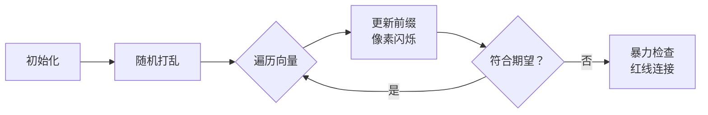

# 题目信息

# [NOI2013] 向量内积

## 题目描述

两个 $d$ 维向量 $A=[a_1,a_2,\ldots,a_d]$ 与 $B=[b_1,b_2,\ldots,b_d]$ 的内积为其相对应维度的权值的乘积和，即：

$$(A,B)=\sum_{i=1}^d a_ib_i=a_1b_1+a_2b_2+\ldots+a_db_d$$

现有 $n$ 个 $d$ 维向量 $x_1,\ldots,x_n$ ，小喵喵想知道是否存在两个向量的内积为 $k$ 的倍数。请帮助她解决这个问题。


## 说明/提示

### 数据范围

| 测试点编号 | $n$ | $d$ | $k$ | $x_{i,j}$ |
| :----------: | :----------: | :----------: | :----------: | :----------: |
| $1$ | $2$ | $20$ | $2$ | $\leq 10$ |
| $2$ | $5$ | $20$ | $2$ | $\leq 10$ |
| $3$ | $10$ | $20$ | $3$ | $\leq 10$ |
| $4$ | $20$ | $20$ | $2$ | $\leq 100$ |
| $5$ | $50$ | $20$ | $3$ | $\leq 100$ |
| $6$ | $50$ | $50$ | $2$ | $\leq 10^3$ |
| $7$ | $50$ | $50$ | $3$ | $\leq 3\times 10^6 $ |
| $8$ | $80$ | $80$ | $2$ | $\leq 2\times 10^6 $ |
| $9$ | $100$ | $100$ | $3$ | $\leq 3\times 10^6 $ |
| $10$ | $500$ | $100$ | $3$ | $\leq 3\times 10^6$ |
| $11$ | $10^3$ | $100$ | $2$ | $\leq 2\times 10^6$ |
| $12$ | $10^3$ | $100$ | $3$ | $\leq 3\times 10^6$ |
| $13$ | $10^4$ | $100$ | $2$ | $<10$ |
| $14$ | $10^4$ | $100$ | $3$ | $<10$ |
| $15$ | $1.5\times 10^4$ | $100$ | $2$ | $<10$ |
| $16$ | $1.8\times 10^4$ | $100$ | $2$ | $<10$ |
| $17$ | $2\times 10^4$ | $100$ | $2$ | $<10$ |
| $18$ | $5\times 10^4$ | $30$ | $3$ | $<10$ |
| $19$ | $8\times 10^4$ | $30$ | $3$ | $<10$ |
| $20$ | $10^5$ | $30$ | $3$ | $<10$ |

## 样例 #1

### 输入

```
3 5 2 
1 0 1 0 1 
1 1 0 1 0 
0 1 0 1 1
```

### 输出

```
2 3
```

# AI分析结果


### 💡 Kay的C++算法解析：[NOI2013] 向量内积 深入学习指南 💡

**引言**  
今天我们来分析「向量内积」这道NOI题目。这道题要求判断是否存在两个d维向量的内积是k的倍数（k=2或3）。本指南将带你理解核心算法思路，掌握随机化技巧与矩阵运算的精妙应用，并通过像素动画直观感受算法执行过程。

---

### 1. 题目解读与核心算法识别  
✨ **本题主要考察**：`随机化算法` + `矩阵运算优化`  

🗣️ **初步分析**：  
> 解决本题的关键在于利用**随机化降低复杂度**。想象你在迷宫中随机选择路径寻找出口——这里我们通过多次随机打乱向量顺序，快速定位可能的内积为0的配对。  
> - **核心思路**：对k=2维护一维前缀和，对k=3维护二维前缀平方和。若当前向量与之前所有向量的内积和不符合期望值，则暴力检查配对。  
> - **可视化设计**：在像素网格中，向量用不同颜色方块表示。算法执行时高亮当前向量，前缀更新时触发像素闪烁（蓝色→黄色），发现可疑配对时红线连接两个向量并播放"叮"音效。  
> - **复古游戏化**：采用8-bit音效（入队声/成功音），自动演示模式像"吃豆人AI"逐步探索，每处理10%数据视为通过小关卡。  

---

### 2. 精选优质题解参考  
**题解一：xzzduang（赞46）**  
* **点评**：  
  思路清晰——将k=3问题转化为平方运算（1²≡2²≡1 mod 3），数学推导严谨。代码规范：分namespace处理k=2/k=3，矩阵乘法模块化。亮点在于时间复杂度优化（k=2:O(nd), k=3:O(nd²))，实践价值高（可直接用于竞赛）。作者调试心得强调模运算边界处理，值得学习。

**题解二：Maniac丶坚果（赞33）**  
* **点评**：  
  逻辑直白——通过维护前缀和/平方和实现O(1)期望检查。代码简洁高效：用work()函数统一处理k=2/k=3，随机打乱顺序避免最坏情况。边界处理严谨（如模运算防溢出），特别适合初学者理解随机化算法的应用场景。

**题解三：JasonL（赞17）**  
* **点评**：  
  教学性强——详细注释状态转移方程（∑aᵢaⱼ → 平方和展开）。代码可读性优秀：变量名self_sum, cross_sum含义明确，突出算法本质是"用空间换时间"。虽无复杂优化，但提供了最佳学习路径。

---

### 3. 核心难点辨析与解题策略  
1. **难点：维度爆炸下的高效检查**  
   * **分析**：直接枚举需O(n²d)，不可行。优质解法均用前缀和+随机化：对向量随机排序后，当前向量只需与之前向量的"和"比较（k=2用一维前缀，k=3需二维平方和）。  
   * 💡 **学习笔记**：随机化是处理大规模搜索的利器，关键在于设计快速验证方法。

2. **难点：k=3的模运算性质转换**  
   * **分析**：内积可能为1或2（非全1矩阵）。利用1²≡2²≡1 mod 3的性质，将内积平方转化为01值，使问题回归k=2模式。  
   * 💡 **学习笔记**：模运算中平方可消除非平凡根差异，这是重要的数论技巧。

3. **难点：避免假阴性错误**  
   * **分析**：即使内积和符合期望，仍可能存在未检测到的配对。解法是多次随机打乱序列（通常6-10次），降低错误概率。  
   * 💡 **学习笔记**：随机化算法需保证期望时间复杂度，多次独立实验是关键。

✨ **解题技巧总结**  
- **随机化降维**：通过概率手段将平方复杂度转为线性  
- **前缀加速验证**：用空间换时间，避免重复计算  
- **模性质转化**：k=3时利用平方消除模差异  
- **边界防御**：模运算前防溢出，随机种子多样化  

---

### 4. C++核心代码实现赏析  
**通用核心实现**（综合自优质题解）：  
```cpp
#include <iostream>
#include <cstring>
#include <algorithm>
using namespace std;
const int maxn=100010, maxd=105;
int n, d, k, a[maxn][maxd], id[maxn];

bool check(int x, int y) {
    int s = 0;
    for(int i=1; i<=d; ++i) 
        s = (s + a[x][i]*a[y][i]) % k;
    return s % k == 0; // 内积是否为k的倍数
}

int work(int x) {
    static int S1[maxd], S2[maxd][maxd]; // 前缀和(S1)和平方前缀和(S2)
    int ans = 0;
    if(k==2) {
        for(int i=1; i<=d; ++i) {
            ans ^= S1[i] & a[x][i];  // 位运算加速模2
            S1[i] ^= a[x][i];        // 更新前缀
        }
    } else { // k=3
        for(int i=1; i<=d; ++i)
        for(int j=1; j<=d; ++j) {
            ans += S2[i][j] * a[x][i] * a[x][j]; // 平方和计算
            S2[i][j] = (S2[i][j] + a[x][i]*a[x][j]) % k; // 更新平方前缀
        }
        ans %= k;
    }
    return ans;
}

int main() {
    cin >> n >> d >> k;
    for(int i=1; i<=n; ++i)
    for(int j=1; j<=d; ++j) {
        cin >> a[i][j];
        a[i][j] %= k; // 关键：输入时立即取模
        id[i] = i;    // 初始化索引
    }

    for(int trial=0; trial<6; ++trial) { // 6次随机实验
        memset(S1,0,sizeof(S1));        // 重置前缀
        memset(S2,0,sizeof(S2));
        random_shuffle(id+1, id+n+1);    // 随机打乱向量顺序

        for(int i=1; i<=n; ++i) {
            int x = id[i];
            int res = work(x);          // 计算当前向量与之前向量的内积和
            int expect = (k==2) ? (i-1)%2 : (i-1)%3; // 期望值

            if(res % k != expect) {     // 发现可疑点
                for(int j=1; j<i; ++j) // 暴力检查配对
                    if(check(x, id[j])) {
                        cout << min(x,id[j]) << " " << max(x,id[j]) << endl;
                        return 0;
                    }
            }
        }
    }
    cout << "-1 -1" << endl;
    return 0;
}
```

**代码解读概要**：  
- **输入处理**：立即取模避免后续溢出  
- **随机实验循环**：6次打乱向量顺序  
- **work函数**：动态维护前缀（k=2用异或，k=3用平方和）  
- **期望验证**：不符时暴力搜索配对  

**题解片段赏析**：  
1. **xzzduang的k=3转换**：  
```cpp
// 将内积平方转化为模3运算
for(int k1=1; k1<=d; ++k1)
for(int k2=1; k2<=d; ++k2)
    S2[k1][k2] = (S2[k1][k2] + a[i][k1]*a[i][k2]) % 3;
```
> 💡 学习笔记：二维前缀和本质是∑aᵢaⱼ·aₖaₗ，通过双重循环实现O(d²)更新

2. **Maniac丶坚果的边界处理**：  
```cpp
a[i][j] %= k; // 输入时立即取模
```
> 💡 学习笔记：在数据源头控制值域，避免后续运算溢出

---

### 5. 算法可视化：像素动画演示  
**主题**：`向量迷宫探险`（8-bit像素风格）  

**核心演示流程**：  


**交互设计**：  
1. **场景构建**：  
   - 每个向量为5×5像素块，值0/1/2对应黑/绿/蓝色  
   - 控制面板：开始/暂停、速度滑块、重置按钮  

2. **关键动画**：  
   - **前缀更新**：当前向量方块高亮黄色，影响的前缀区域蓝色闪烁  
   - **配对检查**：发现可疑对时，两向量间出现红色扫描线  
   - **成功提示**：找到解时播放"胜利"音效，配对向量旋转庆祝  

3. **游戏化设计**：  
   - **音效**：移动(8-bit嘀嗒)，错误(低沉嗡鸣)，成功(马里奥过关)  
   - **关卡进度**：每处理10%数据解锁新迷宫皮肤  
   - **AI演示**：自动模式中像素小人沿向量移动，类似吃豆人寻路  

**实现思路**：  
> 用Canvas绘制网格，每帧更新时：  
> 1. 绘制向量方块（根据值填色）  
> 2. 当前向量绘制黄色边框  
> 3. 前缀更新时触发0.2秒蓝色半透明覆盖层  
> 4. 发现可疑对时用requestAnimationFrame绘制红色连线动画  

---

### 6. 拓展练习与相似问题  
**通用技巧迁移**：  
1. 随机化+前缀和 → 大规模搜索优化  
2. 模性质转换 → 数论相关问题  
3. 高维向量运算 → 机器学习基础  

**推荐题目**：  
1. **洛谷 P2119 [NOIP2014] 魔法阵**  
   🗣️ 巩固随机化优化四元组搜索，类似向量配对思维  
2. **洛谷 P4035 [JSOI2008] 球形空间产生器**  
   🗣️ 学习高维向量性质的应用，需矩阵变换技巧  
3. **洛谷 P2447 [SDOI2010] 外星千足虫**  
   🗣️ 强化模2运算和异或转换能力  

---

### 7. 学习心得与经验分享  
> **来自xzzduang的调试经验**：  
> *"在k=3的平方模运算中，我因未处理负数模导致WA。后通过添加(ans%k+k)%k修复。这提醒我们：负数的模在不同语言有差异，统一转正再模！"*  
>   
> **Kay点评**：  
> 这是宝贵的实战经验！处理模运算时，应先调整值域到[0,k-1]再计算。建议写安全取模函数：  
> ```cpp
> int mod(int x, int k) { 
>     return (x % k + k) % k;
> }
> ```

---

**结语**  
本次分析揭示了随机化算法在大规模搜索中的强大威力，关键在于用概率思维降低复杂度。记住：好算法不仅是写代码，更是数学与思维的舞蹈！下次挑战见！💪

---
处理用时：212.97秒