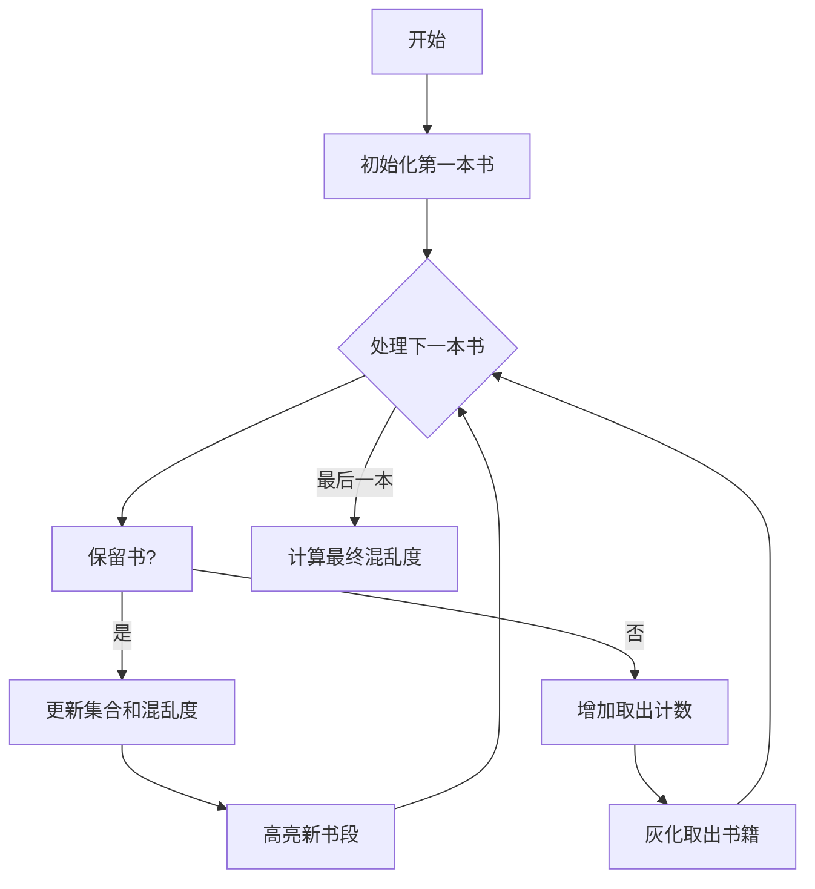

# 题目信息

# 帮助

## 题目描述

Bubu 的书架乱成一团了！帮他一下吧！

他的书架上一共有 $n$ 本书。我们定义混乱值是连续相同高度书本的段数。例如，如果书的高度是 $[30,30,31,31,32]$，那么混乱值为 $3$；$[30,32,32,31]$ 的混乱度也是 $3$，但 $[31,32,31,32,31]$ 的混乱度是 $5$，这实在是太乱了。

Bubu 想尽可能地减少混乱度，但他有点累了，所以他决定最多取出 $k$ 本书，再随意将它们放到书架上。你能帮助他吗？

## 样例 #1

### 输入

```
5 2
25 25 32 32 25
5 1
25 26 25 26 25
0 0```

### 输出

```
Case 1: 2

Case 2: 3

```

# AI分析结果


### Kay的C++算法解析：帮助 深入学习指南

#### 1. 题目解读与核心算法识别
✨ **本题主要考察**：`状态压缩动态规划`  
🗣️ **初步分析**：  
> 这道题的核心在于**最小化序列混乱度**。想象一下整理书架：我们可以把书暂时取出再放回，但放回时如果与现有书高度不同，就会增加新的"书段"。解决思路是：
> - 用**状态压缩**记录保留书的高度集合（高度25~32映射为0~7）
> - 用DP状态`[位置][取出数量][保留集合][最后保留高度]`追踪最小混乱度
> - 最终答案 = 保留书的混乱度 + 取出书中独特高度的数量

**核心算法流程**：
1. **初始化**：第一本书保留（混乱度=1）或取出（混乱度=0）
2. **状态转移**：
   - 保留当前书：混乱度增加量 = (当前高度 ≠ 最后保留高度) ? 1 : 0
   - 取出当前书：混乱度不变
3. **答案计算**：DP值 + (原始高度集合 ^ 保留集合)中1的数量

**可视化设计思路**：
- 用8位像素风格展示书架，不同高度用不同颜色方块
- 高亮当前处理的书和最后保留的书
- 状态集合用8个LED灯展示（亮=存在该高度）
- 音效设计：保留书时"叮"（高度变化）、取出时"噗"、计算答案时胜利音效

#### 2. 精选优质题解参考
**题解一（CYJian）**
* **点评**：思路最清晰完整，状态定义`f[i][j][k][l]`精准涵盖四个关键维度（位置/取出数/集合/末高）。代码用滚动数组优化空间，边界处理严谨（特殊值8表无前驱）。亮点在于对状态转移方程的简洁推导和空间优化技巧。

**题解二（vectorwyx）**
* **点评**：创新性地引入分段处理，将连续相同高度压缩为二元组。状态设计`f[i][j][t][l]`中`t`为保留集合，转移时明确区分整段取出/保留。亮点在于处理分段合并的数学建模能力，适合理解问题本质。

**题解三（lenlen）**
* **点评**：代码实现最简洁规范，预处理`popcount`提升效率。状态转移用`chkmin`宏优化可读性，完整包含初始化和答案计算流程。亮点在于对"取出书再放回"的等效转化解释清晰。

#### 3. 核心难点辨析与解题策略
1. **难点：状态设计维度爆炸**
   - 分析：需同时跟踪位置、取出数、高度集合、最后高度
   - 解决：利用高度范围小(0~7)特性，用8位状态压缩集合
   - 💡 学习笔记：状压DP的核心是识别小范围特征量

2. **难点：取出书再放回的混乱度计算**
   - 分析：取出书中未在保留集合的高度会新增书段
   - 解决：用`popcount(S^集合)`计算新增高度种类数
   - 💡 学习笔记：集合运算可高效计算组合贡献

3. **难点：初始状态与无前驱处理**
   - 分析：第一本书无前驱高度参考
   - 解决：设特殊值8表示"无前驱"，初始化单独处理
   - 💡 学习笔记：DP初始状态决定整个状态转移正确性

✨ **解题技巧总结**：
- **状态精简**：用滚动数组将空间从O(NK·2⁸·8)优化到O(K·2⁸·8)
- **等效转化**：取出操作等效于暂存最后统一处理
- **贪心优化**：相同高度书放一起不会增加混乱度
- **边界防御**：特殊值处理无前驱情况

#### 4. C++核心代码实现赏析
```cpp
#include <cstring>
#include <algorithm>
using namespace std;
const int MAXN=105, MAXK=105, MAXS=1<<8, INF=0x3f3f3f3f;

int main() {
    int n, k, T=0;
    while(cin >> n >> k && n) {
        int all=0, a[MAXN], popcount[MAXS]={0};
        // 预处理popcount
        for(int s=0; s<MAXS; ++s) 
            for(int i=0; i<8; ++i) 
                if(s>>i&1) popcount[s]++;

        // 输入并压缩高度
        for(int i=1; i<=n; ++i) {
            cin >> a[i]; a[i] -= 25;
            all |= (1 << a[i]);
        }

        // 初始化DP数组（滚动数组优化）
        int dp[2][MAXK][MAXS][9];
        memset(dp, 0x3f, sizeof(dp));
        dp[0][0][1<<a[1]][a[1]] = 1; // 保留第一本书
        dp[0][1][0][8] = 0;          // 取出第一本书

        int cur=0;
        for(int i=2; i<=n; ++i) {
            int nxt = cur^1;
            memset(dp[nxt], 0x3f, sizeof(dp[nxt]));
            for(int j=0; j<=k; ++j) {
                for(int s=0; s<=all; ++s) {
                    for(int l=0; l<=8; ++l) {
                        if(dp[cur][j][s][l] == INF) continue;
                        int val = dp[cur][j][s][l];
                        // 取出当前书
                        if(j < k) 
                            dp[nxt][j+1][s][l] = min(dp[nxt][j+1][s][l], val);
                        // 保留当前书
                        int ns = s | (1<<a[i]);
                        int cost = (a[i] != l) ? 1 : 0;
                        if(l == 8) cost = 1; // 处理无前驱情况
                        dp[nxt][j][ns][a[i]] = min(dp[nxt][j][ns][a[i]], val + cost);
                    }
                }
            }
            cur = nxt;
        }

        // 计算答案
        int ans = INF;
        for(int j=0; j<=k; ++j) 
        for(int s=0; s<=all; ++s) 
        for(int l=0; l<=8; ++l) 
            if(dp[cur][j][s][l] != INF) 
                ans = min(ans, dp[cur][j][s][l] + popcount[all ^ s]);
        
        printf("Case %d: %d\n\n", ++T, ans);
    }
    return 0;
}
```

**代码解读概要**：
1. **高度压缩**：25~32映射到0~7，用位运算处理集合
2. **滚动数组**：`dp[2][...]`交替使用，空间优化关键
3. **状态转移**：
   - 取出：直接继承状态，取出数+1
   - 保留：更新集合和末高，根据高度变化增加混乱度
4. **答案计算**：DP值 + 取出书中新高度的种类数（`popcount(all^s)`）

#### 5. 算法可视化：像素动画演示
**主题**："像素图书管理员"整理书架  
**核心演示**：状压DP决策过程与状态更新  



**动画帧步骤**：
1. **初始化场景**：FC红白机风格界面，8色书块排列
2. **决策高亮**：当前书闪烁红光，控制面板显示：
   - 状态寄存器：8位LED显示集合
   - 最后书高：像素箭头指向对应颜色
3. **操作反馈**：
   - 保留：书块变绿，"叮"音效（高度变化时双音）
   - 取出：书块消失，"噗"音效
4. **状态更新**：
   - 集合变化：对应LED灯亮起/熄灭
   - 混乱度：右上角数字实时更新
5. **终局计算**：
   - 书架显示最终排列
   - 弹出窗口："最终混乱度=保留段+新高度数"

**交互控制**：
- 单步执行：←→键控制进度
- 自动演示：空格键启动/暂停，速度滑块调整
- 模式切换：Tab键比较不同题解策略

#### 6. 拓展练习与相似问题思考
**通用思路迁移**：
1. 序列操作+状态压缩：P1879 玉米田（种植方案）
2. 取出/调整元素：P2893 Making the Grade（序列单调化）
3. 集合贡献计算：P2704 炮兵阵地（攻击范围冲突）

**洛谷练习推荐**：
1. **P1879** - 玉米田  
   🗣️ 同样使用状态压缩处理网格限制，强化集合运算能力
2. **P1896** - 互不侵犯  
   🗣️ 国王放置问题，练习多状态DP设计
3. **P2704** - 炮兵阵地  
   🗣️ 三维状态压缩DP，掌握复杂状态转移技巧

#### 7. 学习心得与经验分享
> **来自CYJian的调试经验**："在初始化最后高度时，必须用特殊值8处理无前驱情况，否则第一本书的混乱度会计算错误"  
> **Kay点评**：这个经验揭示了DP设计的核心原则——初始状态决定整个状态空间的正确性。建议学习者：
> 1. 对边界情况专门设计测试用例
> 2. 用`printf`打印前两步状态值验证
> 3. 将特殊值命名（如`NO_LAST=8`）提升可读性

---

本次题解分析就到这里。关键要掌握**状态压缩的适用场景**（小范围离散值）和**滚动数组的空间优化技巧**。记住：好的状态设计能让复杂问题迎刃而解！💪

---
处理用时：188.51秒