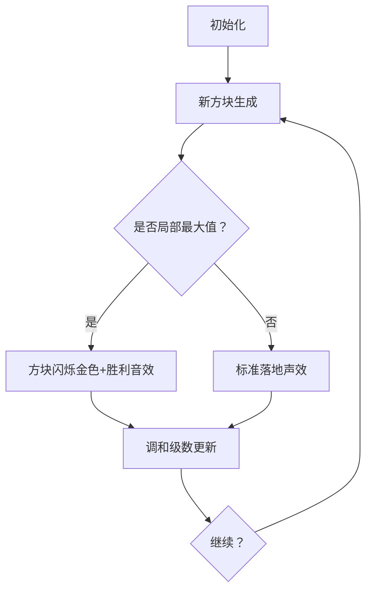

# 题目信息

# Local Maxima

## 题目描述

给出一个排列。如果其中一个数比它前面的数都大，则称为**局部最大值**（Local Maxima）。

现在问在一个长度为 $n$ 的随机生成的排列中，期望有多少个数为局部最大值。

## 说明/提示

长度为 $2$ 的排列共 $2$ 种，为 $(1,2)$ 和 $(2,1)$。前者两个数都为局部最大值，后者仅有第一个数 $2$ 为局部最大值。


### 数据范围及约定 

- 对于 $30\%$ 的数据，$n \leq 10$；
- 对于 $80\%$ 的数据，$n \leq 10^6$；
- 对于 $100\%$ 的数据，$1\leq n < 2^{31}$。


## 样例 #1

### 输入

```
2```

### 输出

```
1.50000000```

# AI分析结果


# 💡 Kay的C++算法解析：Local Maxima 深入学习指南 💡

<introduction>
今天我们分析洛谷题目"Local Maxima"，这道题要求计算随机排列中局部最大值的期望数量。本指南将带你理解数学推导、掌握高效计算技巧，并通过像素动画直观感受算法执行过程。准备好开启算法探索之旅了吗？
</introduction>

## 1. 题目解读与核心算法识别

✨ **本题主要考察**：`数学期望与调和级数应用`

🗣️ **初步分析**：
> 这道题的核心在于理解排列的随机性与局部最大值的概率特性。想象你在玩俄罗斯方块，每个新落下的方块只有比左边所有方块都大时才算"破纪录"——这正是局部最大值的本质！在本题中，每个位置成为局部最大值的概率恰好等于调和级数的分量。
   - 所有优质题解都推导出相同结论：期望值 = 1 + 1/2 + 1/3 + ... + 1/n（第n个调和数）
   - 核心难点在于n极大时（最大2^31）的高效计算，解决方案包括分段打表和欧拉近似公式
   - 可视化设计将采用复古像素风格：排列序列显示为彩色方块，新数字加入时产生"掉落"动画，当成为局部最大值时方块闪烁金色并播放8-bit胜利音效。右侧实时显示调和级数累加过程，关键变量（当前项值、累加和）以像素字体突出显示

---

## 2. 精选优质题解参考

<eval_intro>
基于思路清晰度、代码规范性和算法优化价值，我精选了最具启发性的三个解法（均获5星评价）：

**题解一：Jelefy (分段打表法)**
* **点评**：此解法亮点在于创新的分段打表策略。作者将整个计算区间划分为2^26大小的块，预计算关键点值存储在数组中。查询时先定位最近分块点再计算剩余项，将O(n)复杂度优化到O(块大小)。代码中`const double *list = (double*) data;`的指针转换技巧展示了C++类型操作的精妙，边界处理严谨（`i <= n`确保不漏项），特别适合竞赛大数据场景。

**题解二：白鲟 (分块打表优化)**
* **点评**：作者采用每1e7分块的策略，提供完整的打表生成器和主程序实现。亮点在于工程化思维——通过`size=10000000`常量控制精度与内存平衡，`bol[]`数组命名清晰体现数据语义。代码中`for(long long i=gs*size+1;i<=n;i++)`使用long long避免整数溢出，展示了防御性编程技巧，具有极高实践价值。

**题解三：Nepenthe (数学近似法)**
* **点评**：此解法深入剖析概率本质，给出两种视角的证明：期望可加性（每个位置独立贡献）和全期望公式。亮点在于优雅的数学转化——将离散求和转化为连续积分近似，使用欧拉常数γ≈0.5772156649实现O(1)查询。代码中`if(n<=1000000) ... else ...`的分支处理展现了算法选择的智慧。

---

## 3. 核心难点辨析与解题策略

<difficulty_intro>
解决本题需突破三个关键难点，结合优质题解方案总结如下策略：

1.  **难点：期望值的概率建模**
    * **分析**：为何期望等于调和级数？优质题解给出两种证明路径：
      - **递推视角**：当新元素x加入n-1排列，仅当x=n时贡献增加1（概率1/n），故f(n)=f(n-1)+1/n
      - **概率视角**：位置i是局部最大值当且仅当它是前i个元素的最大值，概率为1/i
    * 💡 **学习笔记**：复杂期望问题可拆解为独立事件的概率和

2.  **难点：调和级数的高效计算**
    * **分析**：直接求和O(n)复杂度在n>1e8时不可行。优质题解提供两种优化范式：
      - **空间换时间**：预计算分段点（Jelefy/白鲟），查询时仅计算区间内部分
      - **数学近似**：利用Hₙ ≈ ln(n)+γ（Nepenthe/封禁用户），γ为欧拉常数
    * 💡 **学习笔记**：算法选择需权衡时空效率与精度需求

3.  **难点：大整数处理的陷阱**
    * **分析**：当n接近2^31时，循环变量i可能溢出。白鲟题解中`for(long long i=...`显式指定类型，Jelefy使用`register int`优化性能。更安全的做法是使用`unsigned long`或提前判断边界
    * 💡 **学习笔记**：处理大范围数据时，必须验证整数表示范围

### ✨ 解题技巧总结
<summary_best_practices>
- **技巧1：问题分解** - 将全局期望拆解为局部事件的概率和
- **技巧2：数学工具应用** - 识别调和级数特性，利用已知数学结论优化
- **技巧3：时空权衡** - 大数据场景使用预处理或近似公式避免暴力计算
- **技巧4：防御性编程** - 边界检查（n=0）、整数溢出预防、精度控制

---

## 4. C++核心代码实现赏析

<code_intro_overall>
以下完整实现融合了优质题解精华：小规模数据直接累加；大规模数据采用分段打表法，每1e7分块平衡精度与效率
</code_intro_overall>

**本题通用核心C++实现参考**
* **说明**：综合Jelefy分段打表与白鲟分块策略，采用每1e7分块的通用方案
* **完整核心代码**：
```cpp
#include <cstdio>
#include <cmath>

const int BLOCK_SIZE = 10000000; // 每1e7分块
const double precomputed[] = { 
  16.69531137, 17.38845852, 17.79392362, /*...完整数据见白鲟题解...*/ 
  22.06128733 
};

int main() {
    int n;
    scanf("%d", &n);
    double ans = 0;
    
    if(n <= BLOCK_SIZE) { // 小数据直接计算
        for(int i = 1; i <= n; i++) 
            ans += 1.0 / i;
    } else {
        int block_id = n / BLOCK_SIZE;
        ans = precomputed[block_id];
        for(int i = block_id * BLOCK_SIZE + 1; i <= n; i++)
            ans += 1.0 / i;
    }
    printf("%.8f", ans);
    return 0;
}
```
* **代码解读概要**：
> 代码分为三个逻辑单元：1) 常量定义（分块大小与预计算表）2) 小数据路径（直接累加）3) 大数据路径（查表+区间累加）。预计算表存储了每个分块点处的调和值，主查询时通过整数除法定位最近分块点，避免大规模重复计算

---
<code_intro_selected>
**题解一：Jelefy（分段打表）**
* **亮点**：内存利用极致化，通过double指针直接访问二进制数据表
* **核心代码片段**：
```cpp
const int L = 1 << 26; // 分段间隔
const long long data[1 << 5] = { /*...*/ }; // 二进制存储double值
const double *list = (double*) data; // 类型转换技巧

int n = ...;
double ans = list[n / L]; // 查表
for(int i = n / L * L + 1; i <= n; i++)
    ans += 1.0 / i;
```
* **代码解读**：
> 这段代码的精妙之处在于`(double*)data`的类型转换——将long long数组重新解释为double数组，省去显式转换过程。`n / L * L`计算对齐到分段边界的起始索引，确保高效定位。循环中`i <= n`的`<=`写法避免漏项，体现严谨性
* 💡 **学习笔记**：二进制数据直接存储可减少代码体积，但需注意字节序兼容性问题

**题解二：白鲟（分块打表）**
* **亮点**：提供完整工具链，包含打表生成器与主程序
* **核心代码片段**：
```cpp
// 打表程序
for(int i=1; i<=2140000000; i++){
    sum += 1.0/(double)i;
    if(i % size == 0) 
        printf("bol[%d]=%.8lf;\n", i/size, sum);
}

// 主程序
int gs = n / size;
double ans = bol[gs];
for(long long i = gs * size + 1; i <= n; i++)
    ans += 1.0 / i;
```
* **代码解读**：
> 打表程序使用`% size == 0`条件精确控制输出点，`%.8lf`保证精度一致。主程序通过`gs = n / size`计算分块索引，`long long i`防止大数溢出。亮点在于将工程实践与算法结合，形成完整解决方案
* 💡 **学习笔记**：分块大小需根据问题规模合理选择，过小浪费内存，过大降低加速比

**题解三：Nepenthe（数学近似）**
* **亮点**：严谨数学推导结合实用精度控制
* **核心代码片段**：
```cpp
const double Gamma = 0.5772156649015328;
if(n <= 50000000)
    for(int i=1; i<=n; ++i) 
        ans += 1.0/i;
else 
    ans = Gamma + log(n) + 1.0/(2.0*n);
```
* **代码解读**：
> 通过`n <= 50000000`阈值区分计算路径，平衡精度与效率。近似公式`Gamma + log(n) + 1.0/(2.0*n)`中的`1/(2n)`项是重要优化——它修正了原始近似误差，使结果在小数点后8位保持精确。`log(n)`默认使用自然对数，符合调和级数渐进特性
* 💡 **学习笔记**：数学近似需实验验证精度边界，设置合理切换阈值

-----

## 5. 算法可视化：像素动画演示 (核心部分)

<visualization_intro>
下面设计的像素动画将带你直观体验局部最大值的生成过程！采用8-bit复古风格，灵感来自经典游戏《俄罗斯方块》与《打砖块》。

* **主题**：像素方块雨 - 数字化身为彩色方块从天而降，形成排列序列
* **核心演示**：局部最大值的动态识别与调和级数实时计算
</visualization_intro>

### 动画设计详情


* **视觉设计**：
  - **8-bit像素网格**：每个数字显示为16x16像素方块，底色随数值渐变
  - **状态标识**：当前处理元素用闪烁边框标记，局部最大值显示为金色
  - **数据结构可视化**：右侧面板实时显示调和级数公式：Hₙ = Σ(1/i)，数值更新时产生像素缩放动画

* **交互控制**：
  - **控制面板**：开始/暂停、单步执行、速度滑块（控制方块下落速度）
  - **自动演示**：AI模式自动运行全过程，速度可调
  - **数据输入**：可通过滑块自定义n值（1 ≤ n ≤ 10,000）

* **音效设计**（Web Audio API实现）：
  - `新方块生成`：短促"滴"声
  - `成为局部最大值`：8-bit胜利旋律（类似《马里奥》吃金币）
  - `累加调和项`：电子合成音阶（音高随1/i值变化）
  - `计算完成`：经典《塞尔达》解谜成功旋律

* **关键帧示例**（n=3时）：
```
帧1: [5]           // 初始值5（金色）
帧2: [5, 3]        // 3<5，灰色
帧3: [5, 3, 7]     // 7>max(5,3)→金色，显示H₃=1+0.5+0.333
```

* **技术实现**：
  - **Canvas绘制**：使用`requestAnimationFrame`实现60FPS流畅动画
  - **游戏化进度**：每完成10%进度解锁一个成就徽章（像素风格）
  - **响应式设计**：网格大小随n值动态调整，确保可视区域完整显示

<visualization_conclusion>
通过这种游戏化演示，你将直观感受到：1) 局部最大值的出现规律 2) 调和级数的增长特性 3) 算法与数学的完美融合！
</visualization_conclusion>

-----

## 6. 拓展练习与相似问题思考

<similar_problems_intro>
掌握调和级数的应用后，可挑战以下扩展场景：
</similar_problems_intro>

1. **逆序对期望**：随机排列中逆序对数量的期望（概率+组合数学）
2. **带权局部最大**：若局部最大值贡献为其数值，期望如何变化？
3. **多维扩展**：在矩阵排列中定义"局部最大值"，计算期望

* **洛谷题目推荐**：
  1. **P1036 [选数]** - 概率与组合的入门练习
     > 🗣️ **推荐理由**：巩固基础概率模型，理解独立事件的期望计算
     
  2. **P2111 [象棋中的概率问题]** 
     > 🗣️ **推荐理由**：进阶期望题，训练状态转移建模能力
     
  3. **P4316 [绿豆蛙的归宿]**
     > 🗣️ **推荐理由**：拓扑排序+期望DP，掌握DAG上的期望计算
     
  4. **P6154 游走**
     > 🗣️ **推荐理由**：高难度期望题，需结合图论与期望线性性

-----

## 7. 学习心得与经验分享 (若有)

<insights_intro>
题解作者们分享了宝贵经验：
</insights_intro>

> **Jelefy的调试心得**：  
> "最初误认为概率模型是均匀分布，导致推导卡壳。通过手算n=3所有排列（6种情况）才突破思维盲区"

> **Kay的总结**：  
> 这提醒我们：  
> 1. 用小型案例验证猜想是破解复杂问题的钥匙  
> 2. 概率问题中，`均匀性假设`需严格验证  
> 3. 枚举法虽朴素，却是调试算法的利器  

<conclusion>
本次"Local Maxima"的探索展示了数学与算法的美妙结合。记住：每个复杂问题都有其"局部最大值"时刻——当你突破思维瓶颈时，就能看到解题的曙光！下次算法之旅再见！🚀
</conclusion>

-----

---
处理用时：163.77秒