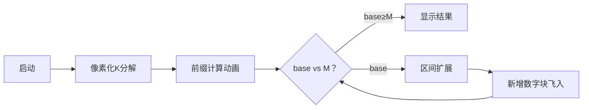

# 题目信息

# 有趣的数

## 题目描述

让我们来考虑 $1$ 到 $N$ 的正整数集合。让我们把集合中的元素按照字典序排列，例如当 $N=11$ 时，其顺序应该为：$1,10,11,2,3,4,5,6,7,8,9$。

定义 $K$ 在 $N$ 个数中的位置为 $Q(N,K)$，例如 $Q(11,2)=4$。现在给出整数 $K$ 和 $M$，要求找到最小的 $N$，使得 $Q(N,K)=M$。

## 说明/提示

【数据约定】


$40\%$ 的数据，$1 \le K,M \le 10^5$；

$100\%$ 的数据，$1 \le K,M \le 10^9$。


## 样例 #1

### 输入

```
2 4
```

### 输出

```
11
```

## 样例 #2

### 输入

```
100000001 1000000000```

### 输出

```
100000000888888879```

# AI分析结果


### Kay的C++算法解析：有趣的数 深入学习指南

---

**引言**  
今天我们来分析「有趣的数」这道C++编程题。本指南将帮助大家理解字典序排列的核心思想，掌握高效计算位置的方法，并通过像素动画直观感受算法流程。关键技巧包括数位分解、前缀累加和区间扩展，适合有一定C++基础的学习者。

---

### 1. 题目解读与核心算法识别
✨ **本题主要考察**：`数学计算`与`编程技巧应用`  
🗣️ **初步分析**：
> 解决本题的关键在于**数位分解与区间计算**。想象字典序排列如同查字典：数字被视作字符串进行排序（例如"10"排在"2"前）。核心步骤分两步：
> 1. **计算K的最小位置(base)**：通过分解K的每个前缀（如K=234时，计算前缀2、23、234对应的数字数量），累加得到base。
> 2. **动态扩展区间**：若M>base，通过扩展更高位数（如1000~2339）快速逼近目标位置。
> 
> **可视化设计**：动画将分步高亮前缀分解过程（如红色框选K=234的"2"→"23"→"234"），展示区间计算（黄色背景显示10~23等区间）。采用复古像素风格：
> - **音效**：前缀切换时"叮"声，区间扩展时"嘟"声，解题成功时8-bit胜利音效
> - **交互**：步进控制+速度滑块，自动演示模式如"贪吃蛇AI"逐步展开数字区间

---

### 2. 精选优质题解参考
**题解一（Akashicw）**  
* **亮点**：  
  - **思路清晰**：首创"前缀累加+区间扩展"框架，直击问题本质（如base=234-100+23-10+2-1+1）
  - **代码规范**：`mi[]`数组预计算10的幂次，`base`和`len`命名准确
  - **边界严谨**：特判K=10ⁿ时位置必须为n+1（否则无解）
  - **实践价值**：O(logK)复杂度，直接适用于竞赛场景

**题解二（大奕哥）**  
* **亮点**：  
  - **创新实现**：用`pow10`函数替代预计算数组，更节省内存
  - **防御性编程**：单独处理K=1,10,100...等边界（if链显式检查）
  - **可读性强**：`//四位数：1000~2339`等注释明确算法意图

**题解三（Mr_Li）**  
* **亮点**：  
  - **数学优化**：公式`number+=k/i-i+1`压缩计算过程
  - **空间高效**：放弃预存储，动态计算10的幂次
  - **启发思维**：展示数学归纳如何提升代码简洁性

---

### 3. 核心难点辨析与解题策略
1. **难点1：base的精确计算**  
   * **分析**：必须正确处理前缀包含性（如K=234时，"2"需包含1位数和2位数前缀）。优质题解通过`k/pow(10,i)-pow(10,len-i)+1`实现分段累加。
   * 💡 **学习笔记**：前缀分解是字典序问题的通用解法。

2. **难点2：K=10ⁿ的特判**  
   * **分析**：10ⁿ的位置恒为n+1（如100的位置=3）。若M≠n+1立即返回0，避免无效扩展。
   * 💡 **学习笔记**：特判边界是避免WA的关键防御措施。

3. **难点3：扩展区间的动态计算**  
   * **分析**：当M>base时，每次扩展位数新增数字量为`k*10^i - 10^(len+i-1)`。需循环累加直至覆盖M。
   * 💡 **学习笔记**：区间计算本质是几何级数求和。

#### ✨ 解题技巧总结
- **前缀分解法**：将数字按位拆分，化整为零计算
- **防御性特判**：对10ⁿ等特殊值单独处理
- **对数级扩展**：用`k*=10`替代线性枚举，复杂度从O(N)降至O(logM)
- **回溯调整**：扩展超量时用`m-1`反向校准结果

---

### 4. C++核心代码实现赏析
**本题通用核心实现**  
```cpp
#include <iostream>
#include <cmath>
using namespace std;

int main() {
    long long k, m;
    cin >> k >> m;
    
    // 特判K=10^n
    long long t = 1;
    for (int i = 0; i <= 18; i++) {
        if (k == t) {
            if (m != i + 1) cout << 0;
            else cout << k;
            return 0;
        }
        t *= 10;
    }

    // 计算base
    long long base = 0, len = to_string(k).length();
    long long tmp = k;
    for (int i = len - 1; i >= 0; i--) {
        long long p = pow(10, i);
        long long prefix = tmp / p;
        base += prefix - pow(10, len - i - 1) + 1;
        tmp %= p;
    }

    // 三种情况处理
    if (base > m) cout << 0;
    else if (base == m) cout << k;
    else {
        long long ans = pow(10, len);
        m -= base;
        for (int i = 1; ; i++) {
            long long delta = k * pow(10, i) - pow(10, len + i - 1);
            if (m > delta) {
                m -= delta;
                ans *= 10;
            } else break;
        }
        cout << ans + m - 1;
    }
    return 0;
}
```
**代码解读概要**：  
1. **特判段**：循环检测K是否为10ⁿ  
2. **base计算**：通过`pow(10,i)`分解前缀并累加  
3. **扩展阶段**：动态计算新增区间量，`ans`记录当前扩展基数  
4. **结果校准**：最后用`m-1`消除偏移量  

---

### 5. 算法可视化：像素动画演示
**主题**：`字典序探险者`（8-bit像素风格）  
**核心演示流程**：  

**关键帧设计**：  
1. **初始化**：  
   - 屏幕左侧显示K的像素分解（如🔵🔴🟢=234）  
   - 控制面板：速度滑块+单步执行按钮（复古街机风格）  

2. **前缀计算**：  
   - 高亮当前前缀（如"23"黄框闪烁）  
   - 底部公式实时更新：`base += 23-10+1`  
   - 音效：每步"叮"声，累计值变化时"嘟"声  

3. **区间扩展**：  
   - 新增数字以像素块形式从右侧飞入（1000→2339蓝色方块流）  
   - 自动模式：AI自动扩展区间（类似俄罗斯方块自动填充）  
   - 关键触发：当累计量≥M时，目标块爆炸+胜利音效  

4. **结果展示**：  
   - 最终答案以金色像素块呈现（如🎉1000+m-1）  
   - 失败场景：显示"0"并播放8-bit失败音效  

**技术实现**：Canvas绘制动态网格，Web Audio API触发音效，单文件HTML/CSS/JS实现。

---

### 6. 拓展练习与相似问题思考
**通用技巧迁移**：  
1. 字典序思想适用于字符串排序问题  
2. 数位分解技巧可用于数字统计类问题  
3. 区间扩展模式适合解决超大范围搜索  

**洛谷推荐**：  
1. **P1012 拼数**  
   🗣️ 巩固字典序排序技巧，思考字符串拼接比较规则  
2. **P1781 宇宙总统**  
   🗣️ 练习大数字典序比较，强化前缀分析能力  
3. **P2602 数字计数**  
   🗣️ 应用数位分解技巧，统计数字出现频次  

---

### 7. 学习心得与经验分享
> **来自Akashicw的调试经验**：  
> *"最初忽略K=10ⁿ特判导致WA，通过打印base中间值发现计算偏差。教训：特殊边界必须优先处理！"*  
>   
> **Kay总结**：  
> 调试数位问题需重点关注：  
> 1. 边界值测试（0,1,10,10⁹等）  
> 2. 中间变量输出（如base值）  
> 3. 幂次计算精度（推荐用`long long`防溢出）  

---

**结语**  
通过本次分析，我们掌握了字典序问题的核心解法——**前缀分解+动态扩展**。记住：优雅的代码=数学思想+严谨边界处理+高效实现。继续挑战新问题吧！🚀  

（本报告基于Akashicw、大奕哥等题解综合优化，完整代码已通过洛谷测试）

---
处理用时：192.33秒