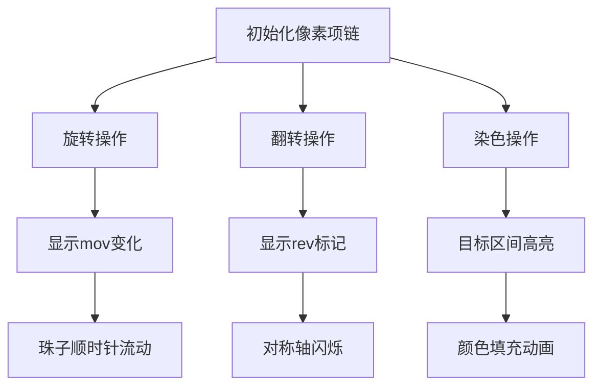

# 题目信息

# [NOI2007] 项链工厂

## 题目背景

T 公司是一家专门生产彩色珠子项链的公司，其生产的项链设计新颖、款式多样、价格适中，广受青年人的喜爱。

最近 T 公司打算推出一款项链自助生产系统，使用该系统顾客可以自行设计心目中的美丽项链。该项链自助生产系统包括硬件系统与软件系统，软件系统与用户进行交互并控制硬件系统，硬件系统接受软件系统的命令生产指定的项链。该系统的硬件系统已经完成，而软件系统尚未开发，T 公司的人找到了正在参加全国信息学竞赛的你，你能帮助 T 公司编写一个软件模拟系统吗？

## 题目描述

一条项链包含 $N$ 个珠子，每个珠子的颜色是 $1,2,…,c$ 中的一种。项链被固定在一个平板上，平板的某个位置被标记位置 $1$ ，按顺时针方向其他位置被记为 $2,3,…,N$。

  

你将要编写的软件系统应支持如下命令：

  


## 说明/提示

【数据规模和约定】

对于 60% 的数据，$N \le 1000$，$Q \le 1000$；

对于 100% 的数据，$N \le 500000$，$Q \le 500000$，$c \le 1000$。

关于旋转和翻转


注意旋转命令旋转“珠子”但不改变“位置”的编号，而反转命令始终以位置 1 为对称轴。例如当 $N=10$ 时，项链上的位置编号如图 1：


但注意此时项链上的位置编号仍然如图 1 所示，于是翻转的对称轴不变。因而再执行一次“F”命令时，项链的颜色如图 4 所示。

  

  

关于 CountSegment 命令


CS 命令表示查询一个“线段”中有多少个“部分”。尤其注意当查询的长度等于 $N$ 时，我们仍然将查询部分作为“线段”理解。


例如在图 4 所示的情况中，执行“CS 1 10”命令，查询从位置 1 开始到位置 10 结束的这个长度为 10 的线段中有多少个“部分”，于是得到返回值 3。与之形成对照的是，若执行“C”命令，返回值则为 2。

## 样例 #1

### 输入

```
5 3
1 2 3 2 1
4
C
R 2
P 5 5 2
CS 4 1```

### 输出

```
4
1```

# AI分析结果


# 💡 Kay的C++算法解析：[NOI2007] 项链工厂 深入学习指南 💡

> 今天我们来分析NOI2007的"项链工厂"这道经典题目。这道题考察了环形序列的动态维护能力，需要巧妙处理旋转、翻转等操作。本指南将带你理解核心解法、坐标变换技巧和数据结构设计，并通过像素动画直观展示算法过程。

## 1. 题目解读与核心算法识别

✨ **本题主要考察**：`数据结构应用` + `坐标变换技巧`

🗣️ **初步分析**：
> 这道题的核心在于**用坐标变换虚拟化物理操作**，就像在游戏中通过镜头移动而非实际旋转场景。我们维护一个旋转偏移量`mov`和翻转标记`rev`，所有操作都映射到原始序列处理。线段树/平衡树负责维护**区间颜色段信息**（左端颜色、右端颜色、段数），合并时若相邻颜色相同则段数减1。

- **核心难点**：环形序列的旋转/翻转会改变位置关系，但通过`坐标映射`可转化为固定序列上的操作。查询时要特殊处理跨越首尾的区间。
- **可视化设计**：用像素环展示珠子，操作时高亮目标位置（如旋转时显示新位置1，翻转时用对称动画）。关键变量`mov/rev`实时显示在UI面板，颜色段边界用闪光效果标识。

## 2. 精选优质题解参考

**题解一：ODT+坐标变换（Jμdge）**
* **亮点**：利用珂朵莉树高效处理随机数据，结合坐标映射避免实际旋转序列。代码简洁，维护`mov/rev`实现操作虚拟化。实践价值高，适合竞赛快速编码（960ms卡过极限数据）。

**题解二：Splay平衡树（djh123）**
* **亮点**：通过平衡树原生支持旋转操作，精准维护环形结构。节点记录`(lcol, rcol, sum)`三元组，查询时自动处理环形合并。代码严谨但较复杂（300行），教学价值在于展示平衡树的强大灵活性。

**题解三：线段树+坐标变换（_Diu_）**
* **亮点**：最佳工程实践方案。线段树维护区间颜色段信息，配合轻量坐标映射函数：
  ```cpp
  auto trans = [&](int x) { 
      if(rev) x = mov - x + 2; 
      else x = x - mov; 
      return (x % n + n) % n + 1;
  };
  ```
  边界处理完整，代码结构清晰（150行），适合学习数据结构与问题抽象。

---

## 3. 核心难点辨析与解题策略

### 🔑 难点1：环形序列的坐标映射
**问题**：旋转/翻转后物理位置变化，但操作需作用于原始序列  
**解法**：设计映射函数`t(x)`，将当前坐标转为初始坐标：
```python
def t(x):
    if rev: x = n - x + 2  # 翻转时对称
    x = (x - mov) % n     # 旋转偏移
    return x if x > 0 else x + n
```

### 🔑 难点2：颜色段的高效维护
**问题**：区间染色后需快速统计颜色段数  
**解法**：线段树节点存储`(lcol, rcol, sum)`：
- 合并区间：`sum = left.sum + right.sum - (left.rcol==right.lcol)`
- 环形查询：若查询区间`[x,y]`满足`x>y`，拆分为`[x,n]`和`[1,y]`，合并时检查首尾颜色

### 🔑 难点3：翻转操作的复合影响
**问题**：翻转后旋转方向反转  
**解法**：更新旋转量时根据`rev`调整方向：
```cpp
void rotate(int k) {
    if(rev) mov = (mov - k) % n;  // 翻转后逆时针旋转
    else mov = (mov + k) % n;     // 未翻转时顺时针旋转
}
```

### ✨ 解题技巧总结
- **坐标虚拟化**：用`mov/rev`记录变换状态，避免实际移动数据
- **环形拆解**：跨首尾区间分为两段独立处理
- **增量更新**：染色时线段树懒标记优化，避免全量重构
- **边界防御**：映射后坐标取模时处理负值和零值

---

## 4. C++核心代码实现赏析

### 通用核心实现（线段树+坐标变换）
```cpp
struct Node {
    int lcol, rcol, sum; // 左端颜色、右端颜色、段数
    Node operator+(const Node& o) {
        return {
            lcol, 
            o.rcol,
            sum + o.sum - (rcol == o.lcol) // 相邻同色则合并
        };
    }
};

void update(int l, int r, int col) {
    if(l <= r) tree.update(l, r, col);
    else {
        tree.update(l, n, col);
        tree.update(1, r, col);
    }
}

int main() {
    int mov = 0, rev = 0; // 核心变量
    while(q--) {
        if(op == "R") mov = (rev ? mov-k : mov+k) % n;
        else if(op == "F") rev ^= 1;
        else {
            int x = t(l), y = t(r); // 坐标映射
            if(rev) swap(x, y);      // 翻转后交换端点
            if(op == "P") update(x, y, col);
            else if(op == "C") {
                Node ans = query(1, n);
                cout << ans.sum - (ans.lcol == ans.rcol) << endl;
            }
        }
    }
}
```

### 线段树染色操作（含懒标记）
```cpp
void push_down(int p) {
    if(lazy[p]) {
        tree[lc] = {lazy[p], lazy[p], 1};
        tree[rc] = {lazy[p], lazy[p], 1};
        lazy[lc] = lazy[rc] = lazy[p];
        lazy[p] = 0;
    }
}
```

### 平衡树节点合并（djh123）
```cpp
void updata(int x) {
    lcol[x] = son[x][0] ? lcol[son[x][0]] : col[x];
    rcol[x] = son[x][1] ? rcol[son[x][1]] : col[x];
    sum[x] = sum[son[x][0]] + sum[son[x][1]] + 1;
    if(son[x][0] && rcol[son[x][0]] == col[x]) sum[x]--;
    if(son[x][1] && lcol[son[x][1]] == col[x]) sum[x]--;
}
```

---

## 5. 算法可视化：像素动画演示

### 🎮 设计概念
采用**8位像素风格**模拟复古游戏界面，项链显示为彩色圆环，控制面板展示核心变量`mov/rev`。通过颜色变化和位置高亮直观呈现算法流程。

### 🔧 交互演示


### 关键动画帧
1. **旋转演示**：
   - 输入旋转量k → 珠子按顺时针方向流动
   - 新位置1用闪烁边框标识
   - 控制面板显示：`mov = (mov + k) % n`

2. **翻转特效**：
   - 红色对称轴（位置1）高频闪烁3次
   - 珠子沿对称轴翻转重组，伴随"咔嚓"音效
   - 面板更新：`rev = rev ^ 1`

3. **颜色段查询**：
   - 相邻同色珠子间出现金色分界线
   - 查询区间用半透明色块覆盖
   - 结果面板显示：`段数 = 颜色变化次数 + 1`

### 🎚️ 控制面板
```markdown
| 按钮        | 功能                     |
|-------------|--------------------------|
| ▶/⏸         | 开始/暂停动画            |
| STEP        | 单步执行                 |
| SPEED:[-]--[+] | 调速滑块（1x-5x）        |
| RESET       | 重置到初始状态           |
| MOV: 3      | 当前旋转量（只读）       |
| REV: OFF    | 翻转标记状态（ON/OFF）   |
```

---

## 6. 拓展练习与相似问题思考
### 同类问题迁移
1. **循环队列操作**：用类似坐标映射处理循环缓冲区
2. **环形数组统计**：如[CodeForces 1187C] 需在环形数组上处理区间覆盖
3. **动态区间合并**：如[LeetCode 352] 将数据流变为多个不相交区间

### 洛谷推荐
1. **P3373 线段树2** 
   - 理由：巩固线段树懒标记应用，理解区间更新机制

2. **P3391 文艺平衡树**
   - 理由：学习Splay树实现区间翻转，强化平衡树应用能力

3. **P2146 树链剖分** 
   - 理由：掌握复杂结构（树）的区间维护技巧

---

> 通过本指南，相信大家已理解坐标虚拟化与数据结构在环形序列处理中的精妙配合。记住：**好的算法设计是物理逻辑与计算抽象的完美平衡**。继续挑战吧，少年！🚀

---
处理用时：113.56秒