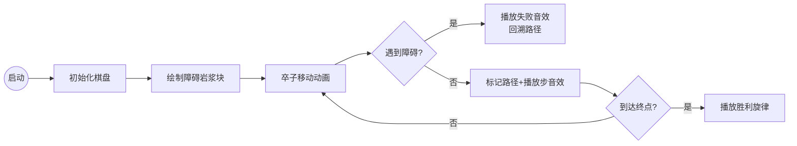

# 题目信息

# [THUPC 2019] 过河卒二

## 题目描述

> 首先我们回忆一下经典难题过河卒问题：
>
> 棋盘上 $A$ 点有一个过河卒，需要走到目标 $B$ 点。卒行走的规则：可以向上、或者向右。同时在棋盘上 $C$ 点有一个对方的马，该马所在的点和所有跳跃一步可达的点称为对方马的控制点，因此称之为「马拦过河卒」。
>
> 棋盘用坐标表示，$A$ 点 $(1,1)$ 、$B$ 点 $(N,M)$ ，同样马的位置坐标是需要给出的。
>
> 现在要求你计算出卒从 $A$ 点能够到达 $B$ 点的路径的条数，假设马的位置是固定不动的，并不是卒走一步马走一步。
>
> **请注意，上述背景内容与本题无关！**

Kiana 喜欢玩象棋，尤其是喜欢用象棋玩过河卒的游戏。在传统的过河卒问题中，Kiana 需要控制一个卒从起点走到终点，在路中避开一个对方的马的攻击，然后假装不会算并询问你从起点到终点的路径总数。

在今天的过河卒二游戏中，Kiana 还是控制一个卒在一个 $N\times M$ 的棋盘上移动，初始时卒位于左下方坐标为 $(1,1)$ 位置，但为了增加难度，Kiana 对游戏规则做出了一些修改。传统的过河卒每步只能向上或向右移动 $1$ 格，Kiana 规定自己的过河卒二还可以在一步中向右上方移动 $1$ 格，即如果当前卒位于坐标 $(x,y)$ 处，则下一步可以走到 $(x+1,y)$ 、$(x,y+1)$ 或 $(x+1,y+1)$ 中的任意一格里面去，同时 Kiana 认为，如果两种移动方案在某一步时卒移动的方向（右、上或右上）不同，则两种方案就是不同的，例如从 $(1,1)$ 先走到 $(1,2)$ 再走到 $(2,2)$ 、从 $(1,1)$ 先走到 $(2,1)$ 再走到 $(2,2)$ 和从 $(1,1)$ 直接走到 $(2,2)$ 是三种不同的移动方案。

其次，过河卒二的终点不再是一个特定的位置，Kiana 规定卒可以从棋盘的上方或右方走出棋盘，此时就视为游戏成功。注意在走出棋盘时仍然有方向选择的不同，例如若过河卒位于 $(1,M)$ 处，则下一步它可以向右或者向右上用两种方式走出棋盘，若过河卒位于 $(N,M)$ 处，则下一步它可以向上、向右或者向右上用三种方式走出棋盘，以不同的方式走出棋盘仍然被算作是不同的移动方案。

此外，对方马的攻击范围不再是有规律的几个位置，而是 Kiana 规定好的 $K$ 个特定坐标，并要求过河卒在移动的过程中不能走到这 $K$ 个坐标的任何一个上，在除这些坐标以外的位置上过河卒都可以按规则自由移动。

现在 Kiana 想知道，过河卒二有多少种不同的移动方案可以走出棋盘，这个答案可能非常大，她只想知道方案数对 $59393$ 取模后的结果。由于她不会算，所以希望由你来告诉她。


## 说明/提示

### 样例解释

用 $\uparrow$ 表示过河卒向上移动了一格，用 $\rightarrow$ 表示过河卒向右移动了一格，用 $\nearrow$ 表示过河卒向右上移动了一格，由此可以简化样例解释的表述。

$24$ 种移动方案如下：

$(\uparrow\uparrow\uparrow)$、$(\uparrow\uparrow\nearrow)$、$(\uparrow\uparrow\rightarrow\uparrow)$、$(\uparrow\uparrow\rightarrow\nearrow)$、

$(\uparrow\uparrow\rightarrow\rightarrow\uparrow)$、$(\uparrow\uparrow\rightarrow\rightarrow\nearrow)$、$(\uparrow\uparrow\rightarrow\rightarrow\rightarrow)$、$(\uparrow\nearrow\uparrow)$、

$(\uparrow\nearrow\nearrow)$、$(\uparrow\nearrow\rightarrow\uparrow)$、$(\uparrow\nearrow\rightarrow\nearrow)$、$(\uparrow\nearrow\rightarrow\rightarrow)$、

$(\rightarrow\rightarrow\rightarrow)$、$(\rightarrow\rightarrow\nearrow)$、$(\rightarrow\rightarrow\uparrow\rightarrow)$、$(\rightarrow\rightarrow\uparrow\nearrow)$、

$(\rightarrow\rightarrow\uparrow\uparrow\rightarrow)$、$(\rightarrow\rightarrow\uparrow\uparrow\nearrow)$、$(\rightarrow\rightarrow\uparrow\uparrow\uparrow)$、$(\rightarrow\nearrow\rightarrow)$、

$(\rightarrow\nearrow\nearrow)$、$(\rightarrow\nearrow\uparrow\rightarrow)$、$(\rightarrow\nearrow\uparrow\nearrow)$、$(\rightarrow\nearrow\uparrow\uparrow)$。

### 版权信息

来自 THUPC（THU Programming Contest，清华大学程序设计竞赛）2019。

题解等资源可在 <https://github.com/wangyurzee7/THUPC2019> 查看。

## 样例 #1

### 输入

```
3 3 1
2 2```

### 输出

```
24```

# AI分析结果


# 💡 Kay的C++算法解析：[THUPC 2019] 过河卒二 深入学习指南 💡

大家好，我是你们的算法导师Kay！今天我们来一起破解「过河卒二」这道趣味数学题。这道题看似复杂，但只要掌握组合数学和容斥原理的精髓，就能轻松解决。下面我会用清晰的语言和生动的比喻，带大家一步步攻克难题！

## 1. 题目解读与核心算法识别

✨ **本题主要考察**：`组合数学` + `容斥原理`

🗣️ **初步分析**：
> 想象卒子在一个巨大的像素棋盘上冒险，它有三种移动方式：右移（→）、上移（↑）、右上对角（↗）。这道题的核心就像在玩一个「路径规划游戏」，我们需要计算从起点(1,1)到终点(n+1,m+1)的所有可能路径（走出棋盘等价于到达终点），同时避开地图上的陷阱（障碍点）。

- **组合数学**就像计算不同舞蹈动作的编排方式：如果我们把卒的移动看作舞蹈，每个动作（右/上/对角）都是独特的舞步。通过枚举对角步数，再用组合数计算直线步数的排列方式，就能算出无障碍时的总路径数。
  
- **容斥原理**则像排除干扰项：当棋盘上有陷阱时，我们先计算所有路径，再减去经过陷阱的路径。但有些路径会重复经过多个陷阱，所以需要像整理错乱的毛线团一样，加上重复减去的部分，减去多加的部分...如此反复。

**可视化设计思路**：我们将制作一个复古像素游戏动画！卒子化身8-bit小骑士，移动时：
- 路径显示为绿色像素轨迹
- 障碍点变成红色岩浆块
- 每步移动伴随经典FC音效（→：滴，↑：嘟，↗：叮）
- 容斥过程用半透明路径演示（红色表减去，蓝色表加回）

## 2. 精选优质题解参考

从思路清晰度、代码规范性和算法效率等角度，我为大家精选了三条优质题解：

**题解一：huayucaiji（组合数学+状态压缩容斥）**
* **点评**：这位同学用"拆解舞步"的思路清晰解释了组合公式，将斜对角移动分解为独立步骤。代码中规整地预处理阶乘逆元，用状态压缩枚举所有障碍组合，再通过容斥系数(+/-1)巧妙加减路径。亮点在于完整推导了组合公式，并严谨处理了边界条件，代码可直接用于竞赛场景。

**题解二：Eznibuil（动态规划容斥）**
* **点评**：这位同学采用了"步步为营"的策略！通过动态规划递推，避免指数级枚举。核心思想是：计算到每个障碍点的纯净路径时，用总路径减去经过前面障碍的路径。代码简洁高效，时间复杂度优化到O(k²m)，是空间与时间的完美平衡。亮点在于用DP取代枚举，处理大K时优势明显。

**题解三：wwt100127（组合数学+状态压缩）**
* **点评**：这位同学提供了清晰的"地图标记法"。通过结构体存储排序后的障碍点，系统化预处理点间路径。状态压缩部分用位运算高效枚举子集，容斥时通过正负号切换实现加减。亮点在于代码模块化设计，障碍点排序和路径计算分离，便于调试理解。

---

## 3. 核心难点辨析与解题策略

### 难点1：三维移动的路径计算
**问题**：传统过河卒只有两种移动方式，加入斜对角移动后如何计算路径数？  
**解法**：将斜对角移动视为独立"跳跃"动作。设从(0,0)到(x,y)需要i次斜对角移动，则路径数为：  
$ \sum_{i=0}^{\min(x,y)} \binom{x+y-i}{i} \binom{x+y-2i}{x-i} $  
> 💡 **学习笔记**：第一个组合数选斜角步位置，第二个组合数排直线步顺序！

### 难点2：障碍点的容斥处理
**问题**：多个障碍点存在重叠路径，如何避免重复计数？  
**解法**：障碍点排序后（x优先y次之），用容斥原理：  
总路径 = 无障碍路径 - 单障碍路径 + 双障碍路径 - ...  
> 💡 **学习笔记**：容斥就像多层滤镜，逐层修正"路径视野"！

### 难点3：大数组合数取模
**问题**：n,m高达1e9时如何计算组合数模59393？  
**解法**：利用**Lucas定理**将大数分解为小组合数乘积：  
$ \binom{n}{m} \mod p = \prod \binom{n_i}{m_i} \mod p $ (n_i,m_i是p进制下的数字)  
> 💡 **学习笔记**：把大数拆成模数进制的小碎片，再组装！

### ✨ 解题技巧总结
- **坐标转换法**：将走出棋盘转化为到达(n+1,m+1)的路径
- **步数分离术**：把斜角步从直线步中分离计算
- **容斥递推式**：DP[i] = 到i的路径 - Σ(DP[j]×j到i路径)
- **模数分解术**：Lucas定理处理大组合数模小质数

---

## 4. C++核心代码实现赏析

### 本题通用核心C++实现
```cpp
#include <iostream>
#include <algorithm>
using namespace std;
typedef long long ll;
const int MOD = 59393;
const int MAXK = 25;

// 预处理阶乘和逆元
ll fac[MOD], invfac[MOD];
void init() {
    fac[0] = invfac[0] = 1;
    for(int i=1; i<MOD; ++i) fac[i] = fac[i-1]*i % MOD;
    for(int i=1; i<MOD; ++i) 
        invfac[i] = i==1 ? 1 : (MOD-MOD/i) * invfac[MOD%i] % MOD;
}

// Lucas定理求组合数
ll C(ll n, ll m) {
    if(m < 0 || m > n) return 0;
    if(n < MOD) return fac[n]*invfac[m]%MOD * invfac[n-m]%MOD;
    return C(n/MOD, m/MOD) * C(n%MOD, m%MOD) % MOD;
}

// 计算(0,0)到(x,y)的方案数
ll calcPath(int x, int y) {
    ll res = 0;
    int lim = min(x, y);
    for(int i=0; i<=lim; ++i) 
        res = (res + C(x+y-i, i) * C(x+y-2*i, x-i)) % MOD;
    return res;
}

int main() {
    init();
    int n, m, k;
    cin >> n >> m >> k;
    vector<pair<int, int>> points = {{1,1}}; // 起点
    
    for(int i=0; i<k; ++i) {
        int x, y; cin >> x >> y;
        points.push_back({x, y});
    }
    points.push_back({n+1, m+1}); // 终点
    
    // 按x排序，x相同按y排序
    sort(points.begin(), points.end());
    
    // dp[i]: 纯净路径到达points[i]的方案数
    vector<ll> dp(points.size(), 0);
    for(int i=0; i<dp.size(); ++i) {
        auto [x1, y1] = points[i];
        dp[i] = calcPath(x1-1, y1-1); // 转化为(0,0)计算
        
        for(int j=0; j<i; ++j) {
            auto [x2, y2] = points[j];
            if(x1 >= x2 && y1 >= y2) { // 确保路径单调
                ll paths = calcPath(x1-x2, y1-y2);
                dp[i] = (dp[i] - dp[j] * paths % MOD + MOD) % MOD;
            }
        }
    }
    cout << dp.back() << endl;
}
```

> **代码解读概要**：  
> 1. **预处理**：`init()`计算模意义下的阶乘和逆元  
> 2. **组合数工具**：`C()`用Lucas定理处理大组合数  
> 3. **路径计算**：`calcPath()`通过枚举斜角步数计算两坐标间方案  
> 4. **容斥DP**：`dp[i]`表示到第i点的纯净路径，通过减去前面障碍点的路径实现容斥  
> 5. **坐标转换**：起点(1,1)转化为(0,0)计算，终点设为(n+1,m+1)

---

### 优质题解片段赏析

**题解二核心片段（Eznibuil）**  
```cpp
for(int i=0; i<=k; i++) {
    dp[i] = calcPath(0, i); // 起点到i的总路径
    for(int j=0; j<i; j++) {
        if(points[j].x <= points[i].x && points[j].y <= points[i].y) {
            // 减掉经过j的路径
            ll paths = calcPath(points[i].x-points[j].x, points[i].y-points[j].y);
            dp[i] = (dp[i] - dp[j] * paths % mod + mod) % mod;
        }
    }
}
```
> **亮点**：用动态规划实现容斥，避免指数级枚举  
> **学习笔记**：DP方式像剥洋葱，层层剥离不纯路径！

**题解一核心片段（huayucaiji）**  
```cpp
for(int s=0; s<(1<<k); s++) {
    ll val = 1;
    int last = 0, sign = 1;
    for(int j=0; j<k; j++) if(s>>j&1) {
        val = val * path[last][j] % MOD;
        last = j; sign = -sign;
    }
    val = val * path[last][k] % MOD;
    ans = (ans + sign * val) % MOD;
}
```
> **亮点**：状态压缩枚举所有障碍组合  
> **学习笔记**：每个二进制位代表一个障碍，像开关控制路径组合！

---

## 5. 算法可视化：像素动画演示

### 像素冒险之旅：卒子的容斥大冒险
**主题**：8-bit风格棋盘，卒子化身像素骑士  
**核心演示**：从起点到终点的路径探索+容斥原理可视化  



**动画关键帧**：  
1. **棋盘初始化**（复古绿网格，红岩浆障碍，黄起点/蓝终点）  
2. **移动动画**：  
   - →：卒子右移，地面留下绿色箭头  
   - ↑：卒子上跳，地面留下黄色箭头  
   - ↗：卒子斜跳，地面留下紫色箭头  
   *（每步伴随8-bit音效）*  
3. **容斥演示**：  
   - 红色半透明路径：被减去的"错误路径"  
   - 蓝色闪烁路径：被加回的"补偿路径"  
4. **自动演示模式**：  
   - 速度滑块控制卒子移动速度  
   - "AI演示"按钮自动播放最优路径  

**技术实现**：  
```javascript
// 伪代码：绘制单步移动
function drawStep(from, to, type) {
    drawPixelArrow(from, to, color[type]); // 绘制箭头
    playSound(sound[type]);                 // 播放音效
    highlightCurrentPos(to);                // 高亮当前位置
}
```

---

## 6. 拓展练习与相似问题思考

### 相似问题迁移
组合数学+容斥原理是路径问题的黄金搭档！适用于：
1. 带障碍的网格路径计数（基础版）
2. 多维空间路径规划（进阶）
3. 有特殊移动规则的棋盘游戏（如象棋）

### 推荐练习（洛谷）
1. **P1176 路径计数2**  
   → *推荐理由：练习基础带障碍路径计数，巩固容斥原理*
2. **P1373 小a和uim之大逃离**  
   → *推荐理由：增加状态维度，学习DP与容斥结合*
3. **P1004 方格取数**  
   → *推荐理由：双路径交互问题，拓展思维维度*

---

## 7. 学习心得与经验分享

> **来自题解作者的经验**：  
> *"调试时发现，当障碍点不满足x/y单调时容斥会出错，必须严格排序！"*  
> *"Lucas定理中，当组合数m>n时要直接返回0，这是边界陷阱！"*

**Kay的总结**：  
1. **排序是容斥的前提**：就像整理书柜，必须先把障碍点按x/y排序才能正确计算路径  
2. **小模数大组合数**：Lucas定理中注意递归边界和模数分解  
3. **DP容斥优势**：当k>15时，优先选择DP容斥避免状态爆炸  

---

本次算法之旅就到这里啦！记住，编程就像冒险，组合数学是你的魔法剑，容斥原理是你的盾牌。多加练习，你一定能成为算法勇士！下次见~ 💪

---
处理用时：238.71秒