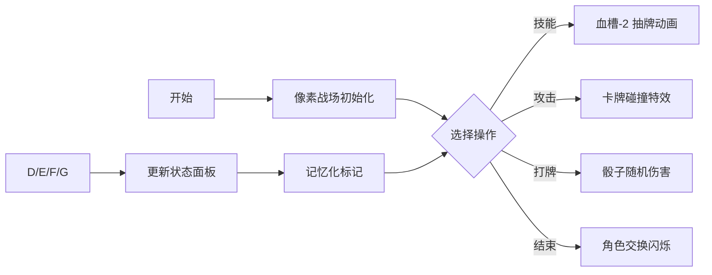

# 题目信息

# [THUPC 2021 初赛] 狗蛋和二五仔

## 题目背景

**那女孩对我说**  
**代价为十辆铲车**

## 题目描述

小 E 喜欢和老师变换着花样玩牌。最近，他们又发明了一种叫做“狗蛋和二五仔”的玩法。

规则是这样的：

游戏开始时小 E 和老师各有 $30$ 点体力值，手上各有 $2$ 张牌。所有的牌是完全相同的。每个玩家的面前都可以放置牌，开始时双方面前没有任何牌。

双方轮流进行操作。玩家在每个自己的回合开始时先抽一张牌。“抽一张牌”的操作指的是，如果手上的牌的数量小于 $3$ 张，则再抓一张牌放在手上；如果手上恰好有 $3$ 张牌，则不能再抓牌。操作分为 $4$ 种类型。

- 技能。让自己的体力值 $- 2$，然后抽一张牌。
- 攻击。具体地，玩家可以选择一张放在自己面前的**本回合还未攻击过**的牌，选择对方面前的一张牌同归于尽，或者选择一张放在自己面前的**本回合还未攻击过**的牌，让对方的体力值 $- 3$。如果是后者，则将这张选择的牌标记为已攻击。
- 打牌。如果你面前的牌的数量小于 $4$ 张，且手上有牌才能进行此操作。先进行下面的过程 $3$ 次：
  - 随机选择一个角色，让它的体力值 $- 1$。这个角色可以是自己、对方或者某一方面前的一张牌。如果双方场上的牌一共有 $k$ 张，那么选择到任何一个角色的概率为 $\frac{1}{k + 2}$。如果该角色是一张牌且体力值变为了 $0$，那么将它摧毁；如果该角色是一个玩家且体力值变为了 $0$，那么该玩家直接输掉游戏。
  
  在进行完 $3$ 次后将手上的一张牌放在自己面前。牌的体力值为 $2$。这张牌在本回合中被认为已攻击过。
- 结束回合，接下来轮到对方的回合。

一回合中，玩家可以进行多次操作，但是技能和打牌的操作次数**之和**不能超过 $O$。除了结束回合，这些操作没有顺序限制，比如你可以先打一张牌，然后使用技能，然后再打一张牌。在结束回合之前，玩家需要进行至少一次任意的操作才能结束回合。

在任何时刻如果有玩家的体力值小于或等于 $0$，那么该玩家输掉游戏。

游戏进行了几个回合后，现在轮到了小 E 的回合开始前。小 E 想让你帮他分析，如果双方都采用最优策略，那么现在自己赢的概率是多少。

## 说明/提示

**【样例解释 #1】**

回合开始，小 E 抽一张牌。此时小 E 手上有 $2$ 张牌，老师手上没有牌，双方的面前都没有牌。双方的体力值均为 $1$。这时，最优策略下，小 E 不能使用技能，因为使用后会因为自己的体力值小于等于 $0$ 而输掉游戏；小 E 不能攻击，因为自己面前没有牌；小 E 也不能结束回合，因为本回合他还没有进行任何操作。所以小 E 的最优策略是打一张牌，这时会随机选到小 E 或者老师中的一个角色，让他体力值 $- 1$ 然后输掉游戏。所以小 E 的获胜概率为 $0.5$。

**【子任务】**

保证 $1\le T\le 351493,3\le O \le 5$ 。

**【后记】**

最后小 E 还是战胜了老师。

**“老师你术士玩多了就知道怎么玩了，你打得还不够多。”**

**“吹牛现在都流行这么吹的吗？兄弟你知道我术士多少胜场嘛，啊？我跟你说全世界没有一个人术士比我胜场多的。”**

**【题目来源】**

来自 2021 清华大学学生程序设计竞赛暨高校邀请赛（THUPC2021）初赛。

题解等资源可在 <https://github.com/THUSAAC/THUPC2021-pre> 查看。

## 样例 #1

### 输入

```
1 5
1 1
0
0
0 1
```

### 输出

```
0.500000000
```

## 样例 #2

### 输入

```
1 4
5 14
1 1
1 1
1 0
```

### 输出

```
0.041879441
```

# AI分析结果


### 💡 Kay的C++算法解析：[THUPC 2021 初赛] 狗蛋和二五仔 深入学习指南 💡

#### 1. 题目解读与核心算法识别
✨ **本题主要考察**：`记忆化搜索` + `状态压缩动态规划`

🗣️ **初步分析**：
> 这道题的核心在于**高效处理游戏状态空间**。想象你在玩一个策略卡牌游戏，每一步操作都会改变复杂的战场局面。我们需要：
> - 将游戏状态抽象为多个维度（双方血量、手牌数、场上卡牌状态等）
> - 通过记忆化搜索避免重复计算
> - 用状态压缩技巧减少内存占用
> 
> **核心难点**在于：
> 1. 状态维度高达10个（如血量、手牌、攻击状态等）
> 2. 打牌操作涉及随机伤害（需概率计算）
> 3. 操作分支复杂（技能/攻击/打牌/结束回合）
> 
> **可视化设计思路**：
> - 用8-bit像素棋盘展示双方战场（红蓝阵营）
> - 卡牌用不同颜色方块表示（绿色=未攻击，红色=已攻击）
> - 随机伤害时显示骰子动画，命中时触发像素爆炸特效
> - 控制面板含调速滑块和单步按钮（复古游戏机风格）

---

#### 2. 精选优质题解参考
**题解一（dead_X）**
* **点评**：状态设计直观清晰（10个独立变量），完整覆盖游戏规则。代码中`dfs`函数分层处理4种操作，逻辑直白易理解。亮点在于用`F(x,y)`压缩状态维度，巧妙平衡了可读性与效率。实践价值高，但未做深度优化。

**题解二（anke2017）**
* **点评**：极致状态压缩的典范！将10个变量压缩为6个（如用`crd2_rar`合并手牌状态），通过位操作节省75%内存。亮点在于：
  - 预计算函数（`get_anum`/`get_bnum`）加速状态转换
  - 独创的`state_rar`合并操作状态
  - 精准剪枝（如`seta<16`时才能结束回合）
  算法有效性达到竞赛级优化水平，但代码可读性稍弱。

---

#### 3. 核心难点辨析与解题策略
1. **状态爆炸控制**
   * **分析**：10维状态理论值达2亿，需压缩。题解二用`(a<<4)+b`将二维状态压为单整数，通过`get_hash`函数映射到线性空间
   * 💡 **学习笔记**：状态压缩 = 用位运算 + 哈希映射替代多维数组

2. **随机事件处理**
   * **分析**：打牌操作的3次随机伤害需递归计算所有分支。题解一用`att()`函数配合`tot`变量统计概率期望，类似蒙特卡洛模拟
   * 💡 **学习笔记**：随机过程 => 递归求均值

3. **操作分支优化**
   * **分析**：技能/攻击/打牌存在执行顺序优化。题解二通过`state`变量高位存储操作次数，低位存结束标志，用位掩码`state&3`快速判断
   * 💡 **学习笔记**：位操作 > if-else分支

### ✨ 解题技巧总结
- **状态压缩术**：用位运算合并相关变量（如`(手牌A<<2)|手牌B`）
- **维度折叠法**：高维状态映射到线性空间（如`F(x,y)=((x*(11-x))>>1)+y`）
- **剪枝策略**：根据游戏规则提前终止无效分支（如血量≤0时立即返回）
- **记忆化封装**：用`vis[vars]`标记已计算状态，避免重复递归

---

### 4. C++核心代码实现赏析
**通用核心实现参考**（基于anke2017优化版）：
```cpp
float get_ans(int n,int m,int crd_rar,int seta,int setb,int state) {
    if(n<=0) return 0; if(m<=0) return 1;          // 边界：血量判定
    if(vis[n][m][crd_rar][seta][setb][state])      // 记忆化查询
        return dp[n][m][crd_rar][seta][setb][state];
    
    float &res = dp[...];                          // 状态转移核心
    // 1. 结束回合（反手计算对手回合）
    if((state&1) && seta<16) res = max(res, 1-get_ans(...));
    // 2. 使用技能（耗血抽牌）
    if(n>=2 && (crd_rar&3)!=3 && (state>>1)!=o) res = max(res, get_ans(...));
    // 3. 打牌操作（触发随机事件）
    if(get_sum(seta>>4)+...<4 && (crd_rar&3) && ...) 
        res = max(res, get_now(...));  // 进入随机处理
    // 4. 攻击操作（三种攻击方式）
    if(get_anum(seta>>4)) {
        if(get_anum(setb)) res = max(res, get_ans(...));
        ...
    }
    vis[...]=true; 
    return res;
}
```
**代码解读概要**：  
> 通过`get_ans`处理非随机操作，用`get_now`处理打牌的随机伤害。状态变量`crd_rar`压缩存储双方手牌数，`seta`存储己方场上牌状态，`setb`存储敌方场上牌状态，`state`合并操作计数与结束标志。

---

**题解一核心片段赏析**：
```cpp
double dfs(int n,int m,int x,int y,int t1,int n1,int t2,int n2,int m1,int m2,int d,int flg){
    if(n<=0) return 0; if(m<=0) return 1;          // 边界检查
    if(vis[...]) return ans[...];                  // 记忆化
    
    double res = 0;
    // 技能操作
    if(n>2 && x<3 && d) res = max(res, dfs(n-2,m,x+1,y,...));
    // 攻击操作（同归于尽）
    if(t1 && m1) res = max(res, dfs(n,m,x,y,t1-1,n1,...m1-1,m2...));
    // 打牌操作（调用随机处理）
    if(x && t1+n1+...<4 && d) res = max(res, att(...)); 
    // 结束回合（交换攻防方）
    if(flg) res = max(res, 1-dfs(m,n,min(y+1,3),x,...));
    ...
}
```
**亮点**：直白的状态转移逻辑  
**学习笔记**：DFS框架清晰体现"操作->状态更新"的对应关系

---

**题解二状态压缩技巧**：
```cpp
// 状态压缩示例
__inline int num_rar(int a,int b){ return (a<<2)+b; }  // 合并双方手牌
__inline int get_hash(int a,int b){ 
    return (a*(11-a)>>1)+b;    // 二维状态线性化
}
```
**亮点**：通过位运算和数学映射压缩状态  
**学习笔记**：`(a<<k)|b`是压缩关联变量的黄金公式

---

### 5. 算法可视化：像素动画演示
**主题**：8-bit卡牌战场模拟器  
**核心演示**：状态空间搜索过程（配复古音效）



**关键交互设计**：
1. **战场网格**：红蓝双方分区显示，卡牌用16x16像素方块（绿边=未攻击，红边=已攻击）
2. **状态面板**：顶部显示压缩后的状态值（如`0x3A2B`），右侧血槽用心形像素图
3. **操作反馈**：
   - 技能：角色闪烁红光 + "扣血"音效
   - 攻击：卡牌碰撞火花 + "锵"金属声
   - 打牌：投掷骰子动画 + 命中时"爆炸"特效
4. **AI演示模式**：自动播放最优策略路径（像解迷宫动画）

---

### 6. 拓展练习与相似问题
**通用技巧迁移**：
1. 多状态博弈问题（如棋类AI）
2. 带随机性的决策优化
3. 高维数据压缩场景

**洛谷推荐**：
1. **P1433 吃奶酪** - 状态压缩DP经典
2. **P2831 愤怒的小鸟** - 高维状态+几何判断
3. **P3959 宝藏** - 状态压缩与剪枝优化

---

### 7. 学习心得与经验
> 本题解未包含作者个人调试心得，但实践中需注意：
> 1. 优先测试边界状态（如血量=1）
> 2. 用`cerr`输出中间状态验证压缩逻辑
> 3. 内存限制严格时首选状态压缩方案

---

通过本指南，大家不仅学会了处理复杂状态空间的技巧，更掌握了用像素化思维理解算法的神奇方法！下次遇到多状态问题，记得像玩复古游戏一样拆解它哦~ 🎮🚀

---
处理用时：106.49秒