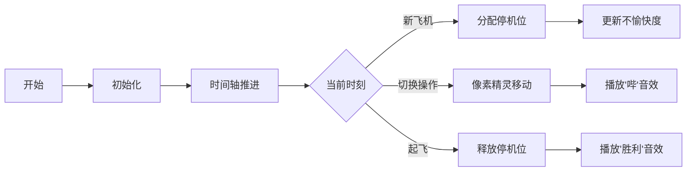

# 题目信息

# [THUPC 2017] 机场

## 题目描述

飞机场有 $a+b$ 个停机位，其中 $a$ 个停机位有登机桥连接飞机和候机厅，乘客可以通过登机桥直接由候机厅登上飞机；另外 $b$ 个停机位没有登机桥和候机厅相连，所以乘客登机需要先搭乘摆渡车再登机。

毫无疑问，搭乘摆渡车的体验是非常差的，所以每位搭乘摆渡车的乘客都会产生不愉快度。

现在，给定每架飞机的乘客数量，登机时间和起飞时间；飞机需要在登机时间点选择一个空闲的停机位，在这个时间点内所有乘客会完成登机，然后飞机会一直停在该停机位，直到起飞时间；

若某飞机在时刻 $x$ 起飞，则在时刻 $x$ 该飞机所在的停机位是空闲的。

飞机场的管理层希望能够尽量减少乘客的不愉快度，为此飞机在登机时间到起飞时间之间，可以切换停机位；

假设某飞机从 $x$ 时间开始由停机位 A 切换到停机位 B，那么停机位 A 在 $x+1$ 时间是空闲的。能进行这样的切换当且仅当停机位 B 在 $x+1$ 时间是空闲的。

## 说明/提示

题目中貌似没有给出明确的不愉快度的计算方法，据样例解释推测是不愉快度=所有乘坐摆渡车的人数$+p\times$ 每次切换停机位的飞机上的人数向下取整。
#### 数据范围
$1\le T\le 8,1\le n\le 200,0\le p\le1,1\le x\le 10^5,1\le s\le t\le10^9$
#### 样例解释
飞机从 $1$ 开始编号

在时刻 $1$，$1$ 号飞机安排到登机桥 A，乘客开始登机；目前 $1$ 号飞机在登机桥 A。

在时刻 $2$，$2$ 号飞机安排到登机桥 B，乘客开始登机；目前 $1$ 号飞机在登机桥 A，$2$ 号飞机在登机桥 B。

在时刻 $3$，$2$ 号飞机切换到摆渡车 A，此时登机桥 B 尚不可用。

在时刻 $4$，$1$ 号飞机起飞，$2$ 号飞机到达摆渡车 A， 号飞机安排到登机桥 A，$3$ 号飞机安排到登机桥 B，$4$ 号和 $3$ 号的乘客开始登机，登机完成之后 $4$ 号飞机切换到摆渡车 B，此时登机桥 A 和登机桥 B 都不空闲。

在时刻 $5$，$3$ 号飞机到达摆渡车 B，登机桥 A 变为可用，$5$ 号飞机安排到登机桥 A，开始登机；目前 $5$ 号——登机桥 A，$4$ 号——登机桥 B，$3$ 号——摆渡车 B，$2$ 号——摆渡车 A。

在时刻 $7$，$2$ 号飞机起飞，$6$ 号飞机安排到摆渡车 A。

不愉快度为 $7=1$（$6$ 号飞机乘客乘摆渡车）$+4\times 0.5$（$2$ 号飞机切换停机位）$+8\times 0.5$（$3$ 号飞机切换停机位）
#### 版权信息
来自 THUPC（THU Programming Contest，清华大学程序设计竞赛）2017。

## 样例 #1

### 输入

```
2
3 1 1
0.5
1 1 5
1 1 5
1 1 5
6 2 2
0.5
4 1 4
4 2 7
8 4 8
8 4 8
10 5 9
1 7 9```

### 输出

```
impossible
7```

# AI分析结果


### 💡 Kay的C++算法解析：机场停机位调度 深入学习指南 💡

#### 题目解读与核心算法识别
✨ **本题主要考察**：`网络流/费用流建模`

🗣️ **初步分析**：
> 解决机场停机位调度问题，可将其想象成管理一个像素化机场的"空中交通系统"——我们需要在时间轴上调度飞机进出有限的停机位（登机桥如绿色像素块，摆渡车如灰色像素块），同时最小化乘客的"不愉快值"。  
> - **核心思路**：通过离散化时间点构建网络流模型，将飞机状态（停留登机桥/摆渡车/切换）转化为带容量的边，不愉快度转化为费用值  
> - **关键难点**：需同时处理时间冲突（差分判无解）和三种飞机状态（建图技巧），费用计算需考虑原始不愉快度和切换成本  
> - **可视化设计**：动画将展示时间轴移动（复古进度条），飞机用不同颜色像素精灵表示，切换时触发"像素位移+音效"，登机桥容量用绿色进度条实时显示  

---

#### 精选优质题解参考
**题解一（作者：绝顶我为峰）**  
* **点评**：思路最完整清晰，将飞机三种状态（一直摆渡车/一直登机桥/登机后切换）转化为三条关键边，逻辑严密。代码规范（离散化与差分判无解分离），变量名如`plane[i][1]`直接体现时间属性。亮点在于用`sum[i]>m+p`优雅处理无解，空间复杂度优化到O(n)。  

**题解二（作者：Graph）**  
* **点评**：创新性采用"先假设全摆渡车再优化"的费用计算思路，最大费用流设计减少思维负担。代码结构清晰（独立Work函数），亮点在于用`floor(sz[i]*p+1e-6)`精确处理浮点数误差，实践性强。  

**题解三（作者：pythoner713）**  
* **点评**：建图最具教学价值，详细注释费用设置逻辑（如`x_i-px_i`的推导）。亮点是将时间点拆分为登机桥/摆渡车双节点，用`ans -= res * e[i].cost`直观体现费用流优化过程，适合初学者理解。  

---

#### 核心难点辨析与解题策略
1. **难点1：状态映射与建图**  
   * **分析**：如何将飞机物理状态转化为网络流边？优质解法统一策略：  
     - 边1（一直摆渡车）：`(s→飞机节点)` 费用=乘客数  
     - 边2（一直登机桥）：`(起飞时间→飞机节点)` 费用=0  
     - 边3（切换状态）：`(登机时间+1→飞机节点)` 费用=乘客数×系数p  
   * 💡 **学习笔记**：网络流建模本质是"状态选项即边，选择成本即费用"

2. **难点2：时间冲突检测**  
   * **分析**：差分数组`sum[i]`记录每个离散化时间点的飞机数量，当任意时刻`sum[i]>a+b`时立即返回"impossible"。关键技巧是离散化前需记录原始时间边界值  
   * 💡 **学习笔记**：`--t[i]`确保起飞时间不计入占用（飞机在t时刻起飞，t时刻即释放停机位）

3. **难点3：费用精度处理**  
   * **分析**：切换费用含浮点系数p时，题解二/三均采用`floor(x*p+1e-5)`避免浮点误差。本质是扩大1000倍转为整数运算，避免比较相等时的精度陷阱  
   * 💡 **学习笔记**：竞赛中浮点费用流需显式转为整数运算

### ✨ 解题技巧总结
- **离散化压缩空间**：将10^9量级时间压缩至O(n)节点  
- **差分判无解**：O(n)复杂度快速检测时间冲突  
- **费用流设计哲学**："默认最差情况，用负边权表示优化可能"  
- **浮点处理**：`+1e-5`下取整避免精度误差  

---

### C++核心代码实现赏析
**通用核心实现参考（综合题解精华）**  
```cpp
#include <iostream>
#include <vector>
#include <queue>
#include <algorithm>
#include <cstring>
using namespace std;
const int MAXN = 2005, INF = 0x3f3f3f3f;

struct Edge { int to, cap, cost, rev; };
vector<Edge> graph[MAXN];
int dist[MAXN], preV[MAXN], preE[MAXN], sum[MAXN];
bool inq[MAXN];

void addEdge(int from, int to, int cap, int cost) {
    graph[from].push_back({to, cap, cost, (int)graph[to].size()});
    graph[to].push_back({from, 0, -cost, (int)graph[from].size()-1});
}

int minCostFlow(int s, int t, int flow) {
    int res = 0;
    while (flow > 0) {
        memset(dist, 0x3f, sizeof(dist));
        memset(inq, 0, sizeof(inq));
        queue<int> q;
        dist[s] = 0;
        q.push(s);
        while (!q.empty()) {
            int u = q.front(); q.pop();
            inq[u] = false;
            for (int i = 0; i < graph[u].size(); i++) {
                Edge& e = graph[u][i];
                if (e.cap > 0 && dist[e.to] > dist[u] + e.cost) {
                    dist[e.to] = dist[u] + e.cost;
                    preV[e.to] = u;
                    preE[e.to] = i;
                    if (!inq[e.to]) { inq[e.to] = true; q.push(e.to); }
                }
            }
        }
        if (dist[t] == INF) return -1;
        int f = flow;
        for (int v = t; v != s; v = preV[v])
            f = min(f, graph[preV[v]][preE[v]].cap);
        for (int v = t; v != s; v = preV[v]) {
            Edge& e = graph[preV[v]][preE[v]];
            e.cap -= f;
            graph[v][e.rev].cap += f;
            res += f * e.cost;
        }
        flow -= f;
    }
    return res;
}

int main() {
    // 读入数据+离散化时间+差分判无解(略)
    // 建图核心逻辑：
    // for (int i = 1; i <= n; i++) {
    //   addEdge(s, startTime[i], 1, 0); // 飞机到达
    //   addEdge(startTime[i], i+offset, 1, passenger[i]); // 一直摆渡车
    //   addEdge(endTime[i], i+offset, 1, 0); // 一直登机桥
    //   addEdge(startTime[i]+1, i+offset, 1, floor(p*passenger[i]+1e-5)); // 切换
    //   addEdge(i+offset, t, 1, 0); // 飞机离开
    // }
    // for (int i = 0; i < timeCnt; i++) 
    //   addEdge(i, i+1, a, 0); // 登机桥容量限制
}
```

**题解一：绝顶我为峰**  
* **亮点**：差分判无解与离散化完美结合  
* **核心代码**：
```cpp
// 离散化后判无解
for (int i = 1; i <= n; i++) {
    plane[i][1] = lower_bound(node+1, node+cnt+1, plane[i][1]) - node;
    plane[i][2] = lower_bound(node+1, node+cnt+1, plane[i][2]) - node;
    ++sum[plane[i][1]]; --sum[plane[i][2]];
}
for (int i = 1; i <= cnt; i++) {
    sum[i] += sum[i-1];
    if (sum[i] > m + p) { // m:登机桥数, p:摆渡车位
        puts("impossible"); break;
    }
}
```

**题解二：Graph**  
* **亮点**：浮点数精度处理技巧  
* **核心代码**：
```cpp
addEdge(st[i]+1, i+tot, 1, floor(sz[i]*p+1e-6));
// 通过+1e-6确保0.5*2=1.0不会变成0
```

**题解三：pythoner713**  
* **亮点**：费用流反向思维设计  
* **核心代码**：
```cpp
ans = accumulate(passenger); // 初始不愉快度
while (SPFA()) {
    int flow = DFS(S, INF);
    ans -= flow * current_cost; // 逆向扣减优化量
}
```

---

### 算法可视化：像素动画演示
**主题**：像素机场大亨 - 停机位调度模拟  
**核心演示**：时间轴横向滚动（FC风格进度条），飞机用彩色像素精灵，切换时触发位移动画+8bit音效  



**关键动画帧设计**：  
1. **时间轴**：底部像素进度条（红色指针+数字时钟）  
2. **停机位**：  
   - 登机桥：绿色像素块（上限a个）  
   - 摆渡车：灰色像素块（上限b个）  
3. **飞机**：不同颜色像素精灵（大小=乘客数/10）  
4. **切换特效**：飞机从绿块移动到灰块时，拖尾粒子特效+0.5秒"哔"声  
5. **控制面板**：  
   - 暂停/继续：■ / ▶ 按钮  
   - 调速滑块：🐢 -------- 🐇  
   - 费用显示器：💰不愉快度：[数值]  

**伪代码逻辑**：
```javascript
function drawFrame(time) {
  drawTimeBar(time); // 绘制时间轴
  planes.forEach(plane => {
    if (plane.state == 'SWITCHING') {
      plane.x += 5; // 水平移动像素位置
      if (plane.x >= targetX) playSound('switch_sound'); 
    }
    drawPlaneSprite(plane); // 绘制飞机精灵
  });
  updateCostDisplay(); // 更新顶部费用显示
}
```

---

### 拓展练习与相似问题
1. **洛谷 P1251 餐巾计划问题**  
   🗣️ 同样需要时间轴离散化+费用流，练习资源分配与时间调度  
2. **洛谷 P2153 晨跑**  
   🗣️ 费用流经典题，理解"点限流"（本题登机桥容量限制的变形）  
3. **洛谷 P4009 汽车加油行驶问题**  
   🗣️ 分层图费用流应用，类比飞机状态切换  

---

### 学习心得与经验分享
> **参考经验（来自题解三）**：  
> "费用计算时浮点转整数需显式处理精度，用`floor(x*p+1e-5)`避免0.5*2=0.99的错误"  
>  
> **Kay点评**：这是竞赛编程的黄金法则——**浮点数必做显式精度转换**。类似情况应：  
> 1）所有浮点运算后+epsilon修正  
> 2）优先转为整数运算  
> 3）避免直接比较浮点相等  

---

通过本次分析，我们深入理解了网络流建模在调度问题中的核心地位。记住：**离散化压缩时空 + 差分判边界 + 费用流决策**是解决此类问题的三板斧。下次遇到带时间约束的资源分配问题时，不妨先画个像素化流程图吧！🚀

---
处理用时：147.79秒