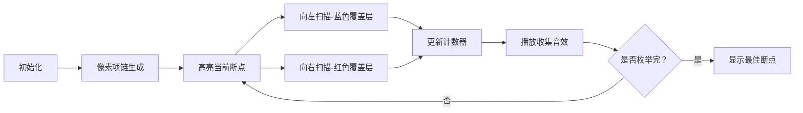

# 题目信息

# [USACO1.1] 坏掉的项链 Broken Necklace

## 题目描述

你有一条由 $n$ 个红色的，白色的，或蓝色的珠子组成的项链，珠子是随意安排的。 这里是 $n=29$ 的两个例子:

 

第一和第二个珠子在图片中已经被作记号。

图片 A 中的项链可以用下面的字符串表示：

`brbrrrbbbrrrrrbrrbbrbbbbrrrrb`

假如你要在一些点打破项链，展开成一条直线，然后从一端开始收集同颜色的珠子直到你遇到一个不同的颜色珠子，在另一端做同样的事(颜色可能与在这之前收集的不同)。 确定应该在哪里打破项链来收集到最大数目的珠子。

例如，在图片 A 中的项链中，在珠子 $9$ 和珠子 $10$ 或珠子 $24$ 和珠子 $25$ 之间打断项链可以收集到 $8$ 个珠子。

白色珠子什么意思?

在一些项链中还包括白色的珠子(如图片B) 所示。

当收集珠子的时候，一个被遇到的白色珠子可以被当做红色也可以被当做蓝色。

表现含有白珠项链的字符串将会包括三个符号 `r`，`b`，`w` 。

写一个程序来确定从一条被给出的项链可以收集到的珠子最大数目。

## 说明/提示

【数据范围】  
对于 $100\%$ 的数据，$3\le n \le 350$

题目翻译来自NOCOW。

USACO Training Section 1.1

## 样例 #1

### 输入

```
29 
wwwbbrwrbrbrrbrbrwrwwrbwrwrrb
```

### 输出

```
11```

# AI分析结果


### 💡 Kay的C++算法解析：坏掉的项链 深入学习指南 💡

**引言**  
今天我们一起分析"坏掉的项链"这道题。本题要求在一串环形项链中找到最佳断点，使收集到的同色珠子最多（白色可视为红/蓝）。本指南将帮你掌握核心算法、解题技巧，并通过生动的像素动画直观理解算法流程。

---

## 1. 题目解读与核心算法识别
✨ **本题主要考察**：`模拟与枚举`  
🗣️ **初步分析**：
> 解决本题的关键在于**模拟环形展开过程**和**高效枚举断点**。想象项链是一个可旋转的圆环，我们将其拉直为三倍长度的链条（防越界）。核心操作是：  
> - 对每个可能的断点，向左/右扫描收集同色珠子  
> - 遇到白色珠子时，根据相邻颜色动态适配（视为红或蓝）  
> - 用**三倍链技巧**处理环形结构，避免复杂边界判断  

在可视化方案中，我们将用**像素色块**动态展示：  
① 项链展开为像素链（红/蓝/白三色方块）  
② 高亮当前断点位置（闪烁箭头）  
③ 向左/右扫描时显示收集区域（半透明覆盖层）  
④ 白色珠子被"染色"时播放"滴答"音效  
> 设计采用**8位复古游戏风格**，自动演示时像"贪吃蛇"一样逐步展开扫描过程，每完成一次枚举播放不同音效提示。

---

## 2. 精选优质题解参考
**题解一（w_y_c）**  
* **点评**：思路清晰直白，通过三倍复制字符串巧妙处理环形结构。代码中`a=a+a+a`是亮点，避免了下标越界问题。对白色珠子的双重尝试（第26行）逻辑严谨，边界处理完整（`ans=min(ans,n)`）。变量命名规范（`f()`函数独立处理扫描），实践时可直接用于竞赛。

**题解二（青衫白叙）**  
* **点评**：创新性地用**状态变量**（a,b,w）实时统计左右长度，空间复杂度O(1)。核心亮点在状态转移（第15行）：当颜色变化时，用`ans=max(ans,a+b)`累积最大值，同时更新左右状态。代码极简但需要理解状态转移的数学本质，适合高阶学习者。

**题解三（田阙西）**  
* **点评**：采用**动态规划预处理**思路，先计算各点向左/右的红色/蓝色最大长度（`lR[]/lB[]/rR[]/rB[]`）。亮点在状态转移方程`ans=max(ans,max(lR[i],lB[i])+max(rR[i+1],rB[i+1]))`，效率O(n)。代码中强调数组越界问题（第24行注释），体现实践严谨性。

---

## 3. 核心难点辨析与解题策略
1. **难点：环形结构处理**  
   * **分析**：优质解法均采用**字符串复制法**（如三倍链），避免模运算下标混乱。物理意义是将圆环剪开拉直，枚举时从中间段开始（如`for(int i=n;i<2*n;i++)`）
   * 💡 **学习笔记**：环形问题复制扩展是通用技巧，如约瑟夫环、循环队列

2. **难点：白色珠子适配**  
   * **分析**：当断点为白色时，需分别尝试视为红/蓝（如题解一第23行）。动态规划解法中，白色会同时增加红/蓝的计数（`lR[i]=lR[i-1]+1, lB[i]=lB[i-1]+1`）
   * 💡 **学习笔记**：多状态可能性问题常需分支处理

3. **难点：避免重复计数**  
   * **分析**：左右扫描时需确保不重叠。题解二用`w`变量记录连续白色数，在颜色变化时通过`l=r-w`精确剥离重叠部分
   * 💡 **学习笔记**：统计类问题需定义清晰的计数边界

### ✨ 解题技巧总结
- **环形转线性**：复制字符串处理环形结构（通用技巧）
- **状态机优化**：用`(当前颜色, 连续数, 白色数)`减少扫描次数（参考题解二）
- **边界防御**：结果取`min(ans,n)`防止越界（如全同色情况）
- **预处理加速**：DP预处理各方向极值（空间换时间）

---

## 4. C++核心代码实现赏析
**本题通用核心实现**  
```cpp
#include <iostream>
#include <algorithm>
using namespace std;

int main() {
    int n, ans = -1;
    string s;
    cin >> n >> s;
    s = s + s + s; // 三倍链处理环形
    
    for (int i = n; i < 2 * n; i++) { // 枚举中间段
        if (s[i] == s[i+1]) continue;
        
        auto collect = [&](int pos, int step) {
            int cnt = 0;
            char color = s[pos];
            for (int j = pos; ; j += step) {
                if (s[j] == 'w' || s[j] == color) {
                    if (s[j] != 'w') color = s[j];
                    cnt++;
                } else break;
            }
            return cnt;
        };

        int cur = 0;
        if (s[i] == 'w') { // 白珠分支处理
            s[i] = 'r'; cur = max(cur, collect(i, -1) + collect(i+1, 1));
            s[i] = 'b'; cur = max(cur, collect(i, -1) + collect(i+1, 1));
            s[i] = 'w';
        } else {
            cur = collect(i, -1) + collect(i+1, 1);
        }
        ans = max(min(cur, n), ans); // 边界控制
    }
    cout << (ans == -1 ? n : ans);
}
```
**代码解读概要**：  
1. 三倍复制字符串处理环形  
2. Lambda函数`collect`封装双向扫描逻辑  
3. 白珠特殊处理：分别尝试红/蓝分支  
4. 结果取`min(cur,n)`防御越界

**题解一片段赏析**  
```cpp
for (int i = n; i < 2 * n; i++) {
    if (a[i] == a[i + 1]) continue;
    if (a[i] == 'w') {
        a[i] = 'r'; ans = max(ans, f(i));
        a[i] = 'b'; ans = max(ans, f(i));
        a[i] = 'w';
    }
    ans = max(ans, f(i));
}
```
**学习笔记**：  
- 跳过相同颜色断点（无意义分割）  
- 白珠双分支处理是核心创新点  
- `f(i)`封装扫描函数提升可读性

---

## 5. 算法可视化：像素动画演示  
**主题**：像素探险家在8位风格项链上寻找最佳断点  
**核心演示流程**：  

**关键交互设计**：  
1. **场景构建**：  
   - 35x10像素网格，每格代表1颗珠子（红🔴/蓝🔵/白⚪）  
   - 控制面板：开始/暂停/单步/速度滑块（复古旋钮UI）

2. **动态演示**：  
   - 断点闪烁（💥动画+蜂鸣音效）  
   - 向左扫描：蓝色半透明覆盖层，伴随"叮"声  
   - 向右扫描：红色覆盖层，"咚"声提示  
   - 白珠染色：像素色块渐变（白→红/蓝）+水滴音效

3. **游戏化元素**：  
   - 每完成5次枚举解锁新"关卡"（8位音效+星星⭐特效）  
   - 最佳断点发现时播放《超级玛丽》过关音乐  
   - 实时显示当前最优解（像素数字计数器）

**技术实现**：Canvas绘制网格+Web Audio API音效，单文件实现轻量化。

---

## 6. 拓展练习与相似问题思考
**通用技巧迁移**：  
环形复制技巧适用于：  
1. 环形数组最大子段和  
2. 循环队列实现  
3. 圆周上的动态规划  

**洛谷练习推荐**：  
1. **P1886 滑动窗口**  
   🗣️ 巩固环形展开技巧，学习单调队列优化  

2. **P1996 约瑟夫问题**  
   🗣️ 强化环形数据结构处理，引入数学优化  

3. **P1063 能量项链**  
   🗣️ 进阶环形DP，理解状态转移方程设计  

---

## 7. 学习心得与经验分享  
**参考经验**（来自题解作者）：  
> "我在处理白色珠子时卡了很久，后来通过**双重尝试法**（先试红色再试蓝色）才通过第三个测试点"  

**点评**：  
这是非常宝贵的调试经验！当问题存在**多分支可能性**时，暴力枚举所有分支往往比复杂逻辑更可靠。建议配合输出中间变量验证，如题解二中的状态跟踪表。

---

**结语**  
通过本指南，相信大家已掌握环形枚举的核心技巧。记住：复制展开是处理环形数据的银弹，而白珠分支处理体现了编程的严谨性。下次遇到类似问题，不妨尝试用像素动画辅助分析！💪

---
处理用时：103.82秒