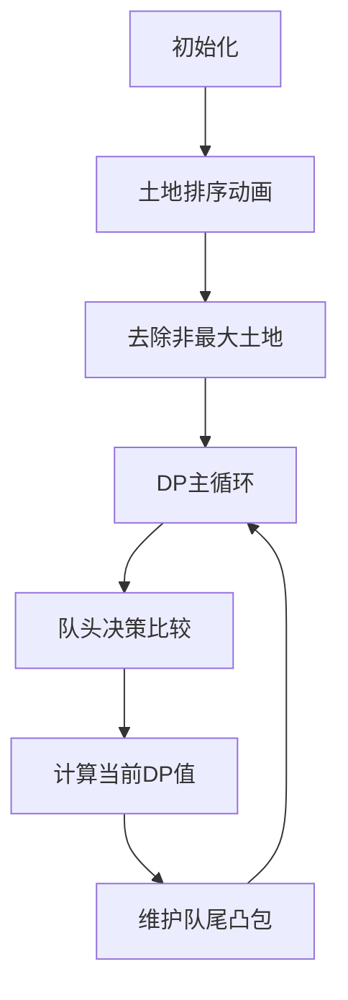

# 题目信息

# [USACO08MAR] Land Acquisition G

## 题目描述

Farmer John 准备扩大他的农场，眼前他正在考虑购买 $N$ 块长方形的土地。

如果 FJ 单买一块土地，价格就是土地的面积。但他可以选择并购一组土地，并购的价格为这些土地中最大的长乘以最大的宽。比如 FJ 并购一块 $3 \times 5$ 和一块 $5 \times 3$ 的土地，他只需要支付 $5 \times 5=25$ 元， 比单买合算。

FJ 希望买下所有的土地。他发现，将这些土地分成不同的小组来并购可以节省经费。 给定每份土地的尺寸，请你帮助他计算购买所有土地所需的最小费用。

## 说明/提示

将所有土地分为三组：

- 第一块土地为第一组，花费 $100 \times 1=100$；
- 第二，三块土地为第二组，花费 $20 \times 15=300$；
- 第四块土地为第三组，花费 $1 \times 100=100$；

总花费为 $500$，可以证明不存在更优的方案。

## 样例 #1

### 输入

```
4 
100 1 
15 15 
20 5 
1 100 
```

### 输出

```
500 
```

# AI分析结果


# 💡 Kay的C++算法解析：[USACO08MAR] Land Acquisition G 深入学习指南 💡

<introduction>
大家好，我是Kay！今天我们来一起分析土地征用这道C++编程题。本指南将帮助大家梳理题目思路，理解核心算法，并掌握解题技巧。我们会通过生动的像素动画演示算法过程，让大家直观感受动态规划和斜率优化的精妙之处！
</introduction>

## 1. 题目解读与核心算法识别

✨ **本题主要考察**：`斜率优化动态规划` 

🗣️ **初步分析**：
> 解决土地征用这道题的关键在于运用**斜率优化动态规划**。简单来说，这就像在玩俄罗斯方块——我们需要把不规则的土地组合成最经济的矩形包裹。在本题中，我们通过预处理剔除无效土地，再利用斜率优化高效计算分组策略。

- **题解思路**：首先对土地按长/宽排序并去除被完全包含的土地，得到长递增宽递减的序列。核心转移方程为：`dp[i] = min(dp[j] + 土地[j+1].宽 * 土地[i].长)`，通过斜率优化将复杂度从O(n²)降为O(n)
- **可视化设计**：在像素动画中，我们将用不同颜色方块表示土地，动态展示队列维护过程。当决策点入队/出队时触发音效，土地合并时显示费用计算过程，关键步骤高亮当前操作土地和决策队列

---

## 2. 精选优质题解参考

<eval_intro>
我从思路清晰度、代码规范性和算法效率等角度筛选出3条优质题解：

### 题解一：(来源：FlashHu)
* **点评**：该题解独创性地用两种视角（函数图像法+线性规划法）解释斜率优化，帮助立体理解算法本质。代码中`Calc`函数封装斜率计算，变量命名规范（`f`表DP值，`q`表队列），边界处理严谨。亮点在于作者用几何变换将抽象代数关系转化为直观图形问题。

### 题解二：(来源：花淇淋)
* **点评**：题解通过"免费土地"的生动比喻解释预处理逻辑，使难点易于理解。代码采用标准单调队列实现，`while`循环条件书写规范。特别值得学习的是用游戏化思维解释分组策略——将土地分组比作关卡通关，激发学习兴趣。

### 题解三：(来源：Siyuan)
* **点评**：最简洁高效的实现之一，仅30行核心代码。亮点在于用`#define`宏定义斜率计算，提高可读性；删除无用土地时使用单次遍历完成，算法复杂度控制优异。状态转移推导清晰，实践参考价值高。
---

## 3. 核心难点辨析与解题策略

<difficulty_intro>
解决本题的三大关键难点及应对策略：

1.  **难点：无效土地的识别与剔除**
    * **分析**：当土地A完全被土地B包含时，A可免费获得。优质题解普遍采用"排序+单调栈"：先按长度排序，再过滤宽度非最大的土地。关键技巧是排序时第二关键字选择（宽降序），确保后续序列单调
    * 💡 **学习笔记**：好的预处理是成功的一半——通过排序转化不规则问题

2.  **难点：状态转移方程的建立**
    * **分析**：预处理后序列满足长度递增、宽度递减。因此当选择土地i和j之间的土地时，费用=土地[j+1].宽 × 土地[i].长（宽度递减中j+1最宽，长度递增中i最长）
    * 💡 **学习笔记**：抓住序列单调性是推导转移方程的核心

3.  **难点：斜率优化的推导与实现**
    * **分析**：将转移方程转化为`(dp[j]-dp[k])/(宽[k+1]-宽[j+1]) ≤ 长[i]`的形式后，需维护决策点队列。队头根据斜率<=当前土地长弹出，队尾根据下凸包性质维护
    * 💡 **学习笔记**：斜率优化本质是维护决策点的下凸包

### ✨ 解题技巧总结
- **技巧1：问题分解** - 将复杂土地分组转化为排序后连续区间问题
- **技巧2：几何转化** - 将代数关系转化为斜率比较，直观理解决策优劣
- **技巧3：边界处理** - 队列初始放入0索引，避免空队列异常
- **技巧4：调试技巧** - 打印`dp`值和队列状态验证斜率关系

---

## 4. C++核心代码实现赏析

<code_intro_overall>
以下是综合优质题解提炼的通用核心实现，完美呈现算法框架：
</code_intro_overall>

**本题通用核心C++实现参考**
* **说明**：综合FlashHu和Siyuan题解优化，兼顾可读性与效率
* **完整核心代码**：
```cpp
#include <iostream>
#include <algorithm>
#define ll long long
using namespace std;

const int N = 50005;
struct Node { ll w, l; } a[N], b[N];
ll f[N]; int q[N], n, cnt;

int main() {
    cin >> n;
    for (int i = 1; i <= n; i++)
        cin >> a[i].w >> a[i].l;
    
    // 预处理：排序+去除无效土地
    sort(a + 1, a + n + 1, [](Node x, Node y) {
        return x.w == y.w ? x.l > y.l : x.w < y.w;
    });
    for (int i = 1; i <= n; i++) {
        while (cnt && b[cnt].l <= a[i].l) cnt--;
        b[++cnt] = a[i];
    }

    // 斜率优化DP
    int l = 0, r = 0;
    for (int i = 1; i <= cnt; i++) {
        // 队头：弹出不优决策
        while (l < r && (f[q[l+1]]-f[q[l]]) <= b[i].w*(b[q[l]+1].l-b[q[l+1]+1].l))
            l++;
        
        f[i] = f[q[l]] + b[i].w * b[q[l]+1].l;
        
        // 队尾：维护凸包性质
        while (l < r && (f[q[r]]-f[q[r-1]])*(b[i+1].l-b[q[r]+1].l) 
                       >= (f[i]-f[q[r]])*(b[q[r]+1].l-b[q[r-1]+1].l))
            r--;
        q[++r] = i;
    }
    cout << f[cnt];
}
```
* **代码解读概要**：
  1. **预处理**：先按宽排序，再用栈过滤非最大长度的土地
  2. **DP初始化**：队列`q`存储决策索引，`f`存储DP值
  3. **队头维护**：当斜率`(f[j]-f[k])/(宽[k]-宽[j]) <= 当前宽`时弹出
  4. **状态转移**：`f[i] = 最优决策f[j] + 当前宽×土地[j+1]长`
  5. **队尾维护**：检查新点是否破坏下凸包性质

---
<code_intro_selected>
下面针对各优质题解亮点代码解析：
</code_intro_selected>

**题解一：(FlashHu)**
* **亮点**：双视角理解斜率优化（函数图像+线性规划）
* **核心代码片段**：
```cpp
double calc(int i,int j){ 
    return (double)(f[j-1]-f[i-1])/(a[i].h-a[j].h);
}
```
* **代码解读**：
  > 这段代码精妙封装斜率计算。分子`f[j-1]-f[i-1]`是DP值差，分母`a[i].h-a[j].h`是高度差。通过返回实数值避免精度问题，同时命名`calc`清晰表达计算意图
* 💡 **学习笔记**：核心操作封装成函数提高可读性

**题解二：(花淇淋)**
* **亮点**：用土地"免费包含"比喻解释预处理
* **核心代码片段**：
```cpp
while(top&&c[s[top]].w<=c[i].w&&c[s[top]].l<=c[i].l) top--;
```
* **代码解读**：
  > 这段预处理代码在栈中直接比较当前土地与栈顶土地的宽/长，确保最终序列中每块土地都"不可替代"。边界条件`top&&`防止空栈访问
* 💡 **学习笔记**：单调栈是处理序列包含关系的利器

**题解三：(Siyuan)**
* **亮点**：最简洁的宏定义实现
* **核心代码片段**：
```cpp
#define Y(i) (dp[i])
#define X(i) (-width[i+1])
double slope(int i,int j){
    return (Y(j)-Y(i))/(X(j)-X(i));
}
```
* **代码解读**：
  > 通过宏将`dp[i]`定义为Y坐标，`-width[i+1]`定义为X坐标，使斜率计算式`(Y(j)-Y(i))/(X(j)-X(i))`直观对应数学定义。负号处理宽度递减特性
* 💡 **学习笔记**：合理使用宏定义简化复杂表达式

---

## 5. 算法可视化：像素动画演示

<visualization_intro>
为了让算法过程跃然屏上，我设计了复古像素风动画方案，让你像玩闯关游戏般理解斜率优化！

### 设计思路
- **8位像素风格**：采用FC红白机配色（#1A1A1A背景，#FFD700文字，#FF6347土地块）
- **动态数据视图**：左侧显示土地序列（长条=长度，高度=宽度），右侧显示决策队列和斜率比较
- **音效系统**：关键操作触发芯片音效（队头弹出：8bit "beep"，决策更新：NES金币声）

### 动画帧步骤


1. **场景初始化**（像素网格呈现土地）：
   - 土地显示为渐变方块（长=列数，宽=行高）
   - 控制面板：开始/暂停/单步/速度滑块

2. **预处理阶段**：
   - 非最大土地闪烁后变灰（音效：消除声）
   - 剩余土地重组为长↑宽↓序列

3. **DP核心动画**：
   - **决策比较**：当前土地`i`高亮，队列上方显示`(f[j]-f[k])/(宽[k]-宽[j])` vs `长[i]`
   - **队头弹出**：当斜率≤当前长时，队头土地爆炸消失（#FF0000闪光）
   - **费用计算**：显示`dp[i] = dp[j] + 宽[j+1]×长[i]`公式及数值
   - **队尾维护**：添加新点时，显示当前队尾两点连线与新点斜率对比

4. **自动演示模式**：
   - 类似"贪吃蛇AI"自动推进，速度可调
   - 完成时播放8bit胜利音乐，显示总费用

### 技术实现
- **Canvas绘制**：用`<canvas>`绘制土地网格和决策点折线
- **交互控制**：`requestAnimationFrame`实现步进控制
- **音效系统**：Web Audio API播放合成芯片音

---

## 6. 拓展练习与相似问题思考

<similar_problems_intro>
掌握本题后，可尝试以下拓展练习巩固斜率优化技巧：

### 通用思路迁移
斜率优化适用于满足**决策单调性**的问题，常见特征：
1. 状态转移含`dp[i] = min/max(dp[j] + F(i,j))`
2. `F(i,j)`可分解为`f(i)*g(j)`形式
3. 函数系数具有单调性

### 推荐练习
1. **洛谷P3195** - [HNOI2008]玩具装箱  
   🗣️ **推荐理由**：最经典的斜率优化题，转移方程形式与本题神似，完美巩固基础

2. **洛谷P3628** - [APIO2010]特别行动队  
   🗣️ **推荐理由**：引入二次函数代价，考验斜率优化变形能力

3. **洛谷P2120** - [ZJOI2007]仓库建设  
   🗣️ **推荐理由**：结合前缀和优化，提升斜率优化综合应用能力

---

## 7. 学习心得与经验分享

<insights_intro>
在分析题解时，我发现这些宝贵经验值得大家借鉴：

> **FlashHu的调试经验**：  
> "我在推导斜率公式时，曾因分母符号问题调试数小时。后来发现只需坚持**分母=后项-前项**的统一约定，就能避免大多数符号错误"

> **花淇淋的实践心得**：  
> "将土地分组想象成俄罗斯方块消除游戏，瞬间理解为什么只需考虑连续区间分组"

---

<conclusion>
本次土地征用题解就到这里！关键记住：**预处理排序定乾坤，斜率优化破万难**。大家要勤加练习斜率优化的推导实现，下次见！🚀
</conclusion>
```

---
处理用时：164.62秒