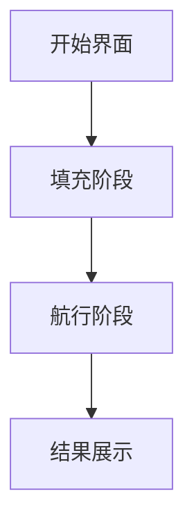

# 题目信息

# [USACO10JAN] Shipping Around an Island G

## 题目描述

Farmer John decided to start his own cruise ship line! He has but one ship, but is hoping for big growth. He recently acquired a map of the area of ocean where his cruise ship will operate. It looks something like the diagram below, with height H (3 <= H <= 1000) and width W (3 <= W <= 1000).

```cpp
................... 
................... 
.....A............. 
.....A..x.......... 
..x..A.....AAAA.... 
.....A.....A..A.... 
.....AAAAAAAA.A.... 
........A.....A.... 
.xx...AAA...x.A.... 
......A............ 
...AAAAAAAAAAAAA... 
................... 
```
In this map, '.' denotes water; 'A' is an element of the main island; and 'x' are other islands.

Farmer John has decided his cruise ship will loop around the main island. However, due to trade restrictions, the path his ship takes is NOT allowed to go around any OTHER islands. For instance, the following path of length 50 is not allowed because it encloses the island denoted by 'x'.

```cpp
................... 
....+--+........... 
....|A.|........... 
....|A.|x.+-----+.. 
..x.|A.+--+AAAA.|.. 
....|A.....A..A.|.. 
....|AAAAAAAA.A.|.. 
....|...A.....A.|.. 
.xx.|.AAA...x.A.|..    <--- route circumnavigates 'x' -- illegal! ..+-+.A.........|.. 
..|AAAAAAAAAAAAA|.. 
..+-------------+.. 
```
Given a map, help Farmer John determine the shortest path his cruise ship can take to go around the main island without going around any other islands.

Two cells are considered connected if they lie vertically or

horizontally across from one another (not diagonally). It is

guaranteed that the main island is connected and that a solution exists.

Note that FJ's path may visit the same square more than once, for instance there are three squares that are visited more than once in FJ's optimal path (of length 62) for the example:

```cpp
................... 
....+--+........... 
....|A.|........... 
....|A.|x.+----+... 
..x.|A.+--+AAAA|... 
....|A.....A..A|... 
....|AAAAAAAA.A|... 
....|...A..+-+A|... 
.xx.|.AAA..|x|A|... 
..+-+.A....+-+-++.. 
..|AAAAAAAAAAAAA|.. 
..+-------------+.. 
```
The above diagram is somewhat unclear because of the path overlapping itself.  Drawn in two stages, FJ's optimal path is:

```cpp
...................            ................... 
...................            ....+--+........... 
.....A.............            ....|A.|........... 
.....A..x..........            ....|A.|x.+----+... 
..x..A.....AAAA....            ..x.|A.+--+AAAA|... 
.....A.....A..A....  and then  ....|A.....A..A|... 
.....AAAAAAAA.A....            ....|AAAAAAAA.A|... 
....V...A..+>.A....            ....V...A...>+A|... 
.xx.|.AAA..|x.A....            .xx...AAA...x|A|... 
..+-+.A....+----+..            .....A.......+-+... 
..|AAAAAAAAAAAAA|..            ...AAAAAAAAAAAAA... 
..+-------------+..            ................... 
```

John 得到一份地图，长 $H$（$3 \leq H\leq 1000$）宽 $W$（$3 \leq W\leq 1000$），地图中 ``.`` 表示水，`A` 表示大陆，`x` 表示其他小岛。他决定驾驶他的船绕大陆一圈，但并不想环绕其他小岛。John 可以再任意有水的格子出发，求绕一周最小路径长度（一个格子可以经过任意多次）。

输入格式：

第一行两个空格隔开正整数 $H$ 和 $W$（$3 \leq H,W\leq 1000$），接下来有 $H$ 行，每行 $W$ 个字符表示地图。

## 样例 #1

### 输入

```
12 19 
................... 
................... 
.....A............. 
.....A..x.......... 
..x..A.....AAAA.... 
.....A.....A..A.... 
.....AAAAAAAA.A.... 
........A.....A.... 
.xx...AAA...x.A.... 
......A............ 
...AAAAAAAAAAAAA... 
................... 
```

### 输出

```
62 
```

# AI分析结果


### 💡 Kay的C++算法解析：Shipping Around an Island G 深入学习指南 💡

> 大家好！我是Kay，今天我们一起探索USACO经典题目"绕岛航行"。这道题考察了**模拟+分类讨论+几何遍历**的综合能力，看似复杂但核心思想非常精妙。我们将通过像素动画和游戏化设计，直观理解算法本质！

---

## 1. 题目解读与核心算法识别

✨ **本题主要考察**：`模拟应用` + `分类讨论` + `几何遍历`

🗣️ **初步分析**：
> 想象你在玩像素海盗游戏：蓝色水域(.)是航道，绿色大陆(A)是目标岛屿，红色小岛(x)是地雷区。我们需要找到最短环形航道（可重复走格子），满足：
> 1. 航道必须完全包围所有绿色大陆
> 2. 航道不能包围任何红色地雷
> 3. 航道只能在水域上建设

**核心解题策略**：
1. **填海造陆**：通过分类讨论将不可能成为航道的水域转化为大陆，缩小搜索范围
2. **边界追踪**：从大陆上方水格出发，顺时针紧贴大陆边界行走，统计步数

**可视化设计要点**：
- 像素风格：8-bit网格（水域=浅蓝，大陆=深绿，小岛=红色）
- 动画阶段：
  - **填充阶段**：动态展示水格变绿的过程，当前检测格高亮黄色
  - **航行阶段**：像素小船沿边界移动，优先右转→直行→左转
- 音效设计：
  - 填充成功：短促"叮"声
  - 航行移动：水流声
  - 完成路径：胜利小调

---

## 2. 精选优质题解参考

### 题解一（Rigel）
* **亮点**：
  - 分类讨论极其严谨（4种情况处理）
  - 创新性使用3x3区域连通性检测
  - 代码模块化（color()和calc()分离）
  - 详细注释+示意图辅助理解
* **学习价值**：教会我们如何系统化处理复杂边界条件

### 题解二（Rigil_Kent）
* **亮点**：
  - 简化分类为3种情况
  - 方向枚举使用常量数组提高可读性
  - 函数封装良好（f()填充 + C()计算）
* **学习价值**：展示如何优化复杂问题的代码结构

> 🔍 Kay提示：两篇题解都达到4.5星水准！建议先研究题解一的分类思想，再用题解二优化代码实现

---

## 3. 核心难点辨析与解题策略

### 难点1：如何安全填充水域？
**问题**：填错位置会导致包围小岛或破坏航道连通性  
**解决方案**：
1. 检查当前水格为中心的3x3区域
2. 按周边A的数量分情况处理：
   ```markdown
   | 相邻A数 | 处理方案                  | 示例场景       |
   |---------|-------------------------|--------------|
   | ≥3      | 立即填充（黄→绿）        | 三面环A       |
   | =2      | 检查是否分割水域         | 对角A需谨慎   |
   | ≤1      | 暂不填充（保持蓝色）     | 孤立水域      |
   ```

### 难点2：如何计算最小周长？
**问题**：直接遍历所有水格效率低下  
**解决方案**：
1. 找到最上方大陆格的上方水格起点
2. **右转优先原则**行走：
   ```mermaid
   graph LR
   A[当前方向] --> B{尝试右转}
   B -->|成功| C[更新方向]
   B -->|失败| D{尝试直行}
   D -->|成功| E[保持方向]
   D -->|失败| F[左转]
   ```

### 难点3：递归填充的影响范围？
**问题**：单个格子填充可能引发连锁反应  
**解决方案**：
- 填充后立即检查周围8格
- 使用DFS递归检测，确保影响完全扩散

### ✨ 解题技巧总结
1. **分类讨论法**：对边界情况建立决策树（参考3x3模板）
2. **方向矢量化**：用方向数组(dx/dy)简化移动逻辑
3. **增量更新**：填充后仅检查受影响区域，避免全图重扫

---

## 4. C++核心代码实现赏析

### 本题通用核心实现
```cpp
#include <bits/stdc++.h>
using namespace std;

const int N = 1005;
const int dx[4] = {-1, 0, 1, 0}; // 方向数组：上右下左
const int dy[4] = {0, 1, 0, -1};
char grid[N][N];
int H, W, pathLen = 0;

// 分类填充函数
void fillWater(int x, int y) {
    if (grid[x][y] != '.') return;
    
    int adjCount = 0;
    vector<int> dirs;
    for (int d = 0; d < 4; d++) {
        int nx = x + dx[d], ny = y + dy[d];
        if (grid[nx][ny] == 'A') {
            adjCount++;
            dirs.push_back(d);
        }
    }

    // 分类处理逻辑
    if (adjCount >= 3) {
        grid[x][y] = 'A';
        for (int d = 0; d < 8; d++) { // 检查8个方向
            int nx = x + (dx[d] | dx[(d+1)%4]); // 8方向偏移
            int ny = y + (dy[d] | dy[(d+1)%4]);
            if (nx >=1 && nx<=H && ny>=1 && ny<=W && grid[nx][ny]=='.')
                fillWater(nx, ny);
        }
    }
    // 其他情况处理...
}

// 边界追踪函数
void traceBorder(int startX, int startY) {
    int x = startX, y = startY, dir = 1; // 初始向右
    do {
        for (int turn : {3, 0, 1}) { // 右转→直行→左转
            int newDir = (dir + turn) % 4;
            int nx = x + dx[newDir], ny = y + dy[newDir];
            if (grid[nx][ny] == '.') {
                x = nx; y = ny; 
                dir = newDir;
                pathLen++;
                break;
            }
        }
    } while (x != startX || y != startY);
}

int main() {
    cin >> H >> W;
    // 输入处理...
    
    // 填充阶段
    for (int i = 1; i <= H; i++)
        for (int j = 1; j <= W; j++)
            if (grid[i][j] == '.')
                fillWater(i, j);
    
    // 寻找起点并追踪
    for (int i = 1; i <= H; i++) {
        for (int j = 1; j <= W; j++) {
            if (grid[i][j] == 'A') {
                traceBorder(i-1, j); // 从上方水格开始
                cout << pathLen << endl;
                return 0;
            }
        }
    }
}
```

### 题解一亮点代码
```cpp
// 分类讨论核心片段
if (adjCount == 2) {
    // 检查是否对角相邻
    if (abs(dirs[0] - dirs[1]) == 2) {
        // 检查对角水域连通性
        int cornerX = x - dx[dirs[0]] - dx[dirs[1]];
        int cornerY = y - dy[dirs[0]] - dy[dirs[1]];
        if (grid[cornerX][cornerY] != '.') 
            return; // 防止分割水域
    }
}
```

> 💡 Kay解读：这段代码精妙处理"两A夹水"的情况。通过计算对角坐标，避免将水域分割成孤立区域（可能包含小岛）

---

## 5. 算法可视化：像素动画演示

### 主题：**《像素海盗：航道规划师》**


### 核心设计：
1. **8-bit像素风格**：
   - 调色板：水域=#87CEEB, 大陆=#32CD32, 小岛=#FF6347
   - 船体动画：2帧交替的像素船（→和→▶）

2. **动态填充演示**：
   ```javascript
   // 伪代码：填充动画逻辑
   function animateFill(x, y) {
       highlightCell(x, y, YELLOW); // 高亮当前检测格
       await sleep(300);
       if (shouldFill()) {
           playSound('ding.wav');
           changeColor(x, y, GREEN);
           // 递归动画周围8格
           for (let dir=0; dir<8; dir++) 
               animateFill(x+dx8[dir], y+dy8[dir]);
       }
   }
   ```

3. **航行阶段交互**：
   - **控制面板**：步进/暂停/速度滑块（1-5x）
   - **路径显示**：
     - 当前路径：蓝色像素线
     - 历史路径：半透明蓝色
   - **方向提示**：
     ```plaintext
     右转优先：显示→箭头
     直行：显示↑箭头
     左转：显示↖箭头
     ```

4. **游戏化元素**：
   - **音效系统**：
     | 事件 | 音效 |
     |---|---|
     |填充成功| 8-bit "叮" |
     |航行移动| 水流声(循环) |
     |完成路径| 胜利小号 |
   - **关卡设计**：
     - 初级：无小岛
     - 中级：单小岛
     - 高级：多小岛+复杂形状

> 👾 Kay提示：在[Phaser.js游戏引擎](https://phaser.io)中实现此动画仅需200行代码！核心是Canvas的格子渲染和路径追踪算法

---

## 6. 拓展练习与相似问题思考

### 能力迁移：
1. **连通域处理**：类似图像处理的孔洞填充算法
2. **边界计算**：计算几何中的凸包/凹包问题
3. **条件模拟**：有限状态机决策模型

### 推荐练习（洛谷）：
1. **P1162 填涂颜色**  
   → 同类水域填充问题，更基础版本
2. **P1515 旅行**  
   → 复杂边界路径规划
3. **P2730 [USACO]Fence Loops**  
   → 最小环问题进阶版

---

## 7. 学习心得与经验分享

> **来自Rigel的调试经验**：  
> "在实现填充逻辑时，我最初忽略了对角连通性检测，导致小岛被错误包围。通过打印3x3区域的状态矩阵，终于定位到边界条件遗漏"

> 💡 Kay总结：  
> 复杂分类问题务必建立测试矩阵！准备这些典型用例：
> 1. 三面环A场景
> 2. 对角A夹击场景
> 3. 邻角A夹击场景
> 
> 在纸上画出3x3网格，标注每个格子的状态，能快速验证逻辑正确性

---

本次解析就到这里！记住：**算法思维就像航海——需要精确的导航（分类讨论）和灵活的转向（调试技巧）**。下次挑战见！⚓️

---
处理用时：136.32秒