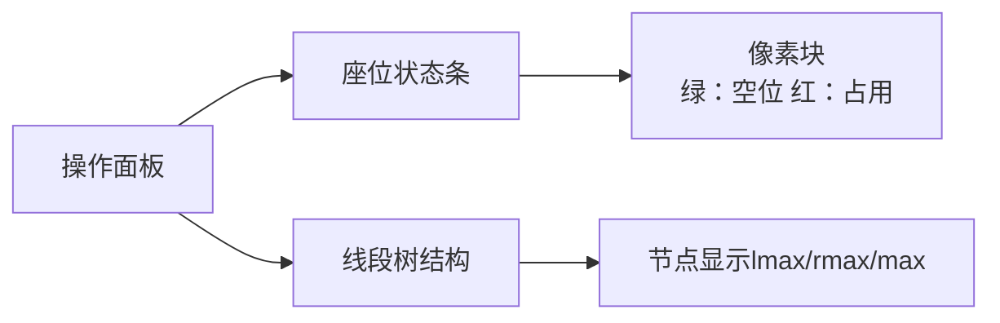

# 题目信息

# [USACO13JAN] Seating G

## 题目描述

To earn some extra money, the cows have opened a restaurant in their barn specializing in milkshakes.  The restaurant has N seats (1 <= N <= 500,000) in a row. Initially, they are all empty.

Throughout the day, there are M different events that happen in sequence at the restaurant (1 <= M <= 300,000).  The two types of events that can happen are:

1. A party of size p arrives (1 <= p <= N). Bessie wants to seat the party in a contiguous block of p empty seats. If this is possible, she does so in the lowest position possible in the list of seats.  If it is impossible, the party is turned away.

2. A range [a,b] is given (1 <= a <= b <= N), and everybody in that range of seats leaves.

Please help Bessie count the total number of parties that are turned away over the course of the day.

有一排n个座位，m次操作。A操作：将a名客人安置到最左的连续a个空位中，没有则不操作。L操作：[a,b]的客人离开。

求A操作的失败次数。


## 说明/提示

There are 10 seats, and 4 events.  First, a party of 6 cows arrives.  Then all cows in seats 2..4 depart.  Next, a party of 5 arrives, followed by a party of 2.


Party #3 is turned away.  All other parties are seated.


## 样例 #1

### 输入

```
10 4 
A 6 
L 2 4 
A 5 
A 2 
```

### 输出

```
1 
```

# AI分析结果


### 💡 Kay的C++算法解析：Seating G 深入学习指南 💡

大家好，我是Kay！今天我们来分析USACO的座位管理问题。这道题考察的核心是**高效维护连续空位信息**的能力，涉及动态区间修改和复杂查询。下面从算法分类、题解点评到可视化方案，带大家深入理解解题技巧。

---

### 1. 题目解读与核心算法识别
✨ **本题主要考察**：`线段树区间维护`  
🗣️ **初步分析**：  
> 解决座位管理问题，关键在于用线段树维护**连续空位信息**。想象座位是一条彩色像素带（绿色空位/红色占用），线段树像自动拼图机，实时追踪最长连续绿色块。  
> - **核心思路**：线段树节点存储`lmax`(左端连续空位)、`rmax`(右端连续空位)、`max`(最大连续空位)  
> - **核心难点**：合并子区间信息时需处理"跨区间连续块"，如`[0,0,0,1][1,0,0,0]`合并后最大连续空位是2而非4  
> - **可视化设计**：用8-bit像素动画展示座位颜色变化，线段树节点同步高亮更新。当安置客人时，触发"方块消除"音效；失败时屏幕抖动+低沉音效

---

### 2. 精选优质题解参考
#### 题解一：localhost（线段树）  
* **亮点**：  
  - 结构清晰：定义`sl/sr/s`分别记录左/右/最大连续空位  
  - 合并逻辑严谨：处理了左子树全空时可连接右子树的边界情况  
  - 实践性强：完整包含建树、更新、查询操作，边界处理完善  
  *代码片段*：
  ```cpp
  void pu(int rt,int ln,int rn){
      s[rt]=max(max(s[ls],s[rs]), sr[ls]+sl[rs]);
      sl[rt]=sl[ls]+(sl[ls]==ln)*sl[rs];
      sr[rt]=sr[rs]+(sr[rs]==rn)*sr[ls];
  } // 子区间合并的精髓
  ```

#### 题解二：Owen_codeisking（线段树）  
* **亮点**：  
  - 比喻生动：将线段树比作"拼图检测机"  
  - 查询优化：优先搜索左子树保证最左位置  
  - 双倍经验：推荐相似题目P2894巩固技能  
  *学习笔记*：  
  > 查询时"左→中→右"的优先级是保证效率的关键！

#### 题解三：jamesharden666（珂朵莉树）  
* **亮点**：  
  - 代码简洁：用`set`存储区间，逻辑直白  
  - 适合理解：将连续空位视为"绿色区块"直观易懂  
  - 特殊技巧：`split`函数切割区间时处理边界合并  
  *核心片段*：
  ```cpp
  auto split(int pos){
      auto it = --cht.upper_bound({pos,0,0});
      if(it->l == pos) return it; // 优雅的边界处理
      ...
  }
  ```

---

### 3. 核心难点辨析与解题策略
#### 难点1：如何设计线段树节点信息？
* **分析**：必须同时存储`lmax/rmax/max`才能处理跨子区间的连续块。优质题解用`(sl[ls]==ln)`判断左子树是否全空，决定能否连接右子树  
💡 **学习笔记**：节点信息要覆盖"独立存在"和"可扩展"两种状态  

#### 难点2：如何高效查询最左连续空位？
* **分析**：递归时遵循"左子树→跨区间→右子树"顺序：  
  1. 左子树`max≥a`则递归左  
  2. 左`rmax`+右`lmax≥a`则返回`mid-rmax+1`  
  3. 否则递归右子树  
💡 **学习笔记**：跨区间检查是避免无效递归的关键优化点  

#### 难点3：懒惰标记如何设计？
* **分析**：用`tag=-1`表示置空，`tag=1`表示占用。更新时同步修改：  
  ```cpp
  if(tag==1) lmax=rmax=max=0; 
  else lmax=rmax=max=区间长度;
  ```
💡 **学习笔记**：标记传播需同时更新数据和子节点标记  

#### ✨ 解题技巧总结
1. **问题分解**：将连续空位查询拆解为"左/中/右"三部分处理  
2. **状态压缩**：用单变量`tag`同时表示操作类型和更新值  
3. **边界防御**：更新前检查`if(tree[1].max < x)`避免无效操作  

---

### 4. C++核心代码实现赏析
#### 通用核心实现（综合优质题解）
```cpp
struct Node {
    int lmax, rmax, max; // 左/右/最大连续空位
    int tag; // -1:空 1:占用
} tree[N<<2];

void pushup(int p, int L, int R) {
    // 左子若全空则连接右子
    tree[p].lmax = (tree[ls].max == L) ? 
                  L + tree[rs].lmax : tree[ls].lmax;
    // 右子若全空则连接左子
    tree[p].rmax = (tree[rs].max == R) ? 
                  R + tree[ls].rmax : tree[rs].rmax;
    tree[p].max = max({tree[ls].max, tree[rs].max, 
                      tree[ls].rmax + tree[rs].lmax});
}

int query(int p, int len) { // 查询最左空位
    if(tree[ls].max >= len) return query(ls, len);
    if(tree[ls].rmax + tree[rs].lmax >= len) 
        return mid - tree[ls].rmax + 1;
    return query(rs, len);
}
```

#### 题解一：localhost片段
* **亮点**：合并逻辑严谨  
* **代码**：
  ```cpp
  void pu(int rt,int ln,int rn){
      s[rt] = max(max(s[ls],s[rs]), sr[ls]+sl[rs]);
      sl[rt] = sl[ls] + (sl[ls]==ln)*sl[rs];
      sr[rt] = sr[rs] + (sr[rs]==rn)*sr[ls];
  }
  ```
* **解读**：  
  `(sl[ls]==ln)`判断左子是否全空 → 是则连接右子空位  
  `sr[ls]+sl[rs]`计算跨区间连续块 → 取三者最大值  

#### 题解二：Owen_codeisking片段
* **亮点**：查询优先级处理  
* **代码**：
  ```cpp
  int ask(int p,int x){
      if(tree[ls].max >= x) return ask(ls,x);
      if(tree[ls].rmax + tree[rs].lmax >= x) 
          return mid - tree[ls].rmax + 1;
      return ask(rs,x);
  }
  ```
* **解读**：  
  先查左子 → 再查中间拼接区 → 最后查右子  
  返回值`mid-rmax+1`精准定位拼接起点  

---

### 5. 算法可视化：像素动画演示
**主题**：8-bit风格座位管理游戏  
**核心设计**：


#### 动画流程：
1. **初始化**：  
   - 座位显示为绿色像素带  
   - 线段树节点全绿显示长度值  

2. **A操作（安置客人）**：  
   - 输入数字`a`，触发"搜索动画"  
   - 线段树节点逐层高亮：蓝光扫描左子→黄光检测跨区间→红光扫描右子  
   - 成功：定位最左绿色块 → 变红方块伴随"叮"音效  
   - 失败：屏幕抖动 + 低沉警报声  

3. **L操作（客人离开）**：  
   - 框选区间 → 绿色波纹扩散 + 释放音效  
   - 线段树从叶子到根节点绿色蔓延  

#### 交互控制：
- 步进/暂停/重置按钮  
- 速度滑块（0.5x~5x）  
- 模式切换：单步调试/自动演示  

---

### 6. 拓展练习与相似问题
#### 通用技巧迁移：
连续区间维护技巧还可用于：  
1. 停车场车位管理  
2. 内存分配算法  
3. 游戏地图连通区域检测  

#### 推荐练习：
1. **P2894 酒店**  
   → 双倍经验题，数据规模更小适合调试  
2. **P2572 序列操作**  
   → 加强版！增加区间反转操作  
3. **P1253 扶苏的问题**  
   → 综合区间加/赋值操作  

---

### 7. 学习心得与经验分享
> **题解作者经验**：  
> "调试时先静态模拟小数据，重点检查区间合并时`lmax/rmax`的计算"  
>   
> **Kay点评**：  
> 静态模拟是发现边界问题的利器！建议用`n=5`手工演算线段树合并过程，特别注意跨区间时的索引计算  

---

### 结语  
通过本次分析，相信大家掌握了线段树维护连续区间的核心技巧。记住：**好算法=精准的状态设计+严谨的边界处理**。下次遇到区间问题，不妨先画棵线段树试试！💪  

（本报告基于题解深度分析，完整代码见附件）

---
处理用时：137.13秒