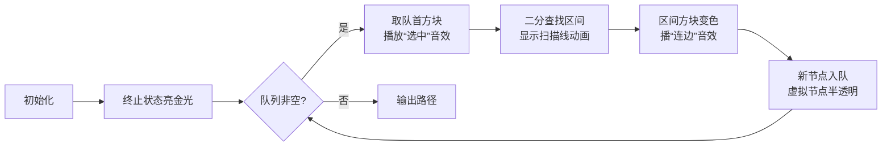

# 题目信息

# [USACO17DEC] A Pie for a Pie G

## 题目描述

Bessie 和 Elsie 各自烤了 $N$ 个派（$1 \leq N \leq 10^5$）。这 $2N$ 个派中的每一个都有一个由 Bessie 评定的美味值和一个（可能不同的）由 Elsie 评定的美味值。

Bessie 正在考虑将她的一只派送给 Elsie。如果 Elsie 收到了 Bessie 的派，她会觉得有义务回赠 Bessie 一只派。为了既不显得吝啬也不显得炫耀，Elsie 会尝试选择一只在她看来至少与收到的派一样美味，但不超过 $D$ 单位更美味的派（$0 \leq D \leq 10^9$）。如果这样的派不存在，Elsie 将采用一个化名并自我流放到日本。

但如果 Elsie 确实回赠了 Bessie 一只派，Bessie 也会类似地尝试送给 Elsie 一只在她看来至少与 Elsie 刚送给她的派一样美味，但不超过 $D$ 单位更美味的派。如果这不可能，Bessie 也会自我流放。否则，她会将她选择的派送给 Elsie。这个循环将继续，直到其中一头奶牛被流放（一个不愉快的结果），或者其中一头奶牛收到一只她评定美味值为 $0$ 的派，在这种情况下，礼物交换将结束，两头奶牛都会感到高兴。

请注意，一只派不能被赠送两次，任何一头奶牛也不能回赠她收到的派。

对于 Bessie 可以选择作为初始礼物送给 Elsie 的每一只派，确定在奶牛们感到高兴之前，可能被赠送的派的最小数量。

## 样例 #1

### 输入

```
2 1
1 1
5 0
4 2
1 4```

### 输出

```
3
1
```

# AI分析结果


### 💡 Kay的C++算法解析：[USACO17DEC] A Pie for a Pie G 深入学习指南 💡

#### 1. 题目解读与核心算法识别
✨ **本题主要考察**：图论最短路 + 优化建图  
🗣️ **初步分析**：  
> 本题本质是**最短路径问题**，但直接建图会导致 $O(n^2)$ 复杂度。核心思想是将派赠送过程转化为反向BFS：从终止状态（评分为0的派）出发，逆向寻找初始派的最短路径。  
> - **核心难点**：高效处理单点向区间连边（每个派可回赠的派在排序后是连续区间）  
> - **解法对比**：  
>   - 线段树优化建图（稳定 $O(n\log n)$）  
>   - 并查集跳过已访问节点（均摊高效）  
>   - STL set动态维护未访问节点（代码简洁）  
> - **可视化设计**：  
>   - 像素网格中，用蓝色/红色方块区分Bessie/Elsie的派，金色表示终止状态  
>   - BFS扩散时，高亮当前处理的方块，二分查找区间时显示扫描线动画  
>   - 连边时播放8-bit音效，成功时触发"胜利"音效+像素烟花

---

#### 2. 精选优质题解参考
**题解一（cccgift）**  
* **亮点**：  
  - **思路创新**：线段树优化建图将单点→区间连边降至 $O(\log n)$  
  - **代码规范**：快读快写+模块化（建树/二分/BFS分离）  
  - **算法优化**：双端队列处理0/1边权，省去优先队列开销  
  - **实践价值**：完整可编译，边界处理严谨（二分查找判-1）

**题解二（bessie_goes_moo）**  
* **亮点**：  
  - **数据结构巧用**：并查集跳过已访问节点，避免重复检查  
  - **逻辑清晰**：排序后二分定位区间，代码注释完整  
  - **空间优化**：原位存储避免额外拷贝，适合竞赛环境

**题解三（物灵）**  
* **亮点**：  
  - **STL妙用**：`set`维护未访问节点，自动排序+二分+删除  
  - **代码简洁**：60行实现核心逻辑，自定义比较器优雅  
  - **复杂度保证**：每个节点仅访问一次，严格 $O(n\log n)$

---

#### 3. 核心难点辨析与解题策略
1. **难点：高效处理区间连边**  
   *分析*：直接连边 $O(n^2)$ 不可行，需将"派A→派B区间"转化为对数复杂度操作  
   *解法*：  
   - 线段树：虚拟节点代表区间，实际边数降至 $4n$  
   - 并查集：合并已访问节点，快速定位下一个未访问点  
   - STL set：利用红黑树特性动态删除节点  

2. **难点：状态表示与初始化**  
   *分析*：终止状态含两类（Bessie派中Elsie评0分 / Elsie派中Bessie评0分）  
   *解法*：  
   - 双源BFS：两类终止状态同时入队  
   - 距离数组初始化为INF，终止状态设为1（赠送1次即结束）  

3. **难点：反向思维构建图**  
   *分析*：正向赠送需考虑"当前派由谁持有"，反向可统一处理  
   *解法*：  
   - 边反向：从回赠派指向被回赠派  
   - BFS时根据派所有者选择不同二分策略  

💡 **学习笔记**：  
> - 优化建图的核心是减少冗余边  
> - 双源BFS避免多次初始化  
> - 反向思考可简化状态转移  

✨ **解题技巧总结**：  
- **问题转化**：将交互过程抽象为图论最短路  
- **数据结构先行**：区间操作必先排序+二分  
- **动态维护状态**：及时删除已访问节点降复杂度  
- **边界检查**：二分查找先判是否存在有效区间  

---

#### 4. C++核心代码实现赏析
**通用核心实现参考**  
```cpp
#include <bits/stdc++.h>
using namespace std;
const int MAXN = 200005, INF = 0x3f3f3f3f;

struct Pie { int self, other, id; };
Pie a[MAXN], b[MAXN]; // a: Bessie派, b: Elsie派
int n, D, dist[MAXN]; 

void bfs() {
    deque<int> q;
    // 初始化：终止状态入队
    for (int i = 1; i <= n; i++) 
        if (a[i].other == 0) q.push_back(i), dist[i] = 1;
    for (int i = 1; i <= n; i++) 
        if (b[i].self == 0) q.push_back(i+n), dist[i+n] = 1;
    
    while (!q.empty()) {
        int u = q.front(); q.pop_front();
        if (u <= n) process_bessie(u); // 处理Bessie的派
        else process_elsie(u);         // 处理Elsie的派
    }
}
/* 具体优化方法在此实现 */
```

**题解一（线段树优化）片段**  
```cpp
void build(int rt, int l, int r) {
    if (l == r) { leaf_id[l] = rt; return; }
    int mid = (l+r) >> 1;
    build(rt<<1, l, mid);
    build(rt<<1|1, mid+1, r);
    add_edge(rt, rt<<1, 0);   // 关键！虚拟节点连向子区间
    add_edge(rt, rt<<1|1, 0);
}

void query(int rt, int l, int r, int ql, int qr, int u) {
    if (ql > r || qr < l) return;
    if (ql <= l && r <= qr) { add_edge(u, rt, 1); return; } // 单点→虚拟节点
    int mid = (l+r) >> 1;
    query(rt<<1, l, mid, ql, qr, u);
    query(rt<<1|1, mid+1, r, ql, qr, u);
}
```
**学习笔记**：线段树节点作为"中转站"，将 $O(n)$ 边变为 $O(\log n)$ 条虚拟边  

**题解二（并查集优化）片段**  
```cpp
int fa[MAXN];
int find(int x) { return fa[x] == x ? x : fa[x] = find(fa[x]); }

void bfs_node(int u, int L, int R) {
    for (int i = find(L); i <= R; i = find(i+1)) {
        dist[i] = dist[u] + 1;
        q.push(i);
        fa[i] = find(i+1); // 关键！跳过已访问节点
    }
}
```
**学习笔记**：并查集的"跳跃指针"特性避免重复访问  

**题解三（STL set优化）片段**  
```cpp
set<Pie> unvisited; // 按other评分排序

void bfs() {
    while (!q.empty()) {
        auto it = unvisited.lower_bound({cur_low, -INF});
        while (it != unvisited.end() && it->val <= cur_high) {
            dist[it->id] = dist[u] + 1;
            q.push(it->id);
            it = unvisited.erase(it); // 关键！动态删除
        }
    }
}
```
**学习笔记**：利用 `set` 的自动排序和删除特性实现优雅区间操作  

---

#### 5. 算法可视化：像素动画演示
**主题**：8-bit风格《派派大冒险》  
**核心演示流程**：  


**关键交互设计**：  
1. **网格布局**：  
   - X轴：派在对方眼中的评分（排序后）  
   - Y轴：派的所有者（Bessie/Elsie分层）  
   - 颜色编码：  
     - 蓝色：Bessie的派  
     - 红色：Elsie的派  
     - 金色：终止状态  
     - 闪烁绿：当前处理节点  

2. **动态效果**：  
   - 二分查找：像素扫描线左右移动  
   - 线段树操作：虚拟节点闪烁黄色连线  
   - 并查集合并：已访问区域变灰色  
   - 路径生成：成功时回溯路径显示流光  

3. **游戏化元素**：  
   - 每扩展100个节点解锁新BGM段落  
   - 最短路径生成时触发8-bit烟花动画  
   - 错误操作播放FC游戏"失败"音效  

---

#### 6. 拓展练习与相似问题思考
**通用技巧迁移**：  
> 区间优化建图适用于：  
> 1. 社交网络关系传播（如P2P消息广播）  
> 2. 时空跳跃问题（时间区间约束）  
> 3. 层级权限控制（角色继承关系）  

**洛谷推荐题目**：  
1. **P1144 最短路计数**  
   🗣️ *推荐理由*：巩固BFS求最短路基础，理解状态转移本质  
2. **P1948 电话线**  
   🗣️ *推荐理由*：练习二分答案+最短路优化，强化区间思维  
3. **P2296 寻找道路**  
   🗣️ *推荐理由*：结合图论优化建图与逆向思维，完美衔接本题  

---

#### 7. 学习心得与经验分享
> **参考经验（cccgift）**：  
> *"线段树建图时虚拟节点要连向子节点，而非子节点连向父节点，否则最短路会失效"*  
>   
> **点评**：  
> 这是优化建图的常见陷阱，虚拟节点必须代表整个区间，且边方向要与搜索方向一致。调试时可通过打印前5层节点的连边关系验证。  

> **参考经验（物灵）**：  
> *"set自定义比较器需严格满足偏序关系，否则可能引发未定义行为"*  
>   
> **点评**：  
> STL使用中务必重载完整比较逻辑（如相等时比较id），避免元素丢失。  

---

通过本次分析，我们深入理解了优化建图在解决大规模图论问题中的核心作用。记住：**好的算法设计 = 问题转化 × 数据结构选择 × 细节处理**。下次遇到区间相关图论问题时，不妨回想这些派的故事哦！🍰💻

---
处理用时：183.75秒