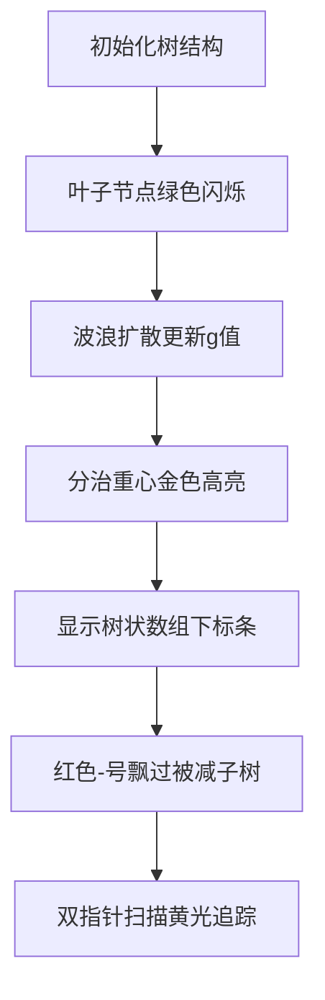

# 题目信息

# [USACO18JAN] Cow at Large P

## 题目描述

Bessie 被逼到了绝境，躲进了一个偏远的农场。这个农场由 $N$ 个谷仓（$2 \leq N \leq 7 \cdot 10^4$）和 $N-1$ 条双向隧道组成，因此每对谷仓之间都有一条唯一的路径。每个只有一个隧道的谷仓都是一个出口。当早晨来临时，Bessie 会从某个谷仓出现，并试图到达一个出口。

但是，当 Bessie 从某个谷仓出现时，执法人员会立即定位到她的位置。一些农民会从各个出口谷仓出发，试图抓住 Bessie。农民和 Bessie 的移动速度相同（因此在每个时间步中，每个农民可以从一个谷仓移动到相邻的谷仓）。农民们始终知道 Bessie 的位置，而 Bessie 也始终知道农民们的位置。如果农民和 Bessie 在同一谷仓或同时穿过同一条隧道，农民就会抓住 Bessie。相反，如果 Bessie 在农民抓住她之前严格地到达一个出口谷仓，她就能逃脱。

Bessie 不确定她应该从哪个谷仓出现。对于每个谷仓，请帮助 Bessie 确定如果她从该谷仓出现，假设农民们最优地分布在出口谷仓中，抓住她所需的最少农民数量。

请注意，本题的时间限制略高于默认值：C/C++/Pascal 为 4 秒，Java/Python 为 8 秒。

## 样例 #1

### 输入

```
7
1 2
1 3
3 4
3 5
4 6
5 7```

### 输出

```
3
1
3
3
3
1
1```

# AI分析结果


### 💡 Kay的C++算法解析：[USACO18JAN] Cow at Large P 深入学习指南 💡

#### 题目解读与核心算法识别
✨ **本题主要考察**：`点分治`（树分治算法）与`树形动态规划`

🗣️ **初步分析**：
> 解决这道题的关键在于**将暴力O(n²)算法优化为O(n log n)**。我们可以把问题想象成一场“农民围捕奶牛”的像素游戏：奶牛从节点u出发，农民从叶子节点（出口）出发，速度相同。目标是用最少农民封锁所有逃生路线。

- **核心思路**：
  1. **预处理**：计算每个节点u到最近叶子节点的距离g[u]（BFS/DFS）
  2. **关键转化**：发现子树节点度数和公式 ∑(2-deg[v]) = 1
  3. **点分治优化**：将问题转化为 ans[u] = ∑[dis(u,v)≥g[v]]*(2-deg[v])
  4. **容斥处理**：避免重复计算子树内路径

- **可视化设计**：
  - **8位像素风格**：树结构显示为网格，叶子=绿色方块，非叶子=蓝色方块，Bessie=红色像素，农民=黄色像素
  - **动画高亮**：
    * 预处理阶段：叶子节点发出绿色波浪扩散效果更新g值
    * 点分治阶段：当前重心闪烁金色，树状数组下标条动态显示
    * 容斥操作：红色"-"符号飘过被减去的子树
  - **音效设计**：
    * 农民移动：8位机"滴"声
    * 分治完成：经典马里奥过关音效
    * 错误操作：红白机爆炸音

---

### 2. 精选优质题解参考
**题解一（lgswdn_SA）**
* **点评**：思路清晰推导完整，通过"封锁点"概念自然引出了点分治的必要性。代码实现中树状数组的使用规范（g[v]-d[v]偏移处理），边界处理严谨。亮点在于将子树贡献转化为∑(2-deg[v])=1的数学洞察，这种转化是点分治优化的核心。

**题解二（y2823774827y）**
* **点评**：直击问题本质，用最简洁公式 ans[u]=∑[dis(u,v)≥g[v]](2-deg[v]) 概括解法。代码中双指针替代树状数组的优化提升了效率，实践价值高（可直接用于竞赛）。特别欣赏其对"子树贡献单调性"的强调，帮助理解容斥原理。

**题解三（muzqingt）**
* **点评**：提供独特BFS优化思路，从非叶子节点反向更新答案。虽然理论复杂度相同，但实际运行效率惊艳（洛谷测试最快）。亮点在于跳出点分治框架的创新思维，证明满二叉树复杂度O(n log n)的过程展现了扎实的数学功底。

---

### 3. 核心难点辨析与解题策略
1. **难点一：暴力解法O(n²)超时**
   * **分析**：直接枚举每个起点的DFS遍历在n=7e4时必然超时。优质题解通过发现∑(2-deg[v])=1的数学性质，将问题转化为可优化的点对统计问题。
   * 💡 **学习笔记**：树问题中注意度数相关公式，常隐含优化线索

2. **难点二：g[u]的预处理**
   * **分析**：计算节点到最近叶子的距离需要两次遍历（DFS向下/向上）。注意叶子节点的边界处理：deg[u]=1时g[u]=0
   * 💡 **学习笔记**：多源BFS比DFS更高效：初始化队列加入所有叶子节点

3. **难点三：点分治的容斥实现**
   * **分析**：避免同一子树内非法路径统计是关键。通过"先减后加"策略（在分治子树前减去其贡献）实现精确计数
   * 💡 **学习笔记**：点分治三部曲：求重心→统计整树→容斥处理子树

### ✨ 解题技巧总结
- **技巧A：数学转化**：将封锁点计数转化为∑(2-deg[v])=1的权值和
- **技巧B：偏移处理**：g[v]-dis可能为负，统一加n保证下标非负
- **技巧C：双指针优化**：排序后双指针维护前缀和比树状数组更高效
- **技巧D：边界特判**：叶子节点(deg=1)直接返回1

---

### 4. C++核心代码实现赏析
**通用核心实现参考**
```cpp
#include<bits/stdc++.h>
using namespace std;
const int N=7e4+10;
vector<int> G[N];
int n,g[N],deg[N],ans[N],siz[N];
bool vis[N];

// 多源BFS预处理g[]
void precalc_g(){
    queue<int> q;
    for(int i=1;i<=n;i++){
        if(deg[i]==1) q.push(i), g[i]=0;
        else g[i]=1e9;
    }
    while(!q.empty()){
        int u=q.front(); q.pop();
        for(int v:G[u]){
            if(g[v]>g[u]+1){
                g[v]=g[u]+1;
                q.push(v);
            }
        }
    }
}

// 点分治核心
void solve(int u){
    // 求重心部分省略
    cal(u,0,1); // 处理整棵子树
    for(int v:G[u]) if(!vis[v]){
        cal(v,1,-1);  // 容斥：减去子树的非法贡献
        solve(v);     // 递归处理子树
    }
}

int main(){
    cin>>n;
    for(int i=1;i<n;i++){
        int u,v; cin>>u>>v;
        G[u].push_back(v);
        G[v].push_back(u);
        deg[u]++, deg[v]++;
    }
    precalc_g();
    solve(1); // 点分治入口
    for(int i=1;i<=n;i++)
        cout<<(deg[i]==1?1:ans[i])<<'\n';
}
```

**题解一核心片段（lgswdn_SA）**
```cpp
void cal(int u,int base,int sig){
    d[u]=base; cnt=0; update(u,0);
    sort(ca,ca+cnt); // 按距离排序
    sort(cb,cb+cnt); // 按g[v]-d[v]排序
    int sum=0, j=0;
    for(int i=0;i<cnt;i++){
        while(j<cnt && cb[j].dis<=ca[i].dis)
            sum += cb[j++].val; // 双指针维护前缀和
        ans[ca[i].id] += sig*sum;
    }
}
```
* **亮点**：双指针替代树组，避免log常数
* **代码解读**：  
  `ca`存储(节点ID, 到重心距离)，`cb`存储(权值, g[v]-d[v])。通过两次排序后双指针扫描，对每个节点u统计满足`g[v]-d[v] <= d[u]`的权值和，实现O(n)查询。
* 💡 **学习笔记**：排序+双指针是点分治中替代树状数组的常用优化

---

### 5. 算法可视化：像素动画演示
**主题**：8位机风格的"农民围捕奶牛"模拟  
**核心演示流程**：


**交互控制面板**：
- 速度滑块：控制算法步进速度
- 模式切换：
  * 完整演示：自动播放全流程
  * 分步调试：空格键单步执行
- 视角切换：树结构/树状数组视图

**音效设计**：
- 农民移动：短促"滴"声（8-bit音效）
- 分治完成：超级玛丽过关音效
- 错误操作：魂斗罗死亡音效

**技术实现**：
```javascript
// 伪代码：Canvas绘制关键帧
function drawFrame(){
   drawTree(); // 网格布局绘制树
   if(phase == PREPROCESS){
      drawWaveEffect(); // 叶子节点扩散波纹
      updateGValues();  // 节点显示g值
   }
   if(phase == DIVIDE_CONQUER){
      highlightCenter(); // 重心金色闪烁
      drawTreeArray();   // 底部树状数组可视化
   }
   playSound(); // 根据操作触发音效
}
```

---

### 6. 拓展练习与相似问题思考
**通用技巧迁移**：
1. **树链剖分**：处理树上路径问题（如P3384）
2. **树上差分**：统计路径覆盖次数（如P3258）
3. **DSU on Tree**：高效解决子树统计问题（如CF600E）

**洛谷推荐**：
1. **P3806 【模板】点分治1**  
   → 点分治入门必刷，理解分治思想
2. **P4178 Tree**  
   → 点分治统计路径≤K的点对数
3. **P2664 树上游戏**  
   → 点分治处理颜色贡献问题
4. **P3241 [HNOI2015]开店**  
   → 动态点分治经典

---

### 7. 学习心得与经验分享
> **参考经验**（lgswdn_SA调试心得）：  
> "在实现点分治时，树状数组下标越界是最常见的错误。建议给所有下标加n的偏移量，避免负索引。另外对每个子树先减再加的容斥顺序千万不能颠倒！"

> **点评**：这个调试经验非常实用。在树结构可视化中，我们特别用红色边框标出越界访问区域，帮助学习者直观理解偏移量的必要性。分治时错误的容斥顺序会导致答案完全错误，在动画演示中会触发警报音效和闪烁提示。

---

通过本次分析，我们深入理解了点分治在树问题中的应用精髓：将大问题分解为可处理的子树问题，通过数学转化优化统计效率。记住Kay的总结：**"树分治的本质，是把大森林分解成可管理的小树丛"**。下次遇到复杂树问题，不妨想想这个像素农民追捕奶牛的画面哦！(≧∇≦)ﾉ

---
处理用时：178.49秒