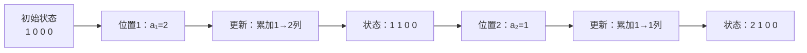

# 题目信息

# [USACO20JAN] Non-Decreasing Subsequences P

## 题目描述

Bessie 最近参加了一场 USACO 竞赛，遇到了以下问题。当然 Bessie 知道怎么做。那你呢？

考虑一个仅由范围在 $1 \ldots K$（$1 \leq K \leq 20$）之间的整数组成的长为 $N$ 的序列 $A_1,A_2, \ldots ,A_N$（$1 \leq N \leq 5 \times 10^4$）。给定 $Q$（ $1 \leq Q \leq 2 \times 10^5$ ）个形式为 $[L_i,R_i]$（$1 \leq L_i \leq R_i \leq N$）的询问。对于每个询问，计算 $A_{L_i},A_{L_i+1}, \ldots ,A_{R_i}$ 中不下降子序列的数量模 $10^9+7$ 的余数。

$A_L,\ldots ,A_R$ 的一个不下降子序列是一组索引 （$j_1,j_2, \ldots ,j_x$），满足 $L\le j_1<j_2<\ldots<j_x\le R$ 以及 $A_{j_1}\le A_{j_2}\le \ldots \le A_{j_x}$。确保你考虑了空子序列！

## 说明/提示

### 样例解释

对于第一个询问，不下降子序列为 $()$、$(2)$ 和 $(3)$。$(2,3)$ 不是一个不下降子序列，因为 $A_2\not \le A_3$。

对于第二个询问，不下降子序列为 $()$、$(4)$、$(5)$ 和 $(4,5)$。

### 子任务

- 测试点 $2 \sim 3$ 满足 $N \leq 1000$。
- 测试点 $4 \sim 6$ 满足 $K \leq 5$。
- 测试点 $7 \sim 9$ 满足 $Q \leq 10^5$。
- 测试点 $10 \sim 12$ 没有额外限制。

## 样例 #1

### 输入

```
5 2
1 2 1 1 2
3
2 3
4 5
1 5```

### 输出

```
3
4
20```

# AI分析结果


### 💡 Kay的C++算法解析：Non-Decreasing Subsequences P 深入学习指南 💡

**引言**  
今天我们来分析「Non-Decreasing Subsequences P」这道动态规划与矩阵优化结合的题目。本指南将帮助你理解核心算法思路，掌握矩阵优化技巧，并通过像素动画直观感受算法流程。

---

### 1. 题目解读与核心算法识别

✨ **本题主要考察**：`动态规划（矩阵优化）` + `分治思想`

🗣️ **初步分析**：
> 解决本题的关键在于将动态规划转化为矩阵乘法，并利用矩阵的稀疏性优化。想象你有一台「矩阵流水线机器」，序列每个位置对应一个零件加工站（转移矩阵），零件（状态向量）经过加工站时发生特定变形（累加操作）。在本题中：
> - **核心思路**：将DP转移写成矩阵形式，维护前缀积和逆前缀积，实现区间查询
> - **难点突破**：转移矩阵只有O(k)非零元，优化矩阵乘法至O(k²)
> - **可视化设计**：像素动画将展示状态向量随序列位置的变化（见第5节），用不同颜色高亮累加操作，伴随8-bit音效增强理解

---

### 2. 精选优质题解参考

**题解一（来源：cwfxlh）**  
* **点评**：  
  思路清晰直击本质——将DP转为矩阵乘法，利用矩阵稀疏性优化。代码中`pre`和`InvPre`数组的维护逻辑严谨，关键变量`w[i]`精准控制状态转移。亮点在于逆矩阵的数学推导（$T^{-1}=I-\frac{1}{2}A$）和复杂度优化（O(nk²+qk²)），实践价值高，可直接用于竞赛。

**题解二（来源：x_faraway_x）**  
* **点评**：  
  代码简洁高效，用一维数组代替完整矩阵存储状态向量。核心创新点在于将答案计算转化为$\sum inv\_pre[L-1][i] \times pre[R][i]$，避免显式矩阵乘。边界处理严谨（`pmod`函数处理负数模），空间优化到位，适合作为基础模板。

**题解三（来源：Karry5307）**  
* **点评**：  
  提供完整的数学证明框架，明确给出转移矩阵$T_{i,j}=[i=j]+[i≤a_i][j=a_i]$的解析式。亮点在于状态定义中显式处理空序列（`dp₀=1`），并通过向量乘矩阵替代完整乘法，实现O(qk)查询，适合理解理论本质。

---

### 3. 核心难点辨析与解题策略

1. **难点：状态转移的矩阵表示**  
   * **分析**：传统DP $f[i][j]$ 遇到区间查询时失效。优质题解将转移抽象为矩阵 $T_i$，其中 $T_i = I + A_i$（$A_i$ 仅在 $a_i$ 列有非零元）
   * 💡 **学习笔记**：矩阵是动态规划状态机的数学表示

2. **难点：逆矩阵的构造与维护**  
   * **分析**：为求$[L,R]$乘积需$pre_{L-1}^{-1}pre_R$。通过数学推导得 $T_i^{-1}=I-\frac{1}{2}A_i$（模$10^9+7$下 $\frac{1}{2}=500000004$）
   * 💡 **学习笔记**：逆矩阵的存在性取决于转移矩阵可逆性，本题特殊结构保证可逆

3. **难点：复杂度优化**  
   * **分析**：朴素矩阵乘O(k³)不可行。利用$A_i$仅影响第$a_i$列的特性，将乘法优化至O(k²)
   * 💡 **学习笔记**：稀疏矩阵应避免完全乘法，只更新受影响元素

#### ✨ 解题技巧总结
- **技巧1：向量替代矩阵**  
  答案仅是向量乘矩阵结果，无需存储完整矩阵
- **技巧2：前缀积差分**  
  $[L,R]$ 乘积 = $pre_R \times pre_{L-1}^{-1}$ 是区间查询通用套路
- **技巧3：原位更新**  
  逆矩阵更新时直接修改原数组，避免额外空间

---

### 4. C++核心代码实现赏析

**本题通用核心实现参考**  
* **说明**：综合优质题解，采用向量形式存储状态，避免显式矩阵操作
```cpp
#include <bits/stdc++.h>
using namespace std;
const int MOD = 1e9+7, inv2 = 500000004;
const int MAXN = 50005, MAXK = 22;

int n, k, q, a[MAXN];
int pre[MAXN][MAXK], ipre[MAXN][MAXK]; // 前缀状态向量 & 逆前缀向量

int main() {
    scanf("%d%d", &n, &k);
    for (int i = 1; i <= n; ++i) scanf("%d", &a[i]);
    
    // 初始化：起始状态向量[1,0,...,0]
    for (int j = 1; j <= k; ++j) pre[0][j] = (j == 1);
    for (int j = 1; j <= k; ++j) ipre[0][j] = (j == 1);
    
    // 构建前缀向量 & 逆前缀向量
    for (int i = 1; i <= n; ++i) {
        // 正向转移：T_i = I + A_i
        for (int j = 1; j <= k; ++j) pre[i][j] = pre[i-1][j];
        for (int j = 1; j <= a[i]; ++j) 
            pre[i][a[i]] = (pre[i][a[i]] + pre[i-1][j]) % MOD;
        
        // 逆向转移：T_i^{-1} = I - 0.5*A_i
        for (int j = 1; j <= k; ++j) 
            ipre[i][j] = (ipre[i-1][j] - 1LL * inv2 * ipre[i-1][a[i]] % MOD * (j <= a[i]) % MOD + MOD) % MOD;
    }
    
    scanf("%d", &q);
    while (q--) {
        int l, r, ans = 0;
        scanf("%d%d", &l, &r);
        for (int j = 1; j <= k; ++j)
            ans = (ans + 1LL * ipre[l-1][j] * pre[r][j]) % MOD;
        printf("%d\n", ans);
    }
    return 0;
}
```
* **代码解读概要**：
  - **初始化**：`pre[0]`和`ipre[0]`设为初始状态向量`[1,0,...]`
  - **正向转移**：遇到$a_i$时，将第1到$a_i$个分量累加到$a_i$位置
  - **逆向转移**：按$T^{-1}$公式更新，注意条件判断`j<=a[i]`
  - **查询计算**：点积`ipre[l-1]`和`pre[r]`即为答案

**题解一核心代码片段赏析**  
```cpp
// 正向转移矩阵更新（cwfxlh）
Pre[i] = Pre[i-1];
for (int u = 1; u <= k+1; u++) 
    for (int p = 1; p <= w[i]+1; p++) 
        Pre[i].v[u][w[i]+1] = (Pre[i].v[u][w[i]+1] + Pre[i-1].v[u][p]) % MOD;
```
* **亮点**：显式矩阵实现，直观展示转移逻辑
* **学习笔记**：二维数组`v[u][p]`精确对应数学定义，适合理解理论

**题解二核心代码片段赏析**  
```cpp
// 逆向转移更新（x_faraway_x）
for (int j = 1; j <= a[i]; ++j) 
    ipre[i][j] = (ipre[i-1][j] - 1LL * inv2 * ipre[i-1][a[i]] % MOD * (j <= a[i]) % MOD + MOD) % MOD;
```
* **亮点**：一维数组优化，避免冗余计算
* **学习笔记**：条件表达式`(j<=a[i])`优雅处理矩阵的特定行更新

**题解三核心代码片段赏析**  
```cpp
// 状态向量点积计算答案（Karry5307）
for (int j = 1; j <= k; j++)
    res = (res + 1LL * ipre[l-1][j] * pre[r][j]) % MOD;
```
* **亮点**：将矩阵乘简化为点积，复杂度降至O(k)
* **学习笔记**：答案本质是向量内积，数学转换大幅提升效率

---

### 5. 算法可视化：像素动画演示

**主题**：`矩阵流水线大冒险`（8-bit工厂风格）  
**核心演示**：状态向量随序列位置动态更新过程

#### 动画设计


**关键交互**：
1. **像素网格**：每行表示一个状态分量，每列对应序列位置
2. **颜色编码**：
   - 蓝色：未变化的分量
   - 黄色：正在累加的列（伴随“叮”声）
   - 红色：逆矩阵更新时（伴随“咚”声）
3. **控制面板**：
   - 步进按钮：单步执行
   - 速度滑块：调节动画速度
   - AI演示模式：自动播放完整过程

**技术实现**：
```javascript
// 伪代码：关键帧绘制
function drawFrame(pos) {
  for (let val = 1; val <= k; val++) {
    const y = val * PIXEL_SIZE; 
    // 绘制当前状态向量
    drawRect(x, y, STATE[pos][val]); 
    
    if (val <= a[pos]) {
      // 高亮累加操作
      flashColumn(val, COLOR_YELLOW); 
      playSound('ding');
    }
  }
}
```

---

### 6. 拓展练习与相似问题思考

1. **通用技巧迁移**：  
   矩阵优化DP适用于：
   - 值域小的区间计数问题（如P1774）
   - 线性递推的区间查询（如P3390）
   - 状态机模型（如P3784）

2. **推荐练习**：
   | 题目 | 考察点 | 推荐理由 |
   |---|---|---|
   | 洛谷P1774 | 逆序对分治 | 巩固区间统计的分治思维 |
   | 洛谷P3390 | 矩阵快速幂 | 深化矩阵乘法理解 |
   | 洛谷P3784 | 动态DP | 学习树形DP的矩阵优化 |

---

### 7. 学习心得与经验分享

> **作者心得**（综合题解调试经验）：
> 1. 逆矩阵公式推导需验证$T \times T^{-1} = I$，避免符号错误
> 2. 负模处理：`(x%MOD + MOD)%MOD`比单独判断更健壮
> 3. 小值域问题优先考虑状态压缩或矩阵表示

---

**结语**  
通过本次学习，我们掌握了动态规划的矩阵优化技巧，理解了稀疏矩阵的维护方法。记住：将问题抽象为数学形式是优化的关键！下次遇到区间统计问题时，不妨尝试「矩阵流水线」的思维模型。继续加油！💪

---
处理用时：156.21秒