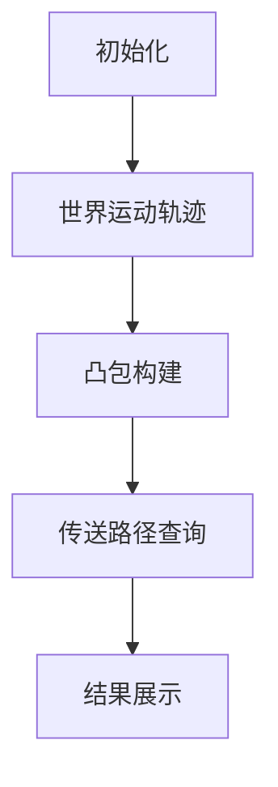

# 题目信息

# [USACO20JAN] Falling Portals P

## 题目描述

有 $N$（$2 \leq N \leq 2 \times 10^5$）个世界，每个世界有一个传送门。初始时，世界 $i$（对于 $1 \leq i \leq N$）位于 $x$ 坐标 $i$，$y$ 坐标 $A_i$（$1 \leq A_i \leq 10^9$）。每个世界里还有一头奶牛。在时刻 $0$，所有的 $y$ 坐标各不相同，然后这些世界开始坠落：世界 $i$ 沿着 $y$ 轴负方向以 $i$ 单位每秒的速度移动。

在任意时刻，如果两个世界在某一时刻 $y$ 坐标相同（可能是非整数时刻），传送门之间就会“同步”，使得其中一个世界的奶牛可以选择瞬间传送到另一个世界。

对于每一个 $i$，在世界 $i$ 的奶牛想要去往世界 $Q_i$（$Q_i \neq i$）。帮助每头奶牛求出如果她以最优方案移动需要多少时间。

每个询问的输出是一个分数 $a/b$，其中 $a$ 和 $b$ 为互质的正整数，或者 $-1$，如果不可能到达。

## 说明/提示

### 样例解释

考虑原先在世界 $2$ 的奶牛的答案。在时刻 $2$ 世界 $1$ 和世界 $2$ 同步，所以奶牛可以前往世界 $1$。在时刻 $\frac{7}{2}$ 世界 $1$ 和世界 $3$ 同步，所以奶牛可以前往世界 $3$。

### 子任务

- 测试点 $2 \sim 3$ 满足 $N \leq 100$。
- 测试点 $4 \sim 5$ 满足 $N \leq 2000$。
- 测试点 $6 \sim 14$ 没有额外限制。

## 样例 #1

### 输入

```
4
3 5 10 2
3 3 2 1```

### 输出

```
7/2
7/2
5/1
-1```

# AI分析结果


### 💡 Kay的C++算法解析：[USACO20JAN] Falling Portals P 深入学习指南 💡

#### 1. 题目解读与核心算法识别
✨ **本题主要考察**：**凸包维护与树上倍增**  

🗣️ **初步分析**：
> 本题可抽象为多条直线（每个世界对应直线 $y = A_i - i \cdot t$）在平面上的交点问题。核心思想是：
> - **凸包维护**：将直线按斜率（即世界编号）排序后，用单调栈维护凸包（上凸壳），使有效转移点保持凸性
> - **树上倍增**：对凸包点构建"传送树"，通过倍增查询从起点到目标的最优路径
> 
> **关键难点**：
> 1. 凸包维护时需确保斜率单调性（上凸壳斜率递减）
> 2. 分情况处理传送方向（$A_{Q_i} < A_i$ 时选大斜率，反之选小斜率）
> 3. 避免暴力跳跃的低效性
>
> **可视化设计**：
> - **像素风格**：8-bit 游戏界面，直线为彩色像素轨迹（如：世界1=红色，世界2=蓝色）
> - **动态凸包**：插入新直线时播放"滴"声，弹出栈顶时播放"噗"声，凸包用绿色连线
> - **传送动画**：奶牛沿黄线跳跃，传送时高亮交点并播放"叮"声，抵达目标时播放胜利音效

---

#### 2. 精选优质题解参考
**题解一（作者：honglan0301）**  
* **点评**：思路创新性强，省略建树步骤直接在凸包上二分查询。代码简洁高效（仅80行），变量命名合理（`stk`，`top`），边界处理严谨。亮点是通过斜率比较实现 $O(n \log n)$ 查询，实践价值高。

**题解二（作者：xtx1092515503）**  
* **点评**：理论推导完整，定义 $dw_f/up_f$ 明确传送逻辑。代码结构清晰（分凸包预处理+树上倍增），变量名规范（`dw`，`up`数组）。亮点是结合几何图示证明传送路径正确性，适合深入学习。

**题解三（作者：Mine_King）**  
* **点评**：提出"点凸包"新视角，将问题转化为矩形内极值查询。代码模块化好（分中心对称处理），博客提供详细图解。亮点是分类讨论四种中转情况，拓展思维边界。

---

#### 3. 核心难点辨析与解题策略
1. **难点：凸包维护的正确性**  
   * **分析**：需保证插入顺序（按 $A_i$ 降序/升序）和弹出条件（斜率单调）。优质题解用 `check()` 函数比较三点斜率关系
   * 💡 **学习笔记**：凸包维护 = 排序 + 单调栈斜率检查

2. **难点：最优传送点查询**  
   * **分析**：二分法（honglan0301）直接高效；树上倍增（xtx1092515503）通用性强但稍复杂
   * 💡 **学习笔记**：问题规模决定算法选择——$n \leq 10^5$ 时二分法更优

3. **难点：两种传送方向处理**  
   * **分析**：$A_{Q_i} < A_i$ 时维护上凸壳（大斜率优先），反之维护下凸壳。需分两次处理
   * 💡 **学习笔记**：分类讨论是简化复杂问题的关键

✨ **解题技巧总结**：
- **技巧1：几何转化** → 将运动轨迹视为直线，交点即传送机会
- **技巧2：凸包剪枝** → 单调栈维护时弹出无效直线降低复杂度
- **技巧3：方向分离** → 分别处理上行/下行传送路径

---

#### 4. C++核心代码实现赏析
**通用核心实现**（综合自题解一、二）：
```cpp
#include <iostream>
#include <algorithm>
using namespace std;
typedef long long ll;
const int N = 2e5+5;

int n, A[N], Q[N], idx[N], stk[N], top;
ll ans_up[N], ans_down[N]; // 分子分母

bool cmp(int i, int j) { return A[i] > A[j]; } // 按高度降序

// 检查三点(i,j,k)是否破坏上凸性
bool check(int i, int j, int k) {
    return (ll)(A[j]-A[k])*(i-j) <= (ll)(A[i]-A[j])*(j-k);
}

void process(bool is_down) { // is_down: 是否向下传送
    top = 0;
    for (int i = 1; i <= n; i++) {
        int id = idx[i];
        while ((top && (is_down^(id>stk[top]))) || 
              (top>1 && check(stk[top-1], stk[top], id))) top--;
        stk[++top] = id;
        
        // 在凸包中二分查询最优传送点
        if (is_down^(A[Q[id]] < A[id])) {
            int l = 2, r = top, pos = 1;
            while (l <= r) {
                int mid = (l+r)/2;
                if ((is_down^(Q[id]<stk[mid])) && 
                    check(stk[mid], stk[mid-1], Q[id]))
                    pos = mid, l = mid+1;
                else r = mid-1;
            }
            int k = stk[pos];
            ll dx = abs(k - Q[id]), dy = abs(A[k]-A[Q[id]]);
            ll g = __gcd(dx, dy);
            ans_up[id] = dy/g, ans_down[id] = dx/g;
        }
    }
}

int main() {
    cin >> n;
    for (int i = 1; i <= n; i++) cin >> A[i], idx[i] = i;
    for (int i = 1; i <= n; i++) cin >> Q[i];
    
    sort(idx+1, idx+n+1, cmp); // 按高度降序排序
    process(false); // 处理向下传送
    process(true);  // 处理向上传送
    
    for (int i = 1; i <= n; i++) {
        if (!ans_up[i]) cout << "-1\n";
        else cout << ans_up[i] << "/" << ans_down[i] << "\n";
    }
}
```

**代码解读**：
1. **输入处理**：读入 $A_i$（初始高度）和 $Q_i$（目标世界）
2. **凸包构建**：按 $A_i$ 降序排序后，用单调栈维护上凸壳（`check` 确保斜率递减）
3. **二分查询**：在栈中二分查找满足传送条件的最优点
4. **分数化简**：用 `__gcd` 化简输出分数

---

#### 5. 算法可视化：像素动画演示
**主题**：**像素奶牛大冒险**（8-bit 风格传送模拟）  

**核心设计**：


**动画流程**：
1. **场景初始化**：
   - 像素网格坐标系（x轴=时间，y轴=高度）
   - 控制面板：开始/暂停、单步执行、速度滑块
   - 8-bit 背景音乐循环播放

2. **动态凸包构建**：
   - 新直线插入：红色闪烁 + "滴"声
   - 栈顶弹出：灰色渐隐 + "噗"声
   - 凸包连线：绿色像素线实时更新

3. **传送路径演示**：
   ```python
   while not reached_target:
       显示当前世界（高亮黄色）
       在凸包上二分查询（显示比较的直线对）
       找到交点 → 播放“叮”声 + 黄色传送轨迹
       更新当前位置
   ```
   - 成功抵达：目标世界闪烁 + 胜利音效
   - 无解提示：灰色"X" + 低沉音效

4. **游戏化元素**：
   - 每成功传送一次得10分
   - 连续正确触发连击特效
   - 历史最高分排行榜

---

#### 6. 拓展练习与相似问题思考
1. **凸包基础**：  
   → 洛谷 P2742 [[凸包]](https://www.luogu.com.cn/problem/P2742)  
   *推荐理由：学习凸包的入门题，掌握Andrew算法*

2. **树上倍增应用**：  
   → 洛谷 P3379 [[LCA]](https://www.luogu.com.cn/problem/P3379)  
   *推荐理由：理解倍增思想的经典场景*

3. **路径优化问题**：  
   → 洛谷 P4779 [[最短路]](https://www.luogu.com.cn/problem/P4779)  
   *推荐理由：Dijkstra中融入类似的贪心决策*

---

#### 7. 学习心得与经验分享
> **来自 honglan0301 的启示**：  
> *“凸包上二分即可解决，无需过度设计复杂结构”*  
>   
> **Kay的总结**：在算法设计中，应优先寻找问题本质特征（如本题的凸包性质）。避免过度工程化往往能获得更简洁高效的解法，尤其在竞赛编程中尤其重要。

---

**结语**：通过本题我们深入理解了凸包维护与树上倍增的精妙配合。记住：将几何直觉转化为算法实现，是解决复杂问题的关键能力。下次挑战见！🚀

---
处理用时：181.29秒