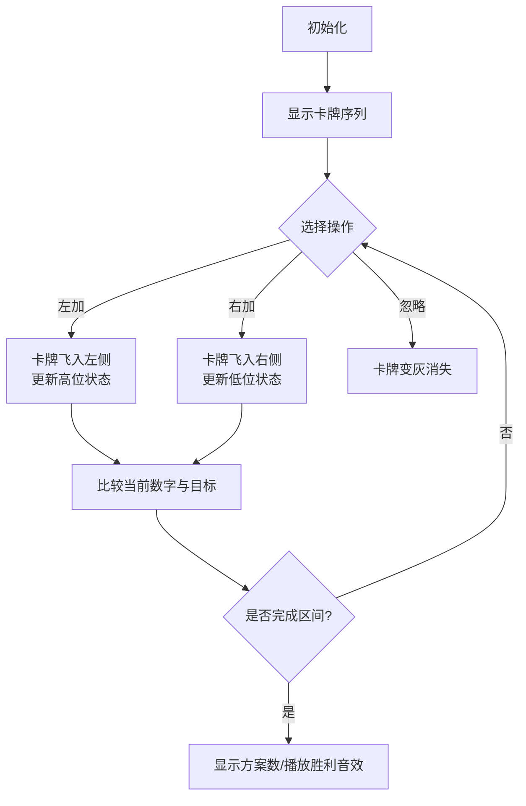

# 题目信息

# [USACO23FEB] Piling Papers G

## 题目描述

农夫约翰在纸片上写下了 $N (1 \le N \le 300)$ 个数字。对于每个 $i \in [1,N]$，第 $i$ 张纸片上写着数字 $a_i (1 \le a_i \le 9)$。

奶牛们有两个最喜欢的整数 $A$ 和 $B(1 \le A \le B<10^{18})$，希望你回答 $Q (1 \le Q \le 5 \times 10^4)$ 个查询。对于第 $i$ 个查询，奶牛们将从左到右移动穿过纸片 $l_i \cdots r_i (1 \le l_i \le r_i \le N)$，保持一个最初为空的纸片堆。对于每张纸片，它们可以选择将其添加到堆的顶部、底部，或者不添加。最后，它们将从顶部到底部读取堆中的纸片，形成一个整数。在奶牛们在此过程中做选择的所有 $3 ^ {r_i-l_i+1}$ 种方式中，计算出结果在 $[A,B]$ 范围内的方式数量，并输出这个数量对 $10^9+7$ 取模的结果。

## 说明/提示

### 示例 1 的解释

对于第一个查询，Bessie 在读取区间 $[1,2]$ 时有九种方式堆叠纸片：

- Bessie 可以忽略 $1$ 然后忽略 $2$，得到 $0$。
- Bessie 可以忽略 $1$ 然后将 $2$ 添加到堆的顶部，得到 $2$。
- Bessie 可以忽略 $1$ 然后将 $2$ 添加到堆的底部，得到 $2$。
- Bessie 可以将 $1$ 添加到堆的顶部然后忽略 $2$，得到 $1$。
- Bessie 可以将 $1$ 添加到堆的顶部然后将 $2$ 添加到堆的顶部，得到 $21$。
- Bessie 可以将 $1$ 添加到堆的顶部然后将 $2$ 添加到堆的底部，得到 $12$。
- Bessie 可以将 $1$ 添加到堆的底部然后忽略 $2$，得到 $1$。
- Bessie 可以将 $1$ 添加到堆的底部然后将 $2$ 添加到堆的顶部，得到 $21$。
- Bessie 可以将 $1$ 添加到堆的底部然后将 $2$ 添加到堆的底部，得到 $12$。

只有 $2$ 种方式得到的数字在 $13$ 和 $327$ 之间，所以答案是 $2$。

### 评分

- 输入 $2-3$：$B<100$
- 输入 $4-5$：$A=B$
- 输入 $6-13$：无额外约束。

题面翻译由 ChatGPT-4o 提供。

## 样例 #1

### 输入

```
5 13 327
1 2 3 4 5
3
1 2
1 3
2 5```

### 输出

```
2
18
34```

# AI分析结果


### Kay的C++算法解析：Piling Papers G 深入学习指南

---

### 1. 题目解读与核心算法识别
✨ **本题主要考察**：数位动态规划（数位DP）与区间DP

🗣️ **初步分析**：
> 本题要求统计通过左/右添加或忽略数字卡牌形成在区间$[A,B]$内的数字的方案数。核心挑战在于**处理数字的双向构建**（左加高位、右加低位）和**大范围值域比较**（$A,B$可达$10^{18}$）。数位DP的核心思想是将数字视为字符串，通过**状态机模拟比较过程**。在本题中，状态需记录当前形成的数字与目标数字（$A-1$或$B$)的**高位/低位比较状态**。

- **核心难点**：  
  - 双向添加导致数字位权动态变化  
  - 状态需同时跟踪高位（左加）和低位（右加）与目标数字的比较  
- **解决方案**：  
  设计状态$f_{l,r,i,j,k}$表示：处理区间$[l,r]$时，当前数字与目标数字的第$i$至$j$位比较结果为$k$（$k=0$小于，$k=1$等于，$k=2$大于）的方案数。转移时分左加/右加两种情况更新状态。
- **可视化设计**：  
  采用**复古像素风格**（类似FC游戏）展示卡牌序列（如`[1,2,3,4,5]`）。动画演示：  
  - 当前操作卡牌**高亮闪烁**（红/黄/蓝对应忽略/左加/右加）  
  - 形成的数字**实时显示**，与目标数字比较状态用**颜色边框**标记（绿：小于，黄：等于，红：大于）  
  - **音效设计**：放置卡牌时“叮”，成功时8-bit胜利音效，错误时短促警示音  

---

### 2. 精选优质题解参考
**题解一（作者：Elma_）**
* **点评**：  
  思路清晰直击核心——**状态设计简洁高效**（$f_{i,j,k}$仅用三维数组）。代码规范：变量名`lim`/`chk`含义明确，边界处理严谨（如空串初始化+2）。算法亮点：通过**后缀预处理**将查询优化至$\mathcal{O}(1)$，复杂度$\mathcal{O}(n^2\log^2 B)$完美适配$N\le300$。实践价值高，可直接用于竞赛。

**题解二（作者：学委）**
* **点评**：  
  提供**替代思路**——离线处理查询+组合数学优化。状态设计$f_{t,i,j}$和$g_{t,i,k,j}$分层清晰，解释到位（尤其"已合法/未合法"状态划分）。代码规范：模块化（`Get()`/`Solve()`分离），但复杂度$\mathcal{O}(n^2\log^3 B)$稍高。亮点：**组合数预计算**处理短数字方案，适合理解数学优化。

**题解三（作者：Bluebird_）**
* **点评**：  
  作为Elma_解法的补充，**详解边界细节**（如空串+2的原因）。代码注释详尽（如转移分"加左/加右"），变量名`cmp()`直白。亮点：**学习友好性**——通过`ckmin`/`ckmax`等封装函数降低理解门槛，适合初学者逐步调试。

---

### 3. 核心难点辨析与解题策略
1. **难点1：状态定义模糊**  
   - **分析**：双向添加时，数字位权动态变化（左加影响高位，右加影响低位）  
   - **解决**：优质解采用**双指针$i,j$** 分别跟踪目标数字的高/低位，如Elma_解法中：  
     ```cpp
     for(int x=1; x<=m; x++)       // x: 目标数字高位指针
     for(int y=m; y>x; y--)         // y: 目标数字低位指针
     ```
   - 💡 **学习笔记**：双指针是处理双向添加问题的通用技巧

2. **难点2：大小关系转移混乱**  
   - **分析**：左加数字时需重新评估**整个数字**与目标的大小关系  
   - **解决**：Elma_解法中**分情况转移**：  
     ```cpp
     if(a[j]>lim[x]) { /* 整个数字必然大于目标 */ }
     else if(a[j]==lim[x]) { /* 继承之前状态 */ }
     else { /* 整个数字必然小于目标 */ }
     ```
   - 💡 **学习笔记**：高位数字决定整体大小是数位DP的核心性质

3. **难点3：位数不足的合法性判定**  
   - **分析**：位数少于目标数字时，无论数字为何值均合法  
   - **解决**：Bluebird_解法中**独立统计短数字方案**：  
     ```cpp
     for(int p=1; p<top; p++) // 位数不足时三种状态均合法
       ans += f[1][p][0] + f[1][p][1] + f[1][p][2];
     ```
   - 💡 **学习笔记**：数位DP中先处理位数差异可简化状态机

#### ✨ 解题技巧总结
- **技巧1：容斥原理降维**  
  将$[A,B]$转化为$(\leq B)-(\leq A-1)$，复用同一DP函数
- **技巧2：状态压缩**  
  用单个整数$k\in\{0,1,2\}$编码大小关系（小于/等于/大于）
- **技巧3：后缀预处理**  
  预处理所有$(l,r)$答案，将查询复杂度优化至$\mathcal{O}(1)$

---

### 4. C++核心代码实现赏析
#### 本题通用核心实现（基于Elma_解法优化）
```cpp
#include <bits/stdc++.h>
using namespace std;
typedef long long LL;
const int N = 302, M = 22, mod = 1e9+7;
int n, q, a[N], f[M][M][3], ansL[N][N], ansR[N][N];
LL A, B;

void calc(LL bound, int res[][N]) {
    int lim[M] = {}, m = 0;
    for(LL x=bound; x; x/=10) lim[++m] = x%10;
    reverse(lim+1, lim+m+1); // 分解bound为数字数组

    for(int l=1; l<=n; l++) {
        memset(f, 0, sizeof f);
        for(int r=l; r<=n; r++) {
            // 核心DP转移
            for(int i=1; i<=m; i++) for(int j=m; j>=i; j--) {
                if(j > i) { // 非单字符区间
                    if(a[r] > lim[i]) { // 左加：新数字必然大于目标
                        for(int k:{0,1,2}) f[i][j][2] = (f[i][j][2]+f[i+1][j][k])%mod;
                    } else if(a[r] == lim[i]) { // 左加：继承原状态
                        for(int k:{0,1,2}) f[i][j][k] = (f[i][j][k]+f[i+1][j][k])%mod;
                    } else { // 左加：新数字必然小于目标
                        for(int k:{0,1,2}) f[i][j][0] = (f[i][j][0]+f[i+1][j][k])%mod;
                    }
                    // 右加：分状态转移
                    f[i][j][2] = (f[i][j][2]+f[i][j-1][2])%mod;
                    f[i][j][a[r]>lim[j]] = (f[i][j][a[r]>lim[j]]+f[i][j-1][1])%mod;
                    f[i][j][0] = (f[i][j][0]+f[i][j-1][0])%mod;
                }
            }
            // 单字符区间初始化
            for(int i=1; i<=m; i++) 
                f[i][i][(a[r]>lim[i])?2:(a[r]<lim[i])?0:1] += 2;
            
            // 统计答案
            for(int i=1; i<=m; i++) 
                res[l][r] = (res[l][r] + f[i][m][0] + f[i][m][1] + (i>1)*f[i][m][2])%mod;
        }
    }
}
```

#### 题解片段赏析
**题解一（Elma_）核心转移**
```cpp
// 左加转移：根据新数字与目标高位比较更新状态
if(a[j] > lim[x]) {
    for(int k=0; k<=2; k++) 
        f[x][y][2] = (f[x][y][2] + f[x+1][y][k]) % mod;
} else if(a[j] == lim[x]) {
    for(int k=0; k<=2; k++) 
        f[x][y][k] = (f[x][y][k] + f[x+1][y][k]) % mod;
} else {
    for(int k=0; k<=2; k++) 
        f[x][y][0] = (f[x][y][0] + f[x+1][y][k]) % mod;
}
```
> **解读**：当新数字$a_j$添加到左侧（高位），其与目标高位$lim_x$的比较直接决定整个数字的相对大小：  
> - $a_j > lim_x$ ⇒ 新数字必然大于目标  
> - $a_j = lim_x$ ⇒ 继承原状态（需继续比较后续位）  
> - $a_j < lim_x$ ⇒ 新数字必然小于目标  
> 💡 **学习笔记**：高位数字具有"一票否决权"，这是数位比较的关键特性

**题解二（学委）状态初始化**
```cpp
for(int x=1; x<=top; x++)
    f[x][x][(a[r]>s[x])?2:(a[r]<s[x])?0:1] += 2;
```
> **解读**：处理单字符区间时的巧妙初始化——**+2对应两种操作**（左加或右加形成相同数字）。  
> 💡 **学习笔记**：空串操作有"左加"和"右加"两种独立方案，这是易错点！

**题解三（Bluebird_）答案统计**
```cpp
ans += f[1][top][0] + f[1][top][1]; // 等长数字：小于或等于
for(int p=1; p<top; p++)            // 短数字：三种状态均合法
    ans += f[1][p][0] + f[1][p][1] + f[1][p][2];
```
> **解读**：分两种情况统计合法方案：  
> 1. 等长数字：仅小于/等于目标时合法  
> 2. 短数字：任何值均合法（因位数不足必小于目标）  
> 💡 **学习笔记**：数位DP中先处理位数差异可简化状态转移

---

### 5. 算法可视化：像素动画演示
**主题**："卡牌大冒险"（8-bit复古风格）  
**核心演示**：数字卡牌序列构建过程与目标数字的实时比较  



**动画帧细节**：  
1. **场景**：  
   - 像素卡牌序列（如`[1,2,3,4,5]`）  
   - 当前数字显示区（8-bit LCD风格）  
   - 目标数字`A`/`B`（发光边框）  
2. **操作反馈**：  
   - 左加：卡牌向左滑动+绿色↑箭头  
   - 右加：卡牌向右滑动+蓝色↓箭头  
   - 忽略：卡牌变灰+碎裂音效  
3. **状态提示**：  
   - 当前数字：绿色（$<$目标），黄色（$=$），红色（$>$）  
   - 目标数字：匹配位闪烁黄光  
4. **游戏化元素**：  
   - 每完成一个查询解锁新关卡  
   - 方案数转化为得分（1方案=10分）  
   - 连续正确触发"连击"特效  

**技术实现**：  
- **Canvas绘制**：网格化卡牌（16×16像素/张）  
- **状态同步**：高亮显示DP状态机（如双指针$i,j$位置）  
- **音效**：Web Audio API生成8-bit音效（放置声：三角波，胜利：方波+滑音）  

---

### 6. 拓展练习与相似问题思考
**通用技巧迁移**：  
1. **位运算优化**：状态压缩（如$k$用2位表示）  
2. **离线查询**：预处理所有区间答案（学委解法）  
3. **组合数学**：短数字方案数计算（$C_n^k \times 2^k$）  

**洛谷推荐**：  
1. [P2657 windy数](https://www.luogu.com.cn/problem/P2657)  
   → 巩固数位DP+相邻位限制  
2. [P2602 数字计数](https://www.luogu.com.cn/problem/P2602)  
   → 拓展数位DP的统计应用  
3. [P4127 类数统计](https://www.luogu.com.cn/problem/P4127)  
   → 练习区间查询+数位DP组合技  

---

### 7. 学习心得与经验分享
> **参考经验（Elma_）**：  
> "状态设计时最初忽略空串的两种操作（左加/右加），调试发现方案数少一半，+2修正后AC"  
> 
> **点评**：  
> 这个经验凸显了**边界条件测试**的重要性——空串是DP初始化的关键点。建议：  
> 1. 对空输入、单元素等边界写单元测试  
> 2. 用小数据（如样例$[1,2]$）人肉模拟状态转移  

---

本次解析就到这里！数位DP的核心在于"**高位决定整体，低位继承状态**"。通过本指南的像素动画演示和代码剖析，相信大家能更直观理解该算法。下次挑战再见！💪

---
处理用时：194.90秒