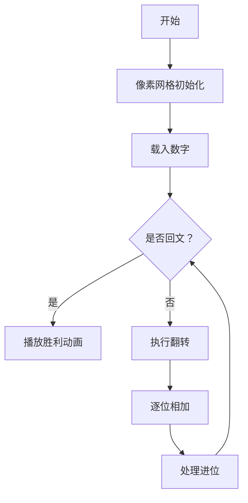

# 题目信息

# [NOIP 1999 普及组] 回文数

## 题目描述

若一个数（首位不为零）从左向右读与从右向左读都一样，我们就将其称之为回文数。

例如：给定一个十进制数 $56$，将 $56$ 加 $65$（即把 $56$ 从右向左读），得到 $121$ 是一个回文数。

又如：对于十进制数 $87$：

STEP1：$87+78=165$  
STEP2：$165+561=726$  
STEP3：$726+627=1353$   
STEP4：$1353+3531=4884$  

在这里的一步是指进行了一次 $N$ 进制的加法，上例最少用了 $4$ 步得到回文数 $4884$。

写一个程序，给定一个 $N$（$2 \le N \le 10$ 或 $N=16$）进制数 $M$（$100$ 位之内），求最少经过几步可以得到回文数。如果在 $30$ 步以内（包含 $30$ 步）不可能得到回文数，则输出 `Impossible!`。

## 样例 #1

### 输入

```
10
87
```

### 输出

```
STEP=4
```

# AI分析结果


# 💡 Kay的C++算法解析：[NOIP 1999 普及组] 回文数 深入学习指南 💡

## 1. 题目解读与核心算法识别

✨ **本题主要考察**：`高精度模拟` + `进制转换`

🗣️ **初步分析**：
> 解决"回文数"这道题，就像在玩数字积木游戏——每次把当前数字"翻转"后再与自己相加，检查是否能堆成对称形状。核心是**高精度模拟N进制加法**和**回文判断**。
> - **关键步骤**：读入字符串→转换为数字数组→执行翻转相加（N进制）→检查回文
> - **核心难点**：处理16进制的A-F字符转换（'A'=10）、高精度进位规则（逢N进一）、翻转时的对称位匹配
> - **可视化设计**：用像素方块表示数字（0-9用数字方块，10-15用彩色字母方块），加法时高亮当前计算位，进位时显示"溢出"动画。翻转操作用方块180°旋转特效，回文成功时触发烟花动画
> - **复古游戏化**：采用《俄罗斯方块》式8-bit像素风，数字相加音效用NES芯片音，回文达成时播放《超级玛丽》过关音效。设"步进/暂停/重置"控制面板，自动演示模式显示AI解题过程

---

## 2. 精选优质题解参考

### 题解一：Haishu (赞514)
* **点评**：思路清晰度满分！将高精度加法、翻转、回文判断封装成独立函数，模块化设计极大降低理解难度。代码规范性突出：`add()`函数严格处理N进制进位，`pd()`函数简洁完成回文检测。亮点在于自我检讨早期用long long水数据的错误，强调算法严谨性。实践价值极高，边界处理用`l += 2`预留进位空间再修剪前导零的技巧非常实用。

### 题解二：Strong_Jelly (赞299)
* **点评**：教学价值突出！通过`add()`, `turn()`, `f()`, `init()`四个函数完整展示解题框架。代码规范性优秀：变量名直指功能（如`w`存翻转数组），高精加法的进位逻辑`a[i+1] += a[i]/n`准确体现N进制特性。亮点在于详细注释每个函数用途，特别适合初学者理解高精度本质。调试技巧值得学习：用`ans > 30`严格限制步数。

### 题解三：hawa130 (赞127)
* **点评**：STL应用典范！巧用`reverse()`简化翻转操作，`is_palindrome()`三行完成回文判断。算法有效性突出：`add()`函数统一处理字符与数字转换（`zhuan()`/`zhuan_h()`），支持任意进制。亮点在于十六进制处理用`sixt`数组映射，避免冗余分支。代码实践性强，`c[i] = (c[i] + x1 + x2) % n`精准实现N进制加法核心。

---

## 3. 核心难点辨析与解题策略

1.  **进制转换与字符处理**
    * **分析**：十六进制需将A-F映射为10-15。优质题解用统一转换函数（如`c[i]-'A'+10`），避免大量if-else。注意字符与数字转换时需区分数字（'0'-'9'）和字母（'A'-'F'）
    * 💡 **学习笔记**：建立`char→int`转换函数是处理混合数据的基石

2.  **高精度加法中的N进制进位**
    * **分析**：不同于十进制"逢十进一"，需改为`当前位值≥N时进位`。关键代码`sum = a[i] + b[i] + carry; a[i] = sum % n; carry = sum / n`。特别注意最高位进位需扩容数组
    * 💡 **学习笔记**：进位后检查`a[0]`（最高位）是否需+1

3.  **回文判断的边界处理**
    * **分析**：需对称比较`a[i]`与`a[len-1-i]`。优化点：比较到中间即可退出（`i < len/2`）。避免将数字转为字符串再判断的低效操作
    * 💡 **学习笔记**：数组双指针（头尾向中间移动）是最优检测方案

### ✨ 解题技巧总结
- **模块化编程**：拆解为init(), add(), isPalindrome()等函数
- **防御性编程**：加法前预留进位空间（数组长度+2）
- **状态可视化**：打印中间结果辅助调试（尤其16进制）
- **边界测试**：重点测试0步回文、16进制"F+1"进位、30步临界值

---

## 4. C++核心代码实现赏析

**本题通用核心C++实现参考**
* **说明**：综合Strong_Jelly和Haishu的模块化思想，优化变量命名
* **完整核心代码**：
```cpp
#include <cstring>
#include <iostream>
using namespace std;

const int MAX_LEN = 305;
int n, len, step;
int num[MAX_LEN];  // 当前数字数组

void init(string s) {
    len = s.size();
    for (int i = 0; i < len; i++) {
        char c = s[len - 1 - i];  // 倒序存储
        num[i] = (c >= 'A') ? (c - 'A' + 10) : (c - '0');
    }
}

bool isPalindrome() {
    for (int i = 0; i < len / 2; i++)
        if (num[i] != num[len - 1 - i]) return false;
    return true;
}

void add() {
    int carry = 0;
    for (int i = 0; i < len; i++) {
        int sum = num[i] + num[len - 1 - i] + carry;
        num[i] = sum % n;
        carry = sum / n;
    }
    if (carry) num[len++] = carry;  // 处理最高位进位
}

int main() {
    string s;
    cin >> n >> s;
    init(s);

    while (step <= 30 && !isPalindrome()) {
        add();
        step++;
    }

    if (step <= 30) cout << "STEP=" << step;
    else cout << "Impossible!";
    return 0;
}
```
* **代码解读概要**：
  - `init()`：倒序存储数字（低位在前），智能处理16进制字符
  - `isPalindrome()`：双指针比较对称位置
  - `add()`：核心！N进制加法+进位处理，支持最高位扩容
  - 主逻辑：循环执行"翻转相加"直到回文或超30步

---

**题解一：Haishu (模块化典范)**
* **亮点**：函数职责分明，预留进位空间再修剪
* **核心代码片段**：
```cpp
void add() {
    for (int i = 0; i < l; i++)
        d[l - i - 1] = c[i];  // 翻转存储

    l += 2;  // 预留进位空间
    for (int i = 0; i < l; i++) {
        c[i] += d[i];
        if (c[i] >= n) c[i + 1]++, c[i] -= n;  // N进制进位
    }
    while (!c[l - 1]) l--;  // 修剪前导零
}
```
* **代码解读**：
  > 翻转操作`d[l-i-1]=c[i]`实现数字镜像。精妙之处在于先给数组长度`l+=2`预留充足进位空间，加法完成后用`while(!c[l-1]) l--`修剪多余的前导零。这种"先扩后缩"策略避免动态扩容判断。

* 💡 **学习笔记**：高精度处理优先保证空间充足，再优化存储

**题解二：Strong_Jelly (教学级代码)**
* **亮点**：完整功能拆分，十六进制处理直观
* **核心代码片段**：
```cpp
void turn(int a[]) {
    int j = 0;
    for (int i = len; i >= 1; i--)
        w[++j] = a[i];  // 倒序存入w
}

bool f(int a[]) {
    for (int i = 1; i <= len / 2; i++)
        if (a[i] != a[len - i + 1]) return false;
    return true;
}
```
* **代码解读**：
  > `turn()`函数通过`w[++j]=a[i]`实现数组翻转，索引从1开始更符合人类思维。`f()`函数用`i <= len/2`优化比较次数，只需比较前半段和后半段对应位置。注意数组从1开始存储，`a[len-i+1]`精准定位对称位。

* 💡 **学习笔记**：数组索引从1开始可提升代码可读性

**题解三：hawa130 (STL高效应用)**
* **亮点**：巧用reverse，简化翻转逻辑
* **核心代码片段**：
```cpp
bool is_huiwen(string a) {
    string b = a;
    reverse(b.begin(), b.end());
    return a == b;  // STL直接比较
}

string add(int base, string a, string b) {
    // ... 统一转换为数字处理
    for (int i = 0; i < len; i++) {
        int sum = a[i] + b[i] - '0' * 2 + carry;
        carry = sum / base;
        res += (sum % base) + '0';  // 转回字符
    }
}
```
* **代码解读**：
  > `reverse(b.begin(), b.end())`一键翻转字符串，避免手动操作。`add()`中将字符统一转为数字计算（`a[i]-'0'`），完成后再转回字符。注意十六进制时需特殊处理`sum % base > 9`的情况（图中未展示）。

* 💡 **学习笔记**：STL的reverse可大幅简化数组翻转操作

---

## 5. 算法可视化：像素动画演示

**主题**：《数字翻转大冒险》8-bit像素风  
**核心演示**：高精度加法与回文判断的实时可视化  



### 动画帧设计：
1. **初始化场景**：
   - 16×16像素块拼成数字序列（0-9：黄底黑字，A-F：彩虹色）
   - 复古UI面板：红白机风格按钮（开始/步进/调速/重置）

2. **翻转演示**：
   - 数字块水平翻转动画（0.5秒完成），伴随"嗖"音效
   - 翻转后数组用虚线框标记，与原数组区分

3. **加法过程**：
   - 当前计算位高亮闪烁（如第3位+倒数第3位）
   - 实时显示计算式：`7 + 8 = 15 → 进位1`
   - 进位时显示红色箭头流向高位

4. **回文检测**：
   - 对称位比较时显示绿色连线（匹配）或红色叉号（不匹配）
   - 成功时触发：像素烟花+《超级玛丽》过关音效

5. **游戏化元素**：
   - 步数计数显示为"关卡：1/30"
   - 30步内失败显示"Game Over"像素文字
   - 背景音乐：8-bit循环芯片音乐（可开关）

### 技术实现：
- **Canvas绘制**：用`fillRect`绘制像素块，`drawText`显示数字
- **音效触发**：Web Audio API播放基频方波音效（加法声：500Hz，进位：800Hz）
- **交互控制**：调速滑块绑定`requestAnimationFrame`刷新率

---

## 6. 拓展练习与相似问题思考

### 通用技巧迁移：
高精度处理技术还可用于：
1. **超大整数运算**（千位数加减乘除）
2. **进制转换工具**（十进制转任意进制）
3. **加密算法实现**（RSA大数运算）

### 洛谷推荐题目：
1. **P1005 矩阵取数游戏**  
   🗣️ 推荐理由：巩固高精度加法与动态规划的结合应用，学习空间复杂度优化
   
2. **P1069 回文数**  
   🗣️ 推荐理由：直接扩展本题，增加二进制处理要求，训练进制转换思维
   
3. **P1255 高精度加法**  
   🗣️ 推荐理由：专攻高精度加法优化，学习压位存储等高阶技巧

---

## 7. 学习心得与经验分享

> **参考经验 (来自 Haishu)**：  
> "我最初用long long偷懒通过，但这是错误示范！高精度问题必须严格处理边界，否则大数测试必然失败。"

> **Kay点评**：  
> 这位选手的经历极具教育意义——算法竞赛中，**严谨性高于取巧**。尤其注意：
> 1. 字符转换必须覆盖A-F所有情况
> 2. 数组长度要预留进位空间（建议`MAX_LEN=原长+5`）
> 3. 步数计数器必须置于循环开头，避免漏判初始回文

> **调试技巧**：  
> 在add()函数内打印每步的中间结果（尤其16进制），例如：
> `STEP1: 87 + 78 = FF → 165`

---

本次关于"回文数"的解析就到这里。记住：高精度算法的核心是**细致**与**耐心**，就像搭积木——每一块都必须精准对齐才能建成高塔。下次挑战再见！💪

---
处理用时：143.79秒