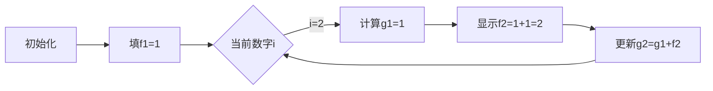

# 题目信息

# [NOIP 2001 普及组] 数的计算

## 题目描述

给出正整数 $n$，要求按如下方式构造数列：

1. 只有一个数 $n$ 的数列是一个合法的数列。
2. 在一个合法的数列的末尾加入一个正整数，但是这个正整数不能超过该数列最后一项的一半，可以得到一个新的合法数列。

请你求出，一共有多少个合法的数列。两个合法数列 $a, b$ 不同当且仅当两数列长度不同或存在一个正整数 $i \leq |a|$，使得 $a_i \neq b_i$。

## 说明/提示

### 样例 1 解释

满足条件的数列为：
- $6$
- $6, 1$
- $6, 2$
- $6, 3$
- $6, 2, 1$
- $6, 3, 1$

### 数据规模与约定

对于全部的测试点，保证 $1 \leq n \leq 10^3$。

### 说明

本题数据来源是 NOIP 2001 普及组第一题，但是原题的题面描述和数据不符，故对题面进行了修改，使之符合数据。原题面如下，谨供参考：

> 我们要求找出具有下列性质数的个数（包含输入的正整数 $n$）。
>
> 先输入一个正整数 $n$（$n \le 1000$），然后对此正整数按照如下方法进行处理：
>
> 1. 不作任何处理；
> 2. 在它的左边拼接一个正整数，但该正整数不能超过原数，或者是上一个被拼接的数的一半；
> 3. 加上数后，继续按此规则进行处理，直到不能再加正整数为止。

感谢 @[dbxxx](/user/120868) 对本题情况的反馈，原题面的问题见[本贴](https://www.luogu.com.cn/discuss/526184)。

## 样例 #1

### 输入

```
6
```

### 输出

```
6
```

# AI分析结果


### 💡 Kay的C++算法解析：数的计算 深入学习指南 💡

**引言**  
今天我们一起分析NOIP普及组经典题目「数的计算」。这道题要求计算满足特定构造规则的数列数量，我们将通过动态规划（DP）核心思想解决它，并掌握递推优化技巧。

---

### 1. 题目解读与核心算法识别  
✨ **本题主要考察**：`动态规划`（递推优化）  

🗣️ **初步分析**：  
> 解决本题的关键在于理解**动态规划**思想。想象你正在搭积木塔：第一块积木是数字n，后续每块积木必须≤前一块的一半。DP的核心是**用已知小块答案组合出大块答案**。  
> - **题解共性**：定义`f[i]`表示以`i`开头的合法数列数量。核心递推式：`f[i] = 1 + Σf[j] (j≤i/2)`，其中`1`表示单独数列`[i]`，求和部分代表添加数字后的扩展。  
> - **核心难点**：直接双重循环计算会导致O(n²)复杂度。优化关键是用前缀和数组`g[i]=f[1]+...+f[i]`将计算简化为`f[i]=g[i/2]+1`。  
> - **可视化设计**：动画将展示像素网格填表过程，高亮状态转移路径（如`f[4]`由`f[1]`和`f[2]`累加），搭配积木搭建音效和8-bit风格胜利BGM。

---

### 2. 精选优质题解参考  
**题解一（shinzanmono）**  
* **亮点**：首创前缀和优化，时间复杂度降至O(n)。代码用`g[i]`存储前缀和，`f[i]=g[i/2]+1`的精炼实现体现算法本质。变量命名规范（`f`状态数组，`g`前缀和），边界处理严谨（显式初始化`f[1]`）。

**题解二（Lawrenceling）**  
* **亮点**：相同O(n)优化但代码更简洁。用`a[i]`替代`f[i]`，`s[i]`替代`g[i]`，突出"状态值+前缀和"的通用DP优化模式。循环内直接计算`s[i]`避免冗余变量。

**题解三（Hhy140516）**  
* **亮点**：基础双重循环解法虽未优化，但直观展示DP思想。内层循环`j≤i/2`清晰对应问题规则，`f[i]++`巧妙处理单数列情况，适合初学者理解DP原理。

---

### 3. 核心难点辨析与解题策略  
1. **状态定义抽象**  
   * **分析**：如何理解`f[i]`代表"以`i`开头的数列数"而非"以`i`结尾"？优质题解通过样例（如`f[2]=2`对应`[2]`,`[2,1]`）验证定义正确性，强调首个数字决定后续可能性范围。  
   * 💡 **学习笔记**：DP状态需完整覆盖子问题且具无后效性。

2. **递推优化实现**  
   * **分析**：直接计算`Σf[j] (j=1→i/2)`导致O(n²)。前缀和`g[i]=g[i-1]+f[i]`将求和转为O(1)查询，本质是用空间换时间。  
   * 💡 **学习笔记**：涉及区间求和的DP转移都可考虑前缀和/树状数组优化。

3. **边界与初始化**  
   * **分析**：`f[1]=1`是递推基础（无法继续添加）。优质题解均显式初始化，避免未定义行为。  
   * 💡 **学习笔记**：DP的边界条件常是递归基或最小子问题。

#### ✨ 解题技巧总结
- **递推拆解**：将大数字拆分为小数字子问题组合（`f[6]=f[1]+f[2]+f[3]+1`）  
- **前缀和应用**：用`g[i/2]`替代循环求和，时间复杂度从O(n²)优化到O(n)  
- **记忆化搜索**：递归解法需用数组存储中间结果避免重复计算  

---

### 4. C++核心代码实现赏析  
**通用核心实现（综合优化版）**  
```cpp
#include <iostream>
using namespace std;
const int N = 1005;
int f[N], g[N]; // f[i]:以i开头的数列数; g[i]:f[1]到f[i]的和

int main() {
    int n; cin >> n;
    f[1] = g[1] = 1; // 初始化边界
    for (int i = 2; i <= n; i++) {
        f[i] = g[i/2] + 1;    // 关键优化：前缀和替代循环
        g[i] = g[i-1] + f[i]; // 更新前缀和
    }
    cout << f[n];
    return 0;
}
```
**代码解读概要**：  
1. 初始化`f[1]=1`（数字1只有单数列）  
2. 从`i=2`开始递推：`f[i]`的值等于所有≤`i/2`的数字的数列数之和（通过`g[i/2]`获取）+1  
3. 实时更新前缀和`g[i]`供后续使用  

**题解片段赏析**  
1. shinzanmono（前缀和优化）  
   ```cpp
   f[1]=g[1]=1;
   for(int i=2;i<=n;i++) 
       f[i]=g[i/2]+1, g[i]=g[i-1]+f[i]; // 逗号运算符精简代码
   ```
   * **解读**：`g[i/2]`直接获取`f[1]`到`f[i/2]`的累加值，避免内层循环。逗号运算符实现单行双操作。  
   * 💡 **学习笔记**：前缀和是空间换时间的经典技巧。

2. Lawrenceling（变量精简版）  
   ```cpp
   a[1]=s[1]=1; // a等效f, s等效g
   for(int i=2;i<=n;i++) {
       a[i]=s[i/2]+1;
       s[i]=s[i-1]+a[i]; 
   }
   ```
   * **解读**：通过更短变量名保持代码紧凑，`s[i/2]`实现同样优化效果。  
   * 💡 **学习笔记**：算法本质优于变量命名，但实际工程建议用描述性名称。

3. Hhy140516（基础双重循环）  
   ```cpp
   for(int i=1;i<=n;i++) {
       for(int j=1;j<=i/2;j++) 
           f[i] += f[j]; // 累加子问题
       f[i]++; // 加上自身
   }
   ```
   * **解读**：内层循环显式求和`f[1]`到`f[i/2]`，直观但效率低。`f[i]++`处理单数列情况。  
   * 💡 **学习笔记**：未优化代码帮助理解DP思想，实际应用需优化。

---

### 5. 算法可视化：像素动画演示  
**主题**：8-bit风格「递推积木塔」建造模拟  

**核心演示流程**：  


**动画实现细节**：  
1. **像素场景**：  
   - 16×16像素网格，每行代表数字1~n，每列显示对应`f[i]`值  
   - 积木块颜色编码：绿色（已计算），黄色（当前计算），红色（依赖项）  

2. **关键操作演示**：  
   - **步骤1**（i=2）：黄色积木块从第2行升起，红色箭头从`f[1]`指向它，显示公式`f[2]=g[1]+1=2`  
   - **步骤2**（i=4）：显示`g[2]=f[1]+f[2]=3`，黄色积木升起同时播放“叮”音效，顶部显示`f[4]=g[2]+1=4`  

3. **游戏化元素**：  
   - 每完成5个状态触发8-bit胜利音效，网格闪烁庆祝  
   - 控制面板：步进按钮（观察转移）、速度滑块（调速递推）  

4. **技术实现**：  
   - Canvas绘制动态网格，关键操作用`requestAnimationFrame`递推  
   - 音效：Web Audio API播放NES风格音效（入队声、胜利音）  

---

### 6. 拓展练习与相似问题思考  
**通用技巧迁移**：  
前缀和优化适用于：  
1. 区间统计问题（如区间和查询）  
2. 树状数组/线段树的简化替代  
3. 多重循环优化（将O(n²)降为O(n)）  

**洛谷推荐**：  
1. **P1192 台阶问题**  
   > 递推+前缀和直接应用，强化`g[i]=Σf[i-k]`思想  

2. **P1029 最大公约数问题**  
   > 结合数学与DP，练习状态设计  

3. **P1044 栈**  
   > 卡特兰数递推，深化子问题分解思想  

---

### 7. 学习心得与经验分享  
> **作者经验（x12345678901）**：  
> *“最初递归超时，后用记忆化避免重复计算。这让我意识到：递归树重叠子问题必须存储中间结果！”*  
>  
> **Kay点评**：这是DP的核心原则——用空间换时间。建议初学者动手画递归树，直观感受重叠子问题如何影响效率。

---

### 结语  
通过本次分析，我们掌握了动态规划的核心思想、递推实现与优化技巧。记住：  
1. 定义状态要覆盖子问题本质  
2. 前缀和是优化区间求和的利器  
3. 动手模拟递推过程加深理解  

下次我们将探索更复杂的DP问题！🚀

---
处理用时：194.56秒