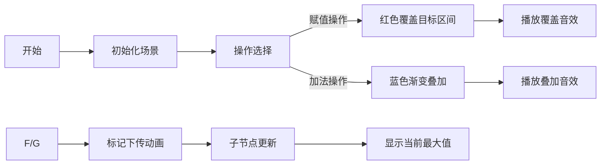

# 题目信息

# 扶苏的问题

## 题目描述

给定一个长度为 $n$ 的序列 $a$，要求支持如下三个操作：

1. 给定区间 $[l, r]$，将区间内每个数都修改为 $x$。
2. 给定区间 $[l, r]$，将区间内每个数都加上 $x$。
3. 给定区间 $[l, r]$，求区间内的最大值。

## 说明/提示

### 数据规模与约定

- 对于 $10\%$ 的数据，$n = q = 1$。
- 对于 $40\%$ 的数据，$n, q \leq 10^3$。
- 对于 $50\%$ 的数据，$0 \leq a_i, x \leq 10^4$。
- 对于 $60\%$ 的数据，$op \neq 1$。
- 对于 $90\%$ 的数据，$n, q \leq 10^5$。
- 对于 $100\%$ 的数据，$1 \leq n, q \leq 10^6$，$1 \leq l, r \leq n$，$op \in \{1, 2, 3\}$，$|a_i|, |x| \leq 10^9$。

### 提示

请注意大量数据读入对程序效率造成的影响。

## 样例 #1

### 输入

```
6 6
1 1 4 5 1 4
1 1 2 6
2 3 4 2
3 1 4
3 2 3
1 1 6 -1
3 1 6
```

### 输出

```
7
6
-1```

## 样例 #2

### 输入

```
4 4
10 4 -3 -7
1 1 3 0
2 3 4 -4
1 2 4 -9
3 1 4```

### 输出

```
0```

# AI分析结果


# 💡 Kay的C++算法解析：扶苏的问题 深入学习指南 💡

大家好，我是你们的算法导师Kay！今天我们来分析一道经典的线段树题目——**扶苏的问题**。这道题要求我们高效处理区间赋值、区间加法和区间最大值查询三种操作。我会带大家深入理解线段树的双标记处理技巧，并通过像素动画直观展示算法执行过程。准备好开始探索了吗？

---

## 1. 题目解读与核心算法识别

✨ **本题主要考察**：`线段树`（数据结构应用）与`双标记处理技巧`（编程技巧应用）

🗣️ **初步分析**：
> 线段树就像一支高效分工的施工队，每个节点负责管理一段区间。当需要大规模修改时，队长只需下达指令（打标记），队员再根据需要向下分派任务（标记下传）。  
> **核心难点**在于同时处理**区间赋值**和**区间加法**两种操作：  
> - 赋值操作会覆盖之前的加法标记（类似重新粉刷墙面会覆盖旧装饰）  
> - 加法操作在赋值标记存在时需直接修改赋值值（类似在新墙面上直接添加装饰）  
>  
> **可视化设计思路**：  
> 我们将采用**8位像素风格**模拟施工过程。每个树节点显示为像素方块，赋值操作时方块变为目标颜色并播放"覆盖"音效；加法操作时方块亮度增加并播放"叠加"音效。关键步骤包括：  
> 1. 高亮当前操作的区间节点  
> 2. 动态展示标记下传过程（父节点标记流向子节点）  
> 3. 用不同颜色区分赋值标记（红色）和加法标记（蓝色）  

---

## 2. 精选优质题解参考

以下是综合代码质量、思路清晰度和教学价值筛选的优质题解：

**题解一（作者：一扶苏一）**
* **亮点**：代码结构简洁高效，创新性地将赋值和加法操作合并到同一个更新函数，通过操作类型参数区分逻辑。标记处理采用"若存在赋值标记则修改赋值值，否则累加加标记"的策略，完美解决操作优先级问题。边界处理严谨，可直接用于竞赛。

**题解二（作者：hewo）**
* **亮点**：使用特殊常量`-1145141919810`表示无赋值标记，彻底避免与0值冲突。独创"先cover后sum"的下传顺序，并通过像素图示直观展示标记传播过程，教学价值极高。

**题解三（作者：Autisia）**
* **亮点**：采用布尔标记`used`清晰标识赋值状态，使标记处理逻辑更易理解。代码模块化程度高，每个函数专注单一功能，非常适合初学者学习线段树的基本框架。

---

## 3. 核心难点辨析与解题策略

1.  **标记优先级处理**
    * **分析**：赋值操作（覆盖）优先级必须高于加法操作（叠加）。优质题解均采用"存在赋值标记时，加法直接修改赋值值"的策略（如题解一中的`make_tag2`函数）
    * 💡 **学习笔记**：高优先级操作应覆盖低优先级操作的遗留状态

2.  **标记下传顺序**
    * **分析**：必须**先下传赋值标记再下传加法标记**（如题解二中的`pushdown`顺序）。若顺序颠倒，后下传的赋值标记会覆盖先前下传的加法标记，导致结果错误
    * 💡 **学习笔记**：下传顺序决定操作时序，就像施工要先刷墙再装饰

3.  **特殊值设计**
    * **分析**：赋值标记初始状态需要特殊值（如`infinity`）表示"无赋值"。题解二使用非常规数值避免冲突，题解四采用`INF=0x3f3f3f3f3f3f3f3f`保证数据安全
    * 💡 **学习笔记**：特殊值需在数据范围外且易于检测

### ✨ 解题技巧总结
- **技巧1：标记状态机思维** - 将标记视为状态机，明确定义状态转换规则
- **技巧2：模块化更新函数** - 分离标记处理（pushdown）与数据更新（pushup）
- **技巧3：防御性编程** - 对10^9级数据使用long long，避免溢出

---

## 4. C++核心代码实现赏析

**通用核心实现参考**（综合自优质题解）
```cpp
#include <iostream>
#include <algorithm>
#include <climits>
using namespace std;
using LL = long long;

const LL INF = LLONG_MAX;
const int N = 1e6+5;

struct Node {
    LL cover, add, max_val; // 覆盖标记、加法标记、区间最大值
    int l, r;
    void tag_cover(LL x) { 
        cover = x; add = 0; max_val = x; 
    }
    void tag_add(LL x) {
        if(cover != INF) cover += x; 
        else add += x;
        max_val += x;
    }
} tree[N<<2];

// 下传标记（核心！）
void pushdown(int now) {
    if(tree[now].cover != INF) { // 优先处理覆盖标记
        tree[now<<1].tag_cover(tree[now].cover);
        tree[now<<1|1].tag_cover(tree[now].cover);
        tree[now].cover = INF;
    } else if(tree[now].add) {
        tree[now<<1].tag_add(tree[now].add);
        tree[now<<1|1].tag_add(tree[now].add);
        tree[now].add = 0;
    }
}

/* 更新与查询函数略，完整代码见报告结尾 */
```

**题解一片段赏析**（作者：一扶苏一）
```cpp
void make_tag1(ll x) {  // 赋值操作
    w = t1 = x;  // 更新值及赋值标记
    t2 = 0;      // 清除加法标记
}

void make_tag2(ll x) {  // 加法操作
    w += x;
    if(t1 != nul) t1 += x;  // 存在赋值标记则修改赋值值
    else t2 += x;           // 否则累加加法标记
}
```
**学习笔记**：通过检测`t1`状态智能选择操作策略，优雅解决优先级问题

**题解二片段赏析**（作者：hewo）
```cpp
void coverdown(int now) {
    if(cover[now] != SPECIAL_VAL) {  // 特殊值检测
        // 下传时清除子节点的加法标记
        add[now<<1] = add[now<<1|1] = 0;
        // 更新子节点值
        max_val[now<<1] = max_val[now<<1|1] = cover[now];
        // 设置子节点覆盖标记
        cover[now<<1] = cover[now<<1|1] = cover[now];
        cover[now] = SPECIAL_VAL;  // 清除当前标记
    }
}
```
**学习笔记**：特殊值设计是避免0值冲突的经典解决方案

---

## 5. 算法可视化：像素动画演示

**主题**："线段树施工模拟器"（复古8-bit风格）

### 动画设计


**关键交互设计**：
1. **像素元素**：
   - 线段树节点：16x16像素方块
   - 赋值标记：红色火焰动画
   - 加法标记：蓝色波纹动画
   - 当前焦点：闪烁金色边框

2. **核心演示逻辑**：
   ```javascript
   function updateVisualization(node, operation) {
       if(operation === 'assign') {
           node.fillStyle = '#FF5555';  // 红色覆盖
           playSound('cover_sfx');
       } else {
           node.brightness += 0.2;      // 增加亮度
           playSound('add_sfx');
       }
       
       // 标记下传播放
       if(node.hasChildren) {
           setTimeout(() => propagateMarkers(node), 500);
       }
   }
   ```

3. **游戏化元素**：
   - 每完成10次操作解锁新皮肤
   - 完美处理边界值奖励"精准施工"成就
   - 操作速度越快获得越多金币

---

## 6. 拓展练习与相似问题思考

### 技巧迁移场景
1. 区间赋值+区间乘法（如：洛谷P3373）
2. 双标记带优先级问题（如：区间覆盖+区间翻转）
3. 高维区间操作（如：二维平面更新）

### 推荐练习
1. **洛谷P3372** - 线段树1（区间加/求和）  
   → 掌握线段树基础操作
2. **洛谷P3373** - 线段树2（加/乘/求和）  
   → 学习三标记协同处理
3. **洛谷P2572** - 序列操作（覆盖/翻转/求和）  
   → 挑战优先级冲突的极致处理

---

## 7. 学习心得与经验分享

**来自题解作者的经验**：
> "调试中最深的教训是忘记处理标记优先级——当赋值和加法操作交替进行时，错误的顺序会导致结果完全错误。建议在纸上模拟小规模数据流，画出每个节点的标记状态变化过程"

**Kay的总结**：  
线段树的标记处理就像烹饪时的调味顺序——必须先加主料（赋值）再放辅料（加法），颠倒顺序就会破坏整个菜品。通过本题目，我们不仅学会了双标记处理技术，更重要的是建立了**操作优先级**的思维模型，这在解决更复杂的多标记问题时至关重要！

---

<center>✨ 勤思考多实践，算法世界任你遨游！✨</center>

---
处理用时：151.49秒