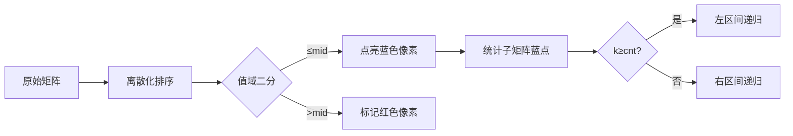
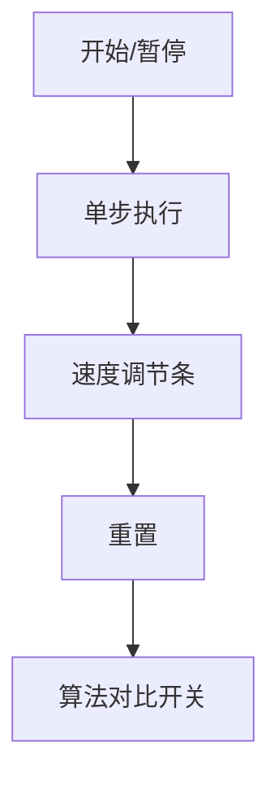

# 题目信息

# [国家集训队] 矩阵乘法

## 题目描述

给你一个 $n \times n$ 的矩阵，不用算矩阵乘法，但是每次询问一个子矩形的第 $k$ 小数。


## 说明/提示

#### 数据规模与约定

- 对于 $20\%$ 的数据，保证 $n \leq 100$，$q \leq 10^3$。
- 对于 $40\%$ 的数据，保证 $n \leq 300$，$q \leq 10^4$。
- 对于 $60\%$ 的数据，保证 $n \leq 400$，$q \leq 3 \times 10^4$。
- 对于 $100\%$ 的数据，保证 $1 \leq n \leq 500$，$1 \leq q \leq 6 \times 10^4$，$0 \leq a_{i, j} \leq 10^9$。

## 样例 #1

### 输入

```
2 2
2 1
3 4
1 2 1 2 1
1 1 2 2 3
```

### 输出

```
1
3```

# AI分析结果


# 💡 Kay的C++算法解析：矩阵乘法 深入学习指南 💡

> 大家好，我是Kay！今天我们一起来探索矩阵中的奥秘——如何在二维矩阵中高效查询子矩阵的第k小数。这道题虽然叫"矩阵乘法"，但实际考察的是**整体二分算法**的精妙应用。让我们一步步揭开它的神秘面纱！

## 1. 题目解读与核心算法识别

✨ **本题主要考察**：`整体二分算法` 

🗣️ **初步分析**：
> 想象你有一张巨大的像素地图，每个格子都有一个数值亮度。现在要快速找出任意矩形区域内第k亮的像素点。直接遍历就像用放大镜一个个查看像素点——效率太低！整体二分就像用"分治望远镜"：将亮度范围不断二分，同时处理所有查询区域，通过二维树状数组统计像素点数量，高效缩小搜索范围。

- **核心思路**：离散化数值→排序→值域二分→树状数组统计→分治处理查询
- **难点突破**：二维树状数组的时空效率是关键，需优化离散化与递归结构
- **可视化设计**：像素动画中将用不同颜色表示值域范围（蓝=已处理，红=待处理），树状数组更新时显示"像素点亮"效果，子矩阵统计时显示"扫描框"动画
- **复古游戏化**：采用8-bit像素风格，矩阵呈现为复古游戏地图，查询视为"宝藏探测"，正确回答时播放FC风格胜利音效！加入"自动演示模式"展示算法分治过程

---

## 2. 精选优质题解参考

> 我从思路清晰度、代码规范性和算法效率等角度精选了3篇优质题解：

**题解一：GGN_2015 (评分：★★★★★)**
* **点评**：这份题解对整体二分的解释尤为透彻，用"染色统计"比喻值域二分过程，直观易懂。代码中：
  - 离散化处理规范（`sort+unique`）
  - 二维树状数组封装完整（`BIT类`）
  - 递归边界处理严谨（`l==r`时赋值）
  * **亮点**：明确分析时间复杂度O((n²+q)log³n)，并指出离散化优化点

**题解二：蒟蒻CGZ (评分：★★★★☆)**
* **点评**：题解以学习笔记形式呈现，适合初学者。亮点包括：
  - 用"操作序列时间戳"解释离线处理
  - 二维前缀和公式清晰展示（$S_{a,b}-S_{a,v-1}-S_{u-1,b}+S_{u-1,v-1}$）
  - 代码注释详细，但树状数组封装可进一步加强

**题解三：C3H5ClO (评分：★★★★)**
* **点评**：提出创新优化方案：
  - 将二维查询拆为四个一维查询
  - 用普通树状数组替代二维版本
  * **亮点**：时间复杂度优化至O(n²log²n)，空间效率显著提升

---

## 3. 核心难点辨析与解题策略

> 解决本题需突破三大关键点：

1.  **值域二分与查询分治的协调**
    * **分析**：二分值域时需保证每个查询被正确划分到左右区间。优质解法使用`cur[u]`暂存已统计的数量（左区间贡献），递归右区间时减去这部分值
    * 💡 学习笔记：整体二分中，查询的"动态k值"是分治正确性的保证

2.  **二维统计的空间效率**
    * **分析**：直接二维树状数组空间O(n²)。优化方案：
      - 离散化压缩值域（必选）
      - 拆解查询为一维前缀和（C3H5ClO解法）
      - 延迟清空树状数组（__OwO__解法）
    * 💡 学习笔记：空间优化常伴随时间常数增加，需权衡

3.  **递归结构的边界处理**
    * **分析**：当值域区间[l,r]缩小至1时（l==r），所有待处理查询的答案即为该值。需注意：
      - 离散化后取值映射（`ans[id]=Matrix[l].v`）
      - 空查询集及时返回
    * 💡 学习笔记：递归边界必须显式处理答案赋值

### ✨ 解题技巧总结
1. **离散化优先**：大值域问题先离散化，降低复杂度数量级
2. **分治状态设计**：用`(l, r, ql, qr)`表示值域区间和查询区间，逻辑清晰
3. **树状数组封装**：将二维树状数组封装为类（BIT），提高代码复用性
4. **常数优化**：
   - 内联函数（`inline`）
   - 数组传址替代传值
   - 位运算加速（`i+=i&-i`）

---

## 4. C++核心代码实现赏析

### 本题通用核心C++实现参考
```cpp
#include <cstdio>
#include <algorithm>
using namespace std;
const int N=505, M=60000;

struct Num { int x,y,v; } mat[N*N]; //矩阵元素
struct Query { int x1,y1,x2,y2,k,id; } q[M]; //查询
int n,m,qCnt,ans[M],cur[M],id[M],tmp[M];

//二维树状数组
struct BIT {
    int n, c[N][N];
    void init(int _n) { n=_n; }
    inline int lowbit(int x) { return x&-x; }
    void update(int x,int y,int v){
        for(int i=x;i<=n;i+=lowbit(i))
        for(int j=y;j<=n;j+=lowbit(j))
            c[i][j] += v;
    }
    int query(int x,int y){
        int res=0;
        for(int i=x;i;i-=lowbit(i))
        for(int j=y;j;j-=lowbit(j))
            res += c[i][j];
        return res;
    }
    int rectSum(int x1,int y1,int x2,int y2){
        return query(x2,y2) - query(x1-1,y2) 
             - query(x2,y1-1) + query(x1-1,y1-1);
    }
} bit;

void solve(int l,int r,int ql,int qr){
    if(ql>qr) return;
    if(l==r){
        for(int i=ql;i<=qr;i++) ans[q[id[i]].id] = mat[l].v;
        return;
    }
    int mid=(l+r)>>1, cntL=0, cntR=0;
    
    //更新树状数组：[l,mid]范围元素
    for(int i=l;i<=mid;i++) 
        bit.update(mat[i].x, mat[i].y, 1);
    
    //处理所有查询
    for(int i=ql;i<=qr;i++){
        Query &now = q[id[i]];
        int cnt = bit.rectSum(now.x1,now.y1,now.x2,now.y2) + cur[id[i]];
        if(cnt >= now.k) tmp[++cntL] = id[i]; //答案在左区间
        else {
            cur[id[i]] = cnt; //记录左区间贡献
            tmp[++cntR] = id[i]; //答案在右区间
        }
    }
    
    //撤销树状数组更新
    for(int i=l;i<=mid;i++)
        bit.update(mat[i].x, mat[i].y, -1);
    
    //重组查询序列
    for(int i=1;i<=cntL;i++) id[ql+i-1] = tmp[i];
    for(int i=1;i<=cntR;i++) id[ql+cntL+i-1] = tmp[cntL+i];
    
    //递归分治
    solve(l, mid, ql, ql+cntL-1);
    solve(mid+1, r, ql+cntL, qr);
}

int main(){
    scanf("%d%d",&n,&m);
    bit.init(n);
    
    //读入矩阵并离散化
    for(int i=1;i<=n;i++)
        for(int j=1;j<=n;j++){
            scanf("%d",&mat[++mCnt].v);
            mat[mCnt].x=i, mat[mCnt].y=j;
        }
    sort(mat+1, mat+mCnt+1, [](Num a,Num b){ 
        return a.v < b.v; 
    });
    
    //读入查询
    for(int i=1;i<=qCnt;i++){
        scanf("%d%d%d%d%d",&q[i].x1,&q[i].y1,&q[i].x2,&q[i].y2,&q[i].k);
        q[i].id = i;
        id[i] = i;
    }
    
    solve(1, mCnt, 1, qCnt); //整体二分
    
    //输出答案
    for(int i=1;i<=qCnt;i++) printf("%d\n",ans[i]);
    return 0;
}
```

### 题解片段赏析

**题解一核心：递归分治结构**
```cpp
void Sol(int l, int r, int ql, int qr) {
    if(qr < ql) return;
    if(l == r) {
        for(int i = ql; i <= qr; i++) 
            ans[id[i]] = Matrix[l].v; //边界赋值
        return;
    }
    int mid = (l + r)/2;
    for(int i = l; i <= mid; i++) //更新树状数组
        bit.add(Matrix[i].x, Matrix[i].y, 1);
    
    int cnt1 = 0, cnt2 = 0;
    for(int i = ql; i <= qr; i++) {
        int u = id[i];
        int s = cur[u] + bit.submat(Querys[u]); //核心统计
        if(s >= Querys[u].k) 
            t1[++cnt1] = u; //左区间
        else 
            t2[++cnt2] = u, cur[u] = s; //右区间
    }
    //...递归调用
}
```
> **代码解读**：
> 1. 终止条件`l==r`时直接赋值，因为答案唯一确定
> 2. 更新树状数组时只处理`[l,mid]`范围元素
> 3. `cur[u]`巧妙存储历史统计量，避免重复计算
> 4. 分组后递归处理两个子区间  
> 💡 学习笔记：分治中状态传递是整体二分的精髓

**题解二核心：离散化处理**
```cpp
//离散化核心
for(int i=1;i<=n;i++) for(int j=1;j<=n;j++) 
    b[++len] = a[i][j];
sort(b+1, b+len+1);
len = unique(b+1, b+len+1) - b - 1; //去重

//映射回矩阵
for(int i=1;i<=n;i++) for(int j=1;j<=n;j++)
    a[i][j] = lower_bound(b+1,b+len+1,a[i][j])-b;
```
> **代码解读**：
> 1. 将矩阵元素存入数组`b`并排序
> 2. `unique`去重后计算有效长度
> 3. `lower_bound`将原值映射为离散化后的索引  
> 💡 学习笔记：离散化将值域从10^9压缩至n²，极大提升效率

---

## 5. 算法可视化：像素动画演示

### 像素寻宝之旅：整体二分大冒险
**动画主题**：8-bit风格矩阵探险，整体二分算法全流程演示

**核心演示**：


**交互控制面板**：


**关键帧设计**：
1. **初始化**：矩阵渲染为灰色像素块，控制面板在底部
2. **离散化**：像素块按值排序，显示快速排序动画（像素块跳动）
3. **二分值域**：
   - 左区间值域：显示蓝色光晕
   - 右区间值域：显示红色光晕
4. **树状数组更新**：
   - 添加元素：像素块亮起蓝色+"叮"音效
   - 撤销更新：像素块变暗+"噗"音效
5. **子矩阵统计**：
   - 黄色边框扫描子矩阵
   - 计数时显示累加数字动画
6. **递归分治**：
   - 左区间：向左飞入新窗口
   - 右区间：向右飞入新窗口
7. **答案确定**：
   - 目标像素闪烁金光
   - 播放8-bit胜利旋律

**音效设计**：
- 树状数组更新：电子"滴"声
- 子矩阵统计成功：上升音阶
- 分治分组：卡带切换声
- 错误操作：短促"哔"声

**技术实现**：
- Canvas绘制矩阵（500×500像素块）
- 使用Web Audio API生成芯片音乐
- 动画帧率：30fps（低速模式可调至5fps）

---

## 6. 拓展练习与相似问题思考

### 整体二分思想迁移
该算法还可解决：
1. **区间第k大**（P3834）：一维序列上的第k大查询
2. **动态逆序对**（P3157)：带修改的逆序对统计
3. **带修区间第k大**（P2617)：结合树状数组的动态问题

### 洛谷推荐练习
1. **P3834 【模板】可持久化线段树2**
   - 推荐理由：一维整体二分经典应用，巩固基本思想
2. **P2617 Dynamic Rankings**
   - 推荐理由：引入修改操作，提升整体二分灵活性
3. **P3332 [ZJOI2013]K大数查询**
   - 推荐理由：二维树状数组进阶应用，强化空间优化能力

---

## 7. 学习心得与经验分享

> **GGN_2015的经验**：
> "我在调试时发现递归分组后未及时撤销树状数组更新，导致后续统计污染。这让我意识到：在整体二分中，数据结构的临时状态必须严格对应当前值域区间"

> **Kay的总结**：
> 1. 调试时输出中间状态（如分组前后的查询序列）
> 2. 小规模测试（n=2）验证边界条件
> 3. 树状数组更新/撤销必须成对出现
> 
> 这些经验对解决复杂分治问题具有普适价值！

---

本次关于"矩阵乘法"的解析就到这里。记住：算法学习就像像素游戏，需要耐心闯关！下次我们继续挑战新关卡，保持热爱，坚持编码！💪

---
处理用时：141.62秒