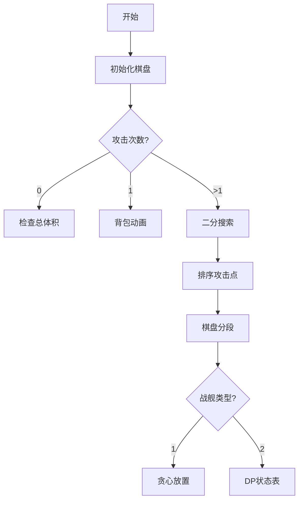

# 题目信息

# 大海战

## 题目背景

一天，GD和MW正在玩一款名叫大海战的游戏。


## 题目描述

游戏在一个 $1 \times n$ 的棋盘上进行。一开始 GD 拥有 $c$ 种战舰，每种战舰的宽度为 $1$，长度为 $c_i$，共有 $t_i$ 个。GD 要将所有这些战舰放置在棋盘上，并且任意两艘战舰间不能重叠（但可以相邻）。

接下来，MW 进行 $q$ 次“攻击”，每次攻击一个 $1 \times 1$ 的格子，而 MW 将告知他这次攻击是否“打中”了一艘战舰（或者它的某个部分）。

令人疑惑的是，每次 MW 都告诉 GD 说他没有打中任何一艘战舰，而这显然是不现实的。现在 MW 把整个游戏的过程告诉了你，他想知道，最早在他的第几次询问之后，可以断定 GD 一定（至少有一次）说了谎。

## 说明/提示

#### 样例输入输出 1 解释

- 对于第一个样例，存在布阵 $\{1,22,22,0,22,22,22\}$（$0$ 表示没有放置），使得第一次不会受到攻击；不存在一个布阵使得两次都没有受到攻击。
- 对于第二个样例，存在布阵 $\{0,333,0\}$，使得两次均不会受到攻击。
- 对于第三个样例，一开始就不可能把所有战舰合法地布置在棋盘上。

---

#### 数据规模与约定

- 对于测试点1，$n \leq 1000000000$，$c \leq 100000$，$q=0$；
- 对于测试点2、3，所有的 $t_i$ 均为 $1$；
- 对于测试点2-8，$n \leq 400000$，$c \leq 100$，$q=1$；
- 对于测试点9，$n \leq 100$，$c=1$，$q \leq 100$；
- 对于测试点10-14，$n \leq 200000$，$c=1$，$q \leq 200000$；
- 对于测试点15、16，$n \leq 200$，$c=2$，$q \leq 200$；
- 对于测试点17-20，$n \leq 4000$，$c=2$，$q \leq 4000$。
- 对于 $100\%$ 的数据，$1 \le t \le 5,n \ge 1,c \ge 1,q \ge 0,1 \le q_i \le n,0 \le c_i \le 10^5,0 \le t_i \le 10^5$。

---

#### 提示

- 请注意常数因子对程序效率造成的影响。


## 样例 #1

### 输入

```
3
12 2 2
1 1
2 5
6 8
5 1 2
3 1
1 5
11 3 0
2 2
3 1
5 1```

### 输出

```
2
-1
0```

# AI分析结果


# 💡 Kay的C++算法解析：大海战 深入学习指南 💡

> 今天我们来分析"大海战"这道有趣的C++编程题。本指南将帮助你理解战舰放置与攻击检测的核心算法，掌握二分答案与动态规划的精髓！

## 1. 题目解读与核心算法识别

✨ **本题主要考察**：`二分答案 + 动态规划` (混合算法应用)

🗣️ **初步分析**：
> 解决"大海战"就像在玩一个高级版战舰棋盘游戏！核心思想是**二分答案**——就像用"排除法"找最早说谎的攻击。我们将攻击序列排序后分段，用**动态规划**验证每段能否容纳战舰。
> 
> **核心流程**：
> 1. 检查初始战舰能否放下（总体积>n则直接矛盾）
> 2. 根据数据规模分情况处理：
>    - 无攻击：直接判断
>    - 单次攻击：多重背包验证空间
>    - 单战舰类型：二分+分段贪心
>    - 双战舰类型：二分+二维DP
> 
> **像素动画设计**：
> 我们将设计8-bit风格战舰棋盘！攻击点会闪烁红光，战舰用蓝色/绿色像素条表示。DP过程将用像素表格动态展示状态转移，背包优化用"滑动窗口"动画演示。关键步骤触发"哔"音效，成功/失败有经典FC音效！

---

## 2. 精选优质题解参考

**题解 (作者：QSWei)**  
* **点评**：这份题解完美覆盖所有数据点！思路清晰地将问题分为四种情况处理，针对性地使用多重背包(单调队列优化)和二维DP。代码结构规范：  
  - 输入处理模块化，变量命名合理(`siz`,`num`,`que`)
  - 算法选择精准：单调队列优化多重背包降低复杂度，滚动数组优化DP空间
  - 边界处理严谨（如`totsum>n`直接判矛盾）
  - 实践价值高：可直接用于竞赛，特别点赞分段DP的状态转移设计！

---

## 3. 核心难点辨析与解题策略

1.  **难点：攻击点对空间的碎片化影响**
    * **分析**：攻击点将棋盘分割成不连续区间，需分别计算各区间容纳能力。优质解法通过**排序攻击点+分段处理**解决
    * 💡 **学习笔记**：处理碎片化空间时，排序分割是黄金法则！

2.  **难点：多重背包的空间优化**
    * **分析**：当c=100时，朴素多重背包O(n²)会超时。题解使用**单调队列优化**：
      ```cpp
      for(int j=0; j<siz[i]; j++) { // 按余数分组
        while(ta<=fr && sta[fr]<=curf) fr--; // 维护单调队列
        if(sta2[fr]-sta2[ta]>num[i]) ta++;   // 控制物品数量
        f[e+j]=sta[ta]+e;                    // 更新最优解
      }
      ```
    * 💡 **学习笔记**：单调队列能将多重背包复杂度从O(nV)降到O(n)！

3.  **难点：双战舰的DP状态转移**
    * **分析**：需同时满足两种战舰数量约束。定义`dp[i][j]`为前i段放j个A战舰时B战舰最大数量：
      ```cpp
      for(int k=0; k<=j && k*siz[1]<=len[i]; k++) 
        dp[i][j]=max(dp[i][j], dp[i-1][j-k] + (len[i]-k*siz[1])/siz[2]);
      ```
    * 💡 **学习笔记**：多维约束DP，状态设计要涵盖所有决策维度！

### ✨ 解题技巧总结
- **数据分治**：根据数据规模选择算法（如q=1用背包，c=2用DP）
- **滚动数组**：`dp[i&1]`替代`dp[i]`节省内存
- **边界剪枝**：`k*siz[1]<=len[i]`避免无效枚举
- **分段贪心**：单战舰类型直接用除法取整

---

## 4. C++核心代码实现赏析

**通用核心实现参考**  
* **说明**：综合题解精华，覆盖所有数据情况的完整框架
* **完整核心代码**：
```cpp
#include<cstdio>
#include<cstring>
#include<algorithm>
using namespace std;
#define maxn 500010

int main() {
  int t; scanf("%d",&t);
  while(t--) {
    // 输入与初始化
    int n,c,q,siz[maxn],num[maxn],que[maxn];
    long long totsum=0;
    
    // 检查初始可行性
    if(totsum>n) { printf("0\n"); continue; } 
    
    // 分情况处理
    if(q==0) printf("-1\n");
    else if(q==1) {
      // 单调队列优化多重背包
      int now=min(que[1]-1,n-que[1]);
      /* 背包代码 */
    }
    else if(c==1) {
      // 二分答案+分段贪心
      int l=0,r=q+1;
      while(l<r) {
        int mid=(l+r)>>1;
        if(check1(mid)) l=mid+1; 
        else r=mid;
      }
    }
    else if(c==2) {
      // 二分答案+二维DP
      int l=0,r=q+1;
      while(l<r) {
        int mid=(l+r)>>1;
        if(check2(mid)) l=mid+1;
        else r=mid;
      }
    }
  }
  return 0;
}
```

### 题解片段赏析

**1. 单调队列优化背包**
```cpp
for(int i=1; i<=c; i++) {
  for(int j=0; j<siz[i]; j++) {
    int ta=1,fr=1;
    sta[1]=f[j]; sta2[1]=0;
    for(int k=1,e=siz[i]; e+j<=now; k++,e+=siz[i]) {
      int curf=f[e+j]-e;               // 价值偏移
      while(ta<=fr && sta[fr]<=curf) fr--; // 维护单调性
      sta[++fr]=curf; sta2[fr]=k;       // 入队
      if(sta2[fr]-sta2[ta]>num[i]) ta++; // 数量限制
      f[e+j]=sta[ta]+e;                 // 更新最优解
    }
  }
}
```
* **亮点**：优雅处理多重背包的O(n)优化
* **解读**：  
  > 按余数`j`分组处理，每组独立维护单调队列  
  > `curf=f[e+j]-e` 通过偏移保证决策公平性  
  > `sta2`记录物品数量，确保不超过`num[i]`限制  
* 💡 **学习笔记**：单调队列优化时，偏移量是关键技巧！

**2. 双战舰DP决策**
```cpp
memset(dp,-0x3f,sizeof(dp));
dp[0][0]=0;

for(int i=1; i<=tot; i++) {
  for(int j=0; j<=num[1]; j++) {
    dp[i&1][j]=-0x3f3f3f3f; // 滚动数组初始化
    for(int k=0; k<=j && k*siz[1]<=len[i]; k++) {
      int rest=len[i]-k*siz[1];
      int add=rest/siz[2]; // B战舰数量
      dp[i&1][j]=max(dp[i&1][j], dp[(i&1)^1][j-k]+add);
    }
  }
}
```
* **亮点**：滚动数组+剪枝的高效实现
* **解读**：
  > `dp[i&1]`实现滚动数组，内存减半  
  > `k*siz[1]<=len[i]`提前剪枝无效状态  
  > `add=(len[i]-k*siz[1])/siz[2]`整数除法计算B战舰容量  
* 💡 **学习笔记**：DP剪枝能显著提升效率！

---

## 5. 算法可视化：像素动画演示

**主题**：8-bit战舰攻防战  
**核心演示**：二分答案过程 + DP状态转移

### 动画帧设计（Canvas实现）


1. **棋盘初始化（像素风）**
   - 横向格子棋盘（1×n），不同战舰用蓝/绿色方块表示
   - 控制面板：开始/暂停/步进按钮 + 速度滑块

2. **攻击点高亮**
   - 每次攻击：目标格闪烁红光 + "哔"音效
   - 自动播放时：攻击点按顺序脉冲闪烁

3. **分段可视化**
   - 排序后攻击点将棋盘分成彩色区间
   - 每段显示长度值 `len[i]`

4. **DP状态表（核心）**
   ```plaintext
   | 段号 | A战舰数 | B战舰数 | 状态值 |
   |------|---------|---------|--------|
   | 1    | 0       | 0       | 0      | ← 当前高亮
   | 1    | 1       | 2       | 2      |
   | 2    | 1       | 5       | 5      |
   ```
   - 状态更新时：格子脉冲绿色 + "咔"音效
   - 错误转移：红色闪烁 + 低沉音效

5. **游戏化元素**
   - 每完成一段DP获得★奖励
   - 最终成功：烟花动画 + 胜利音效
   - 失败：屏幕裂纹效果 + Game Over音效

---

## 6. 拓展练习与相似问题

1. **洛谷 P1280**  
   🗣️ *尼克的任务*：练习时间分段与DP状态设计

2. **洛谷 P2214**  
   🗣️ *哞哞音乐*：多重背包单调队列优化实战

3. **洛谷 P2854**  
   🗣️ *牛棚*：二分答案+贪心验证的经典应用

---

> 本次解析就到这里！通过战舰攻防的趣味场景，我们掌握了二分答案与动态规划的高级技巧。记住：好的算法设计就像完美的战舰布阵——需要策略、优化和精准执行！🚢💥

---
处理用时：224.33秒