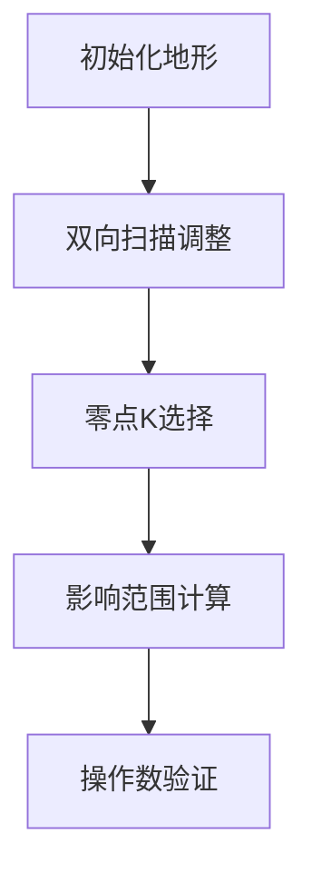

# 题目信息

# [POI 2012] STU-Well

## 题目描述

Byteasar 出发沿着穿越 Byteotian 沙漠的干河旅行。不幸的是，干河已经干涸，Byteasar 的水也用完了。他唯一的希望是在干涸的河床上挖一个足够深的井。意识到情况的严重性，Byteasar 决定在实际开始挖掘之前仔细计划一切。危险在于他可能在到达水位之前耗尽体力——在这种情况下，他不太可能生存下来。他设法确定了水位的深度。他也知道自己能挖多少而不至于失去体力。他唯一担心的是可能发生的山体滑坡，这可能会活埋他。他通过卫星电话向你发送了一张河床的地形图。当然，他请求你帮助他确定应该在哪里挖掘，以便在不耗尽体力的情况下到达水源，同时尽可能保持挖掘坡度的平缓。他在等待你的建议！

## 说明/提示

题面翻译由 ChatGPT-4o 提供。

## 样例 #1

### 输入

```
16 15
8 7 6 5 5 5 5 5 6 6 7 8 9 7 5 5```

### 输出

```
1 2```

# AI分析结果


# 💡 Kay的C++算法解析：STU-Well 深入学习指南 💡

**引言**  
今天我们一起分析 POI 2012 的经典题目「STU-Well」。这道题要求我们在修改次数限制内调整河床高度，使某个点变为零且最大坡度最小。本指南将带你深入理解二分答案与滑动窗口的精妙应用，并通过像素动画直观展示算法执行过程。

---

## 1. 题目解读与核心算法识别

✨ **本题主要考察**：`二分答案` + `贪心扫描` + `滑动窗口优化`  

🗣️ **初步分析**：  
> 解决本题如同在沙漠中寻找最佳挖井点。核心思想是**二分答案**——先假设最大坡度允许值z，再验证是否能在m次操作内实现。这就像用不同尺寸的筛子过滤沙粒，直到找到最细的筛孔（最小z值）。  
> - **关键步骤**：  
>   1. 二分z值范围（0~1e9）  
>   2. 验证z时：  
>      - 左右扫描调整高度（满足|Δh|≤z）  
>      - 滑动窗口确定零点k的影响范围  
>      - 等差数列计算剩余操作量  
> - **可视化设计**：  
>   采用8位像素风格，河床显示为彩色方块（高度=颜色深度）。扫描时高亮当前调整点，零点k设为闪光井口，影响范围用激光射线动态展示，操作次数用像素计数器实时更新。

---

## 2. 精选优质题解参考

**题解一（kczno1）**  
* **点评**：  
  思路清晰展现二分框架与滑动窗口的双指针维护。代码中`l,r`的单调移动是亮点——通过数学证明避免O(n²)枚举。变量`s`前缀和与等差数列公式的运用（`(i-l)*(i-l+1)>>1`）彰显算法优化意识。边界处理严谨（如`a[n+1]=-1`），可直接用于竞赛。

**题解二（Alex_Wei）**  
* **点评**：  
  从约束条件（`x_i≤x_{i-1}+z`）出发，严格证明两次扫描的合法性。滑动窗口部分用“山峰与斜率”比喻帮助理解区间连续性。代码高度精简（`cmax`宏提升可读性），空间复杂度O(1)的窗口维护极具启发性。

**题解三（zjjws）**  
* **点评**：  
  图示辅助解释扫描形成的“山谷/山顶”形态，降低理解门槛。前缀和与窗口移动的配合逻辑直白，内嵌`while`均摊复杂度为O(n)的写法值得学习。实践时需注意`add[]`数组命名的歧义性。

---

## 3. 核心难点辨析与解题策略

1. **难点一：坡度约束的贪心实现**  
   *分析*：需证明两次扫描（左→右降右坡，右→左降左坡）的充分性。优质题解通过反证说明：若存在非法坡度，必在扫描中被修正。  
   💡 **学习笔记**：相邻约束问题常可通过双向扫描分解为单向子问题。

2. **难点二：零点影响范围计算**  
   *分析*：确定k点后，其影响范围呈V字形扩散。利用`a[l]≤z*(i-l)`性质，结合滑动窗口单调性（i增则l/r不降）将O(n²)优化至O(n)。  
   💡 **学习笔记**：满足单调性的区间问题首选双指针而非二分。

3. **难点三：操作次数高效计算**  
   *分析*：将影响区间分为左斜线（k→l）和右斜线（k→r）两部分。通过前缀和`s[]`获取原始高度和，再用等差数列公式`z*Δx*(Δx+1)/2`计算理论高度和。  
   💡 **学习笔记**：区间和与等差数列的结合是复杂度优化的常见手段。

### ✨ 解题技巧总结
- **拆解约束**：将绝对值约束拆解为两个单向约束处理  
- **数学优化**：用等差数列公式替代累加计算  
- **边界防御**：设置哨兵值（如a[n+1]=-1）避免越界  
- **类型防御**：大规模累加用long long防止溢出  

---

## 4. C++核心代码实现赏析

**通用核心实现参考**  
```cpp
#include <iostream>
#include <vector>
using namespace std;
typedef long long ll;

int main() {
    int n; ll m;
    cin >> n >> m;
    vector<ll> a0(n+1), a(n+1), s(n+1);
    for(int i=1; i<=n; ++i) cin >> a0[i];
    
    auto check = [&](ll z) -> int {
        ll ops = m;
        a = a0;
        // 右向扫描降坡
        for(int i=2; i<=n; ++i) 
            if(a[i] > a[i-1]+z) {
                ops -= (a[i] - (a[i-1]+z));
                a[i] = a[i-1]+z;
            }
        if(ops < 0) return 0;
        
        // 左向扫描降坡
        for(int i=n-1; i>=1; --i)
            if(a[i] > a[i+1]+z) {
                ops -= (a[i] - (a[i+1]+z));
                a[i] = a[i+1]+z;
            }
        if(ops < 0) return 0;
        
        // 前缀和初始化
        for(int i=1; i<=n; ++i) s[i] = s[i-1] + a[i];
        
        // 滑动窗口枚举零点k
        int l=1, r=1;
        for(int k=1; k<=n; ++k) {
            while(l<k && a[l]<= z*(k-l)) l++;
            while(r<n && a[r+1]>z*(r+1-k)) r++;
            ll need = (z*((k-l)*(k-l+1) + (r-k)*(r-k+1)))/2;
            if(s[r]-s[l-1] - need <= ops) return k;
        }
        return 0;
    };
    
    // 二分答案框架
    ll low=0, high=2e9;
    while(low < high) {
        ll mid = (low+high)/2;
        if(check(mid)) high = mid;
        else low = mid+1;
    }
    cout << check(low) << " " << low;
}
```
* **代码解读概要**：  
  1. `check(z)`函数实现核心验证逻辑  
  2. 双扫描处理坡度约束（O(n)）  
  3. 滑动窗口动态维护零点k的影响区间（O(n)）  
  4. 等差数列公式高效计算剩余操作量  

---

## 5. 算法可视化：像素动画演示

**主题**  
「沙漠矿工」8位像素冒险——在河床地形中寻找最佳挖井点

**核心交互设计**  


**关键动画帧实现**  
1. **地形初始化**（8位像素风）  
   - 河床高度映射为32色深度（0=黑，31=亮黄）  
   - 控制面板：Z值滑块（0-31）、操作数血条（红色像素条）

2. **双向扫描过程**  
   - 左→右扫描：矿工像素小人移动，过高地块闪烁红光后降低高度（伴随“咔嚓”音效）  
   - 扫描轨迹显示为蓝色光带，坡度超限点显示为❗标记

3. **零点选择动态**  
   - 选定k点为闪光井口（💎图案）  
   - 激光射线动画：从k点发射±z斜率的绿色射线  
   - 影响范围可视化：射线覆盖区域显示为半透明黄框

4. **操作数计算演示**  
   - 射线范围内：显示当前高度与理论高度的差值（红色负数像素）  
   - 操作数血条实时消减，不足时播放“滴嘟”警告音

5. **成功动画**  
   - 找到可行解时井口喷射水花（蓝色粒子效果）  
   - 播放8-bit胜利旋律，显示“Z= [值]”像素字体

**技术实现要点**  
- 使用Canvas绘制地形网格（20x20像素/块）  
- 扫描动画通过`requestAnimationFrame`逐帧更新  
- 音效采用Web Audio API合成8-bit音色  

---

## 6. 拓展练习与相似问题

**通用技巧迁移**  
1. 带约束的最值问题 → 二分答案  
2. 相邻元素差值限制 → 双向扫描  
3. 影响范围计算 → 滑动窗口

**推荐练习**  
1. **洛谷P3515**——灯泡高度调整（同款扫描+窗口技巧）  
   *推荐理由*：强化坡度约束处理能力  
2. **洛谷P4597**——序列递增化  
   *推荐理由*：变种坡度约束问题  
3. **洛谷P2893**——修路计划  
   *推荐理由*：结合前缀和的复杂条件验证  

---

## 7. 学习心得与经验分享

> **参考经验（Alex_Wei）**  
> “滑动窗口正确性依赖严格的单调性证明，最初未注意这点导致WA多次”  
>  
> **Kay点评**：算法优化必须建立在严谨数学证明上，这是竞赛编程的核心准则。建议编写扫描代码时同步维护循环不变量注释。

---

**结语**  
通过二分答案与滑动窗口的珠联璧合，「STU-Well」展现了算法设计的艺术美感。记住：复杂问题往往由多个基础模块组合而成。掌握核心思想后，你也能在算法沙漠中挖掘出智慧的清泉！🚀

---
处理用时：144.89秒