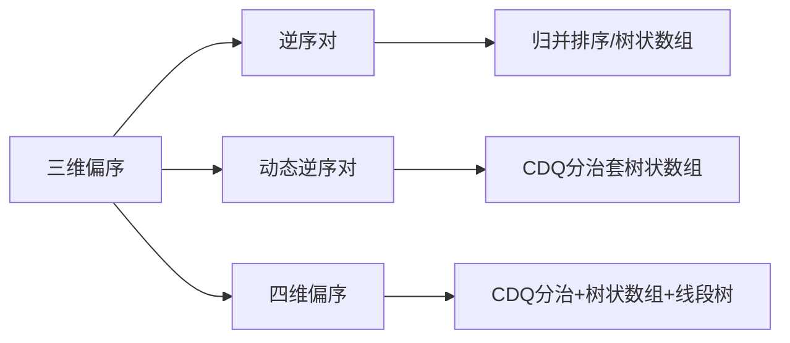

# 题目信息

# 【模板】三维偏序（陌上花开）

## 题目背景

这是一道模板题，可以使用 bitset，CDQ 分治，KD-Tree 等方式解决。

## 题目描述

有 $ n $ 个元素，第 $ i $ 个元素有 $ a_i,b_i,c_i $ 三个属性，设 $ f(i) $ 表示满足 $ a_j \leq a_i $ 且 $ b_j \leq b_i $ 且 $ c_j \leq c_i $ 且 $ j \ne i $ 的 $j$ 的数量。

对于 $ d \in [0, n) $，求 $ f(i) = d $ 的数量。

## 说明/提示

$ 1 \leq n \leq 10^5$，$1 \leq a_i, b_i, c_i \le k \leq 2 \times 10^5 $。


## 样例 #1

### 输入

```
10 3
3 3 3
2 3 3
2 3 1
3 1 1
3 1 2
1 3 1
1 1 2
1 2 2
1 3 2
1 2 1
```

### 输出

```
3
1
3
0
1
0
1
0
0
1
```

# AI分析结果


# 💡 Kay的C++算法解析：三维偏序（陌上花开）深入学习指南 💡

> “陌上花开，可缓缓归矣” —— 这道经典的三维偏序问题将带我们探索CDQ分治的精妙世界。我是Kay，今天我们一起拆解这道算法题的核心思想！

## 1. 题目解读与核心算法识别

✨ **本题主要考察**：`CDQ分治` + `树状数组` (分治策略与数据结构结合)

🗣️ **初步分析**：
> 解决三维偏序问题的核心思想是 **“降维打击”** —— 通过分治策略将三维问题逐步降为二维和一维问题。想象你在整理书架：
> - 先按书籍**高度**（第一维）排序
> - 然后在每个高度层内，按**宽度**（第二维）分组整理
> - 最后用**标签计数器**（树状数组）统计每本书前有多少本更薄的（第三维）

**核心流程**：
1. 第一维排序：按属性a升序排列（a相同时比较b，b相同时比较c）
2. 第二维CDQ分治：递归处理子区间，合并时按属性b排序
3. 第三维树状数组：对属性c动态维护前缀和

**可视化设计思路**：
> 我们设计一个**像素风图书馆管理系统**动画：
> - 书架上书籍按高度分层（a值不同颜色）
> - 分治过程用**闪光分割线**划分区间
> - 树状数组显示为**动态条形图**，插入时条形升高并播放“滴”声
> - 相同元素用**闪烁金光**提示特殊处理

---

## 2. 精选优质题解参考

**题解一（作者：echo6342）**
* **点评**：思路清晰展现了CDQ分治的三层降维逻辑，代码中`cdq()`函数的分治结构和树状数组操作形成完美配合。亮点在于用`a[i].w`处理重复元素，避免复杂判重逻辑。边界处理严谨，变量名`f[i]`、`pre[i]`含义明确，是竞赛实现的优秀参考。

**题解二（作者：FlashHu）**
* **点评**：用“分而治之”的比喻解释CDQ分治思想（左区间对右区间的贡献），教学性极强。代码亮点在于**指针归并时实时更新树状数组**，避免额外排序。实践价值高，但空间优化（如滚动数组）可进一步加强。

**题解三（作者：撤云）**
* **点评**：最简洁的CDQ分治实现之一，突出核心逻辑。亮点在于**三步排序法**：先整体按a排序，分治时按b排序，树状数组处理c。虽然省略了部分优化，但代码骨架清晰，适合初学者理解本质。

---

## 3. 核心难点辨析与解题策略

1. **关键点：重复元素的处理**
   * **分析**：当多个元素完全相同时，CDQ分治中左区间元素无法贡献给右区间的自己。优质题解采用**合并相同元素+计数`size[i]`**，最后在答案中补偿`size[i]-1`
   * 💡 **学习笔记**：去重不是简单删除，而要记录重复次数参与答案计算！

2. **关键点：树状数组的高效清空**
   * **分析**：直接`memset`会导致O(n²)复杂度。正确做法是**逆向操作回撤**：在每次合并后，对之前插入的每个c值执行`add(c, -1)`
   * 💡 **学习笔记**：数据结构操作要考虑时间成本，回撤比重建更高效

3. **关键点：分治中的维度保持**
   * **分析**：第二维排序会破坏第一维有序性。解决方案：**分治前按a排序，分治中仅对b排序**，利用递归性质保持a的偏序关系
   * 💡 **学习笔记**：CDQ分治的核心在于维护维度间的独立性

### ✨ 解题技巧总结
- **降维链条**：排序 → 分治 → 数据结构（三维→二维→一维）
- **重复处理四步法**：排序 → 合并相同元素 → 记录计数 → 答案补偿
- **树状数组双操作**：插入(`add`)和查询(`query`)后紧跟回撤(`add`负值)
- **归并优化**：在分治内部按第二维排序，避免全局重排序的开销

---

## 4. C++核心代码实现赏析

**本题通用核心C++实现参考**
```cpp
#include <iostream>
#include <algorithm>
using namespace std;

const int N = 1e5+10, K = 2e5+10;
struct Node { int a, b, c, cnt, ans; } p[N], q[N];
int n, k, tr[K], ans[N];

// 树状数组核心操作
void add(int x, int v) { for(; x<=k; x+=x&-x) tr[x] += v; }
int query(int x) { int res = 0; for(; x; x-=x&-x) res += tr[x]; return res; }

void cdq(int l, int r) {
    if(l >= r) return;
    int mid = (l+r) >> 1;
    cdq(l, mid); cdq(mid+1, r);  // 递归分治
    
    // 按b归并排序
    int i = l, j = mid+1, t = 0;
    while(i <= mid && j <= r) {
        if(p[i].b <= p[j].b) add(p[i].c, p[i].cnt), q[t++] = p[i++];
        else p[j].ans += query(p[j].c), q[t++] = p[j++];
    }
    while(i <= mid) add(p[i].c, p[i].cnt), q[t++] = p[i++];
    while(j <= r) p[j].ans += query(p[j].c), q[t++] = p[j++];
    
    for(i = l; i <= mid; i++) add(p[i].c, -p[i].cnt);  // 回撤树状数组
    for(i = 0; i < t; i++) p[l+i] = q[i];  // 归并结果回填
}

int main() {
    cin >> n >> k;
    for(int i=1; i<=n; i++) 
        cin >> p[i].a >> p[i].b >> p[i].c;
    
    // 第一维排序+去重
    sort(p+1, p+n+1, [](auto &x, auto &y) { 
        return tie(x.a, x.b, x.c) < tie(y.a, y.b, y.c); 
    });
    
    int m = 0;  // 合并重复元素
    for(int i=1, c=0; i<=n; i++) {
        c++;
        if(p[i] != p[i+1]) {
            q[++m] = p[i];
            q[m].cnt = c;
            c = 0;
        }
    }
    cdq(1, m);
    
    // 统计最终答案
    for(int i=1; i<=m; i++)
        ans[q[i].ans + q[i].cnt - 1] += q[i].cnt;
    for(int i=0; i<n; i++)
        cout << ans[i] << '\n';
}
```

**代码解读概要**：
> 1. **分层处理**：先对第一维排序去重，再分治处理第二维，树状数组维护第三维
> 2. **树状数组**：动态维护c值的前缀和，注意插入后必须回撤
> 3. **归并技巧**：分治中按b排序时采用归并排序，保持O(nlogn)复杂度
> 4. **答案补偿**：相同元素通过`cnt`计数，最终答案加上`cnt-1`

---

## 5. 算法可视化：像素动画演示

### 像素风CDQ分治演示系统

**核心演示**：三维偏序的降维过程（8-bit复古游戏风格）

```plaintext
1. 初始化阶段：
   - 屏幕左侧：三维坐标系显示数据点(a,b,c)
   - 右侧控制台：开始/暂停/步进控制
   - 底部条形图：树状数组状态（初始全灰）

2. 第一维排序（高度分组）：
   - 数据点按a值着色（红<橙<黄<绿...）
   - 动画：书籍自动飞入对应高度书架，伴随“叮”声

3. CDQ分治过程：
   - 书架出现闪光分割线（mid位置）
   - 递归左侧：左侧书架变蓝光闪烁
   - 递归右侧：右侧书架变红光闪烁
   - 合并时：左右书架书籍按b值重新排列动画

4. 树状数组操作：
   - 左区间书籍：落入底部条形图（触发add音效）
   - 右区间书籍：发射探测射线查询条形图（触发query音效）
   - 相同元素：金色闪光+特殊音效

5. 游戏化元素：
   - 每完成一阶段：显示“Stage Clear!” + 得分
   - 错误操作：播放经典FC错误音效
   - 最终统计：答案分布用柱状图展示，8-bit胜利音乐
```

**技术实现**：
- 用Canvas绘制三维坐标系和动态书架
- 树状数组用颜色渐变的条形图表示（高度=值大小）
- 音效使用Web Audio API生成8-bit电子音

> 通过这个动画，你将**亲眼目睹**三维如何降为二维，树状数组如何动态统计，CDQ分治如何化繁为简！

---

## 6. 拓展练习与相似问题思考

### 技能迁移路线


### 推荐练习
1. **洛谷 P1908** - 逆序对  
   * 🗣️ **推荐理由**：掌握二维偏序基础，理解树状数组的经典应用
2. **洛谷 P3157** - 动态逆序对  
   * 🗣️ **推荐理由**：在三维偏序基础上增加删除操作，强化CDQ分治应用
3. **洛谷 P3769** - 四维偏序  
   * 🗣️ **推荐理由**：挑战高维偏序，体验CDQ分治嵌套技巧

---

## 7. 学习心得与经验分享

> **来自 echo6342 的调试经验**：  
> *“处理重复元素时，最初忽略了自身贡献补偿，导致答案偏小。通过打印中间状态`f[i]`值，发现相同元素的计数异常...”*

**Kay的总结**：  
三维偏序是CDQ分治的经典试金石。关键要抓住：
1. **维度独立性**：排序/分治/数据结构各司其职
2. **去重补偿**：相同元素需特殊处理
3. **高效清空**：树状数组必须回撤操作

记住：**好的算法 = 正确的策略 + 精确的细节处理**。希望这份指南助你顺利通关三维偏序！

> “编程如花开，分治见真章” —— Kay @ 算法花园
```

---
处理用时：153.50秒