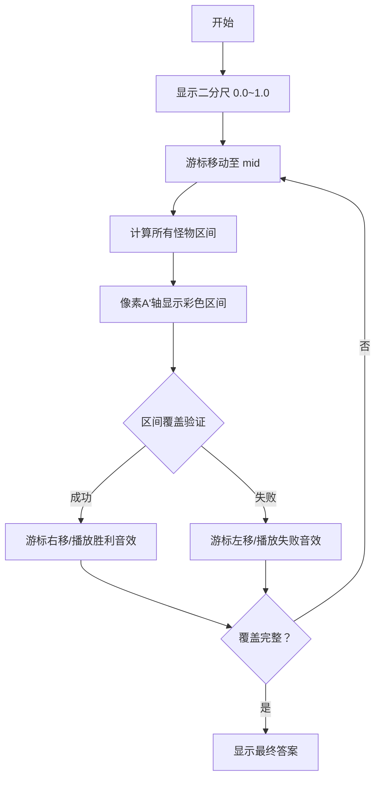

# 题目信息

# [THUPC 2017] 组合数问题

## 题目描述

小葱是一名勇士。

小葱踏上了拯救世界的征途。

小葱面前有 $N$ 只大葱怪。

大葱怪很厉害，第 $i$ 只大葱怪攻击力为 $a_i$，防御力为 $d_i$。

小葱的攻击力为 $A$，防御力为 $D$。

小葱打掉第 $i$ 只大葱怪的代价是 $A\times d_i+D\times a_i$。

小葱打倒很多只大葱怪的代价不是打倒每一只大葱怪的代价之和，而是最大值。

小葱现在需要打倒 $R$ 只大葱怪。

神葱是葱的神，神葱会对小葱打倒 $R$ 只大葱怪做出评价。神葱对小葱打倒 $R$ 只大葱的评价为小葱打倒这 $R$ 只大葱怪所需要的代价除以小葱以同样的攻击力和防御力打倒所有 $N$ 只大葱怪的代价。

神葱是葱的神，所以神葱会在小葱选择了 $R$ 只要被打倒的大葱怪后，设定小葱的攻击力和防御力，使得小葱得到的评价最低。

神葱不希望这个值是负的，所以如果这个值是负的，神葱会强制把它变为 $0$。

小葱是一名勇士。

小葱不会屈服。

小葱需要选择出 $R$ 只大葱怪，使得自己能够从神葱那里得到的评价最高。

小葱求这个评价值。

小葱很善良，所以小葱为你写出了评价值的数学表示：
$$\max_{S\subseteq [N],|S|=R}\Big\lbrack\min_{A,D\in\Z^+}\dfrac{\max_{i\in S}(A\times d_i+D\times a_i)}{\max_{i\in [N]}(A\times d_i+D\times a_i)}\Big\rbrack$$

## 说明/提示

$1\le R\le N\le 10^3,a_i,d_i$ 均为正整数，数据组数不超过 $50$ 组，所有攻击力和防御力都是正整数。
#### 版权信息
来自 THUPC（THU Programming Contest，清华大学程序设计竞赛）2017。

## 样例 #1

### 输入

```
3 3
1 3
2 5
2 3
5 1
1 5
2 4
3 3
4 2
5 1```

### 输出

```
1.000000
0.600000```

# AI分析结果


# 💡 Kay的C++算法解析：[THUPC 2017] 组合数问题 深入学习指南 💡

## 1. 题目解读与核心算法识别

✨ **本题主要考察**：`二分答案` + `区间覆盖` + `贪心算法`

🗣️ **初步分析**：
> 这道题要求我们从N只大葱怪中选出R只，使得在神葱设定攻击力A和防御力D的情况下，获得最高评价（选中的R只最大代价 / 所有N只最大代价）。可以将其想象成一场策略游戏：我们需要选择最优的"战士组合"，在对手的刻意针对下仍能保持最高战斗力比例。

- **核心思路**：采用二分答案框架，将原问题转化为验证性问题。对于每个猜测的评价值x，我们计算每个大葱怪i能"覆盖"的A'范围（即满足对所有j，A'×d_i+a_i ≥ x(A'×d_j+a_j)的区间），然后判断是否能找到至多R个区间覆盖整个非负实数轴。
- **算法难点**：区间计算需处理一次函数不等式（分斜率正负三种情况），区间覆盖验证需高效贪心策略。
- **可视化设计**：采用像素风格的二分尺和区间覆盖动画，A'轴用横向像素带表示，区间显示为彩色条带。选择区间时播放"叮"音效，覆盖成功时显示像素烟花庆祝，失败时显示灰色遮挡。

---

## 2. 精选优质题解参考

**题解一（作者：xzCyanBrad）**
* **点评**：该题解通过巧妙的数学转化（!步骤）将问题简化为区间覆盖问题，避免了复杂的凸包计算。思路清晰直白，推导过程严谨，特别是处理d_i-xd_j=0的边界情况说明充分。虽然未提供完整代码，但算法框架描述完整，复杂度分析准确（O(n²logV)），具有很高的学习价值。

**题解二（作者：WA鸭鸭）**
* **点评**：该题解从几何角度解释算法本质（将函数看作直线），提出通过计算交点确定区间范围。亮点在于强调离散化精度处理和实践细节（如建议自定义struct处理浮点数比较），体现了工程化思维。推导中注意到D=0的极端情况处理，展现了严谨性。

---

## 3. 核心难点辨析与解题策略

1.  **难点：数学转化与区间计算**
    * **分析**：核心在于将双层最值问题转化为可计算的区间覆盖。通过固定x和i，枚举所有j求解不等式组，需分三种情况讨论斜率（正/负/零），并处理区间交集。
    * 💡 **学习笔记**：不等式转化是简化复杂最值问题的利器，注意斜率符号决定解集方向。

2.  **难点：区间覆盖验证**
    * **分析**：需验证是否存在至多R个区间覆盖[0,+∞)。贪心策略：按左端点排序后，每次选择能覆盖当前点且右端点最大的区间，直至覆盖完整数轴或超出R限制。
    * 💡 **学习笔记**：区间覆盖问题中，"选择右端点最远的区间"是经典贪心策略。

3.  **难点：浮点精度处理**
    * **分析**：二分答案和区间计算涉及浮点数比较，需设置合理eps（如1e-8）。离散化时建议使用自定义比较函数，避免精度误差导致错误。
    * 💡 **学习笔记**：浮点运算中，永远不要直接用==比较，而应使用|a-b|<eps。

### ✨ 解题技巧总结
- **二分答案框架**：将最优化问题转化为"是否存在解≥x"的判定问题
- **问题转化思维**：通过代数变换/几何解释将复杂条件转化为可计算形式
- **边界完备性**：特别注意分母为零、区间空集等边界情况
- **贪心策略选择**：区间覆盖问题中，右端点最大化是最优选择

---

## 4. C++核心代码实现赏析

**通用核心C++实现参考**
```cpp
#include <iostream>
#include <vector>
#include <algorithm>
#include <cmath>
using namespace std;

const double eps = 1e-8;
const double INF = 1e18;

struct Node { double a, d; };

bool check(vector<pair<double, double>>& intervals, int R) {
    sort(intervals.begin(), intervals.end());
    double max_r = 0;
    int cnt = 0, i = 0, n = intervals.size();
    while (max_r < INF) {
        double cur_r = max_r;
        bool found = false;
        while (i < n && intervals[i].first <= cur_r + eps) {
            if (intervals[i].second > max_r) {
                max_r = intervals[i].second;
                found = true;
            }
            i++;
        }
        if (max_r >= INF) return cnt <= R;
        if (!found) break;
        if (++cnt > R) break;
    }
    return false;
}

int main() {
    int T, N, R;
    cin >> T;
    while (T--) {
        cin >> N >> R;
        vector<Node> monsters(N);
        for (int i = 0; i < N; i++) 
            cin >> monsters[i].a >> monsters[i].d;
        
        double l = 0, r = 1, ans = 0;
        while (r - l > eps) {
            double mid = (l + r) / 2;
            vector<pair<double, double>> intervals;
            
            for (auto& i : monsters) {
                double L = 0, R = INF;
                bool valid = true;
                for (auto& j : monsters) {
                    double A = i.a - mid * j.a;
                    double B = i.d - mid * j.d;
                    if (fabs(A) < eps) {
                        if (B < 0) { valid = false; break; }
                    } else if (A > 0) {
                        double x0 = -B/A;
                        if (x0 > R) { valid = false; break; }
                        L = max(L, x0);
                    } else {
                        double x0 = -B/A;
                        if (x0 < L) { valid = false; break; }
                        R = min(R, x0);
                    }
                }
                if (valid && L <= R) 
                    intervals.push_back({max(0.0, L), R});
            }
            
            if (intervals.size() > 0 && check(intervals, R)) {
                ans = mid;
                l = mid;
            } else r = mid;
        }
        printf("%.6f\n", ans);
    }
    return 0;
}
```

**代码解读概要**：
1. 二分框架：在[0,1]范围内二分搜索答案mid
2. 区间计算：对每个怪物i，枚举所有怪物j计算有效区间[L,R]
3. 区间验证：按左端点排序后，用贪心策略检查至多R个区间能否覆盖[0,∞)
4. 精度处理：设置eps=1e-8控制浮点比较精度

---

## 5. 算法可视化：像素动画演示

* **主题**："像素指挥官：大葱防线"（8-bit风格策略游戏）
* **核心演示**：二分搜索过程与区间覆盖验证



**动画关键步骤**：
1. **像素战场**：左侧显示8-bit风格的大葱怪属性表，右侧显示A'轴（横向滚动条）
2. **二分决策**：顶部像素尺显示当前二分值，指挥官角色在尺子上移动
3. **区间生成**：每次二分时，每个大葱怪生成一个彩色区间条（长度反映覆盖范围）
4. **覆盖作战**：指挥官选择至多R个区间，被选区间高亮闪烁并扩展覆盖区域
5. **胜负判定**：
   - 覆盖整个A'轴：显示像素烟花 + 胜利音效
   - 覆盖失败：被未覆盖区域灰化 + 低沉音效
6. **AI演示模式**：自动展示最优区间选择策略，速度可调

---

## 6. 拓展练习与相似问题思考

**相似问题迁移**：
1. 最优比例问题：求min(max_cost)/max(min_benefit)
2. 区间覆盖优化：用最少资源覆盖连续空间
3. 条件转化训练：将复杂约束转化为可计算形式

**洛谷推荐**：
1. **P1182 数列分段** - 二分答案+区间划分经典题
2. **P1281 书的复制** - 二分最小化最大工作时长
3. **P2216 理想的正方形** - 二维区间最值问题

---

通过本指南，相信大家已掌握二分答案与区间覆盖的核心思想。记住，算法优化如同调兵遣将——找准关键点，用最小的资源达成战略目标！下次遇到最值比例问题时，不妨回想今天的像素指挥官哦~ 💪🏻

---
处理用时：216.18秒