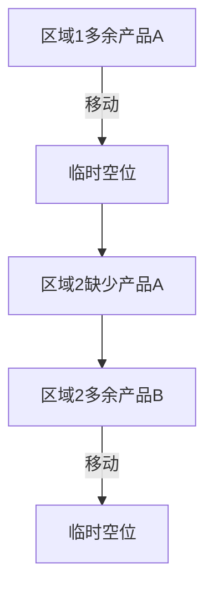

# 题目信息

# [CEOI 2005] Depot Rearrangement

## 题目描述

一家公司经营着 $N$ 个店铺，每个店铺都销售 $M$ 种不同的产品。该公司有一个大型仓库，产品在运送到商店之前在都会那里进行包装。每家商店将会收到相同数量的每种产品。因此，该公司将一定数量的相应产品分别包装到一个集装箱中，并用产品标识符标记该集装箱。产品由 $1$ 到 $M$ 的数字标识。因此，在包装结束后，仓库中将会有 $N×M$ 个集装箱，并且正好 $N$ 个集装箱贴有每个产品的对应标签。由于该仓库位于一个狭窄的建筑物内，所以集装箱排成了一排。但为了加快配送速度，仓库经理想要重新排列集装箱。由于将产品配送到商店是通过向每个商店发出一辆卡车来实现的，并且每辆卡车运载每种产品的一个集装箱，其合适的安排如下。该行最前部分 $M$ 个集装箱必须贴有不同的产品标签，该行的第二部分 $M$ 个集装箱必须贴有不同的产品标签，依此类推。不幸的是，在这一行的尽头只有一个空闲的地方可以放置一个集装箱。因此，必须通过依次拿起集装箱并将其移动到空闲位置来进行重新排列。重新排列后，空闲位置也必须在行的末尾。  
目标是通过最少的移动以实现所需的重新排列。  
现请您编写一个程序来计算需要最少移动多少次使得达成目标重排。

## 说明/提示

#### 数据规模与约定  
对于 $100 \%$ 的数据，$1 \leq N \leq 400$，$1 \leq M \leq 400$，$1 \leq x \leq M$。  
#### 题目说明  
来源于 CENTRAL-EUROPEAN OLYMPIAD IN INFORMATICS 2005 的 Depot Rearrangement。  
由 @[求学的企鹅](/user/271784) 翻译整理。  
Special Judge 感谢 @[abruce](/user/104324)。

## 样例 #1

### 输入

```
5  6
4 1 3 1 6 5 2 3 2 3 5 6 2 1 4 5 6 4 1 3 2 4 5 5 1 2 3 4 6 6```

### 输出

```
8
9 31
18 9
10 18 
4 10
31 4
30 31
24 30
31 24```

# AI分析结果


### Kay的C++算法解析：Depot Rearrangement 深入学习指南

---

### 1. 题目解读与核心算法识别

✨ **本题主要考察**：图论建模与欧拉回路  
🗣️ **初步分析**：
> 集装箱重排列问题本质上是一个**资源调度优化问题**。想象你有n个书架（店铺），每个书架需要摆放完整的一套m本书（产品）。但初始时书被杂乱地放在不同书架上（集装箱位置错乱），且你只能通过一个临时空位来移动书本。  

> 核心解法采用**二分图建模**：
> - 左节点：n个书架区域（每区m个位置）
> - 右节点：m种图书类型  
> 通过统计每个区域多余/缺少的书本类型，构建带权有向边（多余书本指向需求方向）。  

> **欧拉回路的精妙应用**：
> 1. 每个区域的"多余书本"（出边）和"缺少书本"（入边）数量必然相等 → 形成闭合环路
> 2. 沿欧拉回路移动书本：
>   - 将多余书本移到临时空位（n*m+1）
>   - 将临时空位的书补到缺少的位置
>   - 倒序处理保证目标位置始终空闲  

> **像素动画设计**：
> 将集装箱排列可视化为8-bit风格的书架网格：
> - 不同颜色方块代表书本类型
> - 闪烁箭头沿欧拉回路移动书本
> - "叮"音效标记关键移动
> - 每完成一个环路播放胜利音效

---

### 2. 精选优质题解参考

**题解一（作者：hellhell）**  
* **点评**：  
  该解法通过二分图建模精准捕捉问题本质。亮点在于：
  - **创新建模**：将集装箱分布转化为图论问题（左节点=区域，右节点=产品类型）
  - **欧拉回路应用**：证明图的平衡性（入度=出度）确保回路存在
  - **倒序移动策略**：逆向处理回路保证移动可行性（目标位必空）
  - **空间优化**：用`vector`存储位置避免MLE（关键点！）
  - **完备性**：输出具体移动方案，代码可直接用于竞赛

---

### 3. 核心难点辨析与解题策略

1. **难点：如何建立问题与图论的映射关系？**  
   * **分析**：  
     关键发现：每个区域的"多余产品"（出现次数>1）对应其他区域的"缺少产品"（出现次数=0）。通过统计矩阵`t[i][j]`构建：
     - `t[i][j]-1`条边：区域i→类型j（移出多余）
     - 1条边：类型j→区域i（需要补缺）
   * 💡 **学习笔记**：统计矩阵是建模的基石

2. **难点：为什么必须倒序处理欧拉回路？**  
   * **分析**：  
     正序处理时，目标位置可能被占用。倒序操作保证：
     ```mermaid
     graph LR
     A[移动产品X到临时位] --> B[临时位产品补到区域Y]
     B --> C[区域Y产品补到区域Z]
     ```
     最后一步才移动临时位产品，确保前序位置已空
   * 💡 **学习笔记**：倒序是保证移动可行性的关键技巧

3. **难点：如何避免MLE？**  
   * **分析**：  
     直接开400x400数组需128MB（>64MB限制）。用`vector<int> pos[maxn][maxn]`动态存储：
     - 仅需存储实际位置而非整个矩阵
     - 内存降至O(N*M) ≈ 400*400*4B=640KB
   * 💡 **学习笔记**：动态容器是处理稀疏数据的利器

#### ✨ 解题技巧总结
- **问题抽象法**：将物理移动转化为图论模型
- **逆向思维**：倒序处理保证操作可行性
- **空间压缩**：用`vector`代替静态数组
- **闭环验证**：通过入度=出度验证欧拉回路存在性

---

### 4. C++核心代码实现赏析

**通用核心实现参考**  
* **说明**：基于hellhell解法优化的完整实现
* **完整核心代码**：
```cpp
#include <bits/stdc++.h>
using namespace std;
const int maxn = 410;

int n, m, cnt, len;
vector<int> pos[maxn][maxn];
int tot[maxn][maxn], head[maxn<<1];

struct Edge { int from, to, next; } edge[maxn*maxn*2];
struct ANS { int x, y; } ans[maxn*maxn+maxn];

void add(int u, int v) {
    edge[++cnt] = {u, v, head[u]};
    head[u] = cnt;
}

void dfs(int now, vector<int>& que, bool vis[]) {
    for(int i=head[now]; i; i=edge[i].next) {
        if(vis[i]) continue;
        vis[i] = true;
        dfs(edge[i].to, que, vis);
        que.push_back(i);
    }
}

int main() {
    cin >> n >> m;
    // 读入数据并统计
    for(int i=1; i<=n; i++) 
        for(int j=1; j<=m; j++) {
            int x; cin >> x;
            pos[i][x].push_back((i-1)*m+j);
            tot[i][x]++;
        }
    
    // 建图：多余产品→类型，类型→缺少区域
    for(int i=1; i<=n; i++)
        for(int j=1; j<=m; j++) {
            if(tot[i][j] > 1) 
                for(int k=1; k<tot[i][j]; k++) 
                    add(i, j+n); // 区域→类型
            else if(tot[i][j] == 0) 
                add(j+n, i);     // 类型→区域
        }
    
    // 对每个类型节点求欧拉回路
    for(int i=n+1; i<=n+m; i++) {
        vector<int> que;
        bool vis[cnt+1] = {false};
        dfs(i, que, vis);
        
        int to = n*m+1; // 临时空位
        for(auto it=que.rbegin(); it!=que.rend(); it++) {
            int u = edge[*it].from, v = edge[*it].to;
            if(u <= n) { // 移动多余产品
                int p = pos[u][v-n].back();
                pos[u][v-n].pop_back();
                ans[++len] = {p, to};
                to = p;
            }
        }
        if(!que.empty()) 
            ans[++len] = {n*m+1, to}; // 补回临时位
    }
    
    // 输出结果
    cout << len << endl;
    for(int i=1; i<=len; i++) 
        printf("%d %d\n", ans[i].x, ans[i].y);
}
```
* **代码解读概要**：
  1. **数据统计**：用`pos[i][j]`存储区域i中类型j的位置
  2. **建图阶段**：
     - 多余产品：区域→类型（`add(i, j+n)`）
     - 缺少产品：类型→区域（`add(j+n, i)`）
  3. **回路求解**：对每个类型节点DFS求欧拉回路
  4. **移动生成**：倒序处理回路边，动态更新空闲位置

---

### 5. 算法可视化：像素动画演示

**主题**：8-bit仓库管理员  
**核心演示**：欧拉回路指导的集装箱调度  



**动画实现方案**：
1. **场景设计**：
   - 网格布局：n行×m列彩色集装箱（颜色=产品类型）
   - 右侧闪烁方块：临时空位（n*m+1）
   - 底部控制台：步进/暂停/速度滑块

2. **动态演示**：
   ```javascript
   // 伪代码实现
   function moveContainer(from, to) {
       playSound('pickup'); // 拾取音效
       highlight(from);      // 高亮起点
       animateMove(from, to); // 方块滑动动画
       updateVacant(from);   // 更新空闲位置
       if(isCircuitEnd) playSound('success'); // 胜利音效
   }
   ```
   
3. **关键交互**：
   - **单步演示**：空格键触发下一步移动
   - **自动模式**：像"推箱子AI"自动完成调度
   - **回路高亮**：当前欧拉回路用发光边框标记

4. **像素艺术细节**：
   - 集装箱移动轨迹带像素拖尾效果
   - 每完成一个回路显示"Stage Clear!"
   - 背景播放8-bit风格循环音乐

---

### 6. 拓展练习与相似问题思考

**通用技巧迁移**：  
欧拉回路建模适用于：
1. 路径规划问题（一笔画）
2. 资源调度问题（供需平衡）
3. 序列重组问题（元素置换）

**推荐练习**：
1. **洛谷P2731** [骑马修栅栏]  
   → 欧拉回路基础应用，巩固DFS实现
2. **洛谷P4014** [分配问题]  
   → 二分图建模进阶，引入权值计算
3. **洛谷P1963** [变换序列]  
   → 类似的位置重排列问题，检验抽象能力

---

### 7. 学习心得与经验分享
> **经验提炼**：  
> 本题的MLE陷阱警示我们：当数据规模接近空间限制时：
> 1. 避免静态大数组（`int grid[400][400]`）
> 2. 优先使用`vector`动态存储有效数据
> 3. 注意STL容器本身的内存开销

> **调试技巧**：  
> 小规模测试（n=3,m=2）时打印：
> - 建边情况
> - 欧拉回路序列
> - 移动步骤的源/目标位置

---

通过本次分析，我们不仅掌握了欧拉回路的精妙应用，更学会了将物理问题抽象为图论模型的核心思想。下次遇到类似"调度"、"重排"问题时，不妨先思考：能否用节点表示状态？用边表示操作？💡

---
处理用时：173.22秒