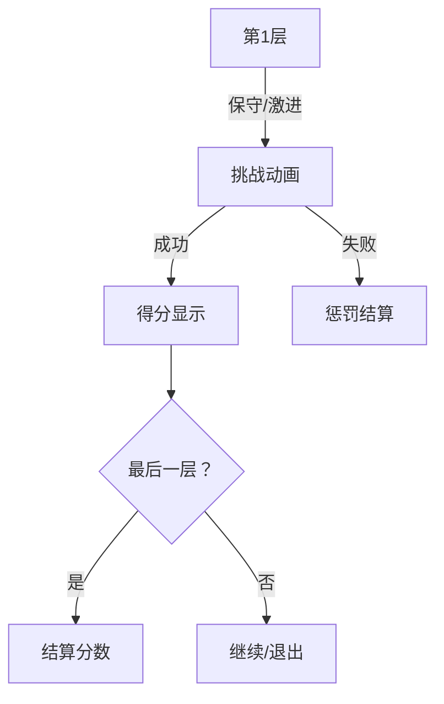

# 题目信息

# [THUPC 2023 初赛] 最后的活动

## 题目背景

各位亲爱的《La Lumière: Scarlet Intense Flame》玩家：

感谢您一直给予《La Lumière: Scarlet Intense Flame》的支持与厚爱。我们非常遗憾地宣布，《La Lumière: Scarlet Intense Flame》将于 2023 年 3 月 5 日 16:00 停止运营服务。

停止运营相关时间表如下：

……

## 题目描述

元老级二次元手游《La Lumière: Scarlet Intense Flame》将于今年 3 月停止运营服务。作为这款游戏的忠实玩家，小 S 希望能在游戏的最后一次活动中刷到一个特殊的分数，以此为近十年来与这款游戏共度的难忘时光画上一个圆满的句号。

《La Lumière: Scarlet Intense Flame》中的每种活动都有其独特的规则，而最后一次活动是 Chase Festival。在 Chase Festival 中，玩家需要多次攻略每次随机生成的多层迷宫，每次退出迷宫时根据在迷宫中各层击杀怪物的评价独立结算本次随机迷宫的分数。每次挑战迷宫时的流程简化如下：

1. 选择挑战的随机迷宫的难度。小 S 是这款游戏的资深玩家，因此在本题中假定小 S 总是挑战最高难度的迷宫。最高难度的迷宫最深为 $N$ 层。确定难度后，从随机生成的迷宫的第 1 层开始挑战。

2. 进行第 $i$ 层的挑战。挑战第 $i$ 层时，小 S 有可能挑战失败，挑战成功并获得普通评价，或者挑战成功并获得高评价。如果小 S 选择保守的挑战策略，则有 $p_{i,0}$ 的概率挑战失败，有 $p_{i,1}$ 的概率挑战成功并获得普通评价，有 $p_{i,2}$ 的概率挑战成功并获得高评价；如果小 S 选择激进的挑战策略，则有 $q_{i,0}$ 的概率挑战失败，有 $q_{i,1}$  的概率挑战成功并获得普通评价，有 $q_{i, 2}$ 的概率挑战成功并获得高评价。
   
   - 获得普通评价时，在当前层获得 $s_{i,1}$ 的分数；获得高评价时，在当前层获得 $s_{i,2}$ 的分数。这部分获得的分数**不会直接加算**到玩家的总分数中，而是**在退出迷宫时结算**。如果挑战成功，且当前不是最后一层（$i<N$），则跳转到第 3 步，选择是否继续挑战；否则（$i=N$），退出迷宫并跳转到第 4 步进行结算。
   
   - 如果挑战失败，则强制退出迷宫，跳转到第 4 步。

3. 如果当前不是最后一层，玩家可以选择是否继续挑战下一层。如果选择继续，则返回第 2 步；否则退出当前迷宫，跳转到第 4 步进行结算。

4. 本次迷宫的分数结算：如果因为失败而强制退出，则当前层不获得任何奖励，且**本次迷宫中之前各层**累积的分数需要乘上惩罚系数 $c$（为了使最终分数为整数，游戏会对惩罚后的分数先求和再下取整）；除了强制退出之外，玩家主动退出或者通关迷宫后退出都可以获得全部尚未结算的分数。

小 S 想得到的目标分数是一个比较大的分数，因此小 S 需要先大量刷最高难度的迷宫，再在接近目标分数时根据当前剩余的分数选择相对稳定的策略，以确保活动结束时能恰好获得目标分数。小 S 不会编程，因此小 S 找到了你，希望你能帮忙计算当剩余分数在 $1$ 至 $M$ 分之间，仅按照上述的流程挑战迷宫，并采用最佳策略时，最终能够恰好达到目标分数的最大概率。

## 说明/提示

#### 子任务

对于 $100\%$ 的数据，保证 $1\le N\le 6$，$1\le M\le 10000$，$0\le c'\le 100$，$1\le s_{i,1}\le s_{i, 2}\le 10000$，$0\le u_{i, 0}, u_{i, 1}, u_{i, 2}, v_{i, 0}, v_{i, 1}, v_{i, 2}\le 10000$，$u_{i,1}+u_{i,2}\ge 1$，$v_{i,1}+v_{i,2}\ge 1$。

#### 提示

《La Lumière: Scarlet Intense Flame 2》将于 2023 年春暖花开的时节与大家相见！

#### 题目来源

来自 2023 清华大学学生程序设计竞赛暨高校邀请赛（THUPC2023）初赛。

题解等资源可在 <https://github.com/THUSAAC/THUPC2023-Pre> 查看。

## 样例 #1

### 输入

```
2 8 50
3 4 0 1 1 0 1 1
4 5 1 2 1 1 1 2
```

### 输出

```
0.125000000000000000 0.140625000000000000 0.515625000000000000 0.564453125000000000 0.135009765625000000 0.328369140625000000 0.548858642578125000 0.625278472900390625
```

## 样例 #2

### 输入

```
见附件中的 2.in```

### 输出

```
见附件中的 2.ans```

# AI分析结果


### 💡 Kay的C++算法解析：最后的活动 深入学习指南 💡

**引言**  
今天我们来分析「最后的活动」这道动态规划与概率期望结合的题目。本指南将帮助大家理解如何通过二分法解决概率DP的自环问题，掌握多阶段决策的实现技巧。

---

### 1. 题目解读与核心算法识别  
✨ **本题主要考察**：`概率动态规划` + `二分优化`  

🗣️ **初步分析**：  
> 解决本题可将其视为「多阶段迷宫冒险」：玩家在每层需选择保守/激进策略（类似选择安全/危险路径），决策会影响通关概率和得分。核心难点在于 **状态转移的自环**（当前概率依赖于自身）。  
> - **题解思路**：Alex_Wei的解法通过二分法迭代概率值，结合DFS模拟决策树；Eraine则从数学角度证明二分单调性  
> - **可视化设计**：采用8位像素迷宫风格，角色在网格中移动。关键动画包括：  
>   - 策略选择（保守蓝/激进红按钮）  
>   - 成功/失败动画（√/×图标）  
>   - 分数结算时显示概率值随二分迭代的变化  
>   - 音效设计：选择(按键声)、成功(欢快音)、失败(低沉音)

---

### 2. 精选优质题解参考  

**题解一 (作者：Alex_Wei)**  
* **点评**：  
  思路清晰直指核心——用DFS模拟每层决策，二分法破解概率自环。代码亮点在于：  
  - **决策封装**：lambda函数`F(c)`优雅处理状态转移  
  - **归一化处理**：概率输入除以总和保证准确性  
  - **二分收敛**：30次迭代平衡精度与效率  
  实践价值极高，可直接用于竞赛（边界处理严谨）

**题解二 (作者：Eraine)**  
* **点评**：  
  虽无完整代码，但提供关键理论支撑：  
  - **数学推导**：严格证明当 `f₂ = p·f₁ + (1-p)·f₃` 时，`f₂>f₁ ⇒ f₃>f₁`  
  - **单调性解释**：为二分方向提供理论依据  
  作为补充资料，帮助深入理解算法本质

---

### 3. 核心难点辨析与解题策略  

1. **关键点1：概率DP的自环问题**  
   * **分析**：当一轮得0分时，状态转移形如 `f[i] = a·f[i] + b`，需二分迭代解方程  
   * 💡 学习笔记：二分法将非线性问题转化为单调收敛过程  

2. **关键点2：多阶段策略优化**  
   * **分析**：每层需比较两种策略的期望收益（继续挑战 vs 退出结算），DFS递归实现最优决策链  
   * 💡 学习笔记：`max(u,v)`对应保守/激进策略的择优  

3. **关键点3：分数惩罚机制**  
   * **分析**：失败时需计算 `acc * c / 100`，整数运算避免浮点误差  
   * 💡 学习笔记：惩罚系数需在过程中累积计算  

✨ **解题技巧总结**  
- **二分破环法**：处理自环型概率DP的通用技巧  
- **决策树封装**：用lambda函数隔离状态转移逻辑  
- **实时归一化**：输入概率即时除以总和  
- **记忆化剪枝**：DFS结合DP避免重复计算  

---

### 4. C++核心代码实现赏析  

**通用核心实现参考**  
* **说明**：综合Alex_Wei解法，最简洁高效的概率DP框架  
```cpp
#include <bits/stdc++.h>
using namespace std;
constexpr int N = 8, M = 1e4 + 5;
int n, m, c, s1[N], s2[N];
double u0[N], u1[N], u2[N], v0[N], v1[N], v2[N], f[M];

// 决策核心：pos-当前层, acc-累计分, aim-目标分
double dfs(int pos, int acc, int aim) {
  if(pos > n) return 0;
  auto F = [&](int c) { return c > aim ? 0 : f[aim - c]; };
  double p1 = max(F(acc + s1[pos]), dfs(pos + 1, acc + s1[pos], aim));
  double p2 = max(F(acc + s2[pos]), dfs(pos + 1, acc + s2[pos], aim));
  int sc = acc * c / 100; // 惩罚计算
  double u = u0[pos]*F(sc) + u1[pos]*p1 + u2[pos]*p2; // 保守策略
  double v = v0[pos]*F(sc) + v1[pos]*p1 + v2[pos]*p2; // 激进策略
  return max(u, v);
}

int main() {
  cin >> n >> m >> c;
  for(int i = 1; i <= n; i++) {
    cin >> s1[i] >> s2[i];
    // 概率归一化处理
    cin >> u0[i] >> u1[i] >> u2[i];
    double su = u0[i] + u1[i] + u2[i];
    u0[i] /= su; u1[i] /= su; u2[i] /= su;
    // 同理处理v系列概率
  }
  f[0] = 1; // 基准状态
  for(int i = 1; i <= m; i++) {
    double l = 0, r = 1;
    for(int _ = 0; _ < 30; _++) { // 二分30次
      f[i] = (l + r) / 2;
      dfs(1, 0, i) < f[i] ? r = f[i] : l = f[i];
    }
    printf("%.9lf ", f[i]);
  }
}
```

**题解一核心代码解析**  
* **亮点**：lambda函数 + 二分迭代实现高效状态转移  
```cpp
auto F = [&](int c) { return c > aim ? 0 : f[aim - c]; };
...
double u = u0[pos]*F(sc) + u1[pos]*p1 + u2[pos]*p2;
```
> 1. **lambda妙用**：`F(c)`封装状态转移，当本轮得分`c`超过目标时返回0，否则取`f[aim-c]`  
> 2. **决策树构建**：`p1/p2`分别对应选择普通/高评价后继续挑战的期望  
> 3. **策略比较**：`u`和`v`计算两种策略的加权期望，`max(u,v)`实现最优选择  
> 💡 **学习笔记**：函数式编程能优雅处理状态依赖  

**题解二理论补充**  
* **亮点**：数学证明二分方向正确性  
> 若定义真实概率为`f₃`，二分初值`f₁`，满足：  
> `f₂ = p·f₁ + (1-p)·f₃`  
> 推导可得：`f₃ - f₂ = p·(f₃ - f₁)`  
> 因此 `f₂ > f₁ ⇒ f₃ > f₁`，确定二分收敛方向  

---

### 5. 算法可视化：像素动画演示  
**主题**：8-bit迷宫大冒险  

**核心演示流程**：  


**交互设计**：  
1. **像素网格**：每层为16x16像素方块，角色Q版造型  
2. **动态决策**：  
   - 保守策略：蓝色按钮+盾牌图标  
   - 激进策略：红色按钮+剑图标  
3. **战斗动画**：  
   - 成功：绿色√ + 得分数字弹跳  
   - 失败：红色× + 灰暗滤镜  
4. **数据可视化**：  
   - 右上角实时显示：`f[i] = [l, r]`  
   - 底部进度条：目标分数达成度  
5. **音效系统**：  
   - 关键操作：8-bit电子音  
   - 结算时：根据概率播放不同音阶  

---

### 6. 拓展练习与相似问题  
**通用技巧迁移**：  
1. 概率DP自环问题（如抽卡游戏期望计算）  
2. 多阶段决策优化（资源分配问题）  
3. 带惩罚机制的期望计算（竞赛扣分规则）  

**洛谷推荐**：  
1. **P1850 换教室**  
   🗣️ 多阶段概率决策，巩固期望DP建模能力  
2. **P3211 XOR和路径**  
   🗣️ 处理带环期望DP，练习高斯消元/迭代法  
3. **P4547 城市地铁规划**  
   🗣️ 决策型DP，强化状态设计能力  

---

### 7. 学习心得与经验分享  
> **Alex_Wei的调试经验**：  
> *“场上没加二分，一直寄/ll”*  
>   
> **Kay的总结**：这提醒我们：  
> 1. 概率DP出现`f[i]=a*f[i]+b`形式时，立即考虑二分迭代  
> 2. 精度设置需平衡（30次迭代≈1e-9精度）  
> 3. 决策树类问题优先尝试记忆化DFS  

---

**结语**  
通过本指南，希望大家不仅掌握了概率DP的二分破环技巧，更学会将算法转化为直观的像素冒险。记住：好的算法如同游戏策略，需要在实践中不断优化！

---
处理用时：181.24秒