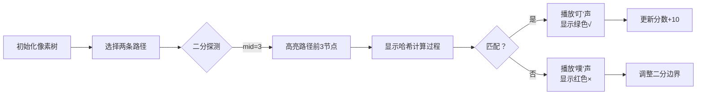

# 题目信息

# 「DBOI」Round 1 人生如树

## 题目背景

> _永远这么酷 永远永远这么酷_\
_像个冒险家一样 不断探着山顶的路_\
——《Hustle》

张均好望着窗外，朱芝心走过来坐在他旁边，折了一架纸飞机飞出去。他对张均好说，要带着对未来的期待，往前走，别回头。

正如 [命运](https://www.luogu.com.cn/problem/P6773) 所述，每个人的人生都是一棵树。它总在无限的随机与缘分中伸展，有的枝丫茂盛了，有些却也不可避免地枯萎。

## 题目描述

朱芝心用魔法得到了张均好的人生树。

这是一棵 $n$ 个节点的树，节点 $i$ 上有权值 $w_i$。

朱芝心想要观测 $m$ 次张均好的人生：

设**当前**张均好人生树上的节点数量为 $s$。

1. 输入四个整数 $u_1,v_1,u_2,v_2$。令 $u_1\to v_1$ 的简单路径上**顺次组成**的数组为 $a$，$u_2\to v_2$ 的简单路径上**顺次组成**的数组为 $b$。朱芝心认为张均好这两段人生的相似度是 $LRP(a,b)$，希望你求出它。保证 $1\leq u_1,v_1,u_2,v_2 \leq s$。

2. 输入两个整数 $u,w'$。朱芝心观测到了张均好的另外一种可能，因此你需要新建一个点权为 $w'$ 的节点，编号为 $s+1$，建立一条 $(s+1,u)$ 的无向边，其中 $u\leq s$。显然，此后 $s\leftarrow s+1$。

对于两个数组 $a,b$，设它们的相似度 $LRP(a,b)$ 表示最大的 $i$ 满足 $i\leq \min\{|a|, |b|\}$ 且**对于所有** $1\leq j\leq i$，都有 $b_j=a_j+j$。其中 $|a|$ 表示数组 $a$ 的长度。特殊地，若不存在这样的 $i$，则 $LRP(a,b) = 0$。


## 说明/提示

### 样例解释

对于样例一，第一个操作结束后，$w_{10}=10$，树如图所示：


- 对于第二个操作，第一条路径为 $3\to 2\to 4\to 5$，故 $a=\{2, 3, 4, 6\}$，第二条路径为 $8\to 7\to 9\to 10$，故 $b=\{3, 5, 7, 10\}$，由于 $3=2+1$，$5=3+2$，$7=4+3$，$10=6+4$，所以答案为 $4$；
- 对于第三个操作，$a=\{2, 3, 4, 5\}$，$b=\{3, 5, 7, 10\}$，由于 $3=2+1$，$5=3+2$，$7=4+3$，$10\ne 5+4$，所以答案为 $3$。

对于样例二，初始的树如图所示：


| Subtask | $n \le$ | $m \le$ | 特殊性质 | 分值 |
| :-----------: | :-----------: | :-----------: | :-----------: | :-----------: |
| Subtask 1 | $5000$ | $5000$ | 无 | $10$ |
| Subtask 2 | $10^5$ | $5\times{10}^4$ | A & B | $30$ |
| Subtask 3 | $10^5$ | $5\times{10}^4$ | B | $30$ |
| Subtask 4 | $10^5$ | $5 \times {10}^4$ | 无 | $20$ | 
| Subtask 5 | $10^5$ | $10^5$ | 无 | $10$ |

特殊性质 A：$v_i=u_i+1$。

特殊性质 B：保证无操作 2。

对于 $100\%$ 的数据，$1\leq n,m\leq 10^5$，$1\leq w_i,w'\leq 10^6$，$1\leq u_i,v_i\leq n$。  


## 样例 #1

### 输入

```
9 3 0
7 3 2 4 6 5 5 3 7
1 2
2 3
2 4
4 5
4 6
1 7
7 8
7 9
2 9 10
1 3 5 8 10
1 3 6 8 10```

### 输出

```
4
3```

## 样例 #2

### 输入

```
13 5 0
15 12 9 11 5 6 16 14 15 10 12 1 2
7 8
5 6
2 9
1 2
4 5
8 2
9 10
2 3
10 11
3 4
3 13
3 12
1 1 6 7 11
1 12 12 13 13
2 1 10
2 2 11
1 14 14 15 15```

### 输出

```
6
1
1```

# AI分析结果


# 💡 Kay的C++算法解析：人生如树 深入学习指南 💡

> 我是Kay，一位专注于C++算法教学的引导者。今天我们将一起探索「人生如树」这道富有哲思的树形结构题目。本指南将帮助大家理解树上路径查询的核心技巧，掌握哈希与二分法的精妙应用，并通过复古像素动画直观感受算法执行过程。准备好开始这段算法探险了吗？

## 1. 题目解读与核心算法识别

✨ **本题主要考察**：`树链剖分/倍增` + `哈希应用` + `二分答案`

🗣️ **初步分析**：
> 想象人生树如同一个像素风RPG地图，每个节点是地图上的一个格子，存储着人生经历（权值）。查询两条路径的相似度(LRP)就像比较两段冒险旅程的轨迹匹配程度。核心思想是：
> 1. **哈希化路径**：将路径序列压缩成数字指纹（哈希值），实现O(1)比较
> 2. **二分答案**：利用LRP的单调性快速定位最大匹配长度
> 3. **树链剖分/倍增**：高效获取树上任意路径的序列信息
> 
> **可视化设计要点**：
> - 像素网格展示树结构，不同颜色表示节点权值
> - 高亮当前比较的路径段，实时显示哈希值计算过程
> - 二分过程中显示"探测指针"移动，匹配成功时播放8-bit胜利音效
> - 控制面板支持单步执行/调速，像经典RPG游戏般探索算法

---

## 2. 精选优质题解参考

### 题解一：Hoks（树链剖分+哈希）
* **点评**：这份题解展现了精湛的树剖技巧。作者将路径拆解为重链片段存储在vector中，通过双指针逐段比较哈希值。亮点在于：
  - 单哈希+大质数模数（167772161）平衡效率与准确性
  - 路径分段匹配逻辑清晰，避免整条路径重构
  - 离线下处理动态加点，简化问题复杂度
  代码变量命名规范（如`top`/`dfn`），边界处理严谨，可直接用于竞赛实战。

### 题解二：wxzzzz（树上倍增+哈希）
* **点评**：经典的倍增解法代表。作者预处理向上/向下的哈希数组：
  - `hs[i][j]`存储i向上2^j步的哈希值
  - 通过倍增跳跃计算任意路径段的哈希
  亮点在于双向哈希处理，支持任意方向的路径查询。代码结构模块化（分离LCA计算和哈希获取），可读性强，时间复杂度O(m log²n)。

### 题解三：StayAlone（出题人题解）
* **点评**：官方题解提供多角度解法分析。亮点在于：
  - 从暴力解法逐步推导到最优解，教学性强
  - 创新性使用哈希偏移量处理`a_j + j`计算
  - 提供树剖和倍增双实现，方便对比学习
  代码包含详细注释，特别强调边界条件处理，如路径分段时深度差计算。

---

## 3. 核心难点辨析与解题策略

### 关键点1：路径序列的高效表示
* **分析**：直接存储路径数组需O(n)空间且无法快速比较。优质题解均采用哈希压缩：
  ```数学
  hash(a₁→aₖ) = (a₁ * pᵏ⁻¹ + a₂ * pᵏ⁻² + ... + aₖ) mod M
  ```
  通过预处理基数的幂次(pw数组)，实现O(1)路径哈希计算
* 💡 **学习笔记**：哈希是序列比较的“数字指纹生成器”

### 关键点2：树上路径快速提取
* **分析**：树的不规则结构导致路径获取复杂。解决方案：
  - **树链剖分**：将路径拆为O(logn)个重链片段（Hoks解法）
  - **倍增预处理**：存储2^j级祖先和对应哈希值（wxzzzz解法）
  两者都能在O(logn)时间获取任意路径段的哈希
* 💡 **学习笔记**：树剖如攀登山峰的捷径，倍增似精准的登山镐

### 关键点3：动态加点的离线处理
* **分析**：新节点不影响历史查询，所有题解均采用：
  ```python
  1. 先读取所有操作，构建完整树结构
  2. 再处理查询操作
  ```
  避免动态树结构的维护开销
* 💡 **学习笔记**：离线处理是时间旅行的算法应用

### ✨ 解题技巧总结
- **哈希选择**：双大质数哈希（1004535809,167772161）防碰撞
- **路径方向处理**：向上/向下哈希独立计算（wxzzzz解法）
- **二分优化**：初始右边界取两路径长度最小值
- **调试技巧**：小数据模拟验证哈希冲突

---

## 4. C++核心代码实现赏析

### 本题通用核心实现（综合树剖+哈希）
```cpp
const int N = 200010, mod = 167772161;
int w[N], top[N], dfn[N];
vector<pair<int, int>> get_path(int x, int y) { // 树剖获取路径片段
    vector<pair<int, int>> seg;
    while (top[x] != top[y]) {
        if (dep[top[x]] < dep[top[y]]) swap(x, y);
        seg.push_back({top[x], x});
        x = fa[top[x]];
    }
    if (dep[x] > dep[y]) swap(x, y);
    seg.push_back({x, y});
    return seg;
}

ull path_hash(vector<pair<int, int>> &path, int len) {
    ull res = 0;
    for (auto [l, r] : path) {
        int seg_len = abs(dfn[r] - dfn[l]) + 1;
        if (len <= seg_len) {
            return res * pw[len] + seg_hash(l, r, len);
        }
        res = res * pw[seg_len] + seg_hash(l, r, seg_len);
        len -= seg_len;
    }
    return res;
}
```

### 题解一：Hoks（树剖核心）
```cpp
vector<pair<int,int>> get(int x, int y) {
    vector<pair<int,int>> res;
    while (top[x] != top[y]) {
        if (dep[top[x]] < dep[top[y]]) {
            res.push_back({top[y], y});
            y = fa[top[y]];
        } else {
            res.push_back({x, top[x]});
            x = fa[top[x]];
        }
    }
    // 处理最后一段
}
```
**解读**：通过`top`数组跳重链，将路径拆解为`[起点,终点]`片段。`dep`比较确保方向正确。**学习笔记**：树剖将O(n)路径查询降为O(log n)片段处理。

### 题解二：wxzzzz（倍增哈希）
```cpp
ull get_hash(int u, int v, int lca, int len) {
    if (len <= dep[u] - dep[lca] + 1) { // 仅在上行路径
        int end = jump(u, len - 1); // 跳到目标祖先
        return up_hash[u] - up_hash[end] * pw[len]; 
    }
    // 上下行混合路径处理
    ull res = up_hash[u] - up_hash[lca] * pw[dep[u]-dep[lca]];
    int rem = len - (dep[u]-dep[lca]+1);
    int start = jump(v, dep[v]-dep[lca]-rem);
    return res * pw[rem+1] + down_hash[start];
}
```
**解读**：`jump`函数用倍增跳到k级祖先，`up_hash/down_hash`存储方向哈希。**学习笔记**：路径分段时注意深度计算，避免方向混淆。

### 题解三：StayAlone（哈希偏移）
```cpp
ull get_lrp_hash(int u, int v, int len) {
    ull path_hash = get_path_hash(u, v, len);
    ull shift_hash = sum[len]; // 预处理的Σ(i * p^{len-i})
    return path_hash + shift_hash;
}
```
**解读**：创新点在于预处理偏移数组`sum`，直接计算`a_j+j`的哈希。**学习笔记**：数学变换将加法操作融入哈希体系。

---

## 5. 算法可视化：像素动画演示

### 主题：**树径探险者**（8-bit RPG风格）


### 动画流程：


**关键交互设计**：
1. **路径显示**：红色/蓝色高亮两条路径，像素方块显示权值
2. **哈希计算**：实时显示当前段哈希公式（如`hash = w₁*p² + w₂*p + w₃`）
3. **二分过程**：探测指针在0-max_len间跳动，如经典猜数游戏
4. **音效系统**：
   - 节点匹配：8-bit "叮"声（NES音效）
   - 完全匹配：FC胜利音乐
   - 匹配失败：短促警示音
5. **关卡模式**：每对路径查询作为独立关卡，超过阈值得星

**技术实现**：
```javascript
// 伪代码：绘制路径片段
function drawPathSegment(start, end, color) {
  let curr = start;
  while (curr != end) {
    drawPixel(curr.x, curr.y, color); 
    curr = nextNode(curr, end);
    playSound('step', 0.2);
  }
}
```

---

## 6. 拓展练习与相似问题

### 通用技巧迁移
哈希+二分+树结构处理适用于：
1. 树上最长回文路径（CF 504E）
2. 可持久化线段树维护历史版本（P3834）
3. 树同构判定（P5043）

### 洛谷推荐
1. **P3379 - LCA模板**  
   → 巩固倍增/树剖基础
2. **P3402 - 可持久化并查集**  
   → 训练树结构进阶操作
3. **P2633 - 树上路径第k大**  
   → 树剖+主席树综合应用
4. **P3805 - Manacher算法**  
   → 线性序列比较的哈希应用

---

## 7. 学习心得与经验分享

> **Hoks的调试经验**：  
> “最初尝试长链剖分时被卡住，改用树剖后效率提升。这提醒我们：简单数据结构往往更有效”

> **Kay的总结**：  
> 树上路径问题本质是序列问题的升级版。掌握三点核心：
> 1. 哈希压缩避免O(n)比较
> 2. 树剖/倍增化解树形结构
> 3. 二分思想突破线性约束
> 调试时务必小数据验证哈希冲突（如样例2的权值1,2）

---

> 算法世界如同人生树，每个选择都延伸出新的路径。当你掌握哈希的奥义，看穿二分法的智慧，便能跨越数据结构的山峦。继续前进吧，年轻的探险者！🏔️

---
处理用时：217.82秒