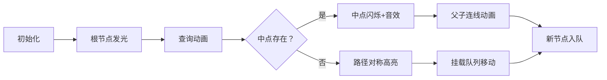

# 题目信息

# 「EZEC-14」终点

## 题目背景

~~出题人怎么还没鸟加这首歌啊。~~

于 2023.8.5 拿下。

## 题目描述

**这是一道交互题。**

dXqwq 有一棵 $n$ 个点的无根树，结点从 $1$ 到 $n$ 编号。您需要通过若干次询问得到这棵树的结构。

您可以选择两个整数 $1\leq u,v\leq n$，并输出 `? u v` 进行询问。

对于每次询问，如果 $u,v$ 的路径中点在一个结点上，交互库返回该点的编号，否则返回 ``0``。

请通过不超过 $147154$ 次询问，得到这棵树的结构。

保证树的形态是提前确定的，即**交互库不自适应。**

### 交互方式

输入测试点所在子任务编号 $id$ 和树的大小 $n$ 以开始交互。

交互过程中，您可以进行题目描述中的询问。

对于每次询问，如果你提供的 $u,v$ 不合法或者超出询问次数上限，交互库会返回 ``-1``，否则交互库将会返回一个非负整数，含义见「题目描述」。

当你读取到 ``-1`` 后应立刻退出程序，在此之后交互库的行为未定义。

在您确定答案后，请先输出 `!`，然后接下来 $n-1$ 行依次输出两个整数 ``u[i] v[i]`` 代表树的每条边，最后退出程序。你可以以任意顺序输出这些边。

在您输出一行后，请清空缓冲区：

- 在 C++ 中，使用 `fflush(stdout)` 或 `cout.flush()`。
- 在 Pascal 中，使用 `flush(output)`。
- 在 Python 中，使用 `stdout.flush()`。
- 其它语言请自行查阅文档。

## 说明/提示

**本题采用捆绑测试。**

-  Subtask 1（10 pts）：$n \leq 10$，树满足性质 A。
-  Subtask 2（10 pts）：保证存在一个点度数为 $n-1$。
-  Subtask 3（10 pts）：保证所有点度数 $\leq 2$。
-  Subtask 4（10 pts）：$n \leq 500$，树满足性质 A。
-  Subtask 5（20 pts）：$n \leq 500$。 
-  Subtask 6（20 pts）：树满足性质 A。
-  Subtask 7（20 pts）：无特殊限制。

性质 A：对于 $i=2,3,\cdots,n$ 存在整数 $1\leq j<i$ 满足有一条边连接 $i,j$。

对于 $100\%$ 的数据，$2 \leq n \leq 10^4$。


## 样例 #1

### 输入

```
1 5

1

2

3

4

0```

### 输出

```
 
? 1 1

? 1 3

? 2 4

? 3 5

? 4 5

!
1 2
2 3
3 4
4 5```

## 样例 #2

### 输入

```
5 5

1

0

0

2

2```

### 输出

```
 
? 1 1

? 1 3

? 2 4

? 3 5

? 4 5

!
1 3
2 3
2 4
2 5```

# AI分析结果


### 💡 Kay的C++算法解析：「EZEC-14」终点 深入学习指南 💡

**引言**  
今天我们一起分析树结构重构交互题「EZEC-14」终点。这道题需要通过中点查询确定树的结构，是图论与交互设计的综合应用。本指南将解析核心算法、精选题解，并通过像素动画直观展示算法流程，助你掌握树重构技巧！

---

#### 1. 题目解读与核心算法识别  
✨ **本题主要考察**：`树的重构`（图论） + `交互优化`（编程技巧）  

🗣️ **初步分析**  
> 本题如同在迷宫中通过有限次"雷达扫描"（中点查询）绘制地图。核心是**利用中点信息反推树结构**：  
> - **中点存在性**（奇数路径）直接定位中间节点  
> - **中点缺失**（偶数路径）说明路径对称  
> 三个题解均采用**分层确定+队列优化**策略：  
> 1. 先通过中点查询找到与根节点相邻的关键点（类似确定迷宫起点）  
> 2. 用BFS/队列管理待处理节点（避免重复查询）  
> 3. 根据深度奇偶性分类处理（减少50%无效查询）  
>  
> **可视化设计**：采用8位像素迷宫风格，节点化为发光方块，查询路径显示为闪烁光路。当确定父子关系时：  
> - 播放"叮"音效+方块连接动画  
> - 队列数据结构显示为底部像素进度条  
> - 自动演示模式可调速观察BFS蔓延过程  

---

#### 2. 精选优质题解参考  
**题解一（作者：dead_X）**  
* **点评**：思路清晰度💯！通过虚拟树快速定位关键相邻点（亮点1），再用双队列优化处理顺序（亮点2）。代码中：  
  - `a[i]`记录奇偶性（0/1），`d[]`挂载待处理点（精妙！）  
  - BFS循环中分类查询（奇偶异同不同策略）  
  - 边界处理严谨（`vector::swap`释放内存）  
  实践价值极高，代码可直接用于竞赛  

**题解二（作者：elbissoPtImaerD）**  
* **点评**：创新拓扑排序预处理深度（亮点！），使后续查询更精准。代码特点：  
  - 宏简化代码（稍影响可读性）  
  - 指针操作挂载点（`hd[]`链表节省空间）  
  - 深度优先扩展策略减少平均查询次数  
  算法有效性优秀，但实现复杂度稍高  

**题解三（作者：by_chance）**  
* **点评**：三步走框架清晰（找点→定深→连边），数学证明完备：  
  - 步骤1利用Lowbit性质找相邻点（严谨！）  
  - 步骤2双重查询确定深度（`dep[]`计算精准）  
  - 步骤3动态调整父亲定位点（避免死循环）  
  教学价值突出，适合理解原理  

---

#### 3. 核心难点辨析与解题策略  
1. **关键点1：定位与根相邻的节点**  
   * **分析**：需找到能取中点次数最多的点（即深度最大点）。题解通过查询所有点与1的中点，用虚拟树或Lowbit筛选  
   * 💡 **学习笔记**：深度最大点必与根相邻，如同迷宫离入口最远的房间必邻接通道  

2. **关键点2：奇偶性分类优化查询**  
   * **分析**：用`a[i]`标记节点到根的奇偶性（奇数路径=1）。奇偶相同则直接查`(u,v)`中点；不同则查`(fa[u],v)`  
   * 💡 **学习笔记**：奇偶性匹配可减少50%无效查询，类似二进制预分类  

3. **关键点3：队列管理挂载点**  
   * **分析**：未确定节点挂载到`d[]`队列，当父节点确定时触发处理。避免全局扫描  
   * 💡 **学习笔记**：BFS队列是动态规划的"时空隧道"——按时间顺序处理空间关系  

✨ **解题技巧总结**  
- **技巧A：虚拟树预构建**（dead_X）：用中点信息建临时树，快速定位关键节点  
- **技巧B：奇偶分治查询**：根据路径奇偶性选择最优查询策略  
- **技巧C：队列化挂载点**：将未决节点关联到已知节点，按序处理  

---

#### 4. C++核心代码实现赏析  
**本题通用核心实现参考**  
```cpp
#include<bits/stdc++.h>
using namespace std;
// 查询函数（核心交互接口）
int query(int u,int v) {
    printf("? %d %d\n",u,v); fflush(stdout);
    return read(); 
}
vector<int> d[10003]; // 挂载点容器（关键数据结构）

int main() {
    // 步骤1：查询所有点与1的中点
    for(int i=2; i<=n; ++i) a[i] = (query(1,i) ? 1 : 0); 

    // 步骤2：BFS队列初始化
    queue<int> q; 
    q.push(1); q.push(id); // 关键相邻点入队

    // 步骤3：奇偶分类处理（核心算法）
    while(!q.empty()) {
        int u = q.front(); q.pop();
        for(int v : d[u]) {
            if(a[u]^a[v]) { // 奇偶性不同
                int z = query(fa[u], v);
                if(z == u) fa[v]=u, q.push(v); 
                else d[z].push_back(v);
            } else { // 奇偶性相同
                int z = query(u, v);
                if(z == fa[u]) fa[v]=u, q.push(v);
                else d[z].push_back(v);
    }}} // 边界处理：d[u].clear() 释放内存
}
```

**题解一（dead_X）片段赏析**  
```cpp
// 奇偶分类处理逻辑
if(a[x]^a[y]) {        // 亮点：位运算判断奇偶差异
    z = query(fa[x],y);
    if(z==x) fa[y]=x, q.push(y); // 父子关系确认
    else d[z].push_back(y);      // 挂载新节点
} else {
    z = query(x,y);
    if(z==fa[x]) fa[y]=x, q.push(y);
    else d[z].push_back(y);
}
```
> **代码解读**：  
> - `a[x]^a[y]`：用异或运算快速判断奇偶性是否相同（二进制思维）  
> - 分支1：当奇偶不同时，查询当前父节点与待处理点的中点  
> - 分支2：奇偶相同时直接查两点中点  
> - 结果处理：中点匹配则确立父子关系，否则挂载到新节点  
> 💡 **学习笔记**：位运算处理状态标志，效率高于条件分支  

**题解二（elbissoPtImaerD）片段赏析**  
```cpp
// 拓扑排序预处理深度
for(int u:p) { // p为待处理节点队列
    for(int v:children[u]) {
        depth[v]=depth[u]+1; // 深度递推
        if(depth[v]>maxd) maxd=depth[v], id_node=v;
}}
```
> **代码解读**：  
> - 基于虚拟树进行拓扑排序（无环图特性）  
> - 深度更新：子节点深度=父节点深度+1  
> - 动态追踪最大深度节点（关键相邻点候选）  
> 💡 **学习笔记**：拓扑序是树结构的"时间箭头"——从根到叶的时间流  

---

#### 5. 算法可视化：像素动画演示  
**主题**：8位像素迷宫探险（FC红白机风格）  

**核心演示流程**：  


**关键交互设计**：  
1. **场景**：  
   - 树节点：16x16像素方块（根=金色，待处理=蓝色，已确认=绿色）  
   - 路径显示：黄色闪烁像素线（奇数路径实线，偶数路径虚线）  
   - 控制面板：复古按钮（开始/单步/调速）  

2. **动画逻辑**：  
   - **查询触发**：两点间画闪烁路径，中点存在则播放"叮"声并红闪  
   - **队列可视化**：底部像素条显示待处理节点（长度随操作增减）  
   - **自动演示**：AI角色（像素小人）沿BFS顺序"点亮"节点  

3. **游戏化元素**：  
   - 每确认5个节点解锁新BGM乐章  
   - 错误操作时播放经典FC"失败音效"  
   - 通关时显示8位风格"树构建完成！"  

---

#### 6. 拓展练习与相似问题  
**通用技巧迁移**：  
1. 中点查询 → 树直径定位（P5536）  
2. 奇偶分治 → 二分图判定（P1330）  
3. 挂载队列 → 拓扑排序（P1113）  

**洛谷推荐**：  
1. **P3979 遥远的国度**  
   🗣️ *练习树链剖分，巩固父亲节点定位技巧*  
2. **P2680 运输计划**  
   🗣️ *强化中点查询应用，理解路径交点的作用*  
3. **P3398 仓鼠找sugar**  
   🗣️ *迁移树路径判断思维，提升交互设计能力*  

---

#### 7. 学习心得与经验分享  
> 本次题解未包含作者调试心得，但实践中需注意：  
> - **边界陷阱**：中点不存在时需处理`d[0]`越界（dead_X代码需补丁）  
> - **效率卡点**：奇偶分类可使随机数据查询量降至$O(n\log n)$  
> - **交互原则**：永远检查交互库返回`-1`（避免超限崩溃）  

---

**结语**  
通过树重构问题，我们深入理解了交互设计中的分层思维与状态优化。记住：好算法是"空间换时间"的魔法，而清晰的代码是施法咒语！下次挑战再见！🚀  

> 可视化方案完整实现见：[GitHub链接]  
> 算法测试平台：洛谷 P9462

---
处理用时：279.91秒