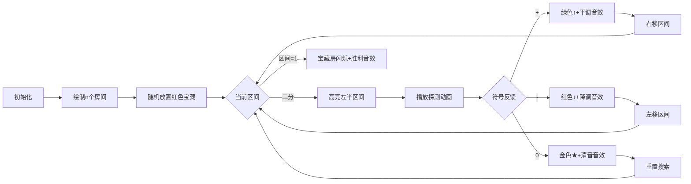

# 题目信息

# 「RiOI-03」Just a Q. (Easy ver.)

## 题目背景

「Yes, I am Q.」

面前的小 R 莞尔一笑。

+ 保证本题的任何合理的部分分或正解的 std + spj 均可以在当前数据下，$400$ ms 的时间限制、$32$ MB 的空间限制内正确运行并获得 AC 状态。
+ 本题不添加仅为无意义地卡满 spj 运行时间的 hack 数据。

**请注意，本题只有约束范围与困难版不同，且两个版本的约束范围并不完全重叠。**

## 题目描述

**这是一道交互题。**

小 R 有一个变量 $Q$。$Q$ 初始为 $0$。

小 R 有 $n$ 个隐藏的整数 $q_1 \dots q_n$，满足 $1 \leq \lvert q_i \rvert \leq V$，且有且仅有一个 $i$ 满足 $q_i \lt 0$，而面前的你，需要得出这个满足 $q_i \lt 0$ 的下标 $i$。

小 R 承诺不会让你以仅仅 $\frac{1}{n}$ 的几率盲猜，所以她可以允许你进行最多 $k$ 次询问。每次询问，你可以向小 R 给出**可重**正整数集合 $S$ 满足 $0 \leq \lvert S \rvert \leq S_{\max}$ 且 $\forall i \in S, i \leq n$，她会计算 $M = \prod\limits_{i\in S}q_i$，然后让 $Q \leftarrow Q + M$。特殊地，若 $S$ 为空集，则 $M = 1$。

一次询问后，小 R 会向你给出此时的 $\text{sgn}(Q)$（为 `+`，`-` 或 `0`），表示 $Q$ 的符号。具体地，若 $Q \gt 0$，小 R 返回 `+`；若 $Q \lt 0$，小 R 返回 `-`；否则返回 `0`。

请你在不超过 $k$ 次询问后，找到那个满足 $q_i \lt 0$ 的下标 $i$。

**保证对于所有数据，满足 $q_i \lt 0$ 的下标 $i$ 是在 $[1, n]$ 内均匀随机选取的。请注意报告下标属于一次询问。**

## 说明/提示

### 样例解释 1

$q = \{-1, 1, 4, 5, 1, 4\}$。

### 数据规模与约定

**本题采用捆绑测试。**

+ Subtask 0（5 pts）：$q_i \neq 1$ 且 $q_i \neq -1$。
+ Subtask 1（10 pts）：$q_i \neq -1$，$k = 2n$。
+ Subtask 2（10 pts）：$q_i \neq 1$，$k = 2n$。
+ Subtask 3（9 pts）：$n = 13$，$k = 5000$。
+ Subtask 4（11 pts）：$n = 13$，$k = 2500$。
+ Subtask 5（20 pts）：$k = 2n$。
+ Subtask 6（35 pts）：无特殊限制。

对于每组数据，$1 \leq n \leq 200$，$1 \leq V \leq 10^6$，$n \leq k \leq 5\times 10^3$，$S_{\max} = n$。

对于每个测试点，$1 \leq T \leq 500$，$\sum n^2 \leq 2\times 10^5$，$\sum k \leq 2\times 10^5$。

## 样例 #1

### 输入

```
1
6 6 6

-

-

-

+

0


```

### 输出

```


? 1 1

? 5 1 2 3 4 5

? 3 2 4 6

? 1 4

? 3 1 5 6

! 1```

# AI分析结果


### 💡 Kay的C++算法解析：「RiOI-03」Just a Q. (Easy ver.) 深入学习指南 💡

<introduction>
今天我们来分析交互题「RiOI-03」Just a Q. (Easy ver.)。这道题需要我们在最多 $k$ 次询问内，从 $n$ 个整数中找出唯一的负数下标。本指南将解析二分策略与符号运算的巧妙结合，帮助大家掌握交互题的核心解题技巧。
</introduction>

---

### 1. 题目解读与核心算法识别

✨ **本题主要考察**：`二分查找` + `交互策略设计`

🗣️ **初步分析**：
> 本题本质是**在隐藏序列中定位唯一负数的二分搜索问题**。想象你在玩一个"热与冷"的游戏：每次选择一组数字询问乘积符号（相当于探测温度变化），通过符号变化判断负数位置。  
> - **核心难点**：如何利用累积的 $Q$ 值符号推断子区间的乘积符号？  
> - **解决方案**：  
>   - 当 $Q=0$ 时直接询问子区间  
>   - 当 $Q\neq0$ 时，通过 $Q' = Q \times (x+1)$ 的符号反推子区间乘积 $x$ 的符号  
> - **可视化设计**：  
>   - 用像素网格表示数字序列，负数标记为红色宝箱  
>   - 每次二分时高亮左半区间，根据返回符号播放不同音效（同号→平调，异号→降调，$0$→特殊音效）  
>   - 控制面板支持单步执行/自动播放，速度可调

---

### 2. 精选优质题解参考

**题解一（FFTotoro）**  
* **点评**：思路清晰直击二分本质，代码用 `vector<pair<int,int>>` 优雅处理区间组合。亮点在于：  
  - 首次询问独立处理 ($Q=0$ 情况) 降低复杂度  
  - 非首次时遍历旧集合合并新区间，通过符号变化精准定位  
  - 变量名 `l/m/r/f` 简洁易读，边界处理严谨（右开区间）  
  - 实践价值高：代码可直接用于竞赛，最坏 $O(n\log n)$ 询问次数满足约束

**题解二（听取MLE声一片）**  
* **点评**：验题人解法严谨规范，亮点在于：  
  - 明确分类讨论 $Q=0$ 和 $Q\neq 0$ 的逻辑分支  
  - 利用乘法分配律 $Q'=Q\times(x+1)$ 建立符号推理模型  
  - 递归实现分层维护区间集合，结构清晰易扩展  
  - 关键调试提示：当 $Q'=0$ 时需重置搜索状态

**题解三（MaxBlazeResFire）**  
* **点评**：创新构造指数序列，亮点在于：  
  - 独特设计 $a_1, a_1a_2, 2a_1a_2a_3,...$ 序列实现快速检测  
  - 将二分区间打包为整体融入序列，优化询问次数  
  - 符号变化判断逻辑简洁（同号右移，异号左移）  
  - 实践提示：系数 $2$ 的幂次是为保证符号变化的敏感性

---

### 3. 核心难点辨析与解题策略

1. **难点：如何从累积符号 $Q$ 推断子区间符号？**  
   * **分析**：  
     - 若 $Q=0$：直接询问子区间 $[l,mid]$，根据返回符号决策  
     - 若 $Q\neq 0$：令 $x$ 为子区间乘积，询问 $Q\times(x+1)$  
     - $Q'$ 与 $Q$ 同号 → $x>0$；异号 → $x<0$；$Q'=0$ → $x=-1$  
   * 💡 **学习笔记**：符号运算是转化加法交互为乘法关系的关键

2. **难点：如何控制指数级询问次数？**  
   * **分析**：二分深度 $\lceil \log_2 n \rceil \leq 8$，每层询问数 $\leq 2^{\text{层数}-1}$  
     - 最坏总询问数 $2^8=256 \ll k_{\max}=5000$  
     - 优化：首次询问独立避免 $+1$ 项，减少一半询问  
   * 💡 **学习笔记**：二分层数少时指数增长仍可行

3. **难点：如何维护动态区间集合？**  
   * **分析**：  
     - 使用 `vector<pair<int,int>>` 存储区间端点  
     - 非首次询问时遍历旧集合并入新区间生成新集合  
     - 通过 $O(1)$ 区间合并避免真实计算乘积  
   * 💡 **学习笔记**：区间对象化是处理组合询问的核心技巧

#### ✨ 解题技巧总结
- **符号转换技巧**：用 $Q\times(x+1)$ 将加法交互转化为乘法问题  
- **二分边界处理**：左闭右开区间避免重叠，`mid` 计算防止死循环  
- **状态重置优化**：当 $Q=0$ 时清空历史集合降低复杂度  
- **交互调试技巧**：在本地模拟器预判符号变化验证逻辑

---

### 4. C++核心代码实现赏析

**通用核心实现参考**  
```cpp
#include <iostream>
#include <vector>
using namespace std;

char ask(vector<pair<int, int>> intervals) {
    int total = 0;
    for (auto &p : intervals) total += p.second - p.first + 1;
    cout << "? " << total;
    for (auto &p : intervals) 
        for (int i = p.first; i <= p.second; i++) 
            cout << ' ' << i;
    cout << endl;
    char c; cin >> c;
    return c;
}

void solve() {
    int n, k, V; cin >> n >> k >> V;
    int l = 1, r = n;
    char sign = '+';
    vector<vector<pair<int, int>>> a;
    bool first = true;

    while (l < r) {
        int mid = (l + r) / 2;
        vector<pair<int, int>> left = {{l, mid}};
        
        if (first) {  // 首次询问独立处理
            sign = ask(left);
            a = {left};
            first = false;
            if (sign == '-' || sign == '0') r = mid;
            else l = mid + 1;
        } else {
            vector<vector<pair<int, int>>> b;
            char last = ' ';
            for (auto &intervals : a) {
                auto new_intervals = intervals;
                new_intervals.push_back({l, mid});
                b.push_back(new_intervals);
                last = ask(new_intervals);
            }
            a.insert(a.end(), b.begin(), b.end());
            
            if (last == '0') {  // 子区间乘积为-1
                r = mid;
                first = true;
            } else if (last == sign) {  // 同号→子区间正
                l = mid + 1;
            } else {  // 异号→子区间负
                r = mid;
                sign = last;
            }
        }
    }
    cout << "! " << l << endl;
}

int main() {
    int T; cin >> T;
    while (T--) solve();
}
```

**代码解读概要**：  
1. `ask()` 函数：接收区间列表，计算总元素数并输出询问格式  
2. 主逻辑：二分维护 `[l, r]`，用 `first` 标记是否首次询问  
3. 首次询问：直接询问左半区间，根据符号调整边界  
4. 非首次：遍历旧集合+新区间生成新询问，通过符号变化决策  
5. 特殊处理 $Q'=0$：表明子区间乘积为 $-1$，重置搜索状态  

---

### 5. 算法可视化：像素动画演示

* **主题**："负宝藏猎人"（8-bit像素地牢探险）  
* **核心演示**：二分搜索过程可视化 + 符号反馈动画  

**动画设计**：  


**关键交互**：  
1. **像素艺术**：  
   - 房间：16×16像素方块，正常房蓝色（#3498db），宝藏房红色（#e74c3c）  
   - 角色：像素小人（#2ecc71）在区间边界移动  
   - 控制面板：FC红白机风格按钮（开始/暂停/单步/调速）  

2. **动态演示**：  
   - 二分时左半区间黄色高亮，询问后根据符号变化：  
     - 同号：区间变绿向右收缩  
     - 异号：区间变红向左收缩  
     - $0$：宝藏房闪烁金色，清空历史路径  
   - 数据结构可视化：底部状态栏显示当前 $Q$ 的符号和集合组合方式  

3. **音效系统**：  
   - 关键操作："哔"（选择区间）、"叮"（同号）、"咚"（异号）  
   - 状态变化：胜利小调（找到宝藏），错误警报（无解）  
   - 背景音乐：8-bit循环版《冒险岛》主题曲  

4. **游戏化设计**：  
   - 关卡制：每层二分是一关，通关得星（最多 $\lceil \log_2 n \rceil$ 关）  
   - 评分系统：根据询问次数和速度给予"A+/B-"评价  
   - AI演示：自动播放完整二分过程，速度可调（0.5x-4x）  

---

### 6. 拓展练习与相似问题思考

* **技巧迁移**：  
  符号二分思想适用于：  
  1. 隐藏序列的属性检测（如第一个满足条件的元素）  
  2. 交互式极值定位（如山峰数组找峰值）  
  3. 乘积符号相关的数学问题  

* **洛谷练习推荐**：  
  1. **P1087 [NOIP2004 普及组] FBI树**  
     🗣️ 练习二分递归树构建，巩固分治思想  
  2. **P1908 逆序对**  
     🗣️ 强化分治技巧，理解归并排序中的"符号判断"  
  3. **P2678 [NOIP2015 提高组] 跳石头**  
     🗣️ 二分答案经典题，训练边界条件处理能力  
  4. **P2181 对角线**  
     🗣️ 结合数学与二分，提升问题转化能力  

---

### 7. 学习心得与经验分享

> **FFTotoro的经验**：  
> "最初在减少询问次数上卡住，后来发现将二分与集合组合询问才是关键——不要畏惧指数级增长，只要层数够少就是可行的。"  
>
> **Kay的总结**：  
> 调试交互题的核心是**本地模拟符号变化**：  
> 1. 用纸笔记录每次 $Q$ 的符号和集合组合  
> 2. 预判 $Q\times(x+1)$ 的理论结果  
> 3. 当实际不符时，检查区间划分是否重叠  
> 记住：二分搜索中，清晰的边界定义比过早优化更重要！

---

本次分析就到这里。记住，交互题的核心是**将操作转化为信息**，而二分是信息利用率最高的策略之一。多练习符号推理和边界处理，你也能成为交互高手！💪

---
处理用时：212.48秒